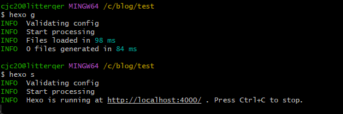

# Hexo 初探

Hexo 就是一个将markdown转译成blog的工具。基本上，只要输入一个markdown文件，Hexo就可以将其转译成一个blog。它实际上就是静态页面。

## 开发环境与配置

### 环境

Hexo不需要很复杂的开发环境，基本上只需要三个工具

- Git
- Node.js
- Hexo

基本安装的话，就参考官网的一个[教程](https://hexo.io/docs/)即可  
由于安装过于简单，所以就直接略过了。

### 配置

Hexo中可修改的配置有很多，基本都放置在_config.yml里面。使用IDEA打开即可修改。关于具体配置的修改我放在后面详述。

> 注意：Hexo使用的配置文件的格式是.yml
> 我们也可以自己写config，只要用``` $ hexo server --config custom.ymln ```把写好的config配置给hexo就可以了
> 配置文件里面的东西大多数都是字面意思，后面我会把一些有些小坑的地方标注出来。

## 初试hexo

使用hexo真的很简单，比git都好学。首先在本地创建一个空文件夹，然后在这个文件夹下直接开启git bash（这里最好用git bash）。
在git bash中输入以下命令直接初始化一个hexo文件夹。

```shell
hexo init <filename> 
```

这个init命令实际上就是clone hexo-starter的内容（官方的github）。观察创建的文件夹，会发现一共有5个目录，我们来逐一分析每个目录。  



### .github

github自己的一个管理文件，里面也只有一个文件dependabot.yml。放都是关于依赖的问题，可以直接略过。

### .node_modules

node.js自己生成的文件，一般用来管理各种需要用到的插件。不需要特别注意

### scaffolds

页面的template，可以后期自己加入。一般初始化的时候会给出三个，draft，page和post。draft就是一个在本地使用的页面，page就是一个自定义个页面，post就是需要放入的博客内容。
模板本身支持直接修改。

### source

这里存放的是所有已生成的页面和页面的附件，比如图片之类的。hexo在处理图片的时候和一般的markdown格式有一些小的区别。

### themes

不同的主题，初始化的时候里面只有一个git文件。后面需要换主题的时候直接把主题clone到themes文件夹下就好了。

## 具体配置文件

直接在git bash中使用`hexo s`，这个指令可以在本地运行一个实时更新的博客。不出意外的话应该会有一个经典hello world的post。
主题也是默认的landscape。回到刚才的blog文件夹，此时我们可以观察`_config.yml`这个文件。

```yaml
# Hexo Configuration
## Docs: https://hexo.io/docs/configuration.html
## Source: https://github.com/hexojs/hexo/

# Site
title: Hexo
subtitle: ''
description: ''
keywords:
author: John Doe
language: en
timezone: ''

# URL
## Set your site url here. For example, if you use GitHub Page, set url as 'https://username.github.io/project'
url: http://example.com
permalink: :year/:month/:day/:title/
permalink_defaults:
pretty_urls:
  trailing_index: true # Set to false to remove trailing 'index.html' from permalinks
  trailing_html: true # Set to false to remove trailing '.html' from permalinks

# Directory
source_dir: source
public_dir: public
tag_dir: tags
archive_dir: archives
category_dir: categories
code_dir: downloads/code
i18n_dir: :lang
skip_render:

# Writing
new_post_name: :title.md # File name of new posts
default_layout: post
titlecase: false # Transform title into titlecase
external_link:
  enable: true # Open external links in new tab
  field: site # Apply to the whole site
  exclude: ''
filename_case: 0
render_drafts: false
post_asset_folder: false
relative_link: false
future: true
highlight:
  enable: true
  line_number: true
  auto_detect: false
  tab_replace: ''
  wrap: true
  hljs: false
prismjs:
  enable: false
  preprocess: true
  line_number: true
  tab_replace: ''

# Home page setting
# path: Root path for your blogs index page. (default = '')
# per_page: Posts displayed per page. (0 = disable pagination)
# order_by: Posts order. (Order by date descending by default)
index_generator:
  path: ''
  per_page: 10
  order_by: -date

# Category & Tag
default_category: uncategorized
category_map:
tag_map:

# Metadata elements
## https://developer.mozilla.org/en-US/docs/Web/HTML/Element/meta
meta_generator: true

# Date / Time format
## Hexo uses Moment.js to parse and display date
## You can customize the date format as defined in
## http://momentjs.com/docs/#/displaying/format/
date_format: YYYY-MM-DD
time_format: HH:mm:ss
## updated_option supports 'mtime', 'date', 'empty'
updated_option: 'mtime'

# Pagination
## Set per_page to 0 to disable pagination
per_page: 10
pagination_dir: page

# Include / Exclude file(s)
## include:/exclude: options only apply to the 'source/' folder
include:
exclude:
ignore:

# Extensions
## Plugins: https://hexo.io/plugins/
## Themes: https://hexo.io/themes/
theme: landscape

# Deployment
## Docs: https://hexo.io/docs/one-command-deployment
deploy:
  type: ''
```

下面我会分成不同的部分进行讨论。

### site配置

| 变量名         | 解释   |
|-------------|------|
| title       | 网站标题 |  
| subtitle    | 副标题  |       
| description | 描述   |       
| keywords    | 关键词  |       
| author      | 作者   |       
| language    | 使用语言 |       
| timezone    | 时区   |

这里没有什么需要解释的，就是根据需要直接进行修改就好了。这里唯一的小坑就是网站描述一般不会出现在页面中，
而是写在网站的源码内部。主要的作用是优化搜索结果的，所以如果想提高点击量的话，这个描述还是有点作用的。语言的话有一个特别支持多国语言的选项。

### URL设置

```yaml
url: http://example.com
permalink: :year/:month/:day/:title/
permalink_defaults:
pretty_urls:
trailing_index: true # Set to false to remove trailing 'index.html' from permalinks
trailing_html: true # Set to false to remove trailing '.html' from permalinks
```

这里第一个就是设置网站的URL，这个地方系统推荐的是写成username.github.io/project。根据我的实测经验，如果没有project这个页面类的话，网站就可以读出来，但是会变成乱码，或者不读css文件。
建议写成username.github.io就可以了。当然如果使用gitlab也是一样的。  
permalink的话就是文章的永久链接格式，这和也不需要修改，本身就已经很不错了。如果需要改的话，它支持的格式都在文档中有写好了。这个部分如果需要上线评论功能的话，则会比较重要，因为其中有一个id，这个id是用来对应评论的。这个部分会在测试评论功能的时候细说。  
permalink_defaults就是各个页面的永久链接格式。
pretty_urls这个比较有意思，如果定义了这个选项的话就会把前面的permalink直接覆盖掉，虽然我没有看出来这么做的意义是什么，但是我估计是它框架里面源码的一些调用方式问题。所以如果想要改permalink的话就用这个比较好。
后面两个就是url上面显示的东西，不需要可以直接改为false，不过留着也不影响。

### Directory配置

```yaml
# Directory
source_dir: source
public_dir: public
tag_dir: tags
archive_dir: archives
category_dir: categories
code_dir: downloads/code
i18n_dir: :lang
skip_render:
```

这些的话也不太需要更改，因为它的归纳已经分配的很好了，不过要注意一个细节就是最后一个，如果你使用了github SSH来进行发布的话，那么有些不必要的内容可以通过这个组织发布。
具体的禁用方式就是把不需要渲染的文件或者文件夹直接使用glob expressions写入即可。其实最好是直接放入同一个文件夹下，然后放入文件加的地址。

### 写作配置

```yaml
# Writing
new_post_name: :title.md # File name of new posts
default_layout: post
titlecase: false # Transform title into titlecase
external_link:
  enable: true # Open external links in new tab
  field: site # Apply to the whole site
  exclude: ''
filename_case: 0
render_drafts: false
post_asset_folder: true
relative_link: false
future: true
highlight:
  enable: true
  line_number: true
  auto_detect: false
  tab_replace: ''
  wrap: true
  hljs: false
prismjs:
  enable: false
  preprocess: true
  line_number: true
  tab_replace: ''
```

一个一个来看，第一个就是所生成的文章的格式和名字模板，一般来说就用md就好了。  
`default_layout`指的是使用`hexo new "filename"`生成的文章的默认模板，一般来说post就可以了，当然我们也可以定义自己的模板然后套用。  
`titlecase`就是改个大小写，看个人喜好开关  
`exteral_link`就是是否有一个新的网页打开外部链接。就是一个新tab。  
`filename_case`文件名大小写 0就是不变,1是小写，2是大写  
`render_drafts`是否渲染草稿（在最终成品网页中展示），建议关闭，毕竟draft只是用来本地测试的。  
`post_asset_folder`一定要**开启**，这个主要用来放置不同文章的附件，比如图片音频等。开启这个才能使用很多功能，非常重要。  
`relative_link`把链接改为和根目录的一个地址。这个路径可以简化pathname的书写，但是如果移动文件夹则会导致路径失效，个人建议别开。  
`future`显示未来的文章，说实话这个部分，没搞懂在干嘛，未来文章也不知道指什么，自己实验了一下也看不出效果。就别动它就好了。  
剩下的两个都是和代码高亮相关的，主要是通过js的一些设置，这个部分我不是很熟悉，但是具体方式就参考官方文档即可。

### 主页配置 & 分类和标签

```yaml
index_generator:
  path: ''  #主页的地址，不许要修改
  per_page: 10 # 一页显示多少文章
  order_by: -date # 文章排序方式

# Category & Tag
default_category: uncategorized #默认标签
category_map: # 分类别名 
tag_map:   #标签别名
```

简单的设置，都是字面意思，直接根据需要跟换即可。

### 时间与分页

```yaml
# Date / Time format
date_format: YYYY-MM-DD
time_format: HH:mm:ss
## updated_option supports 'mtime', 'date', 'empty'
updated_option: 'mtime'

# Pagination
## Set per_page to 0 to disable pagination
per_page: 10
pagination_dir: page
```

Hexo使用的是Moment.js来获取时间，具体格式和方法就直接参考Moment.js即可。但是我个人的建议是不需要调整，因为这个博客的时间并不是很重要。
这里有个小坑，就是下面的分页。这里的per_page和之前的per_page是同一个，如果两个配置不同的话后面的会覆盖前面的。所以建议就保持一致。因为实测下来，
有时候会出现错乱的情况。而且这个全局配置非常重要，如果搞的不好整体就会乱码，所以我建议能不动就不动。

### 扩展

```yaml
# Include / Exclude file(s)
## include:/exclude: options only apply to the 'source/' folder
include:
exclude:
ignore:

# Extensions
## Plugins: https://hexo.io/plugins/
## Themes: https://hexo.io/themes/
theme: vexo
```

上面的部分没有什么复杂的，就是在hexo部署的时候，希望hexo包括或者不包括那些文件。这里的小坑就是include和exclude只针对source目录底下的文件。而ignore则会针对全局。
那么如果出现了include和ignore中出现了同样的情况，根据就近原则，谁后面出现谁就覆盖前面的。

### Deployment

```yaml
deploy:
  type: git
  repo: 
```

这个部分算是部署成功的重要一环，因为我个人使用的是github，所以就直接使用git，然后要注意一个超级大坑。
这里git和冒号直接必须**保证一个空格**，而且就是一个空格。不然整体部署就会失败。包括后面的repo也是需要一个空格。

## 简单的使用

刚才的部分就是全部的配置文件，但是关于不同主题其实还会有不同的配置文件，所以后面在使用主题的时候在详细解释。  
当我们初始化好了一个hexo文件夹后，就可以开始写入具体的内容了。直接使用`hexo new <file_type> "postname"`来创建新的文章或者页面。
这里要注意一般就是三种形式，pages，draft和post，我们之前的设置是post，所以这里不输入file type的话就会直接创建一个post，因为之前选择开启assert folder
所以创建后会在source目录下的_post中加入一个md文件和一个对应的文件夹。具体样子如下  

   

可以看到每一md都会对应一个同名的文件夹。 打开一个md文件，我们会发现如下结构

```markdown
title: Hexo 入门
date: 2022-07-21 17:01:14
tags:
```

这个部分hexo把它称作front matter，用于归类一篇文章。具体的改动方式有很多。
`updated` 文件更新日期  
`comments` 开启文章的评论功能  
`tags` 标签（不适用于分页）  
`categories` 分类（不适用于分页）  
`permalink`    覆盖文章网址 (会覆盖全部配置)  
`excerpt` Page excerpt in plain text. Use this plugin to format the text  
`disableNunjucks` Disable rendering of Nunjucks tag `{{ }}/` and tag plugins when enabled  
`lang` Set the language to override auto-detection Inherited from _config.yml

基本上没有什么需要调整的，就看着用就好了。我也只测试了其中的一部分功能。

当添加完具体内容后，使用`hexo g`就可以直接在本地完成部署。然后再使用`hexo s`就可以在本地进行测试了。具体如下

 

Hexo会直接使用一个本地端口来测试，当然一定要保证这个端口是空闲的。打开浏览器直接输入就可以看到效果了，注意这里的效果和部署到网上的效果会是完全一致的。所以如果在这里图片不显示，那么部署后也不会显示。

### 基本本地部署流程

1. 使用`hexo c`清理已有的缓存
2. 使用`hexo g`重新本次部署一次
3. 使用`hexo s`开启本地服务器，进行本地的浏览

## 图片以及音频不显示问题

这个算是Hexo初探中的一个大坑。基本上网上众说纷纭，我个人的建议是直接参考官方文档。其实这里图片不显示的问题主要是由于hexo里的markdown语法和普通的有区别导致的。
我们看下面这个例子

```markdown
一般在一个markdown插入图片我们会使用这种方式

只要我们知道图片的具体位置，就可以直接定位到。

但是Hexo使用了一种特殊的语法（其实是因为插件导致的）

```

这才是正确的引用方式，其实这里也可以选择在全局设置中开启下面的配置

```yaml
marked:
  prependRoot: true
  postAsset: true
```

这样的话，图片或者文件就会被直接编码在markdown文件中，但是我不推荐这样做。因为只有在打开这篇文章的时候才能正确读出图片，如果是在主页或者别的位置，则还是显示不出来。

### 需要的一些插件和安装

Hexo其实并不是原生支持图片的导入，而是通过插件来实现这个，所以需要提前安装插件。那么对于这个问题而言，步骤也比较重要，千万不能出问题，不然可能要全部重来（主要很难定位到安装的位置）。  
首先，进入Hexo的文件夹下打开git bash。先运行`npm install`，这一步很关键，虽然hexo的init应该会自动安装npm，但是仍然会出现有些包没有的情况，所以一定要用这个检查一下。然后运行`npm install hexo-asset-image --save`
安装完成后，直接使用上面的方式进行调用即可。

## 评论功能

## 主题功能（可替换）

```yaml
menu:
 Home: /
# Series: /series/
# Tags: /tags/
 Archives: /archives/
 Projects: /project/
 About: /about/

# highlight
highlight:
  tomorrow

# catalog
catalog: true

# donate
donate: false

# qrcode
qrcode: false

# comment
# you can set utterances, gitment, uyan or disqus
comment: utterances

# utterances config
utterances：
  repo: Litter-Qer/repoforcomments # e.g. GitHubAccount/RepoForUtterances
  issue_term: title # you can see other available options at 'https://utteranc.es/'
  theme: photon-dark  # you can see other available options at 'https://utteranc.es/'
  crossorigin: "anonymous"

about: 
  banner: ""
  avatar: https://avatars3.githubusercontent.com/u/16443628?v=3&s=460
  description: "The end is always near."
  weibo_username: yanm1ng
  twitter_username: yanm1ng
  github_username: yanm1ng
  zhihu_username: yummy1121
  douban_username: yanm1ng
  linkedin_username:

# MathJax Support
mathjax:
  enable: true
  per_page: false
  cdn: //cdnjs.cloudflare.com/ajax/libs/mathjax/2.7.5/MathJax.js?config=TeX-AMS-MML_HTMLorMML

# Local Search Support
local_search:
  enable: true
```

其实对于不同的主题，配置文件是完全不同的。所以一旦选定了主题就建议最好不要更换。这里我仅用Vexo做一个例子，具体我们最后怎么使用还得看最终选择的主题。
这个配置文件的内容只是作为一个小的展示。但是有一个原则要注意，一个主题一旦被使用，那么它会覆盖source目录下的所有config，也是全局的config如有和主题冲突的，会以主题的为准。

