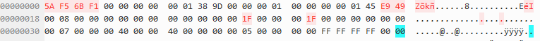
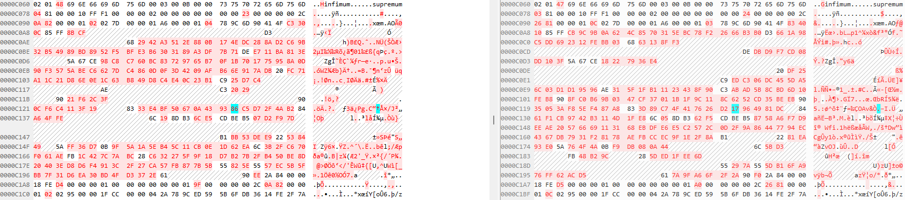
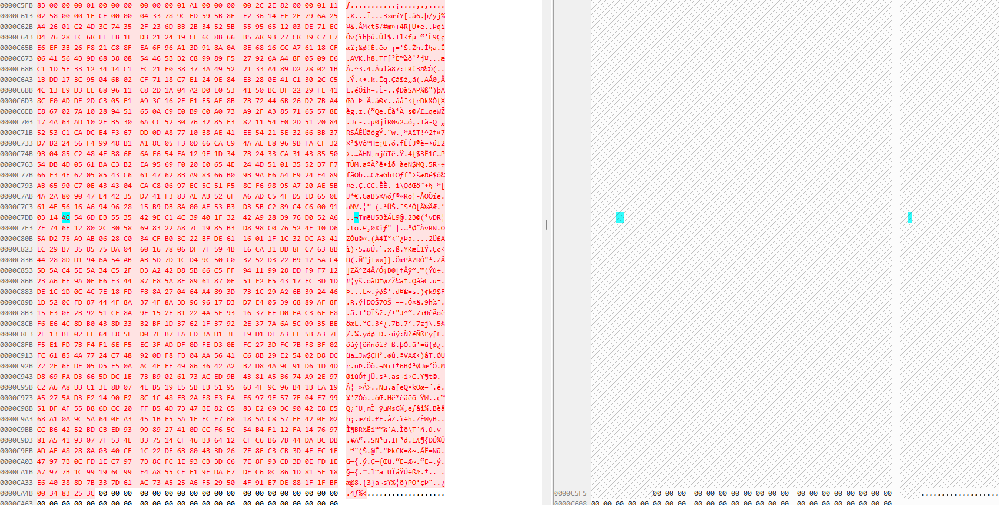
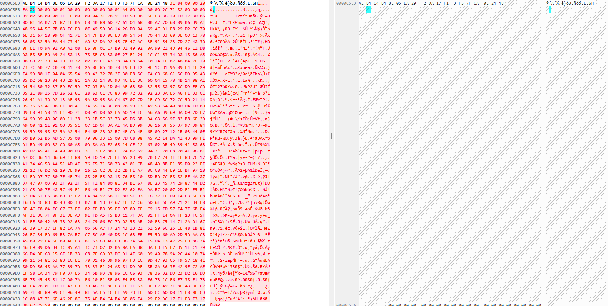

# 带数据和不带数据的变化

空表的时候情况是  

加入了四条数据后  

这里的变化，我参照了FSP表头的使用。
可以看到在加入了4条数据后，spaceID发生了改变。
number of pages used in 'FREE_FRAG' list也发生了变化。虽然这里两个数据都不太可读，但是这个变化是合理的。
然后其他就是小的变化，所以不太需要关心。

# 行记录的一些变化

这里其实我听疑惑的，因为我看那个文章说的是开头应该是varchar的长度记录，我输入的四个记录是严格按照文章复制的。可以出来的结果完全一样，我算了一下需要的字节并且进行了逆序排列。
仍然得到了相同的结果，所以这里我还是挺奇怪的。因为按照文章的计算方法，开头两个怎么都应该是10 80，我估计可能又是版本的问题，我去找了文档，但是没有关于这个部分的解释。
官方只给出了page的大小，包括是怎么分配不同的区域，以及innoDB的整体框架。并没有给idb的文件分配方式。根据我实测的结果，user record的位置即便没有数据的时候，也会有一些记录。
这些记录我没有在网上找到可靠的读法。但是观察的结果是，它们的长度是长不多的。下面是一张截图，左边的是带数据的，右边的是空表。  

# 使用不同的方式改变comment

这里我分了2个对照组，空表改comment和非空表。

### 空表结果

通过对照我发现了，当空表使用alter修改comment的时候，会在user records后面加入一长串的binary code。但是这个部分我还是没有在网上解读的方法。
我记录的大概的行数。不过通过对比会发现空表中的user records并没有发生变化，所以看起来似乎没有问题。  

### 非空表结果

这里使用的是包含了4个数据的表格，使用了alter进行修改。比较神奇的是，数据并没有发生很大的变化。直接观察supremum后面的user records。  

如果我的理解正确，在supremum后面的user records（记录了数据的那几行）似乎没有发生什么大改变。不过还是出现了一些小的改变，
这些改变应该是不影响整体的。继续观察新加入的内容，和前面空表的情况一样。也是多加入了很多行，但是行数和空表一致，所以猜测这个部分应该是记录表的变化。
如果和直接空表变化的时候行数一致的话，是不是可以排除有无数据对alter comment的影响。  

这里我不敢下任何结论，因为没有合适解读这些新加的hex code的方法。虽然行数是一致的，看上去似乎和数据量无关，但是不排除它内部有些什么别的可能性，我这里没有测到。

