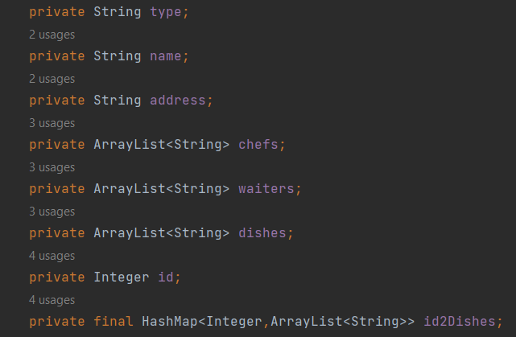
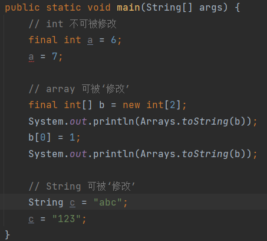
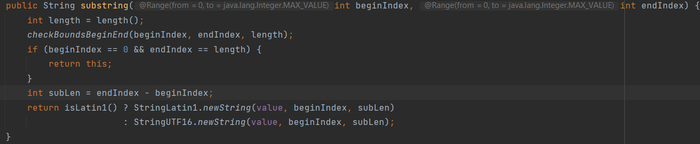

### 今日任务
本次任务只使用了基础的class类型，没有abstract，也没有继承。

a) fields & final关键字

fields在java class中基本类似于一个类的properties。
大部分情况下，每一个field都定义了这个类的不同属性。比如本次实现的
餐厅类中
> 名字、种类、地址等都是餐厅本身具备的属性
> 

定义fields的时候一般使用private作为access modifier，这里主要的
原因是封装。外部无法直接调用和修改一个类的变量，只能通过setter和getter
来进行赋值和提取。<br>
除此以外本次任务中的```id2Dishes```变量使用了final来限制修改应用对象，这里比较有意思的地方很多。
我大概看了很多解释，final关键字指定了一个变量无法被修改，但是为什么final hashmap，arraylist，
甚至array仍然可以添加和删除呢？
原因主要由一下几个点
> final虽然规定了变量不可被修改，但是其实它所指定的是reference不可被修改。
> 也就是说当创建array或者arraylist这些变量的时候，实际上是在内存空间中给这些变量确定了一个地址。
> 当使用final定义的这些变量的时候，final keyword会确保指针指向的这个内存地址不可更改。
> 也就是说虽然我给某个array添加或者删除了某些元素，但是这个array在内存的地址并没有发生改变。
> 所以实际上并没有影响final所限制的reference，因此不会报错。但是当我使用primitive类型的变量时，
> 在内存空间中，改变这个变量的值就类似于改变地址，所以final关键字会限制改动。
> 以下截图证明了primitive类型和其他类型的区别：
>  <br>
> 很明显，primitive类型的变量被final修饰后就不肯更改，而array和string任然可以被更改。

但是final修饰的类中，String是比较特别的。String的源码中虽然被final修饰但是仍然可以被修改，但是其实string并不是被修改了。
而是被替换了指向的地址——也就是创建了一个新的String。我尝试通过反编译的方法去看，是否创建了新的string，但是结果表明反编译不能直接看出String的地址变化。
所以我尝试找源码中的一些线索。比如下面这张图中的substring源码，我们会发现其实使用substring并不是改变了string本身的值，
而是创建了一个新的string，并且把老的变量指向这个新的string。


b) methods

基本的getter和setter目前没有碰到什么实际操作上的问题，所以就略过了。
剩下的就是本次任务实现的两个方法。两个方法的输出均为void。<br>
```shell
public void order(ArrayList<String> orders){
    this.id++;
    id2Dishes.put(this.id,orders);
    StringBuilder str = new StringBuilder();
    str.append("You've ordered the following: \n");
    int i = 1;
    for (String order :orders) {
        str.append(MessageFormat.format("Dish {0}: {1}\n",i,order));
        i++;
    }
    str.append(MessageFormat.format(
        "Thank you for your order!" +
        "Your order id is: {0}\n",this.id.toString()));
    System.out.println(str);
  }

public void serving(Integer orderId){
        StringBuilder str = new StringBuilder();
        if (this.id2Dishes.get(orderId) != null){
            ArrayList<String> orders = this.id2Dishes.get(orderId);
            str.append("Now serving:\n");
            for (String order :orders) {
                str.append(MessageFormat.format("Dish {0}\n",order));
            }
            str.append("All dishes have been served. Thank you!\n");
        } else {
            str.append("Invalid order id\n");
        }
        System.out.println(str);
    }
```
在order方法中，因为餐馆id在定义的时候使用了Integer而不是int，所以要先转为string类在输出。
这里使用Integer的原因也是考虑，一个餐馆如果order id一直是自增的情况下，可能会无限大，Integer的取值范围会比较合适。
其他需要的注意的点和前几天的内容差不多，使用StringBuilder优化效率，利用format增加可读性。
利用java foreach语法糖简化loop的编写形式。在实现这些方法的时候除了代码上的考量，其实逻辑上的思考会更多一点。<br>

比如在order中，我让order id先进行自增在放入hashmap，这样做虽然保证了order id一定不会乱掉，而且也不可能出现hashmap撞key的问题。
但是如果代码在运行中出错，一直重复前两行的话，那么id会一直自增，并且加入了重复的订单。这里可以通过加入一些类似与锁的逻辑，避免这个问题。
比如在放入hashmap前验证上一个单子是有效单，或者先确认上一个单号是非重复的（不同的订单内容，下单时间，下单人等）。<br>

还有在serving中，如果模拟真实场景的话，要如何保证不会重复上菜，或者如果上菜上到一半系统中段了，如何能够保持数据。
在这部分中，我一共有两个思路
> 第一种是直接使用另外一个hashmap来记录上菜情况，这个也应该用```final```来修饰。保证不会被随意替换。
> 但是这种方式会加大内存的压力，所以不是很好。而且不能分辨已经上过的菜。<br>
> 第二种是在serving中每上一个菜就在这个菜的前面加入一个flag来表示已经上过了。也就是说ArrayList打印的结果应该如下：<br>
> ```["served","a","served","b","c"]``` <br>
> 这里就可以很清晰的看出c还没有上，而其他的菜已经上了。但是这里又会出现一个问题，我无法直接判断菜是否上齐了。
> 所以当所有菜上齐的时候应该加入一个特殊的flag表示菜全部上齐，并且添加到arraylist的最前面作为判定条件。
>
> PS: 这里如果使用arraylist的话可能会出现，如果上菜顺序不一致导致效率低的问题。
> 比如b比a先上，那么需要查询b的index，然后在b的前面先添加served。


### Hexo研究进度
已经成功通过github部署了一个online的博客，具体地址如下：<br>
``` https://litter-qer.github.io/ ```<br>
这篇反思也会尝试发布在上面，目前还在研究怎么使用已有的theme。主要是配置文件的问题，我还在研究。

