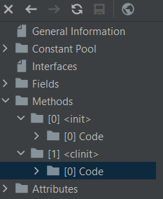

### 昨天的新问题

#### 1. JVM参数的问题

关于为什么大部分的JVM参数都是2的n次方。具体原因在网上查了一下，没有发现特别相关的解释。我个人的一个理解就是，有可能和hash map里面容量类似。
因为StringTable本身其实就是一个hash table。这里又牵扯到一个hash table和hash map的区别上。大部分的文章都是在说hash table是线程安全的，
因为还没有正式开始学习并发和线程相关的知识，这里我暂时认定它们除了线程的安全性的不同，在非并发的开发环境下可以看作一样。实际上底层计算hash的逻辑不同。

那么对于刚才的问题就可以解释了，因为StringTable本身是一个hash table。如果把它看成是一个hash map的话，
那么底层的hash计算逻辑为

```shell
static final int hash(Object key) {
        int h;
        return (key == null) ? 0 : (h = key.hashCode()) ^ (h >>> 16);
    }
```

这一段是从Hash map上截取的源码。其实可以很明显的看出来，hash map在计算hash值的时候，如果能确保table的长度是2^n。
那么从十进制转换到二进制就正好满足一个转换公式
```hash(key) & (length-1) == hash % length```
在底层计算机中实际上就是两组二进制的machine code在相同位置上使用&门。这种算法，很明显对于计算机来说是舒服的。
无论效率还是对与计算机的兼容性上都是更好的。但是可惜的是StringTable的底层使用的hash table。而观察hash table的源码

```shell
key.hashCode();
```

观察了一下源码发现hashCode的具体实现方法是native的，不可查。但是我猜测可能类似于hash map的算法。如果思路是相同的话。
那么使用2的n次幂也一定是可以做到优化的。<br>

##### 小结

我粗略的过了一遍所有的JVM参数，其实大部分和siz有关的参数都是2的n次方，也有一些其他类型的参数是(2^n-1)。对于大部分的table来说，
使用2的n次方一定程度上可以提高效率。因为计算机最终还是要使用machine code进行处理。具体别的原因我目前实在是想不到了。。。。

#### 重新反编译后的继承运行顺序问题

在昨天的基础上，我又新加了一个C和D。并且让C继承B，D也继承B。那么的关系就是

```shell
B extends A
C extends B
D extends B
```

尝试创建了C和D。发现无论是在创建C还是在D的过程中，静态块都被先运行了。然后才是按照构造器的顺序进行。这里发现了一些新的有意思的东西，我会逐一分析。

##### 1. static code block 似乎只会被执行一次

我在同一个方法中，先创建C在创建D，结果发现A，B，C，D的静态块，在整个过程中都只运行了一次。
基于这个发现我就又尝试了一下不同的方法。最终发现，无论使用多少中不同的方法，只要静态块被运行过一次，
就不会在运行。所以静态类只会被执行一次，且是类被创建的时候执行。这里的意思是，当我第一次初始化一个类的实例的时候。
似乎程序才会运行静态块，但是实际上。并不是因为实例化导致了静态类被执行。而是在初始化类的时候执行的。<br>
<br>
反编译的结果也证实了这一点，静态块在反编译的结果中被放到了clinit下面表示是Class initialization的时候才被调用。

##### 2. static block 的执行顺序

不同于下面的继承执行顺序，static block的顺序主要就是符合以下原则。
<br>如果在同一个Class中，那么就按照出现的先后顺序执行

```shell
static { System.out.println("这是A的静态块1"); }
static { System.out.println("这是A的静态块2"); }
static { System.out.println("这是A的静态块3"); }
```

在A中我按顺序写了三个这样的static blocks，发现他们的反编译结果如下

```shell
 0 getstatic #13 <java/lang/System.out : Ljava/io/PrintStream;>
 3 ldc #33 <这是A的静态块1>
 5 invokevirtual #21 <java/io/PrintStream.println : (Ljava/lang/String;)V>
 8 getstatic #13 <java/lang/System.out : Ljava/io/PrintStream;>
11 ldc #35 <这是A的静态块2>
13 invokevirtual #21 <java/io/PrintStream.println : (Ljava/lang/String;)V>
16 getstatic #13 <java/lang/System.out : Ljava/io/PrintStream;>
19 ldc #37 <这是A的静态块3>
21 invokevirtual #21 <java/io/PrintStream.println : (Ljava/lang/String;)V>
24 return
```

在target目录下的class文件中使用IDEA自带的反编译会发现，javac自动将不同的static block按照顺序合并了。
所以也就是说，无论在一个class写多少个static blocks，java都会按照出现顺序执行一遍，而且只执行一遍。
（而且这些blocks和其他methods的位置并不影响结果）

##### 3. 继承的运行顺序 （更正昨天的结论）

通过上述的一些结论，static代码既然会在初始化一个类的时候执行，且优先级高于一切。那么当我实例化一个继承了别的类的类，实际执行的顺序又应该是怎么样的呢？
昨天的结论是按照父和子的顺序慢慢继续。然后今天发现并不是这样（经典白学doge）。。。。。
观察了一下反编译个结果，发现当调用C的构造器的时候

```shell
 0 aload_0
 1 invokespecial #1 <pojo/B.<init> : ()V>
 4 aload_0
 5 bipush 30
 7 putfield #7 <pojo/C.id : I>
10 getstatic #13 <java/lang/System.out : Ljava/io/PrintStream;>
13 ldc #19 <C的构造器>
15 invokevirtual #21 <java/io/PrintStream.println : (Ljava/lang/String;)V>
18 getstatic #13 <java/lang/System.out : Ljava/io/PrintStream;>
21 aload_0
22 getfield #27 <pojo/B.id : I>
25 aload_0
26 getfield #7 <pojo/C.id : I>
29 invokedynamic #28 <makeConcatWithConstants, BootstrapMethods #0>
34 invokevirtual #21 <java/io/PrintStream.println : (Ljava/lang/String;)V>
37 return
```

构造器会自动的先调用B的构造器，而调用B的构造又会自动地调用A的构造器。一环扣一环，总是先调用最顶层的构造器。
所以这里就可以解释为什么static blocks会永远先执行了，因为在实例化C的时候，会自动向上一层找B，而B会找A。
由于A的类还没有初始化，所以会先初始化这个类，然后在构造A。但是由于构造B的时候也需要初始化B类，所以B类的static block也需要被运行，
同理，C也一样。所以就出现了ABC的static blocks会在构造器之前先运行的情况。然后就是正常的走流程，构造A，构造B最后在C。
这里还有一点注意的就是如果此时我在实例化一个D，那么因为ABC已经初始化过了，所以只有D的static block会先运行，而且它的static blocks就不会在运行了。

### 反射

反射目前我的理解是主要作用是可以不需要实例化一个类，但是依然可以得到一个类的所有信息（比如fields，methods）。
它的作用感觉上是为了破坏封装，如果我需要一个对一个类进行一系列的操作，但是我又无法修改其中的private fields。
我就可以通过反射来测试和debug。

#### 反射包含的类

由于反射就是一个类的镜子，所以反射所包含的部分也就是类的部分，大致上分为Field，Constructor，Method，Class和Object。
当然具体看reflect包下面不止这么多，但是和类相关主要的就这些。

#### Class对象的获取

这个部分主要是在于class的对象获取方式。一共有三种：

```shell
// 直接获取
Class cls = Class.forName("className");

// 通过class属性
Class cls = ClassName.class;

// 通过getClass
ClassName clsObj = new ClassName();
Class cls = clsObj.getClass();
```

三种方法各有一点小的区别

1. 使用直接获取的话，必须保证路径的完整，而且类存在，所以必须要handle Exception。
2. 使用第二种的话，也是需要保证类存在。需要导入包。
3. 第三种的话，实际上已经出现了一个对象，那么再反射，意义就不是很大了。

现在比较常见的就是第一种，因为使用了路径，所以比较直接，而且不需要导入包。获取Class算是反射的地基。
所有后续的操作都必须保证这个Class对象是没有问题的。
我大概翻看了一下Class的源码,java 9之后，有一些方法已经被改动了。也没有特别具体的研究，后面有几处思考可能会和源码相关。

#### Fields 获取和使用

获取fields主要使用两个命令```getDeclaredFields```,```getFields```。这两个methods的主要区别在于，
DeclaredFields可以获取所有的fields，包括private修饰的字段。而getFields只能获取共有字段。
获取到了字段之后如果需要赋值，这里就会有一些问题。虽然使用getDeclaredFields可以得到所有的fields。
但是private field仍然不能直接进行赋值或者修改。这时候可以通过使用setAccessible来强行破坏访问权限。
这个部分我查了一下源码:

```shell
public void setAccessible(boolean flag) {
        AccessibleObject.checkPermission();
        if (flag) checkCanSetAccessible(Reflection.getCallerClass());
        setAccessible0(flag);
    }
```

其实这里也并没有打破封装，只是使用true了之后就会自动关闭安全检查，所以才能修改。
这里的话还有一个点就是如果使用getFields由于它会return所有的共有字段。所以它也可以获取到父类的信息，但是必须是共有字段。

#### Constructor获取

同样地，可以使用getDeclaredConstructor和getConstructors。这里我比较意外的是，为啥会有私有的构造方法。
然后细想了一下，感觉可能是为了更好的私密性。
源码的部分和之前大致相同,也是会有一个安全检查，同样可以关闭。

#### Object获取

Object的获取上需要上一步中的构造器。这里话基本上使用的是newInstance这个API。但是要注意的是在Java 9之前，
class是可以直接使用newInstance来进行创建的。但是java 9之后就必须通过构造器来创建了。然后源码中也比较灵活，
直接在newInstance中间输入不同的参数，它就会自动的开箱然后构造。

```shell
public T newInstance(Object ... initargs)
        throws InstantiationException, IllegalAccessException,
               IllegalArgumentException, InvocationTargetException
    {
        Class<?> caller = override ? null : Reflection.getCallerClass();
        return newInstanceWithCaller(initargs, !override, caller);
    }
```

#### Methods获取和使用

还是一样，两种方式。这里不同的地方是getMethods会得到很多Object类中的一些methods。我看了一些解释，
比较主流的都是说所有类都是Object类的子类，然后我就去看了一下源码，发现method的最上层是AccessibleObject
并非单纯的Object类。然后读了一下Object的注释，说所有类都会实现Object类的方法。但是我看这个既不是接口，
也不是个抽象类。就觉得怪怪的，不过暂时不影响理解。获取method后使用invoke就可以在无需实例的情况是直接运行（实际还是实例化了一个object）。

#### 基本流程
反射机制的一个流程，这个部分参考了网上的一些解释。
当获取一个Class对象的时候，实际上在JVM上是做了一个类加载还有链接。这两步的一个具体过程，我还在看。
链接完成后会返回一个Class对象给程序。当我准备使用newInstance的时候，JVM上会进行类的初始化操作
然后在返回一个Object。但是当使用getMethods的时候，就开始出现了一些变化，首先会进行权限检查，
应该就是之前提到的安全检查机制，可以通过setAccessible关闭（不过这里存疑，还没有找到相关的解释，类似的源码
目前也没看明白，明天准备问问Ryan）。然后这里的话，很多人给出了一些不同的结论，
有好几个文章都提到了如果缓存中有这个方法的话，会从缓存中直接获取方法。如果没有则从JVM中先获取，在放入缓存中。
然后在进行modifier和method的匹配。使用invoke方法的话也是一样，先进行权限检查，然后获取Accessor，判断一下Accessor是否为空。
最后调用invoke。到这个地方，再往后就会牵扯到NativeMethodAccessorImpl和其他的一些层。这些层都还没来的及细看。
如果后面会用到的话，我在慢慢看。


