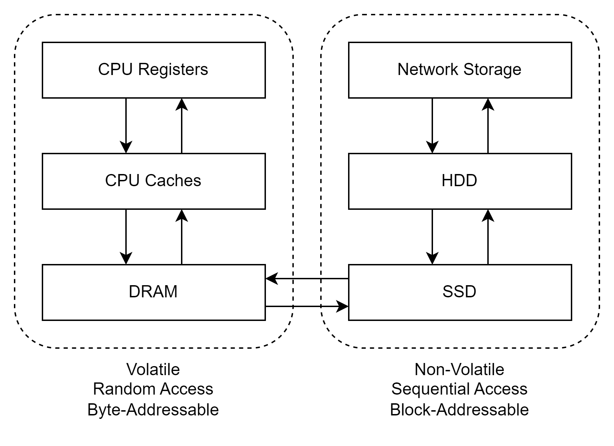

**CMU Introduction to Database Systems Fall 2021**

# Introduction & Relational Model

## Relational Model

### Structure

关系型数据库最大的特征就是不同的表(或者叫relation)之间都是联系的，也就是说一个实体中的某个特征可能和别的实体中的特征有关联。举一个简单的例子，
假设现在有两张表。一张表的内容是订单，而另外一张是用户。加入一个用户下了单，那么某一个订单一定可以联系到一个特定的用户，因为只有用户可以下单。
所以关系型数据库能很好地处理这种结构并且建立这样的关系。

### Integrity

一般翻译为完整性。我个人的理解就是一个数据存在关系型数据库中需要保证它的准确性，有效性，一致性，可用性。所谓的准确性就是这个数据能清晰表达存储的内容。
比如一个存一个数字，那么这个数字的精度必须一致，0.0003存进去后还是0.0003，不会变成0。那么有效性我个人是觉得，这个数据是符合标准的，比如某一个数据少了某个重要的特征，
那么就不能被放入库存。而一致性则是格式一致，比如存日期，那么就要保证所有日期的数据格式都一致，不能出现有的是带时间，有的是不带。可用性则是这个数据是否可以被处理。

### Manipulation

这个就是能否使用接口来操作数据

### keys

#### primary key

主键是用来区分不同数据的最靠谱方式。因为主键一定是唯一的，所以每一个主键只会对应一条数据。但是主键并不是唯一方式，因为字段在很多DBMS中是可以结合起来看的，
所以其它字段都有可能用来区分数据

#### foreign key

外键则是联系两个不同表之间数据的重要部分。之前的用户和订单之间就可以通过用户id来联系，因为一个订单中一定会出现一个用户id，而这个id也一定可以在用户表中找到。
那么通过一个用户id就一定可以找到至少一个订单。这里需要注意的概念是用户id只是用户数据中的一个特征，但是这个id对应到的是一条完整的数据，也就是一个订单的所有数据，
包括下单时间，价格，地址等所有特征。当然很多时候需要使用一个连接表来实现，后面也会讨论。

# Database Storage

## Storage Hierarchy

我记得这个部分好像在之前分析多线程的时候聊过，这次就相当于是一个系统的总结吧——硬件思路入手。先看下图

从CPU registers开始，每层的速度会逐级递减，我个人是从物理距离上来理解，cpu的寄存器就在cpu内部，所以它的速度肯定是最快的。剩下离CPU越来越远，
因此会变慢。那么继续从持久层的角度去看，在左边的三层都是volatile的，和java中的volatile关键字完全不一样，这里指的是处于这三层的数据，都会有丢失的风险，
也就是一旦断电，那么就不复存在。反之右边的三层，里面的数据是持久化的，即使没有电源，也可以维持。当然如果在往底层深入一点，就会发现，它们的存储方式也不太一样，
左边的三层一般是通过byte的形式来读取数据，而右边则是通过块的形式。简单的解释就是左边就都可以想象成内存，是一段一段的byte。而右边则是一页一页的书，
所以读写的时候需要一页一页翻找。

## Heap file

堆文件就是一些无序的页(pages)集合在一起，在页面内部，数据元组按照随机顺序储存。形成堆文件的方式有两种，一种是通过链表，一种是页目录。

### 链表

链表的表头会维护一个头文件——Header。在头文件中会保存两个指针，一个是指向空白页，一个是指向数据页。既然堆文件是无序集合，那么这里的链表也是无序的。
所以当一个空白页需要被加入链表的时候，就直接加入尾部节点，同样数据页也是加入尾部。那么这里还会有一个问题，就是每一个单独的页如果只有一部分有数据，一部分有没有，
那么要怎么储存呢？解决方案一般是每一页需要拿出一些空间来储存元数据，其中就可以记录还有多少空余的储存槽。

### 页目录

DBMS维护一些特殊页来追踪数据页在数据库中的位置，同时记录有多少空页。如果要怎么使用，那么就需要保证这个页目录是同步的，不然就会出现类似多线程的读写问题。

### 页

每一个页都会包含一个储存元数据的头，其中一般会包括页的大小，检查总和，DBMS的版本，事务的可见性，以及压缩信息。

