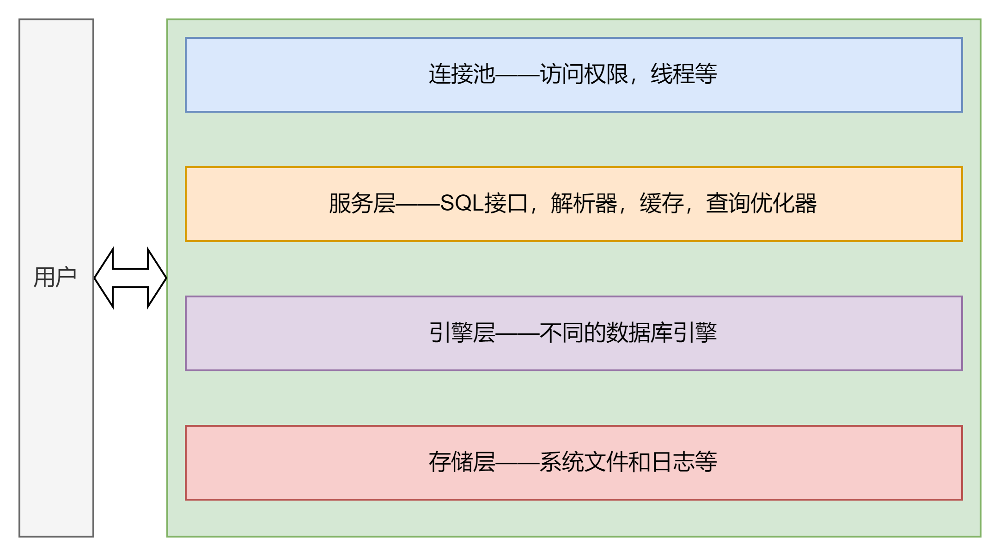
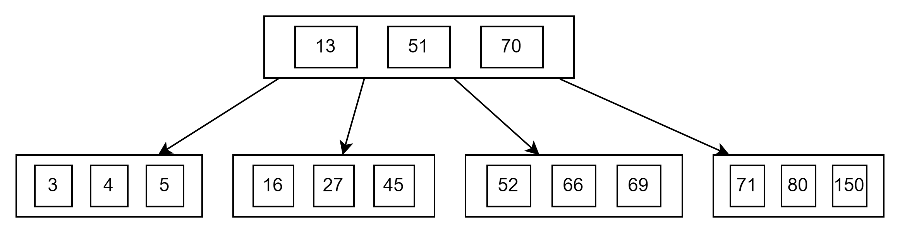
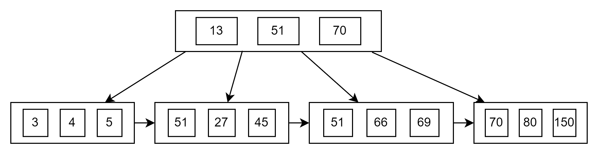
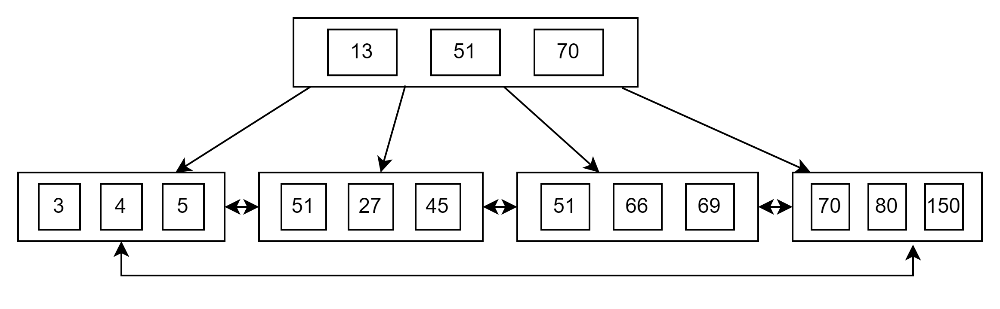

# MYSQL 进阶1

基础的MySQL用法，包括事务的隔离级别等，在spring，java-basics和多线程中已经聊过了。所以这次总结的都是一些进阶的内容。比如innoDB的一些底层原理，
index的原理等。注意之前讨论的时候使用的MySQL 5.7，但是由于技术不断在更新，所以从进阶总结开始，全部是基于8.0的总结。整张会结合MySQL的官方文档，
已经很多网上大神的说法。其中大部分的内容都会做验证，已保证准确性。

## MySQL Server 结构

先来看一下MySQL它的一个基本结构



从客户端的角度看过去，MySQL其实也是一个微服务，不过我把它想成一个很大的微服务，应该叫巨服务:joy:。内部有4个大的组件构成。连接池就是用来管理数据库连接的，
暂时没什么好说的。服务层则是用来处理数据的，比如SQL接口，views等。引擎层是用来使用不同的MySQL数据库引擎的，一般来说一个表是一个引擎。
其实目前我把引擎想象成DBMS是如何管理文件的，比如如果把一个文件转成二进制文件，如果读取，怎么去设计Header等。最后的储存层严格来说应该结合了硬件，
并不完全是MySQL服务器自己的内容，其中除了redo，undo log等日志文件，也包含了存入的数据和系统文件。

### 储存引擎

直接运行

```mysql
show engines 
```

结果如下

```text
InnoDB, MRG_MYISAM, MEMORY, BLACKHOLE, MyISAM, CSV, ARCHIVE, PERFORMANCE_SCHEMA, FEDERATED
```

其实我还是第一次直到MySQL有这么多引擎，之前以为只有老的MRG和新的InnoDB。这一次还是先简单的谈一下，之后的反思里会具体分析。

### InnoDB

MySQL 5.5之后就已经是默认的引擎了。比较大的优势就是支持事务，锁，外键约束。完全适配ACID模型。使用innoDB存储的文件，之前在大数据量表修改注释的那个里面讨论过，
一般是已ibd形式结尾。那么这个ibd文件的结构一般分为5层，最上层就是TableSpace，一般记录了元数据，相当于header。然后它之中会被化成一个一个的小块，称为Segment段。
而段再往下就是区，区往下就是页，那么页就已经我们比较熟悉的部分了，那么必然地，页中会包含行，也就是一行一行的数据。

## 索引

索引本质上就是一个有序的数据结构。它的目标是通过合理的数据结构，使用高效的搜索算法来遍历数据，从而提高读取的效果。一般情况下，索引就是给读取准备的。
显然索引的建立也会占用很多磁盘空间，并且如果存在大量插入的情况，那么其实索引反而会降低效率。因此最终，索引在大量查询的表中效果会更好。

### 索引类型

常见的一共有4种，B+树，hash索引，R-tree和Full-text。R-tree基本不怎么用，最后的全文索引利用了倒排索引的机制，属于ES的核心技术。而MySQL种比较常见的就是前两种，
其实主要是第一种，因为Hash索引的特殊性质，大部分情况下在缓存中用的比较多。而且innoDB一般都是用B+索引。

#### B+索引

其实和之前的红黑树还有二叉树很像，但是B+算是多路平衡查找树。原先的二叉树最大的子节点是2个，现在则是最大度数(Max-degree)
，也就是类似2-3树等结构。比如已一个最大度数为4的b-tree为例，整体结构就会如下图



因为最大度数为4，所以最多只能有3个节点，4个指针。也就是说，每一层节点内部只能有最多三个数据，然后通过排序来找到大小。其实这个想法和redis里面的跳表很类似。
都是通过先划归目标区间，比如我要找66，那么就会发现，它一定在51和70之间，所以直接沿着两个中间的指针往下走。这样的话，最差的情况下，搜索的速度应该是log(max-degree, n)。
它的插入也很简单，就是当指针超过指定数量之后，就把中间的元素向上分裂，保证左右两边尽量是平衡的。

有了B树的基础，在来看B+树的结构就比较简单了。先看下图



可以看到所有的数据会被存放在叶子节点，而其它所有的节点都只是用来找到叶子的指针。如果单独看叶子节点，那么其实所有的数据都被放在一个单向的链表里。
我个人觉得这个设计是为了尽量轻量化节点的大小。使用这种方式，似乎可以把数据和指针分开存储，比如数据存在磁盘里，而指针可以放在一个更快的地方。
当我需要使用的时候，就可以快速通过指针找到磁盘的地址。

那么最后来看MySQL的B+Tree的结构



其实就是把最下层的单向链表变成了双向链表。这个的好处就是即使到了最后一页还可以在从新回到第一页。而且也和之前的ibd文件的数据空间分配对应上了。

#### 索引分类

一般来说是4类

| Type | DESC    | Keywords | Limit |
|------|---------|----------|-------|
| 主键索引 | 针对主键    | primary  | 1     |
| 唯一索引 | 避免重复的索引 | unique   | many  |
| 常规索引 | 快速定位    | /        | many  |
| 全文索引 | 文本关键字   | fulltext | many  |

按照索引的储存方式有可以分成两种

- Clustered Index 聚集索引：也就是按照B+的方式，叶子节点保存行数据。并且在MySQL中，这个索引是必须存在的，有且只有一个。
- Secondary Index 二级索引：把数据和索引分开储存，索引结构的叶子节点关联的是对应的主键。可存在多个

聚集索引的创建规则是：如果存在主键，那么主键索引就是聚集索引。如果没有则第一个唯一索引是聚集索引。如果都不符合，则自动创建一个row id来当作聚集索引。

**也就是说，一次查询只要查的不是主键，那么就会走两次索引，第一次先走二级索引找到对应的id，然后在从聚集索引取出数据。**

#### 创建索引

这个倒是比较简单，就直接用下面这个语句

```mysql
create index [index name] on [table name](col name, )
```

如果是联合索引就按照顺序加列名。不过这个会牵扯到一个索引的效率问题，后面也会分析，这里就只是一个简单的复习。

### SQL 优化

这个题目太大了，很多可以优化的点。这里就非常简单的讨论一些思路。

首先就是最简单的读写比较，通过```show global status like 'Com_______'```直接查询所有不同sql的数量，来看一个表是否是查询较多还是插入较多。
如果说查询比插入多的话，就需要特别优化SQL或者表结构来提高效率。假如几乎没有查询的话，那么似乎就不需要考虑SQL优化问题。

#### 慢查询

这个算是任何系统每天都会碰到的问题。尤其是大的数据表格，其实无论如何都是无法避免的，一张超过1000W数据的表格，即使字段本身不大，如果运行一个count还是需要差不多10s左右。
这个我自己试过了，即使全部都是数字，且长度很少的情况下，依旧需要差不多5s以上。当然可能和磁盘性能也有一定关系。

那么在MySQL中也存在自带的慢SQL查询日志，比如slow_query_log，但是由于并不是很好用，默认是关闭的。我自己试了一下，开启之后也没有啥特别的，而且还得定时抽取这个文件的值，
等于还增加了IO。

#### profiling

和java的JMX profiling差不多，都是把一个SQL的耗时拆成很细的部分来分析。利用下面的指令开启。

```mysql
set profiling = 1;
```

然后直接运行想要查看的sql，运行完毕后使用`show profilies;`获取所有的query列表。然后在针对某一条query使用`show profile for query [query id]`来查看具体的值。
一般结果如下：

| Status                        | Duration |  
|-------------------------------|----------|
| starting                      | 0.000089 |  
| Executing hook on transaction | 0.000003 |  
| starting                      | 0.000007 |  
| checking permissions          | 0.000005 |  
| Opening tables                | 0.000038 |  
| init                          | 0.000005 |  
| System lock                   | 0.000007 |  
| optimizing                    | 0.000009 |  
| statistics                    | 0.000059 |  
| preparing                     | 0.000014 |  
| executing                     | 0.000033 |  
| end                           | 0.000002 |  
| query end                     | 0.000002 |  
| waiting for handler commit    | 0.000008 |  
| closing tables                | 0.000006 |  
| freeing items                 | 0.000011 |  
| cleaning up                   | 0.000009 |  

那么这里会把每一步都拆分出来，这样比较好定位到问题的所在。

#### explain

explain可以查看sql的执行计划，这个在实际开饭中感觉用的也挺多的，具体思路就是给写好的sql前面加上explain。然后就会把具体的执行计划显示出来。
具体的结果我就不复制了。

#### 索引使用

当出现联合索引的时候，一般采取最左前缀发法则。很简单，比如在一张user表的两个字段上建了索引，分别是address,age和status。那么如果用下面的这条sql来查询。

```mysql
select * from user where address='xxx' and age = 21 and status =0;
```

那么索引有效的规则是，从左边开始每一个and中都必须包含在索引里，如果出现age不在，而address和status在的话，那么就不会走索引。索引失效会从第一个不在索引里的字段开始，
并且也是从左至右的。注意这里的最左原则指的是符合索引内部的顺序，而不是sql写的顺序。

除了之外，范围查询右边的列会自动失效。这里指的是单纯大于或者小于，在MySQL 8.0中，如果使用大于等于或者小于等于则不会导致索引失效。

#### 索引失效情况

- 字符串插叙不加单引号
- 模糊查询中，头部模糊查询则索引失效
- 使用or分割的条件，只有两侧都有索引的时候才会有效
- MySQL优化器评估索引比全表慢则自动不走索引

#### 强制索引

这个也是老生畅谈了，可以通过force index强制走索引或者use index来建议mysql走索引。但是这个也要看具体的SQL，有可能走索引并不快。

#### 前缀索引

当出现了长字符串，或者需要储存文章的时候。那么在整个字符串上建立索引很让索引变得过大，查询效率必然降低，同时也会导致浪费磁盘IO。为了解决这种问题，
在建立长字符串索引的时候，可以通过只取前缀的方式来建立索引，减少索引的大小。基本语法如下

```mysql
create index idx_xxx_xxx on [table_name]([colum_name(n)])
```

其中n代表了索引长度


