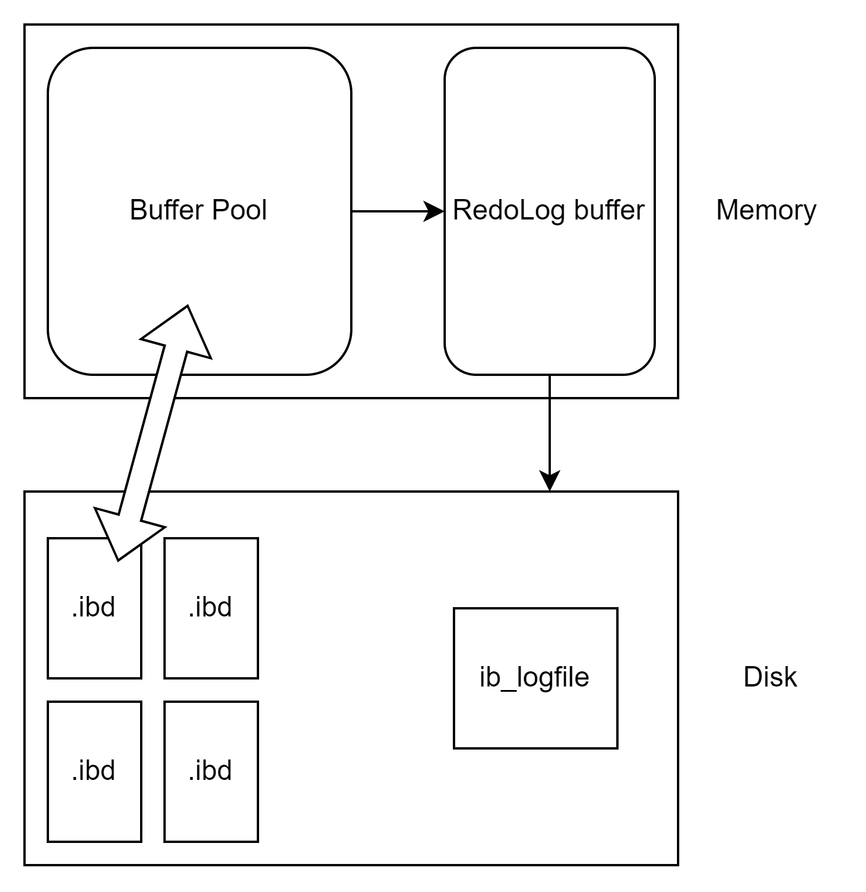

# MySQL进阶 3

本章是innoDB架构的简单分析和整理，包括其中支持的事务管理方式。

## 内存架构

### 缓冲池 Buffer pool

缓冲池是主内存种的一个区域，一般存放的是磁盘上经常操作的一些数据。一般执行CRUD操作的时候，先操作缓冲池中的数据，如果没有命中。就会从磁盘中加载并缓存起来。
等到累计一些后，就直接刷新到磁盘，从而减少磁盘IO。

缓冲池的数据单位是页（page），底层则是维护一个链表。一般页被分配为三种类型

- free page: 空闲页，没有被使用过的
- clean page: 数据没有被修改过的页，正在使用
- dirty page: 脏页，数据被修改过，内部数据和磁盘的并不一致

### 更改缓冲区 change buffer

这个缓冲区只针对非唯一二级索引页，也就是对于主键索引是不会更改缓冲区的。假设现在有一个DML语句，如果这些数据在buffer pool又不存在。那么也还是不会直接操作磁盘，
而是会将数据变更后，保存到更改缓冲区Change Buffer中。将来数据被读取的时候，在把数据合并到buffer pool中，然后刷新到磁盘上。

### 自适应哈希 Adaptive Hash Index

主要是优化buffer pool中对于数据的查询。InnoDB本身并不支持哈希索引，但是引擎会监控表中索引页的查询，如果发现哈希索引可以提升速度，那么就会建立一个哈希索引，这个称为自适应哈希索引。
也就是不需要手动干预，而是系统自动完成。

可以通过修改`innodb_adaptive_hash_index`来开启，一般是默认开启的。

### 日志缓冲区 Log buffer

用来保存要写入磁盘中的log日志数据（redo log,undo log），默认的大小是16MB，日志缓冲区会定期的刷新到磁盘。一般来说修改日志缓冲区的大小可以减少磁盘IO

主要的参数有两个

1. innodb_log_buffer_size：缓冲区大小
2. innodb_flush_log_at_trx_commit：日志刷新时机

对于刷新时机，一般来说默认的是1，也就是每次提交事务的时候写入并刷新到磁盘。0则是每秒将日志写入并刷新到磁盘。2是事务提交的时候写入，每秒刷新。

## 磁盘结构

### 系统表空间 system tablespace

系统表空间是更改缓冲区的储存区域，如果表是在系统表空间，而不是每个表文件或通用表表空间中创建的，它可能包含表和索引数据。
可以查看innodb_data_file_path。

### 文件表空间 File-Per-Table 

每个表的文件表空间包含单个InnoDB表的数据和索引，并储存在文件系统上的单个数据文件中。我个人理解就是idb文件。如果我们用hex来解析就会发现，
里面会有一大堆的内容。
可以查看innodb_file_per_table

### 通用表空间 General Tablespaces

通用表空间，这个表空间不能直接获取，而需要使用create tablespace语句来创建。在创建表的时候可以指定表空间。
也就是说，在创建表的时候就可以自定义表储存的位置，从而提高效率。

### 撤销表空间 Undo Tablespaces

MySQL实例在初始化是会自动创建两个默认的undo表空间。初始大小16Mb。用于储存undo log日志

### 临时表空间 Temporary Tablespaces

InnoDB使用会话临时表空间和全局临时表空间，存储用户创建的临时表等数据

### 双写缓冲区 Doublewrite Buffer Files

InnoDB引擎将数据页从Buffer Pool刷新到磁盘前，先将数据页写入双写缓冲区文件中，便于系统异常是恢复数据

### 重做日志 Redo log

用来实现事务的持久性。该日志文件由两个部分组成，重做日志缓冲(redo log buffer)以及重做日志文件(redo log)，前者实在内存中，后者在磁盘中。
当事务提交之后会把所有修改信息都会存到改日志中，用于在刷新脏页到磁盘时，如果出现错误，可以进行数据恢复。

## 后台线程

### 核心后台线程 Master Thread

它主要负责调度其它线程，还负责将缓冲池中的数据异步刷新到磁盘中。保持数据的一致性，还包括脏页的更新，合并插入缓存，undo页的回收。

### IO线程 IO Thread

InnoDB使用了大量的AIO来处理IO请求，异步可以极大提高数据库的性能。IO线程就是负责这些异步IO的回调。

一般来说线程分配如下

```text
I/O thread 0 state: waiting for completed aio requests (insert buffer thread)
I/O thread 1 state: waiting for completed aio requests (log thread)
I/O thread 2 state: waiting for completed aio requests (read thread)
I/O thread 3 state: waiting for completed aio requests (read thread)
I/O thread 4 state: waiting for completed aio requests (read thread)
I/O thread 5 state: waiting for completed aio requests (read thread)
I/O thread 6 state: waiting for completed aio requests (write thread)
I/O thread 7 state: waiting for completed aio requests (write thread)
I/O thread 8 state: waiting for completed aio requests (write thread)
I/O thread 9 state: waiting for completed aio requests (write thread)
```

可以看到写和读分别是4个线程，而插入buffer是一个单独的线程，log（日志刷新）也是一个单独的线程。

### 清洗线程 Purge Thread

主要用于回收已经提交事务的undo log。在事务提交后，把它清除。

### 页清理线程 Page Cleaner Thread

协助主线程刷新脏页到磁盘的线程。主要是减轻主线程的压力，减少阻塞

## 事务原理

事务就是一组操作的集合，这一组操作只能同时成功或者同时失败。当提交一个事务的时候，一组操作会被当作一个请求来提交。

### 特性 ACID

- 原子性：事务要么全部成功，要么全部失败
- 一致性：事务完成时，必须使所有的数据都保持一致状态
- 隔离性：数据库系统提供的隔离机制，保证事务在不受外部部分操作的影响的独立环境下运行
- 持久性：事务一旦提交和回滚，数据的改变则是永久的。

为了保证原子性，一致性和持久性，InnoDB使用redo log和undo log。而隔离性则利用了锁机制和MVCC，这个后面也会提到

### Redo Log

就像上面说过的一样，记录的是事务提交时数据页的物理修改，用来实现事务的永久性。
这个文件也是由两个部分组成——redo log buffer以及redo log file。前者位于内存中，后者则写在磁盘。当事务提交之后会把所有修改信息都存在日志文件中，
用于在刷新脏页到磁盘发生错误时，恢复数据。

大致结构可以看下图



基本的流程就是，先把东西写到buffer里面，然后更新redo buffer。再有redo buffer去刷新磁盘中的log file，这样就可以保证在事务失败，或者数据库出错的时候，
可以通过redo file中的内容来恢复数据。

### Undo log

主要是解决事务的原子性。回滚日志，用于记录数据被修改前的信息。主要功能——提供回滚和MVCC。undo log记录的是逻辑日志，也就是所谓的叛逆期。
比如当我插入一条数据的时候，它就对着干，记录一条删除这条数据的语句，然后按顺序排列。当执行rollback的时候，就是把这些日志的内容跑一遍，
也就是等于恢复到最开始的状态了。

undo log销毁，undo log在事务提交后，并不会马上被销毁。因为它们可能还会被用在MVCC。
undo log储存，undo log一般采用段的方式管理和记录，存放在前面介绍的rollback segment回滚段中。内部包含了1024个undo log segment。

### MVCC 多版本并发

当前读，读取的是记录的最新版本，读取是还需要保证其它并发事务不能修改当前记录，会对读取的记录进行加锁。
其实就是之前所有共享锁的概念，当两个session同时开启事务，只要没有使用`lock in share mode`或者`for update`等时，就会出现可重复读。
那么即使另外一个事务更新了某条数据并提交成功了，那么这个session还是读不到的。

快照读，其实就是简单的select语句。读取的是记录数据的可见版本，有可能是历史数据，不加锁，是非阻塞读。

MVCC，多版本并发控制。主要是维护一个数据的多个版本，使得读写操作没有冲突，快照读为MySQL实现MVCC提供了非阻塞读。

#### 隐藏字段

为了实现MVCC，首先就是mysql自带的隐藏字段

- DB_TRX_ID：最近修改的事务ID，记录插入这条记录或最后一次修改记录的事务ID
- DB_ROLL_PTR：回滚指针，指向这条记录的上一个版本，用于配置undo log，指向上一个版本
- DB_ROW_ID：隐藏主键，如果表结构没有指定主键，将会生成该隐藏字段。

#### undo log

之前说了undo log在事务结束后不会被立即删除，是为了MVCC。但是其实如果只有insert语句的话，那么undo log完全是可以立即被删除的。因为事务提交后，就不需要回滚了。
但是如果是update，delete，那么产生的undo log日志不仅在回滚是需要，在快照读的时候也需要。所以不会立即被删除。

版本链，本质上就是一个链表。从宏观来看，就是把一个版本记录中的上一个版本指针，指向上一个版本的地址。这样每一个事务写入undo log的时候，就可以通过不断指向上一个地址，
来打到最终回滚到最初版本的要求。整体可以想象成一个前插法。

#### ReadView

读视图，用来记录系统当先活跃的事务id，然后通过这个id来找到需要的历史版本。也就是读取undo log中的内容。
readview中有四个核心字段

- m_ids：当前活跃的事务ID集合
- min_trx_id：最小活跃事务ID
- max_trx_id：预分配事务ID，当前最大事务ID+1
- creator_trx_id：ReadView创建者的事务ID

