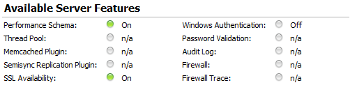

平台：MySql Server 5.7 

使用手册：[MySQL Performance Schema](https://dev.mysql.com/doc/refman/5.7/en/performance-schema.html)

以下文档主要是performance schema官方文档的翻译，其中参杂了一些个人理解，可能会有错误。

# Performance Schema 

Performance Schema(以下简称pfs) 提供了一种可以在运行时检查服务器内部执行的方法。它主要通过pfs储存引擎和pfs数据库来实现。
和Information_schema不同的是，它主要侧重于性能数据，而不是元数据。

pfs的监控单位是服务器事件(server event)。一个服务器事件一般指任何服务器花费了时间并且已被执行的事，所以时间信息也会被收集到。
一般来说，一个事件可以是函数调用，等待操作系统，SQL执行过程中的某个阶段。事件收集给开发者提供了访问关于同步调用的权限，比如表IO，表锁等。

pfs event和被写入系统二进制日志和事件调度不同，它落在一个MySQL服务器实例上。可以把它想成是服务器中的一个本地表，所以修改并不会被放入二进制日志中。

开发者可以从pfs中获取实时事件，历史事件和总结。这样做的优点就是可以让开发者自己决定instrumented event(我个人倾向于翻译成测试事件不过专业词汇应该是插桩)的数量，从而观察发生时间等。
这些事件信息会展示每个线程的行为，或mutex锁状态等。

pfs储存引擎利用服务器源码中的'Instrumentation points'(插桩点)来收集事件数据。所有被收集的数据都会被放入pfs数据库，这些表可以直接用SQL来查询。
pfs配置也可以被动态修改，比如表中的字段是完全可以通过SQL来改动的，这里MySQL给了高度自由。并且这些修改是及时生效的。

所有pfs中的表全部会被放在内存中，不会占用磁盘空间。所以关闭服务器就等于直接丢失所有pfs的数据，反之开启服务器就会把pfs的数据重新注入。
这里官方说得很模糊，到底是把之前的数据先放入磁盘。下次开始的在读回内存，还是重启一个新的pfs数据，官方没有给出一个解答。这个后面我在看看有没有把办法测出来。
我目前的猜想是应该是全部丢失，然后都是新的，而不是重注入原先的。

pfs的监控是面向全平台的，不过由于操作系统的区别，timer可能会有小的出入。储存引擎可能也有小区别。

数据收集是从服务器的源码中修改而来的，但是服务器并不会单独给pfs开一个线程。

它的设计会遵循以下几个原则

- 它绝对不会改变任何服务器的行为
- 服务器监控会悄悄地持续执行，它的运行消耗会很小很小。并且它不会导致服务器不可用
- 解析不会变
- 即使pfs内部调用失败了，也不会影响服务器的正常运行
- 容易加入instrumentation points
- 版本永远向下兼容

## 快速入门

MySQL server 5.7是默认开启Performance Schema，可以通过官方的workbench工具查看



也可以直接用这个查`SHOW VARIABLES LIKE 'performance_schema';`

继续下去之前，我们必须明确一点，PERFORMANCE_SCHEMA的实现本质上是一个储存引擎。这个引擎会在pfs数据库上运行而已，就像innoDB一样。
先用`show tables from performance_schema`查看所有的表，发现有巨多(再见了，我的头发)。并且这个表的数量还会随着插桩的增多而越来越多。
具体每个表是干什么地先不着急，后面会慢慢分析。

用`SELECT * FROM performance_schema.events_waits_current\G`查询服务器正在做啥。结果如下

```shell
*************************** 1. row ***************************
            THREAD_ID: 13
             EVENT_ID: 15
         END_EVENT_ID: 15
           EVENT_NAME: wait/synch/mutex/innodb/buf_dblwr_mutex
               SOURCE:
          TIMER_START: 926626537649295
            TIMER_END: 926626537949175
           TIMER_WAIT: 299880
                SPINS: NULL
        OBJECT_SCHEMA: NULL
          OBJECT_NAME: NULL
           INDEX_NAME: NULL
          OBJECT_TYPE: NULL
OBJECT_INSTANCE_BEGIN: 2248170372120
     NESTING_EVENT_ID: NULL
   NESTING_EVENT_TYPE: NULL
            OPERATION: lock
      NUMBER_OF_BYTES: NULL
                FLAGS: NULL
```

其实有很多行，每一行就是一个线程，不过这里我就用一个来分析一下。
首先是线程id，这个不用说了。然后event_name表示的就是时间的名称，并且清晰告知它的源文件。时间记录了事件开始事件和结束时间，包括持续时间。
如果事件还在继续，那么结束时间和持续时间就会是null。这个时间的单位是picoseconds。

通过performance_schema.events_waits_history可以查到历史事件。这里就不展开聊了。
同样通过performance_schema.events_waits_summary_global_by_event_name表可以查看总结文件。同样通过performance_schema.file_instances可以查看所有的实例。

诸如以上的表格太多，我们后面慢慢分析，现在就大概知道一下。

这里还是需要提一下，pfs会把收集的事件放入pfs数据库中，这个事件其实就是消费者。具体的参数调整我们后面在来慢慢分析。

## 构建配置

这里官方文档主要是明确一下可能会需要调整的部分。比如一些插桩命令我希望不包含在引擎里，主要还是解决问题的QA，所以就略过了。

## 启动配置

需要注意的地方，如果服务器在pfs初始化阶段没有办法给它分配任何内部缓冲区(internal buffer)，那么pfs就会自己停止启动，并且服务器全程不支持插桩。
启动的时候也可以通过`performance-schema-instrument='instrument_name=value'`指令来具体控制某一个插桩。
也可以通过参数设置历史事件表的大小等。具体的配置有很多，后面会根据实际情况慢慢列出可能需要的参数。

## 运行时配置

其实这个应该是关注的重点，因为我们主要就是为了它可以监控运行数据才去研究它的。

### pfs 事件计时

pfs的事件计时和java中时间记录还是有一些相同的，不过个人感觉SQL里面可以选择的timer好像更多一点。先来看带有timer的两个表格——`performance_timers`和`setup_timers`
setup_timers表的任意一行都必须关联到performance_timers。

performance_timers: 列出所有可用的计时器和它们的属性

setup_timers：列出具体的一个计时器被用在哪一条指令

```mysql
mysql> select * from performance_schema.performance_timers;  
+-------------+-----------------+------------------+----------------+
| TIMER_NAME  | TIMER_FREQUENCY | TIMER_RESOLUTION | TIMER_OVERHEAD |
+-------------+-----------------+------------------+----------------+
| CYCLE       |      2798059701 |                1 |             18 |
| NANOSECOND  |            NULL |             NULL |           NULL |
| MICROSECOND |        10000000 |                1 |             30 |
| MILLISECOND |            1005 |                1 |              3 |
| TICK        |            1985 |                1 |              2 |
+-------------+-----------------+------------------+----------------+
```

上面的SQL可以用来查看可用的计时器，可以看到NANOSECOND是无效的。根据官方的说法，先来理解一下三个字段的意义。

### TIMER_NAME 

这个比较简单，就是计时器的名字，直接对应了它的CPU时钟次数。如果出现了向我这里的null，那么就是平台不支持。关于这个我还想在确认一下，
因为我们线上平台具体支不支持这个我也不是很清楚，我没有在官方文档中找到答案。但是我个人猜测这个应该和操作系统相关。

### TIMER_FREQUENCY 

一秒发生多少次计数器单位。听起来比较拗口，其实就是一秒可以换算成多少个单位时间，比如MILLISECOND就是1000次。
唯一需要特别注意的就是ticks是由操作系统决定的，这里的1985就是操作系统规定一秒有多少个tick

### TIMER_RESOLUTION

resolution就是自增的最小单位，上表中的1表示，一次最少加1。

### TIMER_OVERHEAD

最少需要过多久才能使用这个单位进行测量，其实就是精确度啦。比如上表中的2就表示，能够测量的最小值为4ticks。注意因为开头和结束都需要2ticks所以最小才是4ticks。

下面通过`select * from performance_schema.setup_timers;`来查看具体每个timer现在被用来干嘛了。

```mysql
+-------------+-------------+
| NAME        | TIMER_NAME  |
+-------------+-------------+
| idle        | MICROSECOND |
| wait        | CYCLE       |
| stage       | MICROSECOND |
| statement   | MICROSECOND |
| transaction | MICROSECOND |
+-------------+-------------+
```

上面的结果就显示除了，MICROSECOND被用来监控transaction的时间。其实默认的设置就已经是官方调试过觉得最好的搭配了。
但是如果喜欢，我们还是可以通过update语句手动更改需要的timer。

不过比较有意思的是，无论是什么操作系统，MySQL配置好的计时器都是这样，很难相信它真的是最佳的配置。比如拿wait来说，这种类型的事件，我们当然是希望降低overhead，
不然我测量的时候，要在头尾加入大量的overhead，显然不是很准。可以cycle的overhead在我的操作系统中并不是最低的。

所以我个人的建议是，还是要手动调整一下，不过后面可能出现的测试我还是会按照官方的配置来，以减少和官方理解上的冲突。

在不同的pfs表中都会包含三列分别是开始时间，结束时间和等待时间。可以在之前提到的setup_instruments表中打开计时功能。虽然看上去每个计时器的单位不同，但是实际上每次计时都是先用picoseconds，最终转成需要的时间单位。
如果手动的调整不同任务的计时器，这个改动会被mySQL立即捕捉并且生效。所以要格外注意，如果在运行中改动timer可能会导致最终**无法预测**。官方的推荐改法是用TRUNCATE TABLE来同时修改pfs的statistics。

