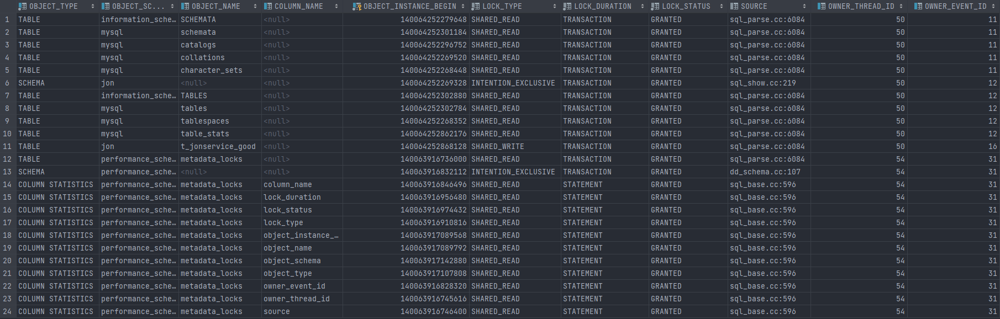

平台：MySql Server 5.7 

Metadata Locking：[Metadata Locking](https://dev.mysql.com/doc/refman/5.7/en/metadata-locking.html)

以下文档主要是performance schema官方文档的翻译，其中参杂了一些个人理解，可能会有错误。

# 元数据锁机制

## Metadata Locking

MySQL 使用元数据锁机制来管理并发访问数据库，并且保证数据的一致性。元数据锁机制不仅对表生效，同时也对schema，储存过程，函数等生效。

在ps中，metadata_locks这个张表暴露了所有元数据锁的信息。这些信息可以清晰的展现谁正在持有锁，哪些部分正在等待锁等。

元数据锁机制也有一些必然的开销，并且这些开销会随着请求体量的增大而增大。当很多请求尝试访问同一实例时，元数据竞争会变得激烈。

元数据锁机制不能替换table definition cache，并且它的互斥和锁机制也和LOCK_open互斥不同。

## Metadata Lock Acquisition

如果同一把锁有多个等待获取者，最高优先级的请求会先被满足，但是系统变量中的`max_write_lock_count`会影响结果。举个例子，一般情况下，写锁比读锁的优先级要高。但是如果`max_write_lock_count`被设置为一个较低的值（官方给的是10）。
同时，读锁请求超过了10把，那么读锁请求的优先级就会高于写锁。简单来说就是`max_write_lock_count`就是用来限制写锁请求的大小。保证在需要的时候，写可以比读优先级高。
对于不同的操作系统`max_write_lock_count`的默认值是不同的，具体可以参考这个文档[Server System Variables](https://dev.mysql.com/doc/refman/5.7/en/server-system-variables.html#sysvar_max_write_lock_count)

每一个语句都会一个接着一个的获得锁，而不是同时，并且整个过程中都会检查死锁。

DML语句正常来说获取锁的顺序和表在语句中被提及顺序一致。

DDL语句，`Lock tables`以及其它相似语句通过表名的顺序来获取锁，从而尝试减少可能出现的死锁（由并发DDL语句造成的）。这里的表名是语句中显式声明的表明，比如外键连接的隐式表名就不参与排序。

### 示例 rename table

先观察如下语句

```mysql
RENAME TABLE tbla TO tbld, tblc TO tbla;
```

当执行上述语句时，其实获取锁的顺序为tbla，tblc，tbld。也就是说所有显式声明的表名，都会按照字母表顺序排列。
如果把上面的sql稍加改动，比如

```mysql
RENAME TABLE tbla TO tblb, tblc TO tbla;
```

那么获取锁的顺序就是tbla，tblb，tblc。和语句一致。

虽然两个语句都会在tbla和tblc上加锁，但是发生时间不一致。由此想见，上锁时间不同必然带来问题。

### 示例 lock table

先来看这个sql

```mysql
LOCK TABLE x WRITE, x_new WRITE; -- client 1 

INSERT INTO x VALUES(1); -- client 2

RENAME TABLE x TO x_old, x_new TO x; -- client 3 

UNLOCK TABLES; -- client 1 
```

加入客户端一对x和x_new上写锁。那么客户端二的sql将会等待x的写锁释放，客户端三上的sql需要互斥锁，并且顺序是x，x_old，x_new。
那么此时如果客户端一释放了写锁，由于rename比insert的优先级高，所以客户端三优先获取锁，同时修改表名为x_old，最终释放锁。
最终客户端二获取锁，插入数据，然后释放。

以上的流程听起来很靠谱，但是思考一下就会发现问题rename比insert先发生，所以客户端二插入的数据并不是原来的x那张表，而是由x_new变化过来的表。
所以这里数据的位置就已经错了，更不用说表结构不对的问题。但是如果我们调换一下顺序

```mysql
RENAME TABLE x TO x_old, new_x TO x; -- client 3
```

客户端三的语句变换了，其它的部分都是一样的。这次当获取锁的时候，由于new_x按字母表顺序比x要先，所以当获取锁的时候，等待new_x锁的sql只有一个，
而等待x的也只有一个。所以这次客户端二会先插入数据，同时客户端三会尝试修改表名，等到客户端二释放了锁，客户端三才能修改x到x_old。
这样数据就被插入到正确的表了，并且表也正确的被改名了。

## 元数据锁释放

为了保证事务的可序列化，服务器绝不允许一个session对某个未完成的事务（这和事务由另一个session显示或隐式开启）使用DDL语句。服务器会对处于事务中的表加锁，
直到整个事务完结。一个加在表上的元数据锁会阻止任何对表结构的修改。上锁机制的含义就是一个正处于事务的表是无法被其它session的DDL修改的，除非事务已经结束。

如果服务器开了一个语法上正确，但是执行过程中失败了的事务，那么它不会直接释放锁，而是等到事务结束。因为这样可以保证log也是一致的。
如果是自动提交模式，那么就是在自动提交之后释放锁。

如果是prepare语句的话，那么在准备完成后就自动释放锁。

# metadata_locks Table

## 基本信息

一般情况下，`metadata_locks`表会暴露以下信息

- 已经被持有的锁
- 已经被请求但还没有被持有的锁
- 已经别死锁检查杀掉的锁请求
- 已经超时，但是仍然在等获取锁请求的锁请求被抛弃的锁请求

`metadata_locks`表会同时显示一个session正在持有的锁，以及它可能在等待的锁。

`metadata_locks`表是一个只读表，它的大小是默认的。可以通过修改系统参数`performance_schema_max_metadata_locks`来调整。
元数据锁工具使用了`wait/lock/metadata/sql/mdl`工具，默认是关闭的。需要在服务启动的时候手动打开，

```mysql
performance-schema-instrument='wait/lock/metadata/sql/mdl=ON'
```

也可以在运行时启动

```mysql
UPDATE performance_schema.setup_instruments
SET ENABLED = 'YES', TIMED = 'YES'
WHERE NAME = 'wait/lock/metadata/sql/mdl';
```

## 锁状态

表中的`LOCK_STATUS`会记录锁的状态。状态变化主要包括以下

- 当一个元数据锁被获取后，立即向表中插入一行状态为`GRANTED`的数据
- 当一个元数据锁被请求后，没有获得，立即向表中插入一行状态是`PENDING`的数据
- 当一个之前请求元数据锁的session获取了锁后，立即更新之前`PENDING`的那一行，改成`GRANTED`
- 当一个元数据锁被释放的时候，立即删除之前插入的一行
- 死锁检测器为了打破一个死锁而取消一个正在`PENDING`的锁请求的时候，更新之前的`PENDING`成`VICTIM`
- 当一个`PENDING`的锁请求超时后，更新`PENDING`成`TIMEOUT`
- 当一个`PENDING`的锁请求或`GRANTED`的锁被杀掉后，它的状态久会更新成`KILLED`
- 一个处于`VICTIM`，`TIMEOUT`，`KILLED`状态的锁请求，一般意味着要被删除了
- `PRE_ACQUIRE_NOTIFY`和`POST_RELEASE_NOTIFY`状态，一般意味着元数据锁系统的子系统在获取锁这个动作，以及释放锁这个动作的时候，会提醒其它想要获得锁的储存引擎。

## 表结构

这张表的主要字段如下

| Name                  | Description                                                                                                                                            |
|-----------------------|--------------------------------------------------------------------------------------------------------------------------------------------------------|
| OBJECT_TYPE           | 对象的种类，GLOBAL, SCHEMA, TABLE, FUNCTION, PROCEDURE, TRIGGER (currently unused), EVENT, COMMIT, USER LEVEL LOCK, TABLESPACE, or LOCKING SERVICE           |
| OBJECT_SCHEMA         | 对象属于的schema                                                                                                                                            |
| OBJECT_NAME           | 对象的名字                                                                                                                                                  |
| OBJECT_INSTANCE_BEGIN | 对象监视器(instrumented object，实在不知道怎么翻译)的内存地址                                                                                                              |
| LOCK_TYPE             | 锁的种类 INTENTION_EXCLUSIVE, SHARED, SHARED_HIGH_PRIO, SHARED_READ, SHARED_WRITE, SHARED_UPGRADABLE, SHARED_NO_WRITE, SHARED_NO_READ_WRITE, or EXCLUSIVE. |
| LOCK_DURATION         | 上锁时间，用来声明时间的，并不是真的时长 STATEMENT和TRANSACTION表示锁在事务结束或者到了某条statement的时候会隐式释放, 而EXPLICIT表示锁只会被显式的释放，比如使用`Flush tables with read lock`。                     |
| LOCK_STATUS           | 锁的状态，详细请看上述情况                                                                                                                                          |
| SOURCE                | 提供监视器源代码的文件名，源代码中一般包括监视的具体事件以及行号，主要是方便利用源码来监控                                                                                                          |
| OWNER_THREAD_ID       | 请求这个元数据锁的线程号                                                                                                                                           |
| OWNER_EVENT_ID        | 请求这个元数据锁的事件号                                                                                                                                           |

## 表索引

元数据锁表自带三个索引

- primary key是加在了`OBJECT_INSTANCE_BEGIN`上
- OBJECT_TYPE, OBJECT_SCHEMA, OBJECT_NAME
- OWNER_THREAD_ID, OWNER_EVENT_ID

## 示例

metadata_locks表的示意图

