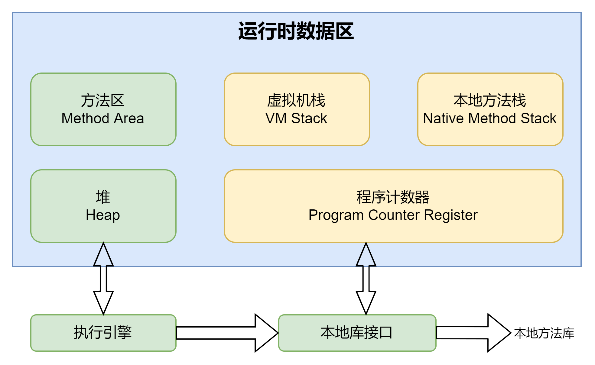
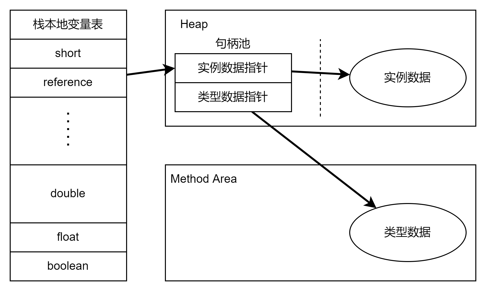
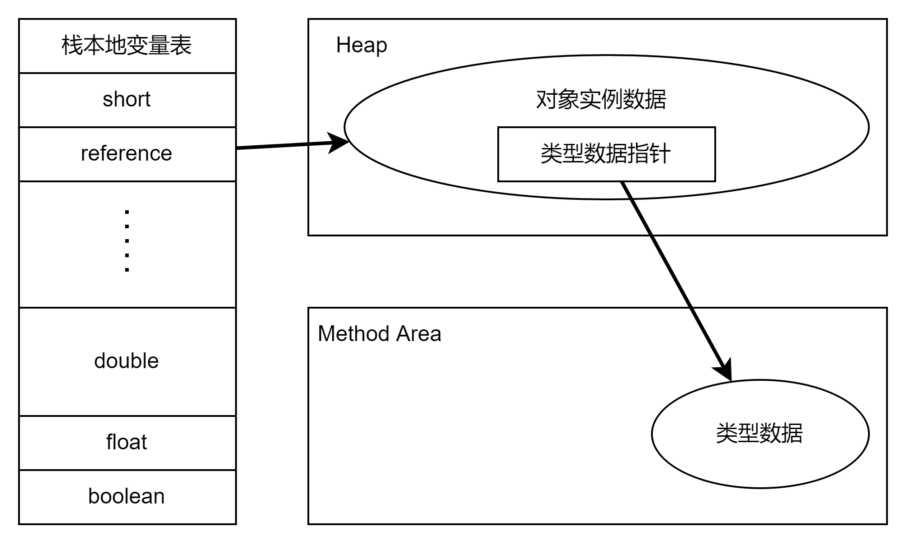
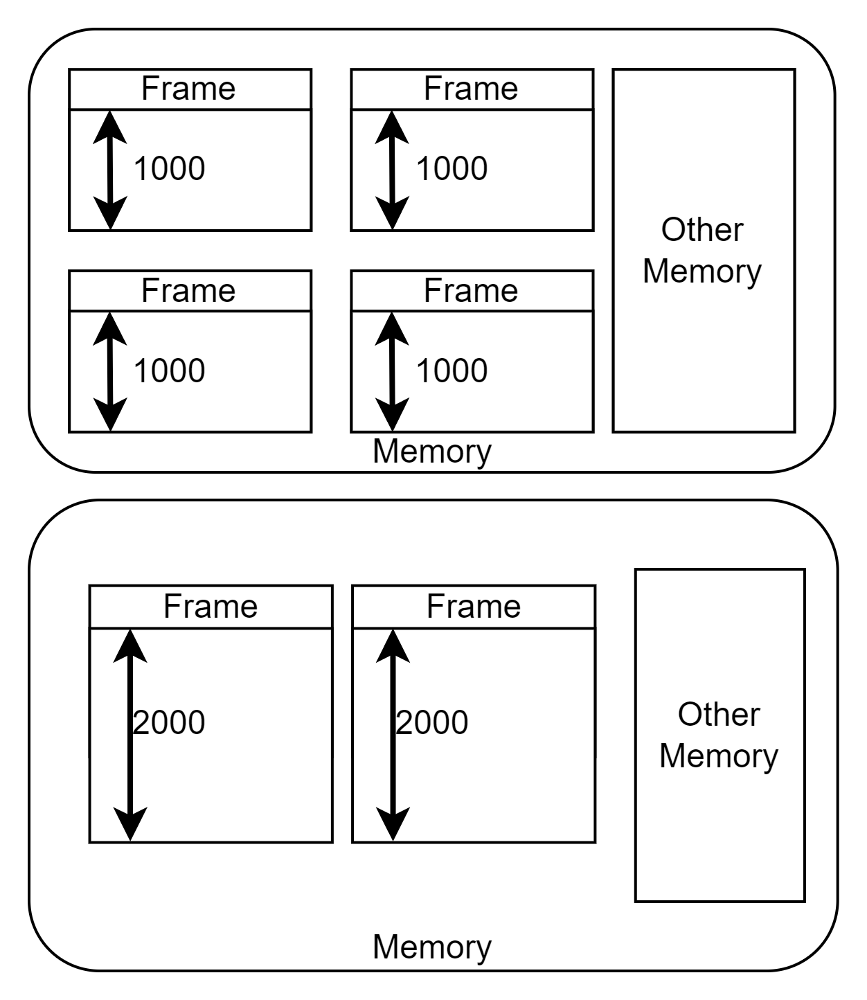

以下所有总结都基于《深入理解Java虚拟机》第三版，包括用于理解的图和代码，仅作为交流和学习使用。使用的JDK版本为openJDK 17，所以和书中的内容会略有出入。
由于JDK 17后基本舍弃了32为的JVM，所以后面讨论的JVM都是64位。

# JVM 运行时数据区域



上图中绿色的部分表示线程可共享的数据，而黄色的部分则是线程隔离的数据区。

## Program Counter Register 程序计数器

首先它是一块较小的内存空间，它可以看作是当前线程所执行的字节码的指示器。根据微机原理，CPU中存在一个PC用来指向下一个需要被执行的指令的地址。JVM中的PCR所达到的效果应该是一样的。
因为每个线程所执行的位置不一样，所以每个线程都会存在单独的PCR，也就是为什么它是线程隔离的。

它是唯一没有规定OutMemoryError情况的区域，这个也很好理解，因为它的物理原型就是CPU的寄存器，CPU寄存器我个人的理解只是一个指令指示器，压根不储存除了当前命令外的任何东西，所以不会出现内存满的情况。

## VM Stack 虚拟机栈

Java虚拟机栈，这个的作用其实在多线程里讨论过。首先它的生命周期个java中的线程是相同的。他藐视java方法执行的内存模型。比如当一个方法被执行的时候，JVM会同步创建一个栈帧(
frame)。
其中会存入局部变量表，操作数栈，动态连接，方法出口等。从JVM的角度去理解其实就是说，一个方法被调用后，会入栈，期间所有执行的内容以及信息都会被记录在frame中，直至方法结束，出栈。
这里根据作者的说法，其实直接把JMM单纯地划分为堆内存和占内存是不够准确的，但是却能直观的反应java的内存布局。为了简化语言，所以栈基本上可以指VM
stack，而不是本地方法栈。

局部变量表可以理解成是一个内存空间，它会把frame所有用到的变量全部放入，比如对象的引用，基础变量等。这些变量在表中是已槽(
slot)的形式来记录的。比如一个boolean在表中就占用一个slot。
long和double则是两个，因为它们都是64位的数据。重要的是，局部变量表所需的内存空间在编译期间就完成了分配，当进入一个方法时，这个方法在frame中的表大小是固定的，并且在运行期间不会改变大小。
这里就会出现疑问了，什么叫做大小不变呢？编译器如何知道表的大小呢？其实这个所谓的大小说的是slot的数量。也就是说，它和真正使用了多少内存没关系。而且其实一个slot所占的大小完全由JVM自己的实现决定。
所以这里所谓的定大小只不过是确保了frame中不会出现太多没有利用上的slot，造成资源的浪费。

JVM规范中，它可能存在的两种异常分别是StackOverFlow和OutOfMemoryError。这两个也是太常见了，就不解释了。

## Native Method Stack 本地方法栈

本地方法栈的作用和前面的虚拟机栈基本类似，只不过它管理的是本地方法的栈帧.同时它会抛出的异常也和VM stack一致。

## Heap 堆

这太重要了，其实按照内存的大小分配来看，它应该是内存最大的一块。首先它会被所有线程共享，并且在虚拟机启动时，它会自动被创建，并且唯一的作用就时存放对象实例。如果一概而论的话，其实所有的对象都放在堆中。
但是由于新技术的发展，也并不绝对了。不过一般这么理解也够用了。

java堆会被垃圾收集器管理，一般也可被称为GC堆(Garbage Collected Heap)。JVM中的GC利用了分代设计的思想，但是不全是分代回收的。
从内存分配的角度看，所有线程共享的堆内容可以划分为多个线程私有的分配缓冲区(Thread Local Allocation Buffer TLAB)
。TLAB提高了对象分配的效率，因为这种分配使得内存回收更清晰和准确。

堆的内存可以被设计成两个模式的，固定大小和可拓展。这个可以通过JVM的参数设定，当然如果超出了内存限制，那么还是会出现OutOfMemoryError。

## Method Area 方法区

和堆一样，不同线程可以共享这个内存区域。它会储存已被虚拟机加载的类型信息，常量，静态变量，即时编译器编译后的代码缓存数据。有意思的是，它的结构类似于堆，但是名字叫Non-Heap。

Permanent Generation(永久代) JDK 8之前使用了这个设计思路来设计方法区，然后由于发展已经不在适合java程序，所以早就被放弃了。所以现在的JVM是不存在永久代这个说法的。
新的JVM规范中，对方法区可以说是完全的放任自由，几乎没有给出任何的限制。不需要连续的内存空间，可扩展，甚至可以不被回收。

### Runtime Constant Pool 运行时常量池

运行时常量池是方法区的一个部分。一个类的文件中除了方法区中记录的方法，字段等，还有一个重要的信息就是常量池(Constant Pool Table)。它会保存编译时期生成的各种字面量于符号引用。
具体内容在类加载后放入方法区常量池。它的内容具备动态性，不要求在编译时期就考虑好大小，也因此会可能会抛出OutOfMemoryError。

## Direct Memory 直接内存

首先它不是虚拟机运行时数据区的一部分，也不是JVM规范中定义过的内存区域。在NIO操作中，java允许使用native函数库直接分配堆外内存，然后通过一个储存在java堆里面的DirectByteBuffer对象作为这块内存引用进行操作。
其实就是限制了java不能在堆和native堆中间一直来回的传输数据。由于这部分内存不受JVM直接控制，所以设计的时候要特别考虑到，所有其它分配的内存总和不能超过物理内存。也就是要考虑直接内存所占的比重。

# HotSpot虚拟机对象

## 对象的创建过程

这里先简单的回顾，当一个new指令被编译后，JVM中的过程其实先定位常量池中的类符号引用，如果存在这个类，就类是否被初始化，如果没有就先加载类，反之就创建对象。创建好的对象，当然需要被分配内存，这个机制相对复杂。
如果堆内存是连续且规整的(也就是一段连续的内存空间)，那么就会采用指针碰撞的方式来解决，其思路类似C中的移动指针。但是如果内存已经被打乱了，那么就需要JVM自己维护一个列表，更新表上的信息，然后分配内存。
具体使用哪一个完全是由堆来决定。而堆是由GC决定的，因此不同的GC会带来完全不同的效果。

当然如果考虑多线程的话，上面的方式也许并不安全。比如使用指针碰撞，那么如果指针没有移动前又有新的对象被创建了，那么指针的位置就乱掉了。基于这种情况，VM也给出了两种方案。
一个是使用CAS操作来保证原子性，当然之前说过，最底层还是加锁了。还有一种情况就是使用TLAB。刚才提到过，可以现在每个线程自己的缓冲区中使用，等到缓冲区用完了在修改堆中内存(当然需要同步锁定)。

下一步就是把分配好的对象所有的字段先初始化为零值(不包括对象头)，保证了即使没有初始赋值，也可以访问到这些数据。然后就是对对象进行设置，主要是一些元数据信息，包括hashcode等放入对象头中。以上全部完成后，一个新对象就产生了（不是doge）。

其实并没有，这个时候才到字节码中`<init>()`这一步。此时新的对象还没创建，只是在堆中把这个类加载，初始化了。如果是通过new来创建实例的话，编译器会自动把new后面加入`invokespeical`指令，然后按照程序的设计创建实例。

## 对象的内存布局

这个部分多线程中提到过，JMM存储一个对象主要分成了三个部分。对象头(header)、实例数据（Instance Data）和对齐填充(Padding)。

Hotspot虚拟机(以后都简称为JVM，这里不考虑其它版本的JVM了)对象头一般分为两个部分。根据不同的JVM，大小也不同，我只讨论64位的。前半部分称为Mark Word。之前讨论锁升级的时候说过，
Mark Word储存的内容在不同等级锁的情况下是不同的。但是最后两位一定是标识位。这个具体到后面还会详细讨论，这里就直接略过了。对象头的后半部分称为类型指针，也就是对象指向它的类型元数据的指针。
JVM通过这个指针来确定该实例属于哪个类。当然如果是数组的话，也必须记录下数组的长度，保证JVM直接获知数组的长度。

实例数据部分是储存真正的有效信息的位置，各个字段内容的储存顺序会受到虚拟机分配策略参数和字段在java源码中定义顺序的影响。JVM提供了一些参数来进一步优化内存的空间，比如CompactFields(默认为true)，就会把子类中比较狭窄的字段和父类混合存储。

第三个部分是padding，这个部分当然不是必然存在的，也没有什么特别的含义，就是保证对象头的整齐，占位使用。

## 对象的访问定位



上图是一个对象在堆栈的使用简略。由于不同的JVM实现对象访问的方式不同，所以上图中的方案主要是采取的是句柄访问，即把一个对象的实例指针和类型指针分开。然后使用的时候根据需求分别在堆和方法区中获取。
如果使用的是指针直接访问，那么其实堆中的对象就会变成的实例数据中嵌套一个类型数据的指针。如下图所示



# 实战

## OOM异常

```java
/**
 * -Xms20M -Xmx20M -XX:+HeapDumpOnOutOfMemoryError
 */
public class HeapOOM {
    static class OOMObject {}

    public static void main(String[] args) {
        List<OOMObject> list = new ArrayList<>();

        while (true) list.add(new OOMObject());
    }
}
```

限定了堆内存的大小，其实就是不让随便扩容了。然后强行填满内存。其实这里只要能够一直释放没有用到的对象，就可以做出一个无限循环。

## SOF异常

具体代码见SOF文件。和之前的思路一致，一直往循环同一个方法，不断地创建栈帧。通过JVM的启动参数限栈的容量大小。注意之前提过，栈的容量大小只是slot的数量不是内存大小。
那么这里其实就是强行填满所有的槽。而slot的大小在不同的系统中是不一样的，比如windows x64默认的就是180K，而Linux默认则是228K。

## 思考

刚才的两个例子其实很好地解释了SOF和OOM的区别，一个是栈的深度不够了，一个则是物理或是预分配的内存不够了。如果现在有这样一个场景，我需要开很多个线程，每个线程都会占用大量的内存，
并且每个线程只跑一个空循环，一段时间后我就会得到OOM，因为线程占满了内存。这种情况其实在实际应用中是有可能出现的，试想一下如果出现了我需要很多线程，而大量的线程阻塞住了，就算他们不占用CPU，
但是对于内存的占用还是很高，尤其是大量的消息进来，如果不能及时处理，很有可能会内存溢出。为了解决这个问题，使用默认的栈大小也许就不合适了，那么在实际应用中，我们是否需要考虑根据不同的任务设计不同的线程。
这里所说的线程是指JVM赋给每个线程的栈深度。



上图的表述并不准确，但是可以用来理解这个问题。加入现在一个frame就是一个线程的话，那么限制frame的深度是完全可以多塞一些线程进去的。尤其是大量阻塞的时候，很多线程根本用不到那么多slot，限制深度完全是高效的利用资源。

## 方法区和运行时常量池溢出

其实主要想讨论的就是那个永久代中的字符串常量池问题。其实早在讨论String的时候就已经说过这个问题了，JDK 7以后移动了字符串常量池，之后又废除了永久代的说法。
所以现在的字符串常量池都是保存在堆中，抽取的时候等于是把引用告知，