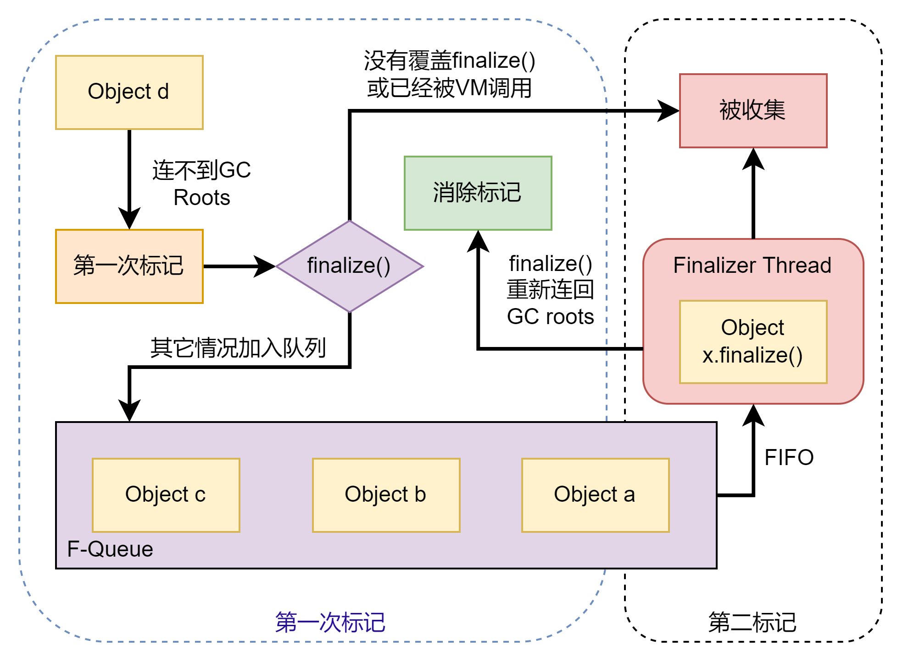
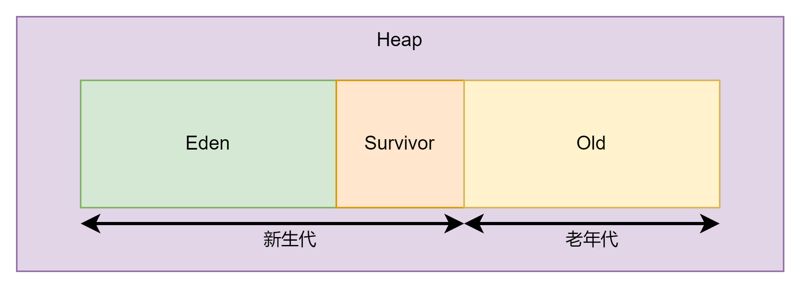

# Java垃圾收集

算是java最为强大的功能，也是为什么很多人选择java而不是C的原因。

## Reference Counting 引用计数算法

就是简单的计算对象被引用的次数，如果被引用了就加一，没有就减一。等到垃圾回收的时候，如果出现了等于0那么就直接回收。实际上python就是利用这个思路来处理垃圾回收的（配合了一些其他复杂的逻辑）

显然这种算法的缺陷很大，如果出现两个对象同时引用对方，那么即使后面它们不在被使用，依旧不会被收集。当然它的效率确实也很高，因为只需要简单的判断一个值即可。但是如果一段程序过于复杂，那么这种简单的方法就不在适用。

## Reachability Analysis 可达性分析算法

有点像NLP里面一个Recursive Tree算法。通过一个根节点不断的向下延申，只要是到达不了根节点的对象最后都会被收集。其实这个算法很多主流的语言都在使用比如java，C#等。
那么这个所谓的根节点叫做GC Roots，从root出发所走过的路叫做Reference Chain。

那么问题来了，如何才能找到根节点呢？其实java也给出了解释。

- 在栈帧本地变量表中引用的对象
- 方法区中静态属性引用的对象
- 方法区中常量引用的对象(比如字符串常量池)
- 本地方法栈中JNI引用的对象
- JVM内部的引用，比如Class，ClassLoader，Exceptions等
- 同步锁持有的对象 synchronized的锁对象
- 反应JVM内部情况的JMXBean等

当然以上并不是全部，对于不同的GC方案和实现，还有可能加入不同的类。这个部分会在后面讨论。

## Reference 引用

从JDK 2之后java发现了单纯的定义被引用和未被引用是不够的，情况越来越复杂，所以java把引用分成了4种——强引用(Strong Reference)
，弱引用(Weak Reference)，软引用(Soft Reference)，虚引用(Phantom Reference)。

- 强引用：其实就是简单的赋值，比如`Object obj = new Object()`。这类的引用可以保证永远不会被GC收集。
- 软引用：用来描述还有用，但是非必须。使用SoftReference类来实现。这类引用会在发生内存溢出前被二次回收，如果还是不够，程序才会抛出异常。
- 弱引用：用来描述那些非必要的对象。使用WeakReference类来实现。可以理解成比软引用还要在弱一点，它们基本上活不过下次回收。
- 虚引用：我感觉更像是一个概念，给一个对象用PhantomReference设置引用的目的更多的是为了得到GC的通知。

## 对象 finalize

被RA算法逮捕的对象并不会立即被回收，而是进监狱(第一次被标记)，等到彻底判刑(第二次被标记)后才会被回收。具体的如下



一个对象如果不在Reference
Chain上，那么它就会被第一次标记，此时VM会判断它是否需要被执行。如果对象没有覆盖finalize方法或者finalize方法已被调用，那么就会被释放(
消除标记)。
反之就会被标记为需要执行。那么此时这个对象会被放入一个F-Queue中。这个队列会自动的被Finalizer线程抽取其中的元素。每一个元素都会被Finalizer线程调用其finalize()
方法。
调用finalize方法算是最后的一次机会了。如果在finalize中对象有办法把自己在连回GC Roots的话，那么就会被消除标记。反之就会GC收集。

> 这里要注意，Finalizer一次只能回收一个对象，因此VM不会保证对象的finalize一定能运行完。如果finalize中有无线循环的话就会一直占用线程。
> Finalizer线程的优先级也很低，不过由于优先级这个概念基本被废弃了，所以就知道一下，也不重要。由于版本的迭代，现在Java官方也并不推荐这种使用方式。
> 尽量不要使用finalize来救活一个可能被收集的对象

## 回收方法区

这个很有意思，因为像ZGC就是不会在这个区内回收垃圾的，而且通常回收方法区中性价比也比较低。不过还是了解以下它回收的主要内容——废弃常量和不再使用的类型。

废弃常量的回收可以参考之前的对象回收，一个简单的例子就是字符串常量池（JDK8后的版本）中的字符串。如果字符串一段时间没有在使用了，那么就会被直接回收。

废弃类型就会比较复杂了，一般存在三个条件：

- 该类所有的实例都已经被回收，也不存在子类对象
- ClassLoader也被回收了，按照书上的说法这个条件很难达到
- 该类对应的java.lang.Class对象没有在任何地方引用，也就是无法通过反射获取

同时满足三个条件才会被回收，而且并不是直接回收。类似于被VM规定，可以被回收。具体会不会还需要看启动参数。

## 分代收集理论

### Weak Generational Hypothesis 弱分代假说

大多数对象朝生夕死

### Strong Generational Hypothesis 强分代假说

多次垃圾回收都没有被收集的对象会很难收集

针对两种假说，java把堆中的对象依据年龄(多少次没有被回收)分配到不同的区域。如果一个区域中的对象都是弱分代的话，那就会被集中在一起。回忆刚才的对象收集过程，
既然所有的对象都是要被回收的，那么我们就可以只保留少量需要的对象，其它的直接回收。这就省去了之前二次标记的过程。

目前比较主流的方案就是把java堆分成新生代(Young Generation)和老年代(Old Generation)
。新生代中的对象会逐渐过度到老年代，最终被回收(满足回收条件)。
这就又出现了一个新的问题。如果新生代中的对象被老年代引用，那我必须遍历老年代才能找出。这无疑大大加重了性能负担。所以在前面的基础上，又提出新的假说

### Intergenerational Reference Hypothesis 跨代引用假说

当跨代的引用出现时，存在互相引用关系的两个对象，应该倾向于同生共死。也就是说，如果一个新生代要被收集，但是其引用了一个老年代，那么它就会被保留，直到自己变成老年代，消除了跨代引用。

根据上面的理论，如果我指向收集新生代(Young GC/Minor GC)那么我就可以使用一个叫做Remembered Set(记忆集)
的方式，把老年代中划分成好几块，其中存在跨代引用的内存应该被放在一起。
也就是垃圾收集的时候，可以直接检查这一段而不用每次都遍历老年代。当然这样做的缺点就是需要维护整个数据的位置和引用关系，保证这些不会出错。不过权衡一下，还是很可取的。

## Mark-Sweep 标记-清除 算法

很好理解，就是把需要收集的对象直接标记好，然后收集。也可以反过来先找要保留的，把剩余的收集。

## Semispace Copying 标记-复制算法

把一个内存空间分成两块，一半含有储存的内容。另外一半在垃圾回收的时候，会把第一半中需要保留的对象复制。然后就使用粘贴到那一半，老的就直接全部被收集，以此类推。
这种做法的好处是，如果每次只有少数会被留下来，那么就极大地提高了效率，但是同样浪费了大量的内存空间。因此很多实现会把这个比例重新调整，保证需要留下来的空间大概在10%左右。

## Mark-Compact 标记-整理算法

需要保留的对象直接向内存的同一端移动，剩下的就直接全部清理掉。思路和标记清除类似，不过要移动内存中的数据。

## HotSpot算法 初探

### 根节点枚举

虽然根节点的定义很清晰，但是在实际运用中找到这根节点并不是那么容易。尤其是在一个很大程序中，目前所有的收集器在根节点枚举这一步都会暂停用户线程。查找引用链则会和用户线程并发。
主流的JVM目前都是采取准确式垃圾收集。当所有用户线程停下来后，VM应该采取某种策略来找到对象引用，而不是遍历，但是具体地实现可以说非常地不同。这里只是初探，所以不做深入考虑。
在HotSpot的方案中，VM使用了一种OopMap的数据结构来达到目的。一旦类加载动作完成，那么HotSpot就会吧对象内的引用全部计算出来。这样收集器采集信息的时候就不需要从方法区等GC
roots开始找。

### Safepoint 安全点

可惜的是，导致OopMap变化的指令太多了，如果每一个都记录，那么势必会导致内存压力太大。所以收集器只会在特定的位置记录这些信息，这些位置就被称为安全点(
Safepoint)。
也就是说，用垃圾收集必须达到特定的安全点后才会开始。所以安全点的设置不能太多也不能太少，不然就会造成过度占用资源或者内存压力大的情况。

一般地，到安全点中断用户线程的方式分为两种——抢先式(Preemptive Suspension)和主动式(Voluntary Suspension)。

抢先式就是直接吧所有用户线程停下来，没有到达安全点的线程让他跑完。过于暴力，基本没人用了。

主动式的思路就是需要发生垃圾回收的时候，不直接对线程进行操作，简单的设置标志位，每个线程会轮询这个标志位，如果出现了中断标志，就在离自己最近的安全点上立刻挂起。
轮询位置和安全点式重合的，并且还要加上所有创建对象和其它需要在java对上分配内存的地方。

### Safe Region 安全区域

如果一个线程被阻塞了，那么GC是否需要等待它重新占用CPU，走到安全点才能开始垃圾收集？如果这样的话，一个线程被阻塞了太久的话，那么GC需要一直等待，显然是不合理的。
所以就有了安全区域的说法，也就是所谓的，在一段代码片段中，引用关系不会发生变化。所以在这段区域内任何地方开始垃圾收集都是可以的，这样就不需要一直等待安全点了。

线程进入安全区域后，会表示自己进入了安全区域，那么GC就可以直接开始收集，不需要特别考虑这些线程。如果线程要离开安全区域，那么它自己需要检查VM是否完成了GC
Roots的枚举，
如果完成就继续工作，没有的话就等待GC完成工作(类似阻塞)。

### 记忆集和卡表

Remembered Set是GC在新生代中建立的数据结构，之前提到过它保证了不需要遍历整个老年代。现在比较流行的G1和ZGC其实在部分收集的时候都会出现问题。所以书中推荐了解以下记忆集的原理。

记忆集其实就是从非收集区指向收集区的指针集合的抽象数据结构。那么它的实现方式有很多，可以用set，list甚至linkedList。但是存储所有的细节显然会导致内存占用过大，那么也失去了它的意义了。
因此很多GC其实会选择使用不同的粒度来记录。书中给出了三种比较常见的方式。

- 字长精度：精确到一个机器字长(处理的寻址位数，也就是所谓的x32，x64)，这个字包含了跨代指针
- 对象精度：精确到一个对象，该对象里会有字段含有跨代指针
- 卡精度：精确到一块内存区域，该区域内有对象含有跨代指针

其中卡精度其实使用的是卡表(Card Table)的方式，这是目前最常见的。Hotspot中卡表的数据结构就是一个简单的数组。这个直接看JVM的参数即可得知。

```C
CARD_TABLE [this address >> 9] = 0;
```

卡表中的元素会被称为卡页，卡页对应了它表示的内存区域中的一块特定大小的内存块。一般地，卡页的大小都是2的n次幂。当然这个设计为了保证地址偏移方便。如果卡页中的任何字段存在跨代引用，
那么它就会被表示为1，也成为脏(dirty)元素。不然的话就是0。那么在垃圾回收的时候，只需要将卡表中的脏元素直接放入GC Roots就完成了扫描。

### 写屏障

在研究volatile中提到过，VM通过读写屏障解决的重排序问题。这里我们再次探究写屏障，但是它和volatile中的内存屏障并不一样。

前面提到过，编译期间能保证好卡页中的数据不被是脏数据，但是如果在运行期间出现了问题呢？这就不是java层面可以解决的问题了，这需要深入底层，从机器码的角度来解决问题。
那么和volatile一样，HotSpot通过写屏障来保证卡表数据的可见性。那么这里的动作其实就是在引用对象复制的时候产生一个环形(
Around)通知，供程序执行额外的动作。
也就是说，复制前后的操作都会被包括在这个屏障中。规定赋值前叫做Pre-Write Barrier，赋值后叫做Post-Write
Barrier。HotSpot的很多收集器都会出现这种写屏障。

当时使用了写屏障后，无论出现了是新生代还是老年代，只要出现了对引用的更新，就会更新卡页。这个虽然听上去浪费时间，但是整体还是比遍历老年代快很多。这里又要提到多线程多伪共享的问题了。
由于现在的缓存大部分在CPU中已缓存行的形式存在，所以一个缓存行被修改后，其它所有线程的缓存自动失效，造成了浪费。那么为了解决这个问题，hotspot给出了只有干净的数据被修改才需要引入写屏障。

在JDK 7后HotSpot中加入了`-XX: +UserCondCardMark`来开启卡表更新条件判断。

## 并发可达性分析

通过上述的一系列手段，在找寻GC roots的时候已经非常的快了。但是遍历这个GC roots下所有的对象还是要花费大量的时间，并且这个时间会随着堆的大小不断地增加。
那么如何才能解决这个问题呢？现有的思路中存在一个三色标记(Tri-color Marking)，作为辅助工具。其实就是把不同的对象分成三个颜色。

- 白色:表示对象还未被GC访问过，开始的时候所有对象都应该是白色
- 黑色：已经被GC访问过，且所有引用都已经扫描过了。它也表示对象是存活的。
- 灰色：表示对象已经被GC访问过，但是对象还有至少一个引用没有被扫描。

思考这种解决方案会发现它只在单线程的时候靠谱，等到多线程的时候就会出现问题。书中给出了多线程下它可能会出现问题的两个条件(
注意必须同时满足)。

- 赋值器插入了一条或者多条从黑色对象到白色对象的引用
- 赋值器删除了全部从灰色对象到该白色对象的直接或者间接引用

为了破坏这两个条件，人们研究出了两种解决方案：增量更新Incremental Update和原始快照(Snapshot At the Beginning, STAB)。

增量更新要破坏的是第一个条件，当黑色对象插入新的白色对象引用，就把这个插入的引用记录下来。等到并发扫描结束后，把这些记录下来的引用的黑色对象为Root在扫描一次，循环往复。
这种方法存在风险，如果出现了两个对象来回扫描一会儿白一会儿黑就会一直卡住，但是这种情况几乎不可能出现，而且只能说明程序设计就有问题。

原始快照需要破坏的就是第二个条件。当灰色对象要删除指向白色对象的引用时，白这个删除的引用记录下来。在并发扫描结束后，在将这些记录的引用关系的灰色对象为Root重新扫描。

一般来说，VM只需要使用一种方式即可保证并发的安全性了。

# 经典垃圾收集器

根据书中的说法，其实openJDK也一直在实验各种不同的收集器，但是经过多年的打磨和验证，经典的7个收集器可以说是必须要了解的GC了。虽然现在有很多效率更好的GC，但是它们大多还没有经过多年的验证。

## Serial

首先它是一个单线程的收集器，它的单线程不单单体现在只有一个线程收集，而是所有线程都得停下来等它处理。听上去这个太不合理了，一个垃圾收集的工作必须要让所有的线程停下来等。
感觉是应该被废除的方案，但是有意思的是，直到java 13它依旧是很主流的新生代收集器。当然这其中的主要原因也它的内存消耗(Memory
Footprint)非常地小。对于单核处理器来说它反而是效率最高的。

## ParNew

其实就是一个多线程版本的Serial收集器，参数几乎一致，只是它是并发执行收集指令。书中对于这个收集器的评价更多的是倾向于它可以和CMS合作，所以才非常的火。
但是由于技术的发展，G1和ZGC的相继出现，导致原先大火的ParNew/CMS被G1取代，而且官方也取消对这个的支持，所以可以说它基本退出历史舞台了。

## Parallel Scavenge

它也是新生代收集器，同样基于Mark-copy算法实现。当然从名字就能看出它是并发处理的，并且它所关注的只是一个可控制的吞吐量(
Throughput)。计算公式如下

$$
Throughput = { Running Time } \ { Running Time + GC Time}
$$

当然JVM也提供了两个参数来用于精确控制吞吐量——`-XX: MaxGCPauseMillis`和`-XX: GCTimeRatio`。

## Serial Old

就是Serial的老年代版本，不过使用的是Mark-Compact算法。

## Parallel Old

它是Parallel Scavenge的老年代版本，同样基于Mark-Compact算法。由于使用了吞吐量优先的评判方式，所以配合它的新生代版本使用效率很高。
但是如果是在单线程的老年代收集中，它的效果就会大打折扣，由于上下文切换代码的负面影响，经常会导致问题。

## Concurrent Mark Sweep CMS

就是字面意思，使用Mark-Sweep算法来收集，它的目的是尽量减少停顿时间，保证线程的运行通畅。所以很大一部分的服务其实都还建立在这个收集器上。它的流程分为4个步骤

1. 初始标记 CMS initial Mark
2. 并发标记 CMS concurrent mark
3. 重新标记 CMS remark
4. 并发清除 CMS concurrent sweep

1和3需要Stop The World， 初始标记只是标记一下GC Roots可以直接关联的对象，时间很短，不怎么占用资源。并发标记阶段则会从GC
Roots关联过的对象开始遍历，而且可以并发，
所以速度其实也不慢。重新标记阶段则是修正并发标记，其实可以参考之前的三色标记，这里相当于增量更新。最后直接清除掉不要的对象，同样可以并发执行。

这种算法对处理器的要求可以说极高，因为它需要并发。如果出现了收集过程过慢导致收集器大量占用CPU，那么程序的速度会变得很慢，这显然是不能接受的。并且它的计算公式导致了只有在4个以上核心的时候才会发挥比较好的效果。
如果是高并发的程序，那么这个还会CPU负载过高。而且CMS无法处理浮动垃圾，这个也很好理解，它的回收方式限定了它只能先标记在清理，无法同时做两件事。为了解决这个问题，
VM必须预留一部分内存给CMS，现在的VM一般会采取当老年代中一定比例内存被占用后，就开始清理的策略。

## G1

主流收集器之一，被官方称为功能最全的垃圾收集器。由于我们现在G1和ZGC在不同情景下都有使用，所以会重点分析一下。但是这里只是初探而已。

它基于Region的堆内存布局。虽然G1也基于分代收集理论，但是其堆内存的布局和其它收集器相差很大。G1不会坚持固定大小以及固定数量的分代区域，而是把连续的java堆划分成多个大小相等的独立区域(
region)，
每个region都可以根据需要，扮演新生代的Eden空间，Survivor空间，或者老年代空间。那么这样G1可以根据需求来使用不同的策略收集垃圾。

Region中还存在一类特殊的Humongous区，只存储大对象。G1会把大小超过了一半region的对象认定为大对象。每个Region的大小可以通过启动参数来调整。它的回收思路其实很简单，
既然我已经有了很多不同的区域，那么我就可以通过监控这些区域找到价值最大的垃圾，有限回收这个。类似市场经济的一个概念，其实就是找收效最高地回收。

> 我看了一下我们的参数配置，用G1的时候，我们也配置了`-XX: MaxGCPauseMillis`来保证收集的最大停顿时间。这个主要应该是为了平衡CPU和内存的占用。

不过既然它充分利用了region，那么也会把region可能存在的问题继承下来。比如跨region引用怎么处理，虽然之前提到过可以用记忆集来减少GC
Roots扫描。，但是G1的实现其实会复杂一些。
实际上，它的每一个region都有自己的记忆集，这写记忆集会记录下别的Region指向自己的指针，并且标记这些指针分别在那些卡页上。这个实现方式一听就直到会占用大量的内存，
因为本质他不就是一个hashset或者hashmap，当然它的key和value也是互为键值对的。

它的所谓回收过程其实和CMS很像

- 初始标记 initial marking：标记一下GC
  Roots直接关联的对象，并且修改TAMS指针的值，让下一阶段用户线程并发运行时，能正确地在可用的Region中分配新对象。这个阶段其实在MinorGC的时候同步再做，所以并没有额外花费时间。
- 并发标记 concurrent marking：可达性分析，扫描整个堆，找到要回收的对象，由于并发，虽然耗时可能较长，但是客户的感受只是变慢了一些，并不会出现STW。
- 最终标记 final marking：用户线程做一个短暂的暂停，用于处理并发结束后仍然遗留的少量SATB记录
- 筛选回收 Live Data Counting and
  Evacuation：更新Region的统计数据，对各个Region的回收机制和成本进行排序，然后根据设置的停顿时间来制定回收计划，可以自由的选择多个Region来回收，然后把决定回收的那一部分Region的幸存对象复制到空Region中。
  在清理掉整个旧Region。这个过程时需要停止用户线程的。

## 低延迟收集器

类似于数据库中的三角原则，收集器也是一样——内存占用，吞吐量和延迟。这三者永远无法同时满足，比较好的设计能够尽量保证其中的两个而不过于牺牲第三个。总的来说即便是G1，也只能保证后两者，而内存占用其实还是比较大的。
虽然对于一般程序来说，这样的设计以及足够，但是对于日益增长的需求来说，延迟会逐渐变得重要。主要的原因是内存的不断加大和价格的下降，导致了大部分时候我们希望牺牲内存来提高后两者。但是其实内存和延迟是息息相关的。
加大内存其实给GC Root的扫描带来了很大的压力，这种压力是不可别避免的，所以其实低延迟的GC一直是一个很大的需求。那么这个部分会在后面详细的讨论。

### Shenandoah

由于OracleJDK基本不支持这个，我就没有细看了，基本上实现原理和ZGC完全不同。而且大部分的公司由于官方的排挤所以不用这个。

### ZGC

算是JDK 11新加入的特性。官方G1的正统续作，不得不说它和前面的Shenandoah的目标是完全一致的，都是实现低延迟的垃圾回收。但是显然它的运用更加地广泛。

#### 堆内存布局

先来看看ZGC的堆内存布局，ZGC的布局具备动态性——动态创建和销毁，以及动态的区域容量大小。不过他会随着不同的硬件平台有所变动，但是总体都是分成3个部分。
小型，中型和大型，分别会占用2MB，32MB和N*2MB的内存。当然大型Region只需是2MB的整数即可，所以最小容量甚至可能只有4MB，而且由于算法，ZGC也不会希望有更多的大型Region。

#### 并发整理算法

ZGC的标志性设计就是使用染色指针技术(Colored Pointer)。在ZGC前，为了方便系统或VM识别对象，经常会在对象头或者元数据空间中加入一些信息，比如对象头中的HashCode等。
但是如果不能保证访问到这个对象的话又该怎么办呢？无论怎么简化对象头中的信息，只要访问不到这个对象都白干。然而染色指针告诉你，我们可以通过使用标记的方式，直接在指针上把这些信息记录下来。

具体是如何实现的呢？这里比较底层，我个人的理解就是不同的操作系统其实对于一个对象指针的运用并不是把64位全部占满，相反的，大部分操作系统，比如Linux，一个对象可以只占42位的地址。
高18位又不给用，那么其实做个简单的计算就会发现，还有4位是空出来的。染色指针实际上就是利用了这个空出来的4位——Finalizable,Remapped,Marked1,Marked0。

这样做的好处就是，ZGC可以在只有一个空region的情况下完成收集。由于只看指针状态，所以并不存在复杂的复制动作。而且由于现在只针对指针，所以也会大大减少使用内存屏障的次数以及带来的影响。
书中陈述了ZGC其实压根就没用过写屏障，只需使用读屏障。

#### 运行流程

还是4个步骤，不过它现在支持全部并发，所以效率要高上不少。

- 并发标记 Concurrent Mark：多线程同时标记指针上的信息，其实这步的目的和G1类似，给连到GC Roots的对象做好标记。这一步会把Marked
  0和Marked 1更新好。
- 并发预备重分配 Concurrent Prepare for Relocate：根据特定的条件找出需要清理的Region，把这些Region重新组合成一个分配集(
  Relocation Set)，
  可以说和G1完全不同。这里的Set是为了保存需要的对象而不是维护记忆集，事实上，ZGC根本没有记忆集。在Relocation
  Set中的对象保证能够被复制到新的Region上。
- 并发重分配 Concurrent
  Relocate：这是ZGC的核心阶段，这个过程要把重分配集中的存活对象复制到新的Region上，并且位每一个复制的Region维护一个转发表(
  forward table)，这一步会记录旧对象当新对象的转换关系。
  如果用户线程此时并发访问了位于重分配集内部的对象，并且修改了引用，那么这个访问会被截获，然后根据Region内部的forward
  table把记录告知新复制的对象(重分配集上的对象)。
  并且同时更新该引用的值，直接保证这个引用指向新对象。这个过程一般称为自愈(Self-Healing)
  ，这样做的好处是只有第一次访问旧对象会需要告知新对象，也就是只占很少的资源。
- 并发重映射 Concurrent
  Remap：修正整个堆中指向重分配集中旧对象的所有引用，由于ZGC的自愈特性，在使用管理旧对象的时候也不过就是多一次转发操作(
  forward到新复制的对象上)，
  所以这个任务并不是很紧急。但是remap还是有好处，其中一个最明显的就可以释放forward table，如果可以释放forward
  table那么对内存的提升还是很大的。之前提到过的自愈是建立在forward table不能被删除的情况下。
  虽然方便，但是还是占用了内存的空间。如果所有指针都被修正了，那么旧可以释放forward
  table。为了最大程度的节省资源，ZGC非常巧妙的把这个工作放在了下一个垃圾回收的并发标记阶段来做。

#### 劣势

无法响应高速且大量的对象分配。想象这样一个场景，如果一段程序短时间内不断地生成大量的对象，根据ZGC开局要扫描全局的方案，势必会花费很久来维护重分配集。
虽然可以并发，但是ZGC的收集速度一定是赶不上对象的生成速度，这样的话就会出现内存里面浮动垃圾越来越多。一个解决方案就是在增加堆容量的大小，但是不解决根本问题。
所以其实还是需要分代收集。

## 垃圾收集日志

JDK 9后终于把所有的日志都集合在了一个参数上`Xlog`
.基本上只要配置这个参数即可做到管理所有的垃圾回收日志。利用`java -Xlog:help`查看格式：

```java
-Xlog[:[selections][:[output][:[decorators][:output-options]]]]
```

可以看到日志被分成了4部分

- selections：输出的是那些信息，是以tag=level来表示的。tag就是JVM的事件或者子系统。其中包括的很多，就不一一解释了。我们用的我看了一下就是gc，safepoint和jit+compilation。
  level只有五个，表示日记的级别：off,trace,debug,info,warning,error。这些级别决定了日志的详细程度
- output：其实就是日志要输出到什么位置，把`file=<filename>`写入就好了。默认是stdout，当然对于输出到文件的部分也可以设置一些参数来控制大小和数量。
我们的参数好像就设置了filecount和filesize。这个感觉就个人喜好结合场景就行，也没有什么规定
- decorators：需要输出的内容，标签很多我也不一一列举了。默认的话是uptime，level，tags这三个
- output-options：就是刚才提到的filecount这类的关于output的参数设置

我研究了一下我们的日志配置，基本上都是一些基本的配置，没有什么特别需要注意的地方，除了我们有限制日志的大小和数量。

## 对象分配问题

之前已经提过java堆中的数据是分代存放的，虽然这个分代理论在不断地更新，但是基本结构仍然不变。



一般来说，当Eden区空间不够的时候，就会出现一次MinorGC用来清理新生代。我在testAllocation中尝试复现这个收集动作，主要用了一下的VM参数

```java
/**
 * -verbose:gc -Xms20M -Xmx20M -Xmn10M "-Xlog:gc*" -XX:SurvivorRatio=8
 */

public class testAllocation {
  private static final int _1MB = 1024 * 1024;

  public static void main(String[] args) {
    byte[] allocation1, allocation2, allocation3, allocation4;
    allocation1 = new byte[2 * _1MB];
    allocation2 = new byte[2 * _1MB];
    allocation3 = new byte[2 * _1MB];
    allocation4 = new byte[4 * _1MB];
  }
}
```

输出的GC日志如下

```java
[0.080s][info][gc,heap     ] GC(0) Eden regions: 2->0(9)
[0.080s][info][gc,heap     ] GC(0) Survivor regions: 0->1(2)
[0.080s][info][gc,heap     ] GC(0) Old regions: 0->0
[0.080s][info][gc,heap     ] GC(0) Archive regions: 0->0
[0.080s][info][gc,heap     ] GC(0) Humongous regions: 9->9
```

我一开始以为allocation4会直接进入老年代的，结果也没有。由于限制了Eden的大小，我预估在第四个赋值会触发MinorGC，这个是触发了，但是老版本的日志输出的不太一样。
我得到的这4个输出也很有意思，其中老年代里面什么都没有，而新生代全部被回收了。整体和我的预期不太一样。不过还是能看出来它进行了回收，尤其是复制到survivor的这个位置。
我分析导致allocation4没有正常进入老年代的原因可能是还不够大，没有达到它的threshold。

## 大对象进入老年代问题

根据上面的问题，我加入了一个启动参数`-XX:PretenureSizeThreshold=3145728`。比较有意思的是，即使这样日志的结果还是新生代。

```java
Heap Usage:
        G1 Heap:
        regions  = 20
        capacity = 20971520 (20.0MB)
        used     = 13362272 (12.743255615234375MB)
        free     = 7609248 (7.256744384765625MB)
        63.716278076171875% used
        G1 Young Generation:
        Eden Space:
        regions  = 4
        capacity = 10485760 (10.0MB)
        used     = 4194304 (4.0MB)
        free     = 6291456 (6.0MB)
        40.0% used
        Survivor Space:
        regions  = 0
        capacity = 1048576 (1.0MB)
        used     = 219232 (0.209075927734375MB)
        free     = 829344 (0.790924072265625MB)
        20.9075927734375% used
        G1 Old Generation:
        regions  = 9
        capacity = 9437184 (9.0MB)
        used     = 8948736 (8.5341796875MB)
        free     = 488448 (0.4658203125MB)
        94.82421875% used
```

通过`jhsdb jmap --heap --pid <pid>`查看具体堆内存的使用，发现了老年代的94%都被使用了。由于还没有研究到后半部分，所以不知道G1对这个会不会有优化，
比如出现超过80%被占用就需要开启GC，至少我这里没有看到怎样的操作。不够作为一个简单的尝试也已经足够我了解基本参数和分配逻辑了。

## 长期存活的对象进入老年代

```java
Heap Usage:
G1 Heap:
   regions  = 20
   capacity = 20971520 (20.0MB)
   used     = 17716160 (16.89544677734375MB)
   free     = 3255360 (3.10455322265625MB)
   84.47723388671875% used
G1 Young Generation:
Eden Space:
   regions  = 0
   capacity = 2097152 (2.0MB)
   used     = 0 (0.0MB)
   free     = 2097152 (2.0MB)
   0.0% used
Survivor Space:
   regions  = 0
   capacity = 1048576 (1.0MB)
   used     = 21440 (0.02044677734375MB)
   free     = 1027136 (0.97955322265625MB)
   2.044677734375% used
G1 Old Generation:
   regions  = 17
   capacity = 17825792 (17.0MB)
   used     = 17694720 (16.875MB)
   free     = 131072 (0.125MB)
   99.26470588235294% used
```

利用`-XX:MaxTenuringThreshold=1`保证了一次MinorGC后就会把对象放入老年代内。这次和我的预期差不多，可以看到老年代已经占用了99.26了，但是新生代完全没有任何对象。

## 动态对象年龄判断

除了达到年龄外，hotspot还提供了一种动态的方式来管理老年代。其中的一条规则就是如果出现了Survivor空间中的相同年龄的对象大小总和超过Survivor空间的一半，那么就直接把它们放入老年代。
具体代码可以看testAllocation4，结果如下

```java
Heap Usage:
G1 Heap:
   regions  = 20
   capacity = 20971520 (20.0MB)
   used     = 16865088 (16.08380126953125MB)
   free     = 4106432 (3.91619873046875MB)
   80.41900634765625% used
G1 Young Generation:
Eden Space:
   regions  = 3
   capacity = 6291456 (6.0MB)
   used     = 3145728 (3.0MB)
   free     = 3145728 (3.0MB)
   50.0% used
Survivor Space:
   regions  = 0
   capacity = 1048576 (1.0MB)
   used     = 853824 (0.81427001953125MB)
   free     = 194752 (0.18572998046875MB)
   81.427001953125% used
G1 Old Generation:
   regions  = 13
   capacity = 13631488 (13.0MB)
   used     = 12865536 (12.26953125MB)
   free     = 765952 (0.73046875MB)
   94.38100961538461% used
```

这里的启动参数故意配置了老年代阈值为15，所以整段代码是不可能出现超过15次GC的。这里占用老年代的全部是由动态判定放入的。

## 空间分配担保

这个是之前提到的Mark-Copy的问题，当survivor不够用的时候，那么就要向老年代借空间。在JDK 6某次更新前，可以通过HandlePromotionFailure这个开关来控制是否借用。
而JDK 7后就完全不在使用这个参数。所以新的判定方式其实就是观察老年代是否有足够的空间。这里所谓的足够是和之前新生代晋升到老年代的平均内存比的。所以其实依旧是有很大风险的。
如果新生代中突然出现了大量的新对象，那么最终一定是要做一次full GC的，那样就糟糕了。所以设计的时候应该考虑如何避免full GC。

