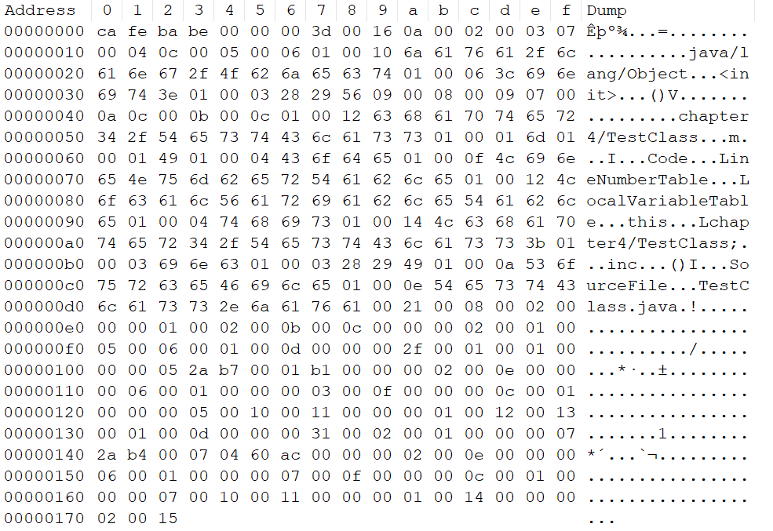
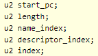

# 虚拟机执行子系统

## Class类文件的结构

Class文件是8个字节位基础单位的二进制流，各个数据项目严格的按照顺序紧凑排列，中间没有分隔符。因为这个设计，每8个字节就会被归为一组。并且每个位置上是什么数据是规定好的，
为了保证不会出错。所以其实一个class文件是可以手动读的。

根据JVM规范，Class文件的格式一律采用一种伪结构来存储数据。其中只存在两个数据类型，无符号数和表。

无符号数：基本数据类型，通常用u1，u2，u4，u8来表示字节数，无符号数用来描述数字，索引引用，数量值或者按照UTF-8编码构成字符串值。

表则是由多个无符号数或者其它表组合成的符合数据类型。为了区分，所有表一般会以`_info`结尾。其实class文件本身就是一张大表。

整个表的具体细节结构可以参考：[Oracle官方文档](https://docs.oracle.com/javase/specs/jvms/se7/html/jvms-4.html)

## magic number和Class文件

每个class文件的前4个字节一定是magic number。这里的magic
number就是一个代号，其实就是告诉别人这是个class文件。java的class文件前4位就是`cafebabe`。
接下来的4个字节则是版本号。5、6是次版本号，7、8是主版本号。下面将会用这段代码来分析class文件

```java
package chapter4;

public class TestClass {
    private int m;

    public TestClass() {
    }

    public int inc() {
        return this.m + 1;
    }
}
```

用maven clean install来生成java class文件。直接用NotePad++打开，利用Hex插件来观察。



可以看到前四位很明显是`cafebabe`，而往后的4位则代表版本号，由于是16进制的方式，所以这个版本应该是61(3*16 + 13)
。这个如果看官方发布的版本号就能知道61对应JDK 17.

## constant_pool_count 常量池

只会占用两个字节，这里的count其实并非常量池本身而是入口，这个入口会记录常量池的大小。这里它计数的方式不同于java，是从1开始的。这个设计其实是为了保证后续如果出现指针不指向任何常量池则可以设为0。

它的内部主要会放入两个部分，字面量(Literal)和符号引用(Symbolic References)。

字面量可以想象成类常量，比如字符串等。符号引用则比较复杂，主要包括以下的类:

- 包(package)
- 类和接口的全限定名(Fully Qualified Name)
- 字段的名称和描述符(Descriptor)
- 方法的名称和描述符
- 方法句柄和方法类型(Method Handle, Method Type, Invoke Dynamic)
- 动态调用点和动态常量(Dynamically-Computed Call Site, Dynamically-Computed Constant)

这里需要理清一个流程，VM在加载Class文件的时候是不会进行动态连接的。也就是说class文件种不会保存方法，字段最终在内存中的布局信息。在VM做类加载的时候才会从常量池获取符号引用，翻译到具体内存地址中。

继续看刚才的截图，第九位应该告知了一共会有21个(16+6-1)常量被记录下来。它后面的每一位相当于一个常量，所以根据这个我们可以看到第一个是0a。
根据常量池的对照表，0a类中方法的符号引用，他会包含一共5个字节，那么也就是从0a开始往后再数4个字节。中间的两个字节表示指向classinfo的索引，翻译以下就是指向第2个常量，并且它是一个classinfo。
再往后面看就会得到00 03，这个是指向NameAndType的索引项，翻译过来就是第三个常量。那么我们现在来看第二个常量，表示位是07，正好对应了前面的classinfo，而classinfo会占3个字节，所以继续观察下一个常量应该是从0c开始，
这个标志位表示的正好是NameAndType。到此就完全对应上了。

由于每个常量所占的字节不一样而且分析起来比较复杂，所以这里就用第一个做个例子验证一下。剩余的常量我就略过了。其实JDK后面更新了这个常量对照表，书中仅是JDK 11的解释。

## access_flags 访问标志

常量池后会马上接着2字节的访问标志，这个是用来表示这个类的访问信息的。比如此类是否为接口，是否public，是否final等。最后一个自己的第一位表示是否位为final或者super，第二位表示public。
那么查看上面的class文件，0x0021。表示的是这个类就是一个普通public类。具体的对照表可以参考前面提到的官方文档。

## this_class super_class interfaces 索引集合

紧接着三个访问标志的就是索引集合的部分，标题的三个索引每人占2字节。this_class会告知引用位置，这个引用就是前面常量池中的常量位置，比如这里的0x0008意思就是第八个常量。
super_class也是一样，0x0002就是第二个常量。第三位的interface则是表示接口数量，这里用的class没有接口，所以就是0x0000。如果没有接口的话那么后面接口的引用就会直接省略。

## field_info 字段表集合

字段表集合主要描述了类中的字段。要特别注意java中的字段其实包括了类级别的变量(static)和实例级别的变量(public private protected default)。
显然字段的信息会包含修饰符，实际数据等。我们先来看字段表的格式。

字段表中每一个字段前8个字节是固定存在的，主要格式可以参考下图


前4个部分每个占2字节。已上文的class文件为例，00 02 00 0b 00 0c 00 00。第一个02表示了这个字段是一个private的，0b表示这个字段的简单名称，就是变量名。
0c则是描述符，用来描述字段的数据类型。比如这里就是指向了int。最后的attributes则是这个字段所包含的attribute数量，如果不是0的话，后面就会跟上它所使用的attribute，这里因为没有，所有就直接省略了。

> PS: 描述符描述方法的时候，会参照先参数列表后返回值的顺序去描述。参数列表按照参数的严格顺序放在一个小括号内。

## Methods_info 方法表

和前面的字段表一样，会先有一个计数，如果没有方法就直接略过后面的部分，如果有就和前面一样依次展示。表的内容和前面的高度一致。我的例子中一共有两个方法。

### 方法一  
01表示public，05表示`<init>`，06表示`()V`，01表示一个attribute。attribute表的格式放在了后面，这里就先略过了。

### 方法二

01表示public，12表示Inc，13表示`()I`，01表示一个attribute。又是一个code表，由于和方法一差不多就省略了。

## attribute_info 属性表

属性表描述的是class文件、字段表、方法表所携带的属性集合。一般直接跟在每个表后。每个属性表其实顺序都不完全一样，所以分开分析。具体的结构还是在前面的官方文档中，
这里只是展示。

### Code
先看属性表共有的前6位，前2位表示name_index，而后4位则表示length。来看我的例子，0d表示是前面的第13个常量，2f表示长度为47。
那么下面来看Code表的构成，具体的结构就不分析了直接展示结果。2f后的两个`0001`表示的分别是`max_stack`和`max_locals`。它们又分别表示了操作数栈深度最大值和局部变量表的储存空间。
实际上就是栈帧frames的数量和变量槽slots的数量。这里都是1。这两个数值是javac自动生成的，局部的最大变量数和类型计算出的。

> 问题：为什么这个调用是void()且没有局部变量，但是仍然出现了max_locals等于1的情况。
> 
> 答案很简单，每个类的内部方法都存在使用this的隐式参数，这个在类的那一章中有讨论，所以其实max_locals在java中基本上最小也得是1，因为必定涵盖一个this。

下面的两位分别是code_length和code。指的其实是编译后的字节码指令长度和字节码，由于字节码指令目前是小于256条的，所以直接用一个两位的16进制表示。例子中的长度为5，观察字节码验证发现确实为5行。

```java
0 aload_0
1 invokespecial #1 <java/lang/Object.<init> : ()V>
4 return
```

这里中间省略了`invokespecial`的三行字节码指令，所以还是5行。后面从2A到b1的部分参照字节码转换表都可以对的上。

继续往后看，又会出现2位的exception_table_length，和之前一样，没有的话则直接省略exception_info这个表。有就按照格式继续写，这里没有就略过。
那么接下俩的两位就到了attributes_count了，一个属性表是可以再次嵌套另一个属性表的。那么这里是02所以就有两个attributes。

### LineNumberTable 行号表

刚才的两个attribute中第一个就是LineNumberTable，这个表的作用很清晰，展示java行号与字节码行号之间的对应关系。前两位是name_index，描述了表是LineNumberTable。
后面4位则是长度，这里是6。然后就是表里的行数，这里是01，就是一条。下面4位，前两位表示字节码行号，后两位则是java中的行号。


### LocalVariableTable 本地变量表

继续往后面看，`000f`告诉我们这个是一个本地变量表。那么观察结构，前8位是固定的name_index,length和local_variable_length。这三个前面讨论过了，直接来看最后的info部分。
其实info代表的是栈帧和源码中的局部变量的关联。一个info的结构如下



前面4个都已经讨论过了，直接看index。index表示的是栈帧在局部变量表中slots的位置。因为其实这里只有一个栈帧，所以它就是起始位置也就是0。

### sourceFile

在方法表结束后，还会有两位来表示其它属性表(不属于前面任何一个表的属性)。这里是01，所以就只有一个。剩下的结构就是name_index，length和sourcefile_index。

## 小结

至此，我把一个class文件完全分析出来了。其实这个我估计在实际工作中可能用处不是很大，但是还是作为一个练习和思考。主要也是帮助理解后面可能出现的classLoader。
