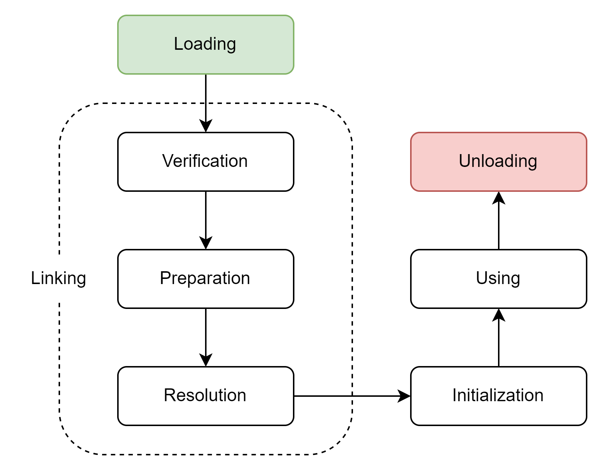

# 虚拟机类加载机制

## 引入

前面我分析了class文件的内容，但是class文件并不是最终的步骤，我们都知道java编译完成后需要把代码跑在虚拟机上。JVM是如何加载并且把代码连接到硬件上的，就是本章会考虑的内容。
JVM把class文件加载到内存，对数据进行sanity check包括类的初始化等，一般统称为类加载机制。其实这个机制的好处就是可扩展性大大加强，比如一段代码可以不用再编译阶段就确定需要使用的http请求，
而是等到跑动之后再获取。

## 类加载过程

一个类型从加载到内存到最终被卸载。它的生命周期一共由7个部分组成，具体如下



以上的过程并不是一定按照箭头顺序执行的，能够保证顺序只有加载，验证，准备，初始化和卸载。并且它们也不是一环扣一环的，在实际加载中，它们大部分时候是交叉混合进行的，可能在一个阶段的过程中就开始调用其它阶段。

加载阶段，java虚拟机规范中并没有强行约束，每个虚拟机的实现也不相同。但是对于初始化阶段。《java虚拟机规范》则是严格规定了有且只有6中情况必须立即对类进行"初始化"。

1. `new`，`getstatic`，`putstatic`，`invokestatic`这四条字节码指令，只要类型没有被初始化，那么就必须先触发其初始化阶段。
2. 使用java.lang.reflect包的方法对类型进行反射调用的时候，如果类型没有进行过初始化，则需要先触发其初始化
3. 如果类型的父类没有初始化，则先初始化父类
4. 虚拟机启动时，main方法的那个类一定会先初始化
5. 动态语言支持中，句柄对应的类没有进行初始化，则需要先触发其初始化
6. JDK8后如果在interface里面写入default方法，那么实现类发生了初始化，接口必须在这之前初始化

关于初始化中提到的引用问题，其实也不是那么简单的。会导致初始化的情况，必须为主动引用，如果是被动引用，则不一定会触发初始化。举个简单的例子，如果观察下面的代码。

```java
// 父类
public class SuperClass {
    static {
        System.out.println("SuperClass init");
    }

    public static int value = 123;
}

// 子类
public class Subclass extends SuperClass {
    static {
        System.out.println("SubClass init!");
    }
}

// driver
public class NotInitialization {
    public static void main(String[] args) {
        System.out.println(Subclass.value);
    }
}
```

上个类是独立文件，这里把他们合并了而已。JDK 9之后把`-XX:TraceClassLoading`移除了，所以改成了`-Xlog:class+load=info`追踪类初始化。
那么上面的main运行后的结果是

```java
[0.121s][info][class,load] chapter4.SuperClass source: file:/C:/github/Java-JVM/target/classes/
[0.121s][info][class,load] chapter4.Subclass source: file:/C:/github/Java-JVM/target/classes/
SuperClass init
123
```

很明显，subClass并没有被初始化，不然应该会打印"subClass init"。这个就是由于被动引用导致的，对于静态字段，只有直接定义这个字段的类才会被初始化，
子类没有直接定义，所以不会被初始化。但是我们来观察loading结果，发现其实class还是会被加载的，这个阶段其实是每个VM的实现不同导致的，并不是所有的VM都会这样。

继续调整代码，复用前面的父子类。

```java
public static void main(String[] args) {
    SuperClass[] sca = new SuperClass[10];
}
```

书上给出的结论是，这段代码SuperClass应该不会被初始化，但是应该触发一个`[LSuperClass`类的初始化，前面的这个`[L`之前已经提过了，就不重复说明了，
但是我发现的问题是我无法复现这个情况。我利用`-Xlog:class+init`来观察被初始化的类，还是没有找到类似的。为了排除可能的编译优化，我查看了字节码，class在常量池中是存在的，
而且其中也由`anewarray`这个操作，但是就是找不到初始化数组的类。所以这里还是比较疑惑的，不过我目前分析，大概率是VM的改动导致的，应该是Hotspot的一些新优化？

### 加载

加载阶段理论上，JVM需要保证三件事

1. 通过一个类的全限定名来获取定义此类的二进制流
2. 将这个字节流所代表的静态储存结构转化为方法区的运行时数据结构
3. 在内存中生成一个代表这个类的java.lang.Class对象，作为方法区这个类的各种数据的访问入口

第一个条件其实没有很死板规定，每个VM完全可以通过自己的方式来定义如果获取这个二进制流，比如从class文件中读，或者从任何它觉得可以的地方读取。这个主要依靠ClassLoader中的findClass和loadClass文件。
但是对于数组而言事情就不太一样了，数组类不是不通过类加载器创建，它应该是由JVM直接在内存中动态构建。所以如果是数组类，那么先看元素是否为一个引用类型。如果是则把数组表示在加载组件类型的类加载的类名空间上。
如果不是引用类型，则直接把数组标记为与引导类加载器关联。

### 验证

连接阶段的第一步，这一阶段的目的是确保Class文件的字节流中包含的信息符合规范。为什么呢？其实主要就是因为class文件的生成和格式。虽然JVM对class文件的格式由严格的规定，
但是class文件的生成并非只有javac一种方式。事实上，我可以直接使用记事本开发(doge)，只要是二进制流，JVM并不能分辨真假。那么就会造成潜在的危险，所以验证整个class文件的安全性是非常重要的。

#### 文件格式验证

这个比较好理解，就是看看是不是JVM规定的格式，比如开头是不是CAFE BABE啊。当然具体的验证每个JVM实现的方式不一样。HotSpot上主要会保证正确地解析字节流，并且放入正确的方法区。
通过了这个验证后，剩下的验证阶段都是基于方法区的储存结构，不会在直接读取文件上的字节流了。

#### 元数据验证

这一步更多的是针对字节码文件的语义进行分析，比如保证语义的描述和规范中的一致。举个简单的例子，类型是否有父类，类型父类是否不可被继承。

#### 字节码验证

最复杂的阶段，主要是通过数据流分析和控制流分析。这部要求确定程序语义是合法、合逻辑的。比如保证操作数栈上的数据类型和指令不冲突等；保证任何跳转指令不会跳到方法体外的字节码指令上等。
如果没有通过字节码验证，那么这段代码一定是有问题的。但是如果一个方法通过了字节码验证，它也仍然有出错的可能。其实这一步的验证方法依旧还在进步的过程中，JDK 14和15的时候也移除了之前使用的验证方式。
比如SplitVerifier，而保证必须是StackMapTable来检测。不过具体HotSpot是如何使用的我也不太清楚了。这个也不会是研究的重点。

#### 符号引用验证

验证的最后阶段，在虚拟机将符号引用转化为直接引用的时候。这个转化动作会在连接的解析阶段中发生。其实就是验证此类导入的包是否靠谱，通过字符串是否可以找到对应的类。

#### 一些思考

其实我一直在想，如果我能保证字节码二进制流不出问题，那就不需要这个步骤了。从书中的描述看上去，其实这个步骤只是保证程序不受侵害，字节码不出错。
理论上完全可以省掉，如果省掉也许可以缩短很多虚拟机加载的时间。我去查了一下虚拟机的启动参数，openJDK 13里面有一个`Xverify: none`可以用来关闭部分验证。
但是已经标记为deprecated，不过到了JDK 18了还没有被移除。

## 准备

这个阶段的工作就是正式的为类中定义的变量(static)分配内存并且设置类变量初始值的阶段。因为我们使用的是JDK 17，所以其实类变量已经都存放在堆中了，我就不讨论JDK 7前永久代的问题了。
并且所谓的初始值是java定义的变量的零值，而不是我创建一个变量时候给赋值的大小。但是有一种情况例外，如果是final的话，那么就会在初始值阶段就把值给加到变量上了。

## 解析

这一步的目的就是把虚拟机常量池内的符号引用替换成直接引用的过程，先区分一下符号引用和直接引用的概念。

符号引用 (Symbolic References)：符号引用使用一组符号来描述引用的目标，符号可以是任何字面量，只要能无歧义的定位到目标即可。
符号引用与虚拟机实现的内存布局无关，引用的目标并不一定是已经加载到虚拟机内存中的内容。各种虚拟机实现的内存布局可以各不相同，但是它们能接受的符号引用必须是一致的。

直接引用 (Direct References)：直接引用是可以直接向目标指针、相对偏移量或者就是一个句柄。直接引用是和虚拟机内存布局相关的，同一符号引用在不同的虚拟机实例上翻译出的直接引用可能会不同，
但是如果有直接引用，那么引用的目标必定已经在虚拟机的内存中存在

其实说了这么多，意思很简单。符号引用就是说因为javac编译class文件的时候，并不知道这些类最终会被放在哪一块内存上，所以通过类似全限定名的方式引用。但是直接内存则是指向JVM已经分配好的内存空间，
这里内存位置已经被确定了。

### 类或接口的解析

一共三步：

1. 如果不是数组，VM会把**全限定名**传递给这个类的**类加载器**去加载这个类。加载过程中，由于元数据和字节码的验证环节，有可能触发别的类加载(这个在前面有提到顺序)。如果父类加载失败，则子类失败
2. 如果是数组，并且数组的元素类型为对象，也就是符号引用的形式为"[Ljava/lang/Integer"形式，那么先按照类的解析方式加载解析对象类，然后在生成代表该数组维度和元素的对象
3. 前面两个都完成后，第三步只是验证直接引用相对于符号引用的有效性。如果符号引用无法访问直接引用那么就抛出异常IllegalAccessError。

所谓的访问权限验证，在JDK 9模块化之后就不太一样了。被访问的类必须保证处于同一个模块中，或者需要两个模块之间允许互相访问。

### 字段解析

字段的解析其实和class文件中的CONSTANT_Class_info有关，其实就是找到字段的符号引用，先解析它的类或者接口(异常处理机制同上)，然后在按照下面的步骤解析字段。

1. 如果字段本身就包含了简单名称和字段描述符，就直接返回字段的直接引用
2. 如果字段实现了接口，就按照继承关系从下往上找，返回这个字段的直接引用
3. 如果字段非Object，按照继承关系从下往上找，如果父类包含了简单名称和字段描述符，就直接返回
4. 否则就抛出NoSuchFieldError异常

以上步骤是按照顺序执行的，找到了直接引用但是访问权限没有通过，则一样抛出IllegalAccessError。注意javac会在编译阶段保证字段的唯一性，如果子类中出现同名字段，并且限定了static，javac会编译失败的。

### 方法解析

第一步和字段解析一样，先找符号引用，之后的步骤(按顺序发生)如下

1. 如果类的方法表中发现class_index索引是一个接口的话，那么就直接抛出IncompatibleClassChangeError异常
2. 如果有直接匹配的，就返回直接引用
3. 父类中查找并返回
4. 接口列表中和父类接口中查找，如果有匹配说明是抽象类，直接抛出AbstractMethodError
5. 搜索失败，抛出NoSuchMethodError
6. 同样最后是权限验证

### 接口方法解析

还是老样子，先符号引用，然后按照下面的来

1. 和类那边正好相反，如果发现这个是类不是接口则抛出IncompatibleClassChangeError
2. 直接匹配则返回
3. 父接口中查找，直到Object类才会停止查找，有匹配就返回
4. 由于接口可以多继承，所以在找到的所有匹配方法中选择一个返回(这里的规则虽然为规范定义的，但是具体的javac或者VM会尽量避免这种不确定性，比如直接编译不通过)
5. 搜索失败，抛出NoSuchMethodError
6. 同样验证权限

## 初始化

类加载的最后一个步骤，其实这个步骤中JVM才开始运行java代码。之前的步骤跟多的是javac编译的内容，比如类初始化(程序猿并没有写这段代码，如果没写static块)。
那么如果在代码中给某个字段赋值或者写入了静态块，VM就会调用`<clinit>()`方法来初始化这个类或者接口。但是不代表这个方法是一定会在初始化中被调用的，如果一个类没有静态块等，那么他可能就不会调用初始化。
关于静态块的初始化顺序，我在java-basics里面讨论过了，就不在重复叙述了。

类加载初始化一个类的时候往往是多线程加锁同步的。所以如果一个线程类加载失败了，其实会导致很多线程被阻塞住，因为初始化只能有一次，一个例子我放在DeadLoopClassTest里面了。
主要是模拟了一下如果类初始化中一个线程永久阻塞的情况。

## 类加载器 ClassLoader

其实我一直觉得这个设计很有意思，因为按照JVM的规范分析，感觉类加载应该是在VM层面实现。但是java又刻意的把类加载的实现放到了代码层面上。
本质上这个类加载器的动作就是用全限定名找二进制字节流。我个人觉得这个设计有一种把演员和角色割裂开的感觉，class loader就是演员，而它可以扮演各种角色。
比如类层次划分，程序热部署等。

### 类与类加载器

想要在JVM中确定一个类，光靠它本身是不行的，必须通过类和类加载器一起才能确定。也就是说，一个类的唯一性需要借助其类加载才能最终被确认。比如两个类，源自于同一个class文件，
也用相同的虚拟机加载，但是只要他们的类加载器不一样，就必定不相等(equals等方法的结果)。用我前面所说的例子，如果两个类由同一个演员出演，那么它们可能是相同的。但是即便角色一样，
只要是不同的演员出演，那么这两个类也绝对不一样。这算是java的一种规定，虽然或者规定也有小的缺点，比如几乎相同的两个类我却不能混用，白白增加了代码量。但是细想一下，
这种混用，或者不确定带来的问题是无限大的，最简单的就是出现问题时候无法准确定位，而且引用混乱也不利于多线程的开发。

下面来看一个小例子

```java
public class ClassLoaderTest {
    public static void main(String[] args) throws ClassNotFoundException, InstantiationException, IllegalAccessException {
        ClassLoader myLoader = new ClassLoader() {
            @Override
            public Class<?> loadClass(String name) throws ClassNotFoundException {
                try {
                    String fileName = name.substring(name.lastIndexOf(".") + 1) + ".class";
                    InputStream is = getClass().getResourceAsStream(fileName);
                    if (is == null) {
                        return super.loadClass(name);
                    }
                    byte[] b = new byte[is.available()];
                    is.read(b);
                    return defineClass(name, b, 0, b.length);
                } catch (IOException e) {
                    e.printStackTrace();
                }
                return null;
            }
        };
        Object obj = myLoader.loadClass("chapter4.ClassLoaderTest").newInstance();
        System.out.println(obj.getClass());
        System.out.println(obj instanceof ClassLoaderTest);
    }
}
```

这个例子主要模拟了一个简单的类加载器，其中的很多方法已经不常用了。直接来看这个实现过程，首先是获取class文件名，通过class文件获得二进制字节流。
上面的例子中，虽然两个实例都是通过同一个class文件创建的，但是显然它们是不同的类，因为它们的classLoader完全不同。最终结果也证明了这一点。

```shell
class chapter4.ClassLoaderTest
false
```

### 三类加载器

从JVM的角度去看，可以说一共有两种类加载器，一种是启动类加载器(Bootstrap ClassLoader),属于虚拟机的一部分，另外一种就是其它所有的类加载器，它们都由java实现，并且全部继承自抽象类。
虽然模块化后，类加载有了些许的变化，但是java还在一直使用三层类加载器，双亲委派的类加载架构。

大多数java程序都会使用以下三个类加载器来进行加载

启动类加载器(Bootstrap Class Loader)：负责加载存放在lib目录下的，或者被`-Xbootclasspath`参数指定的路径中的，能被JVM识别的类库。
这里需要特别注意，启动类加载器无法直接写入java，调用它需要使用null，比如下面的源码中就是这样用的。

```java
@CallerSensitive
@ForceInline // to ensure Reflection.getCallerClass optimization
public ClassLoader getClassLoader() {
    ClassLoader cl = getClassLoader0();
    if (cl == null)
        return null;
    @SuppressWarnings("removal")
    SecurityManager sm = System.getSecurityManager();
    if (sm != null) {
        ClassLoader.checkClassLoaderPermission(cl, Reflection.getCallerClass());
    }
    return cl;
}
```

很明显，如果需要使用Bootstrap ClassLoader就直接给VM返回一个null即可。

扩展类加载器(Extension Class Loader)：这个类加载器是加载\lib\ext目录下，或者被java.ext.dirs系统变量所指定的路径中所有的类库。这种类型的加载器实际作用主要是方便开发者
在程序中直接使用它来加载。

应用程序类加载器(Application Class Loader)：这个类加载器sun.misc.Launcher底下的AppClassLoader实现。由于应用程序加载器是ClassLoader类中的getSystemClassLoader的返回值，
所以有些场合中也会称它为”系统类加载器”。同样，开发人员可以自行定义基于它的类加载器。

### 双亲委派模型 Parents Delegation Model

双亲委派模型要求除了顶层的启动类加载器外，其它的类加载器都必须有自己的父类加载器。不过这里类加载器之间的父子关系一般不是继承，而是组合。

从组合这个字面意思其实就能很好理解双亲委派模型的工作流程了。如果一个类加载器收到了类加载的请求，它会先把这个工作交给父类加载器去做(父慈子孝属于是)，对于上面提到的三层模型来说，每一层都是如此。
这么说来，最后所有的工作都变成了Bootstrap ClassLoader在做了，显然是不行的。所以当父类加载器无法自己完成这个加载的时候，它就会告诉子类你得学会自己做了，子类加载器才会去尝试自己完成加载。

使用双亲委派模型组织各个加载器之间的关系时，最明显的好处就是类的加载器可以和它的父类对应起来，虽然这种对应并不是一一对应的，但是仍然可以提供一些线索。
举一个简单的例子，比如Object不管我定义了多少个类加载器，一定都会被最顶层的加载器加载，那么就保证了Object实例都是从同一个类加载器中出来的。

书上的源码已经有点过时了，所以很多东西需要重新去看。JDK 9的时候loadClass的源码不够数十行，现在已经增加到近30行了。

```java
protected Class<?> loadClass(String name, boolean resolve) throws ClassNotFoundException {
    synchronized (getClassLoadingLock(name)) {
        Class<?> c = findLoadedClass(name);
        if (c == null) {
            long t0 = System.nanoTime();
            try {
                if (parent != null) {
                    c = parent.loadClass(name, false);
                } else {
                    c = findBootstrapClassOrNull(name);
                }
            } catch (ClassNotFoundException e) {
            }

            if (c == null) {
                long t1 = System.nanoTime();
                c = findClass(name);

                // this is the defining class loader; record the stats
                PerfCounter.getParentDelegationTime().addTime(t1 - t0);
                PerfCounter.getFindClassTime().addElapsedTimeFrom(t1);
                PerfCounter.getFindClasses().increment();
            }
        }
        if (resolve) {
            resolveClass(c);
        }
        return c;
    }
}
```

不够主体内容没有大的改变，只是增加了一下时间控制。不过具体这个改动的原因我还没有找到。可能我查的不对，但是我没看到有对应这个的JEP。
源码的逻辑就是先查看这个类是否被加载过，没有的话就调用父类加载器，如果父类加载器默认为null就使用启动类加载器。父类失败就应该抛出ClassNotFoundException，然后调用自己的findClass()方法来尝试加载。

## Java模块化系统 Java Platform Module System JPMS

JDK 9之前依赖关系是基于路径来的，所以当程序没有运行到需要的依赖类时，其实并不会出现问题，也不会报错。为了解决这种低效的问题，JDK 9之后把这个思路转变了，
初始化阶段，类加载就可以声明对其它类的依赖关系，通过之前说的验证直接检查依赖是否有效。如果失败就不会通过，大大提高了验证效率。

### 模块兼容性

JDK 9实现了[JSR-277](https://jcp.org/en/jsr/detail?id=277)中提出的想法，并且发布了[JEP-261](https://openjdk.org/jeps/261)，其中规定JPMS。
借助JEP-277，其中有很重要的概念就是模块路径[ModulePath](https://openjdk.org/projects/jigsaw/spec/sotms/#module-paths)和类路径ClassPath。
它最重要的工作就是区分了JAR包和模块。放置在ClassPath上的JAR文件，无论它是否包含模块化信息(module-info.class)，它都会被当作传统的JAR包来对待。
但是只要放在了ModulePath上的文件，无论如果都会被当作模块来对待。

所有类路径下的JAR文件都会自动被打包在Unnamed Module里面，这个匿名模块没有任何的隔离，所有包都可以访问这个模块。

模块路径下的具名模块(Named Module)只能访问到它依赖定义中列明依赖的模块和包，匿名模块里所有的内容对具名模块来说都是不可见的，即具名模块看不见JAR的内容。

如果把一个传统的、不包含模块定义的JAR文件放置到模块路径中，它就会变成一个自动模块。

以上的三个规则其实保障了向下兼容的可能性。个人感觉这块内容好像和业务关系不大，就没怎么深究。

### 模块化下的类加载器

JDK 9后，对于上述的一些类加载器其实也做出了一些改动，比如Extension ClassLoader也直接改成了Platform ClassLoader。因为整个JDK都已经被模块化了，
所以java类库就足够表述所有的可拓展需求。所以lib\ext就没有意义了。由于模块的打包变得容易了，所以连原先存在的JRE目录也直接去除了。这个部分在之前的**JEP-261**中都可以查到。
如果细看还会发现其中分别规定了不同的加载器需要handle的任务。

