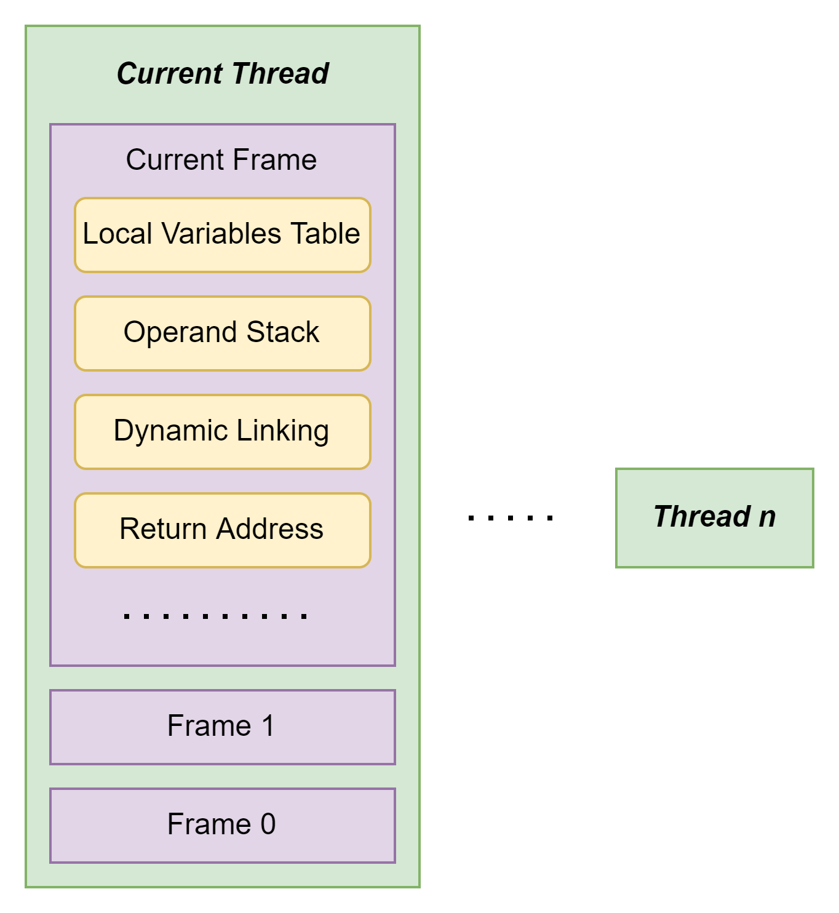

# 虚拟机字节码执行引擎

## 引入

这里说的执行引擎是由软件执行的，和所谓的物理上的处理器，缓存层面的执行引擎不太一样。

## 运行时栈帧结构

JVM把方法看作是最小的执行单元，栈帧作为方法调用和方法执行的数据结构。它也是虚拟机运行时数据区中的虚拟机栈的栈元素。一个栈帧中会储存方法的局部变量表，
操作数栈，动态连接，方法返回地址和其它信息。

在编译时期，栈帧需要的局部变量表，操作数栈的大小就已经被计算并且分配好了。这里所谓的大小并不是实际内存中的大小，而是虚拟机中栈深度。那么这个信息会被写入方法表的Code中，
之前分析class文件的时候说过。

Java层面下，同时同线程下，调用堆栈的所有方法都同时处于执行状态。而对于执行引擎来讲，活动线程中，只有位于栈顶的方法才是运行的，也只有位于栈顶的栈帧是有效的。
其实从IDEA的debug模式观察，也能看到当前调用的方法的栈帧会被放在第一个。

虽然前面已经画过很多次栈帧的图了，但是因为这次是从执行引擎的角度，会是最详细的一次。



### 局部变量表 Local Variables Table

局部变量表就是用来存放变量值的储存空间，用于存放方法参数和方法内部定义的局部变量。编译结束后，会用max_locals规定最大容量。局部变量表中的最小单位是变量槽(slot)，
一个槽的大小并没有严格的规定。所以不同的JVM完全可以分配不同的内存给，不过一般意义上，除了double和long是64位，其它大部分都是32位。

因为JDK 17的Hotspot已经全面改为64位了，所以在索引定位上就不像之前可以直接使用N来作为第N个变量的索引。具体实现并不是中重点，所以就直接略过了。

变量槽也是可以复用的，这一点可以说是很重要，因为它有些时候会对垃圾回收造成影响。比如下面这段代码

```java
public class gcTest {
    public static void main(String[] args) {
        {
            byte[] placeholder = new byte[64 * 1024 * 1024];
        }
//        int a = 0;
        System.gc();
    }
}
```

如果把`int a = 0`这一段注释掉，那么gc就不会把前面placeholder的内容回收。使用`-verbose:gc`得到的打印结果如下：

```shell
[0.007s][info][gc] Using G1
[0.112s][info][gc] GC(0) Pause Full (System.gc()) 68M->66M(234M) 2.969ms
```

明显G1并没有收集byte数组(设置的是64MB)。出现这个的原因就是，虽然byte数组是处于某一个单独的代码块中，并且出了这段代码块后，已经没有关于它的引用了。
但是如果看栈帧的话，就会发现局部变量表还会保持和它的关联，因此GC Roots会继续保持这种关系，从而就不会被回收。那么如果我重新加入`int a = 0`这一行，
在尝试触发GC，就会发现它被正确地回收了。原因很简单，a=0和之前的数组公用了同一个slot，而新的变量把老数组在局部变量表中的位置替代了，GC Roots不在能够找到数组的引用了。
因此就完全回收了。

通过上面这个小例子，值得思考的地方应该是局部变量表的引用替代问题。虽然看上去代码块能够保证隔离GC Roots，其实它并不绝对。所以如果某个对象或者数组无需在使用时，为了减少内存压力。
也许可以适当的添加一行把对象变成null，这样可以保证它被GC Roots隔离开来。

局部变量还会存在的问题就是如果没有赋值，那么是完全不可以使用的，这句话听起来很奇怪，其实意思就是局部变量并不会像之前的类一样由VM给一个初始的赋值，比如int是0。
具体可以看这个例子

```java
public class LocalVar {
    public static void main(String[] args) {
        int a;
        System.out.println(a);
    }
}
```

上面这段代码在预编译阶段就会被IDEA报错，因为a没有被赋值。

### 操作数栈 Operand Stack

基本结构就是一个栈。它的栈最大深度也会在编译阶段就决定，并写入class文件中的max_stacks中。每一个操作数栈的元素都可以是任意的java类型(这里指的是VM里的java类型，包括reference等)。
32位的元素会占用一个单位，64位则是2个单位。基本的操作就是往顶部写入或者拿出内容，比如加法操作的时候，就把顶部的前两个元素拿出来，直接使用相加在压回去。

编译器应该保证出栈入栈的顺序和内容的正确性。比如`iadd`必须是两个int相加。按理说两个栈帧之间不应该出现数据共享的情况，但是有一些虚拟机可能会把一部分通用的局部变量做共享处理。
这种思路再次用到的之前提过的享元模式，不过这样的设计还是给编译器造成了很大的压力。这里也就顺带一提。

### 动态连接 Dynamic Linking

每个栈帧都应该包含一个指向它的方法的引用，之前提到方法的符号引用会被作为参数放在运行时常量池中。一部分符号引用在初始化的时候被解析成直接引用，一部分在运行期间用到时在转化成直接引用。
这里就是之前提到的动态连接。

### 方法返回地址 Return Address

正常方法执行完毕，要么返回一个值，要么就回到下一个执行地址。如果出现了异常，而且没有处理方案，那么就会用`athrow`抛出异常，并且不返回任何值。
无论是上文中的哪一种方式，都需要记录它需要回去的地方，也就是下一个指令的地址。在CPU中这个应该是由寄存器来记录的，在栈帧中它就会被保存到返回地址。

## 方法调用

这里的方法调用指的是确定具体执行哪一个方法，比如出现同名的时候，最终使用的是什么类中什么法。

### 解析 Resolution

回想class文件的内容，一个方法的符号引用会被写在常量池中，而类加载的解析阶段会静态解析出能够确定的符号引用，把它们变成直接引用。这种能够在编译阶段就确认的方法调用被统称为解析。

通过上述的规定，简单思考一下就可以知道，能被private和static修饰的方法基本都属于静态解析。他们在某种程度上，可以说是确定的，无法更改的。因为它们都不能被继承和改写。

针对这种行为，JVM规定了5种字节码指令，在很早之前提到过的`invokespecial`等。

### 分派 Dispatch

从我个人的角度来看，分派其实就是实现多态特征的一种手段，而所谓的重载和重写感觉就像是分派的具体实现。

#### 静态分派

书中给出了这样一段代码

```java
public class StaticDispatch {
    static abstract class Human {}
    static class Man extends Human {}
    static class Woman extends Human {}

    public void sayHello(Human guy){
        System.out.println("人类");
    }

    public void sayHello(Man guy){
        System.out.println("男士");
    }

    public void sayHello(Woman guy){
        System.out.println("女士");
    }

    public static void main(String[] args) {
        Human man = new Man();
        Human woman = new Woman();
        StaticDispatch sr = new StaticDispatch();
        sr.sayHello(man);
        sr.sayHello(woman);
    }
}
```

这里输出的肯定是两次人类。其实这个思路早在讨论类的时候就提过，man这个变量前面的Human是它的外观类型(或者叫静态类型)，而后面的Man才是他的实际类型。
虽然静态类型本身也有可能发生改变，但只有在使用的时候才会出现，并且这种改变其实是改动实际类型，并不影响它所属的静态类型。意思其实很简单，
假设我没有见到一个人以前，我只知道ta是一个人，我不知道具体性别。直到我和ta线下见面了才会直到ta到底是男生还是女生。但是无论如何ta都一定是一个人。
回到java层面，把编译器想象成我自己，也就是编译器一早就知道一个变量的静态类型。

```java
26 invokevirtual #34 <chapter5/StaticDispatch.sayHello : (Lchapter5/StaticDispatch$Human;)V>
29 aload_3
30 aload_2
31 invokevirtual #34 <chapter5/StaticDispatch.sayHello : (Lchapter5/StaticDispatch$Human;)V>
34 return
```

直接来看上面的字节码文件，能看到调用sayHello这个方法的时候，字节码直接就在方法重载的时候给分配了形参是Human的方法。如果深究class文件的话，
就会知道javac会根据参数的静态类型来决定用哪一个重载版本。所以通过静态类型来决定方法执行的分派动作，都被称为静态分派。

#### 动态分派

其实主要就是和重写有关。还是刚才的例子，稍作修改。

```java
public class DynamicDispatch {
    static abstract class Human {
        protected abstract void sayHello();
    }

    static class Man extends Human {
        @Override
        protected void sayHello() {
            System.out.println("男士");
        }
    }

    static class Woman extends Human {
        @Override
        protected void sayHello() {
            System.out.println("女士");
        }
    }

    public static void main(String[] args) {
        Human man = new Man();
        Human woman = new Woman();
        man.sayHello();
        woman.sayHello();
        man = new Woman();
        man.sayHello();
    }
}
```

这次的运行结果其实比静态分派还要好预测，因为直接调用的都是具体地重写后的方法。但是如果细想刚才说过的部分，为什么这里编译器又不进行静态分派了呢？我的思路还是先看字节码

```java
 0 new #7 <chapter5/DynamicDispatch$Man>
 3 dup
 4 invokespecial #9 <chapter5/DynamicDispatch$Man.<init> : ()V>
 7 astore_1
 8 new #10 <chapter5/DynamicDispatch$Woman>
11 dup
12 invokespecial #12 <chapter5/DynamicDispatch$Woman.<init> : ()V>
15 astore_2
16 aload_1
17 invokevirtual #13 <chapter5/DynamicDispatch$Human.sayHello : ()V>
20 aload_2
21 invokevirtual #13 <chapter5/DynamicDispatch$Human.sayHello : ()V>
24 new #10 <chapter5/DynamicDispatch$Woman>
27 dup
28 invokespecial #12 <chapter5/DynamicDispatch$Woman.<init> : ()V>
31 astore_1
32 aload_1
33 invokevirtual #13 <chapter5/DynamicDispatch$Human.sayHello : ()V>
36 return
```

从字节码的角度看还是挺明显的，其实JVM压根不知道最终会是调用谁的方法，它是统一调用的Human的sayHello方法。那为什么JVM还是可以准确的调用到方法呢？
其实这里我自己本来是以为，在运行的时候，JVM会自行判断，但是我重新观察了以下`invokevirtual`的doc才发现问题的关键。官方文档给出的解释如下

```text
Invoke instance method; dispatch based on class
```

具体它的处理方式我就不细说了，官方的意思就是，只要用到了虚指令，那么就会在class的运行时常量池中找它对应的符号引用，然后尝试解析成直接引用。那么这里的解析是完全基于类的，
所以最终调用的方法是跟着实际的类型走的。书中还提到了一个很重要的说法，所谓的多态只能用在方法上的原因也可以得到解释。因为只有方法在字节码层面可能会用到`invokevirtual`这个指令。
字段是永远不会用到的，所以字段不存在多态。

#### 单分派和多分派

代码有点长我就不粘贴过来了，都放在dispatch里面了。因为只是一个概念，所以也没有什么特别好讨论的，结论就是java是静态多分派和动态单分派语言。因为动态分派的时候其实只是和class有关，
也就是指考虑了一个宗量。而静态分派的时候，会看类型和形参，所以其实是多个宗量。

### 动态语言

所谓的动态语言就是在编译时期不会检查类型主体的语言，它们可以说自由度很高，但是也很难debug。我个人学过的动态语言应该只有Python，Prolog和Haskell。
所以对于java程序员常用的Groovy和JS不是特别的熟悉。

#### java.lang.invoke

[JSR-292](https://jcp.org/en/jsr/detail?id=292)提出java需要支持动态语言的特性。但是对于java这样的静态语言来说，需要满足它过于的困难，所以在JDK 7时引入了一个invoke包来解决。
这个invoke包它的主要作用就是把一个方法原先需要使用的符号引用改为一个方法句柄。类似的结构在讨论对象访问定位的时候有涉及到，在堆的句柄池里可以找到类型数据的指针。

这个类的使用方法和反射机制非常地类似，不过它的信息和功能反而没有反射机制那么强大。如果从底层入手的话，反射只是java层面上的暴力拆解，而invoke则是字节码层面上。所以invoke实际上在调用和模拟的
是`invokespeical`等字节码指令，它并不能像反射一样获取方法的信息。但是它却可以很好的模拟所谓动态语言的特性，因为它调用的是字节码指令，所以在编译阶段VM实际对这个方法是一无所知的。
JVM并不能直接判断到底会调用哪个方法。还有就是因为它无需包含很多信息所以也更加轻量级。一个简单的测试用例我写在[MethodHandleTest](Java-JVM/src/main/java/chapter5/MethodHandleTest.java)里面了

#### invokedynamic

千呼万唤始出来，前面铺垫了那么久，终于要讨论这个了。Yeah！

从机制上来说，invokedynamic和MethodHandle是差不多的作用。它们都想突破虚拟机分派的限制。但是一个是从java代码层面，另一个则是字节码层面。注意前面有一点我故意没提，
就是invoke方法调用后，在字节码上居然是看不到利用了invokedynamic的。所以虽然invokeHandler算是一种动态模式，但是本质上并不是从字节码的角度解决的问题。
但是invokedynamic就完全不同了，java会把每个invokedynamic指令的位置称作动态调用点(Dynamically-Computed Call Site)。这个指令的第一个参数从Methodref_info改成了IncokeDynamic_info。
如果不通过lambda表达式的话，想要复刻一个代码层面上的invokedynamic有点困难。我自己完全没有任何想法，只能严格按照书上的来。基本上最后的结果就是invokedynamic后面的参数一定是一个InvokeDynamic_info。
java代码除去lambda表达式外使用这个字节码的可能性也比较低，所以我就放弃研究那段代码了。实在想象不到任何应用场景了。

