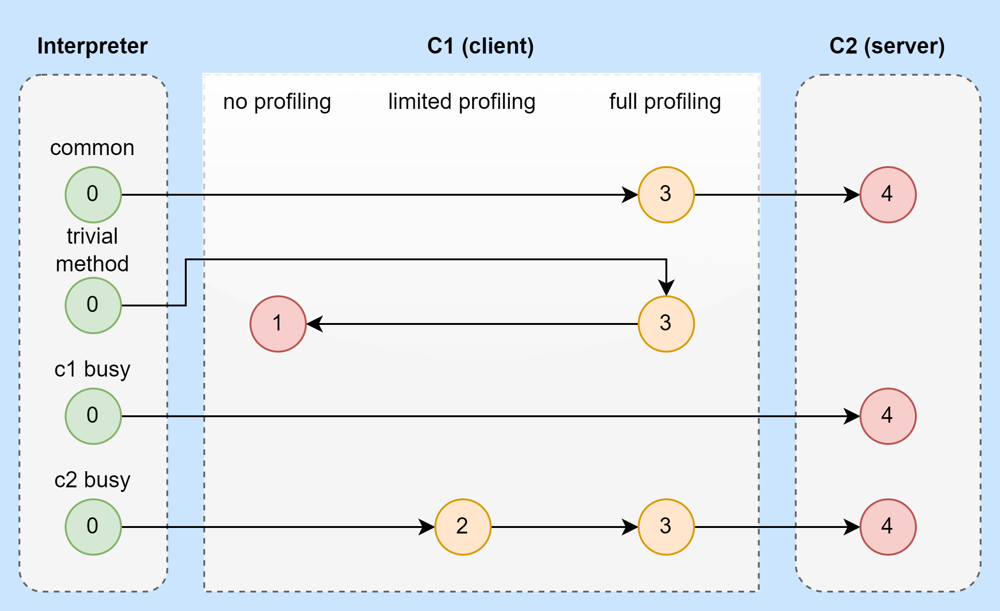
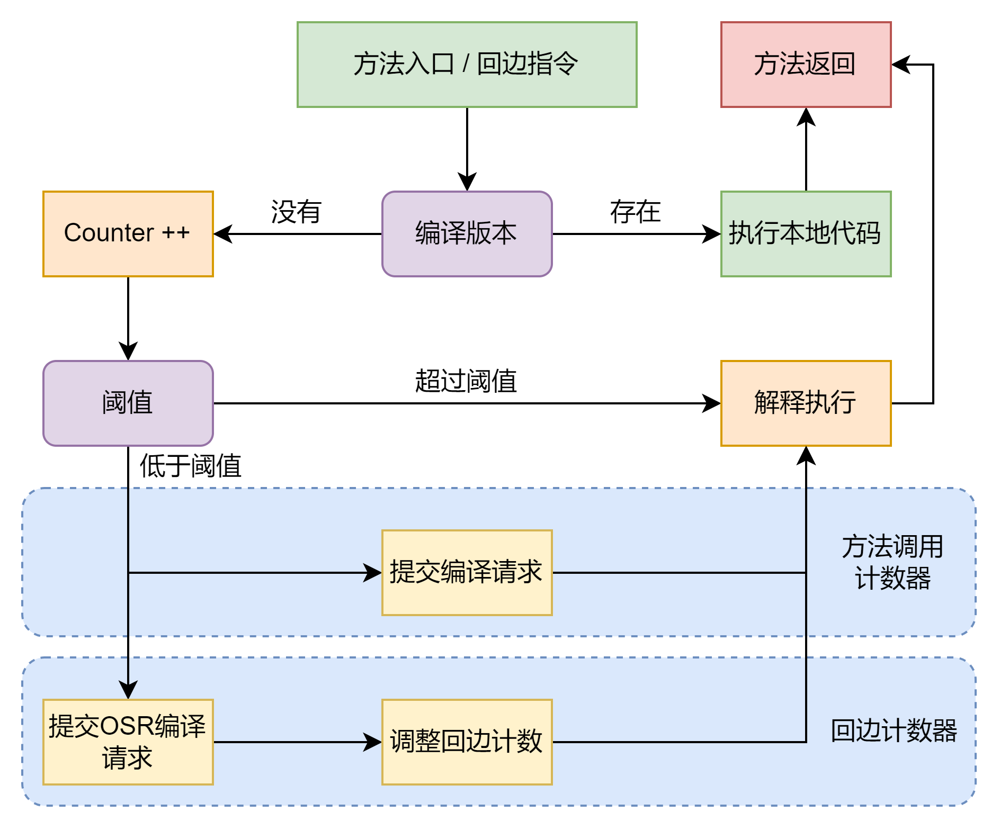

# 语法糖

从基础到多线程其实已经看过很多很多的语法糖了，这次会在整理一小部分。

## 泛型

java的泛型实现被称作“类型擦除式泛型”。java中的泛型在字节码文件中其实早已被替换成了它的裸类型(Raw Type)，并且在相应的位置上放入了强转的代码。
也就是运行期的java代码里，ArrayList&lt;int&gt;和ArrayList&lt;String&gt;其实就是同一个类型。一个简单的验证如下

```java
public static void main(String[] args) {
    ArrayList<String> a = new ArrayList<>();
    ArrayList<Integer> b = new ArrayList<>();

    System.out.println(a.getClass() == b.getClass());
}
```

以上的结果肯定为true，甚至IDEA会直接在编译前就判断出这个结果为true。这就是所谓的类型擦除，其实javac在编译的时候就会把String和Integer全部从类型中擦除掉，替换为Raw Type。
等到具体使用的时候在强转回去。针对上面的作法又加了两行

```java
a.add("good");
System.out.println(a.get(0));
```

下面截取的是关于get的字节码

```java
50 invokevirtual #32 <java/util/ArrayList.get : (I)Ljava/lang/Object;>
53 checkcast #36 <java/lang/String>
56 invokevirtual #38 <java/io/PrintStream.println : (Ljava/lang/String;)V>
```

这样一看就非常清晰了，java在调用get的时候会直接强转，把ArrayList里的内容变成从Raw Type强转为String类型。这里其实又再次解释了为什么泛型使用中不能出现基础类型(Primitive type)
很简单，基础类型无法直接强转，因为Object和int根本就不是同一个东西。所以java只得把基础类型才装箱一次，然后放入泛型中使用。这样的成本显然是很大的，也是为什么java的泛型其实并不是很优秀。
甚至有些时候会出现拖后腿的情况。

### 重载问题

这里书上提到了一个非常重要的例子，代码如下

```java
public class GenericTest {
    public static String method(List<String> list) {
        System.out.println("invoke method String list");
        return "";
    }

    public static int method(List<Integer> list) {
        System.out.println("invoke method Integer list");
        return 1;
    }

    public static void main(String[] args) {
        method(new ArrayList<String>());
        method(new ArrayList<Integer>());
    }
}
```

按照类型擦除的逻辑，这段代码应该是无法通过编译的，因为擦除过后的形参是一样的，在class文件中它们应该是一样的二进制流。但是因为方法中的返回值不一样了，
所以按照JVM的规范应该是允许class文件中存在这两个方法的。可惜的是，书上成功的编译了，但是我尝试了JDK 11和17都无法成功编译。提示如下：

```text
java: name clash: method(java.util.List<java.lang.Integer>) and method(java.util.List<java.lang.String>) have the same erasure
```

和我的预想一样，由于类型擦除，所以编译不通过。我尝试了直接复制书上的代码，但是依旧不能编译，书上的JDK版本是11。排除了所有影响后，我还是找不到原因。
不过我也没纠结这个东西，毕竟了解了类型擦除的机制是主要目的。这个就当是个小插曲吧。

## 自动装箱、拆箱与遍历循环

应该是用的最多的语法糖了，几乎每天都会碰到。具体的编译和反编译我就不分析了。唯一需要特备注意的就是下面这个例子

```java
public static void main(String[] args) {
    Integer a = 1;
    Integer b = 2;
    Integer c = 3;
    Integer d = 3;
    Integer e = 128;
    Integer f = 128;
    Long g = 3L;
    System.out.println(c == d); //true
    System.out.println(e == f); //false
    System.out.println(c == (a + b)); //true
    System.out.println(c.equals(a + b)); // true
    System.out.println(g == (a + b)); // true
    System.out.println(g.equals(a + b)); // false
}
```

这个应该是java中被用烂的例子，结果如上。这里其实阐述了两个实际写码需要注意的地方。

1. java中的基础类型都是有常量池的，对于integer来说是-128到127。所以直接对比这个区间内的整数，无论怎么装箱和拆箱都只需看值。如果超过则会以对象的形式存在，那么对比的就不是值而是引用。
2. equals的用法每个都不相同，但是对于自动装箱类来说，所有的equals第一步都是先看数据类型是否一致，然后才对比值。源码我就不复制了，其实也只调用了instanceof

# 后端编译器

## 即时编译器

目前java虚拟机中仍然存在的两个古董级别的及时编译器分别是C1和C2。

C1是Client Compiler也就是客户端编译器的简称，而C2则是Server Compiler服务端编译器。总体上来，客户端编译器比较保守，会主动放弃全局优化来换取快速启动。
而服务端编译器则是比较激进，为了全局优化，甚至会做出一些不可靠的优化。

在JDK10以后又出现了一个Graal编译器，本来是准备替代C2的，但是由于尚处于实验阶段，所以具体性能和对代码的影响还不可知。因此最好还是别用。
对于java的及时编译来说，分层编译(Tiered Compilation)可以说是JDK 7之后已经为大家熟知的方式了。

一般来说，可以简单地分为5层，我用下图示意



- 0：完全的程序解释执行，解释器不开启性能监控功能
- 1：客户端编译器将字节码编译为本地代码，轻量级，可靠，稳定，依旧不开启性能监控功能
- 2：客户端编译器执行，仅开启方法和回边次数统计等性能监控
- 3：客户端编译器执行，但是所有性能监控全开
- 4：服务端编译器将字节码编译为本地代码，重量级，不可靠，激进

## 编译对象和触发条件

热点代码基本上就两种：

1. 被多次调用的方法
2. 方法体内有多次循环的循环体

但是编译的对象，无论是以上哪一种都是整个方法体。不够第二种的执行入口就不再是进入方法的第一条字节码指令，而是会传入执行入口字节码序号(Byte Code Index, BCI)。
主要因为编译发生在方法执行的过程中，所以这个动作也被称为栈上替换(On Stack Replacement OSR)。也就是说，在栈帧还在栈上的时候方法就被替换了。

那么即时编译器是如何触发热点代码编译的呢？一般是利用叫做“热点探测”(Hot Spot Code Detection)的方式。目前依旧在使用的热点代码探测方式一般有两种，

1. 基于采样的热点探测(Sample Based Hot Spot Code Detection)。这种方法的虚拟机会周期性地检查各个线程的调用栈顶，如果发现某一个方法经常出现，那么它就是热点方法，可以说这个比较好理解。
2. 基于计数器的热点探测(Counter Based Hot Spot Code Detection)。采用这种方法的虚拟机会为每一个方法建立计数器，统计方法的执行次数，如果执行次数超过一定的阈值就认为它是热点方法。

HotSpot会给每个方法两类计数器：方法调用计数器(Invocation Counter)和回边计数器(Back Edge Counter)。VM参数设定好后，两个计数器都会有一个阈值，只要达到阈值就自动触发即时编译。

对于方法调用计数器，客户端和服务器模式的阈值是不同的。一个方法被调用的时候虚拟机会先检查是否被编译过了，如果是就直接用本地代码，如果没有那么就给计数器加一。
阈值可以通过参数`-XX:CompileThreshold`来设定，不同模式和层级下，默认阈值不同，操作系统也会有一定的影响，具体的区别可以参考[VM Options](https://chriswhocodes.com/hotspot_options_openjdk8.html?s=TraceClassLoading)。

当达到阈值后，编译器会提交一个该方法的代码编译请求，直到编译器完成了编译后，方法的调用入口地址就会被系统自动改写成新值。当系统再次调用这个方法的时候就会走及时编译的结果。
在默认设置下，方法计数器并不是统计方法被调用的绝对次数，而是执行频率。如果一段时间内方法计数器的调用次数不满足一定频率，那么它的计数器就会减半。这个过程被叫做热的衰减(Counter Decay)。
衰减的时间则叫做半衰期(Counter Half Life Time)。那么这个值可以直接用`-XX:CounterHalfLifeTime`参数设置半衰期的时间，单位是秒。默认是30秒。

回边计数器的主要作用是统计一个方法体中循环体代码执行的次数，在字节码中遇到后跳转的指令就称为回边。其实就是java层面上的循环。同样地，它可以直接通过
`-XX:BackEdgeThreshold`来设置，大部分情况下，它的默认值为10000。

在客户端模式下阈值的计算公式和服务端模式下是完全不同的。两个计数器的占比可以通过`-XX:OnStackReplacePercentage`调整。具体公式就计算了，意义不大。

以上两种计数器的流程图



应该比较清晰，其实主要的区别就是在提交编译请求上，回边计数器会调整值，但是没有半衰期。方法计数器有半衰期，也会调整值。

## 编译过程

默认情况下，编译动作会在后台的编译线程中进行，可以使用以下参数`-XX:-BackgroundCompilation`来禁止后台编译。后台编译被禁止后，当触发即时编译后，
执行线程会和VM提出编译请求，但是会先阻塞，直到编译过程完成再开始执行本地代码。所以从业务角度出发，虽然可能导致业务一段时间变慢，但是开启后台编译还是利大于弊的。
我们的JVM启动参数中没有没刻意关闭后台编译。我看了后台文档，主要是对编译后的缓存做了限制，具体也是为了减少不必要的GC。

## 优化方法

### 方法内联

简单的理解就是合并代码，把原先分成了多个方法的代码合并到同一个方法中。好处就是省去了调用的开销。这个所谓的开销我个人的理解就是栈的使用。
比如同一个方法一直循环被调用的话，会不断的出栈入栈，如果出现了无线循环还会导致栈溢出。而合并后的代码就可以只使用一个栈帧就解决所有的问题，大大减少了字节码指令。

可惜的是，经典的java虚拟机很难进行方法的内联。原因很简单，之前的提过除了`invokespecial`和`invokestatic`指令等调用的静态方法才会再编译时期解析。而类似invokedyanmic这样的指令，
都是在运行时期编译的，所以在进入VM之前根本不知道会使用哪一个方法，也就无法直接内联。

为了解决这个大的问题，JVM使用了类型继承关系分析(Class Hierarchy Analysis, CHA)的技术。这个名字没什么好纠结的，主要来看其中的一个实现。

CHA提出了一种守护内联来解决虚方法的内联问题。守护内联就是说当遇到`invokevirtual`的时候，CHA会定向的查看是否真的存在多态，如果实际只有一个版本，那么就认定将要使用的就是这个版本。
也就是说不需要考虑别的，直接把调用的方法内联进方法内。这种方法乍一看很靠谱，但是如果考虑java的动态性，那么还是存在问题的。因为类的加载并不是在编译阶段，甚至不在程序开始的时候，而是在使用到的时候。
所以压根就无法推算到底什么时候会出现一个新重写或者重载。一旦后面出现了重写，那么后加载的方法就永远不触发了。针对这个问题，CHA的解决方案是预留一个退路(Slow Path)。
所谓的退路就是如果CHA发现了一个没见过的重写，就自动放弃已经编译好的内容，回滚到最初的方式重新解释运行。如果查到确实有很多个版本的话，那么CHA会尝试用内联缓存的方式提高调用速度，但是这个方法并不能减少栈的使用。
不够比直接调方法表还是快一点。它能够快一点的本质就是依靠单态内联缓存(Monomorphic Inline Cache)，也就是每次调用的版本都是一样的，那么它就以缓存的形式调用。

### 逃逸分析

分析对象动态作用域，当一个对在某个方法中被定义后，它可能被外部方法引用。最经典的例子就是把一个局部变量当作入参放入另一个方法中。在极端一点甚至可以把一个局部变量赋值给其它线程的实例变量。
以上的两种分别可以称为方法逃逸和线程逃逸。这种情况下，开发者就想到了可以根据一个对象的逃逸程度来分配它的位置和创建方式，从而优化整体代码。

#### 栈上分配 Stack Allocations

在JVM中，堆(java堆)中的对象全部都是共享变量，所有线程都可以访问。如果能够确定某一个对象只在一个线程中使用，那么不如直接把它分配到栈内存中，这样就不占用堆内存，而且等线程死亡后，
还可以跟着线程一并销毁，甚至不需要单独做GC。比较可惜，栈上分配只能解决方法逃逸而不能解决线程逃逸。因为方法逃逸，我只需要考虑栈帧，而线程逃逸则需要考虑太多东西了。

#### 标量替换 Scalar Replacement

如果一个数据已经无法再分解成更小的数据类型来表示，那么这个数据就被称为标量，其它所有的量被称为聚合量。很明显对象就是一个聚合量。当一个对象可以被证明只存在与某个方法中，
不会出现任何逃逸的时候，那么不如直接把这个对象拆分成一个一个小的成员变量。这样直接省去了对象的创建过程，大大提高效率，而且大概率VM会把这些字段直接放在栈上，也就是硬件的寄存器中。

#### 同步消除 Synchronization Elimination

线程同步本身是一个相对耗时的过程，如果逃逸分析能够确定一个变量不会逃逸出线程，无法被其它线程访问，那么我就可以排除任何同步竞争锁的可能。所以任何写在变量内部的同步措施都可以安全的消除掉。

从上述的优化来看，我个人感觉逃逸分析其实很不稳定，如果预热时间足够的话，我感觉打开逃逸分析是好的，因为可以大量简化。但是预热时间不够，或者逃逸情况多见的代码中，这种方式其实完全是浪费资源。
JDK 6后逃逸分析是自动开启的，我们也没有手动关闭，所以对于我们的业务来说，也许这个的好处要远大于劣势。逃逸分析只在服务器端默认开启。

### 公共子表达式消除

意思很简单，一个式子如果已经计算过了，那么只要从上次计算到现在内部变量没有发生任何的改变，那么就不需要再计算一次，直接使用前面的结果来代替。看上去代码量上没有改变，
但是翻译成指令就等于少了很多行。比较简单就不多说了。

### 数组边界检查消除

java本身在代码层面上就做了很多数组边界检查，比如数组必须是定界的。但是每次都检查带来的性能问题也是很烦的。

> PS：本章中其实还有大量篇幅去介绍了Graal编译器，但是由于我们没有在使用，我就直接略过了，而且它目前还在实验阶段，说不准什么时候就没了。