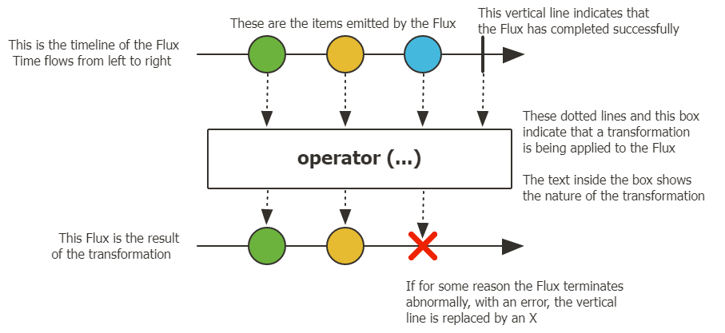
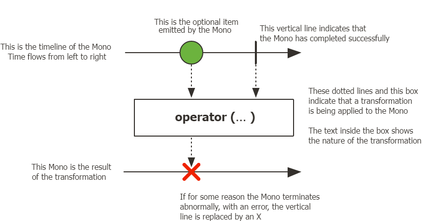

# Java 响应式编程

做这一章的主要目的还是学习Flux和Mono是啥

## 响应式的基本概念

原先的编程理念中，如果一个线程请求某一个值， 但是这个值还在被另一个线程处理，且需要等待时。该线程就必须阻塞等待，那么会造成大量的线程阻塞住，
而且如果多个线程同时需要一个值，还牵扯到锁和修改的问题。那么响应式的思路就是把原先的阻塞等待，变成一个类似异步输出的机制。请求值的线程变成了订阅者，
而被请求的线程是发布者，那么请求线程只需要订阅被请求的线程，当被请求线程的值发生了改变后，那么立即通知请求者。在请求打到被请求线程的时候，
请求者可以继续下面的工作，直到收到了值在继续刚才的工作。这种非阻塞的方式，必然带来大幅度的效率提升。所谓的异步输出其实可以想成一个流的形式，流可以体现出数据的变化。

## Flux Mono的基本概念

类似于Java 8出现，并在Java 9迅速被废弃的Observable，本质上Flux和Mono都是对于订阅者模式的一种延展。就拿Flux做一个简单的例子，
Flux最基础的用法中有三种信号——元素值，错误信号，完成信号。第一种是把元素的改变推送给订阅者，而后两种则是表示流结束的信号。其实就是字面意思，
错误就是这个流在运行中出现了问题，那么Flux会把这个错误发给订阅者，并且终止流。完成则是这个流的任务已经结束，直接结束推送，终止流。
从上面的说法就可以看出信号的三个基本特征：

- 错误和完成信号不可共存
- 没有发送任何元素值就直接发送错误或完成信号，则判定数据流为空数据流
- 如果流在开发代码的时候就没有规定错误信号或完成信号，则流是一个无限的数据流

对于Mono也是一样，三种信号。但是不同的是Flux可以触发零或多个事件，但是Mono最多只能有一个事件。但是它们同时都是发布者。

### Flux

在开始聊这个之前。我想明确一个概念。在官方文档中其实提到了一句话`Nothing Happens Until You subscribe()`。我觉得这个很好的解释了所谓响应式的思路。
虽然Flux和Mono都可以简单的看成数据流，但是本质上如果它们都没有订阅者，那么它们本身没有任何意义。比如假设使用最简单的Flux.just()来创建一个流，
那么只要没有人订阅，流里的数据就是无效的。并且还有一个点，只要是响应式就必须要支持异步输出。

下面回到Flux本身，话说官方javac里面居然还告诉读者不要看它们写的javac，最好看使用手册。这算是官方吐槽吗？

直接来看官方的图

其实还挺好理解的，图中上面的三个圆表示的是被Flux发出的三个元素，这些元素会被执行一些操作，如果没有问题则正常结束流。但是如果出现了问题，
那么就是下面的那条线，直接终止流，并且返回错误信息。

### Mono

和Flux一样，只不过它最多只能有一个元素。
