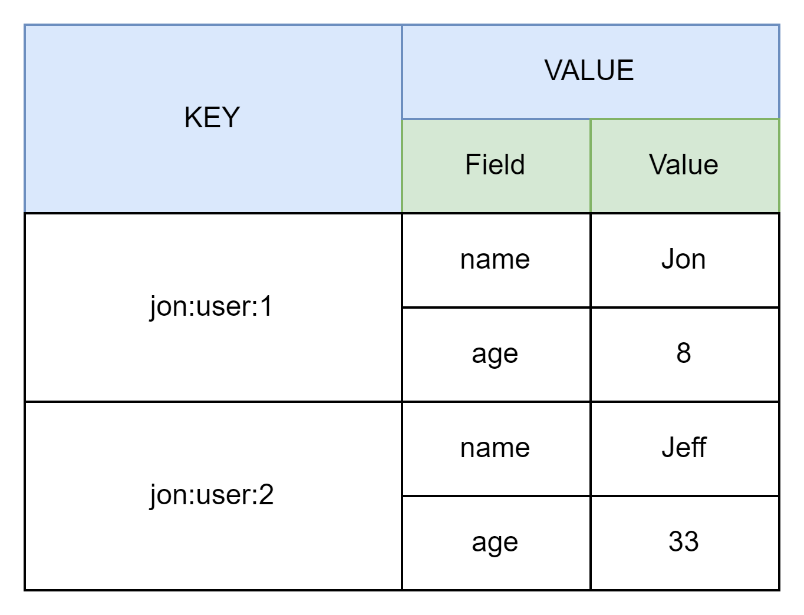
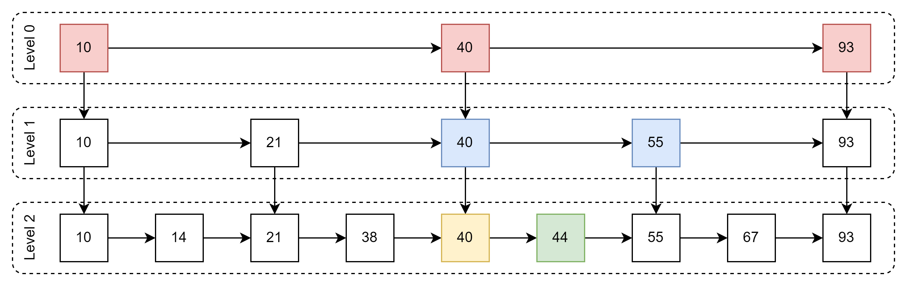
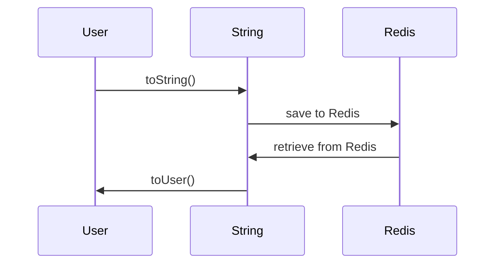

# Redis 1

本次使用的Redis版本是7.0.5 64-bit。由于redis一直是向下兼容的，所以应该不会影响学习。还有一个就是7和6我看了网上的对比，
底层逻辑基本没变，所以应该不会和现在使用的版本有很大的出入。

## NoSQL vs SQL

相较于传统的关系型数据库，redis作为一个缓存技术，其实可以看成一个非关系型数据库。所谓的非关系型数据库就是把数据已非关系的形式存储，比如键值对，树状图型，JSON型等。
相较于SQL，NoSQL没有办法直接表示数据之间的关系。比如买家和订单之间的关系，SQL可以通过join来实现，但是NoSQL就无法直接获取了。还有个区别是语句，
由于存储方式不同，NoSQL人如其名，就是不用直接写SQL语句。最后就是事务的管理，关系型数据库一定是满足ACID原则的，但是大部分情况下NoSQL无法全部满足ACID。
因此它的事务特性被称为BASE。

总的来说NoSQL就是一个概念，利用这种概念的技术很多，比如现在比较火的Redis，ES和MangoDB。它的事务满足最终一致性，并且在大部分情况下可以保证数据的可用性。

## 入门

Remote Dictionary Server，这个名字还挺有意思的远程词典服务器。

基本特征：

- 键值型 value支持不同的数据结构
- 单线程 完全线程安全 （6.0网络处理已经改为多线程，但是核心处理还是单线程）
- 低延迟，速度快（基于内存，IO多路复用，优雅代码基于C）
- 支持数据持久化（内存定期存入磁盘，保证数据持久）
- 支持主从集群，分片集群
- 多语言客户端

## 通用命令

相对比较常用的命令

- keys：找到所有符合pattern的键，这个pattern是redis自己定义的表达式，不是regx。并且由于是模糊查询，且是单线程的，所以当数据量很大的时候，会完全阻塞住。
- del：删除指定的key 支持多个同时删
- exists：判断key是否存在
- expire：给key设置一个有效期，有效期到，key会自动被删除（减少内存占用，防止内存泄露）
- ttl：查看一个key的剩余时间

## 数据类型

一般key都是String，而value则可以是多种数据类型。官方给出了8种主要的数据类型——String, Hash, List, Set, SortedSet, GEO,
BitMap, HyperLog。
其中前5种是redis认为的基本数据类型，后三种则是通过前面的数据类型转换得到。当然，Redis还支持很多其它的数据类型，后面如果碰到在分析。

### String

和Java中不同，redis中的string存在三种形式。按照官方的说法，每一个String类型的value都是已字符串的形式存储。但是有别于java，它会把整数和浮点数分开处理。
如果是正常的String，则和java一样用byte array。如果是整数和浮点则直接转为二进制码存储，这种方案可以大大提高空间效率。不过本质上它们都是数组，只是编码不同。

常见命令

- `set` 添加或修改一个键值对
- `get` 根据key获取一个键值对
- `mset` 批量添加或者修改键值对
- `mget` 批量获取
- `incr` 一个整数value 自增1
- `incrby` 一个整数value 自增指定值
- `incrbyfloat` 一个浮点value 自增指定值
- `setnx` 添加一个string类型的键值对（key不存在则添加，存在则不变）
- `setex` 添加一个string类型的键值对 并且给出有效期

### Hash

和java中的hashmap结构类似，String结构是将对象序列化为JSON字符串后储存，但是hash则会把每个字段单独储存。也就是可以单独的修改一个字段中的某个值。
所以它的结构可以用下图来理解



很明显它在String原先键值对的基础上又加入了一层，也就是它的value又是一个键值对。

基本指令和String很像，就是在前面加入一个H即可。其中还有一些相对特别的指令，包括从Redis 4.0后`HMSET`等类型的命令已经被废弃了。

- `HGETALL` 获取一个key中所有的field和value
- `HVALS` 获取一个key中的所有value
- `HKEYS` 获取一个key中的所有fields

### List

和java中的linkedList比较相似，可以直接看成双向链表。基本特性也很像——有序，可重复，插入和删除快，查询速度一般。

基本指令和list在java中的操作很像，这里就不展示了。从头开始就加L在最前面，反之就是加入R。

### Set

Redis中的set和java中的HashSet类似，它也可以存入null。本质上也是一个hash表，所以它是无序，不可重复，并且查找快。

常用指令：

- `SADD`：添加一个元素
- `SREM`：移除一个元素
- `SCARD`：返回set里的元素数量
- `SISMEMBER`：判断元素是否在set中
- `SMEMBERS`：获取set中的所有元素
- `SINTER`：两个set的交集
- `SDIFF`：两个set的差集
- `SUNION`：两个set的并集

### SortedSet

和java中的TreeSet类似，是一种排序的set。这个部分我看了超多的网上解析，底层数据结构和实现方法和TreeSet是一点关系没有。其中甚至用到的跳表SkipList这种不太常见的数据类型。
我这次就简单的做个了解。首先就是说每个set中的元素都会有一个分数(score)，通过这个分数来排序。这个有点类似于java中自己封装的pojo加入一个字段来排序。
然后储存结构则是SkipList＋hash表。基本就是把原先的hash表中的元素通过某种逻辑穿起来，简单的来说就是分层。大致原理如下



比如44是我想要查的数据。那么它会先从最上层level 0开始遍历，先走到40，发现目标大于40这个元素，下一个元素93又大于目标。所以44一定属于这个区间内的某个地方，
于是就从40这个元素向下走一层，走到level 1的40，然后重复刚才的步骤，知道发现55大于目标，于是从上一个元素在往下走，走到level
2的40，然后继续遍历直到找到元素。
理论上来说这种遍历的方案可以把所有的查询都控制在`O(lgn)`。所有这个结构除了会相对占用一点空间外，查询的稳定性是完全可以保证的。

回到sortedSet，上图中的数字表示每个元素的分数（score）。所以它的基本逻辑就是对比分数，然后创建skipList存储。

它的常见命令基本和set基本一致，就是前面换成Z。

## key 结构

不同于SQL使用表来表示层级和关系。redis在key中加入`:`来表示层级关系。根据不同的业务需求可以设计不同的层级，
一般遵循如下的规则

```shell
project:module:type:id
```

## 常见连接池

### Jedis

Java+Redis组成的名字。使用它的好处在于所有的方法名和redis自己规定的一模一样，减少了学习成本。而且结构简单，直接调用即可，没有什么复杂的变化。但是缺点也很明显。
根据jedis的官方wiki，它无法多线程。其实并不是不能，而是因为线程不安全。官方表示如果需要多线程的话，单例的redis是不安全的，必须是用线程池来配合使用。
这样的话使用成本是大大增加了的。具体它会出现线程不安全的原因，我参考了腾讯开发者社区的一个说法，jedis的源码中是这么使用连接的，每次进行操作的时候，都要先打开连接，
结束后在关闭连接。真的是最经典的线程安全问题，当多线程同时调用同一个方法的时候，由于没有使用连接池，所以每个线程都尝试获得connection，最终就导致了问题。
而且这种不停获取连接的方式显然也是消耗资源的，如果用官方推荐的连接池也会比较麻烦。所以对于多线程任务Jedis确实没有那么合适。

### Lettuce

官方wiki上把它都吹上天了。说是又能支持同步，异步，还支持响应式，最后还是线程安全的。并且Redis本身的哨兵模式，集群模式和管道模式也都支持，说的像是那种包治百病的膏药。
官方还提到Lettuce是基于Netty实现的，但是Netty的东西我还没看到，所以也不知道到底有什么好处。

### Redisson

主要是基于分布式的一种实现，算是整合了java的大部分数据结构，比如Map，Queue，Lock等。并且号称是无锁的。这个等到用的时候在具体看怎么回事。基本就是云服务的时候会用的更多一点。

Spring整合的Redis主要是基于Jedis和Lettuce，所以后面的重点还是这两个。

## Jedis 快速入门

就按照官网的quick start结合了一些入门文章大概看了看怎么用的。基本思路和JDBC挺像的，感觉就是获取数据源然后直接调用方法，整合方面类似MyBatisPlus。
基本用法我直接写在jedis-demo里面了。没有什么特别的地方，所以就不分析了。

## SpringDataRedis

首先明确一下SpringData是spring整合各种数据的方式，其中包括了mysql等等。目前spring对不同的redis客户端提供的支持主要是Lettuce和Jedis。和之前的模板一样，
spring为redis也定做了RedisTemplate来简化开发。

### 简单入门

和之前的JDBC包括Rest一样，直接使用Template来进行开发。首先是配置类，需要在yml文件中稍微配一下具体需求。

```yaml
spring:
  redis:
    port: 6379  # 端口
    host: 127.0.0.1 # redis ip
    lettuce:
      pool:
        max-active: 8 # 最大连接数
        min-idle: 0 # 最小空闲连接
        max-idle: 8 # 最大空闲连接
        max-wait: 1000ms  # 单次最大等待时间
```

这里要说一下，springboot底层是自动选择的lettuce，如果需要使用jedis的话，那么需要单独引入依赖，并且把配置里的lettuce改成jedis即可。

基本配置就这些，然后就是springboot自动读取配置，生成bean。下面来看一个简单的测试。

```groovy
@SpringBootTest
class RedisTest extends Specification {
    @Autowired
    private RedisTemplate redisTemplate;

    def "write to a string"() {
        when:
        redisTemplate.opsForValue().set("name", "Jon")
        def name = redisTemplate.opsForValue().get("name")

        then:
        println "name: " + name
    }
}
```

这个测试也没啥可说的，都是按照基础测试走的，这次测的是redis的string数据类型。所以需要选择redisTemplate中的opsForValue。那么对于不同的数据类型spring的整合如下。

| API         | Return Type      | Data Type  |
|-------------|------------------|------------|
| opsForValue | value Operations | String     |
| opsForHash  | Hash Operations  | Hash       |
| opsForList  | List Operations  | List       |
| opsForSet   | Set Operations   | Set        |
| opsForZSet  | ZSet Operations  | OrderedSet |

### 序列化

在刚才的例子中，直接调用的`opsForValue().set()`方法看上去是直接插入了一条键值对name: jon。但是如果通过redis-cli来读取的话，就会看到如下结果。

```shell
1) "name"
2) "\xac\xed\x00\x05t\x00\x04name"
```

第一个key是我单独通过redis-cli加入的，而后面的那个则是通过Spring RedisTemplate插入的。可以说非常的明显，插入的key前面加入了一大堆乱七八糟的对东西。
但是看起来又很又规律。那么这是怎么造成的呢？这个就要从RedisTemplate是如何处理这些key来看了。一点进去源码就看到了下面的部分。

```java
@SuppressWarnings("rawtypes") private @Nullable RedisSerializer keySerializer=null;
@SuppressWarnings("rawtypes") private @Nullable RedisSerializer valueSerializer=null;
@SuppressWarnings("rawtypes") private @Nullable RedisSerializer hashKeySerializer=null;
@SuppressWarnings("rawtypes") private @Nullable RedisSerializer hashValueSerializer=null;
private RedisSerializer<String> stringSerializer=RedisSerializer.string();
```

这样很清晰了，其实通过RedisTemplate来管理的redis都会通过成员变量中的Serializer来做序列化，而这个序列化的配置是从afterPropertiesSet这个方法中获取的。
当没有特别定义某个序列化器的时候，它直接使用的就是jdk的序列化器，这为什么所有的key和value上都会出现各种乱码的原因。

很显然这种序列化是不好的，预期的值和实际插入的值不同不仅会导致抽取的有可能null，也会出现修改的问题。如果后期需要debug或者维护，可读性也很差。并且由于前面加入了很多字符，
导致最终的内存占用还变大了。因此这个问题是一定要解决的。但是RedisTemplate是写好的，如何能通过修改来解决这个问题呢？

这里就需要从redis存储的基本结构入手了，前面提到过redis的key一般是string，而value可以是各种数据类型，但是大部分可以通过json的方式来表达，虽然不是绝对的，但是json的形式确实够用了。

所以就可以向下面这样来修改这个类

```java
@Configuration
public class RedisConfig {
    @Bean
    public RedisTemplate<String, Object> redisTemplate(RedisConnectionFactory connectionFactory) {
        RedisTemplate<String, Object> template = new RedisTemplate<>();
        template.setConnectionFactory(connectionFactory);

        GenericJackson2JsonRedisSerializer jackson2JsonRedisSerializer = new GenericJackson2JsonRedisSerializer();
        template.setKeySerializer(RedisSerializer.string());
        template.setHashKeySerializer(RedisSerializer.string());

        template.setValueSerializer(jackson2JsonRedisSerializer);
        template.setHashValueSerializer(jackson2JsonRedisSerializer);
        return template;
    }
}
```

通过手动的设置配置类，保证当RedisTemplate在做序列化的时候会按照我们代码上写的值来进行。那么这里我配置的是比较经典的方式，通过jackson2Json的序列化器来序列化SortedHash和Set的对象。
剩下的就用默认的string序列化器。整体的难度不大，所以使用一些就够用了。

那么到这一步还是简单的传入一些String类型的参数，如果我现在想直接把一个对象传入，要怎么做呢？实际上，只需要能实现序列化，整体思路是一样的。具体的例子我放在代码中了，
就是一个简单的User类——两个字段name和age。直接封装好当作参数传入set方法。我想要讨论的地方在于下面这个情况，由于我把一个对象直接转成了json，所以应该会出现的内容如下

```json
{
  "name":"XiaoHu",
  "age": 23
}
```

但是实际存入的对象如下

```json
{
  "@class": "com.jon.pojo.User",
  "name": "XiaoHu",
  "age": 23
}
```

RedisTemplate在序列化的时候，还顺便把class名字存入了。这一步到底是为什么呢？其实是为了反序列化做准备的，因为封装是很简单，但是拆箱的时候就很麻烦了。
但是这样显然会占用更多的内存，如果大量的使用肯定不会是最优解。那么就需要优化这种实现方法来达到，既能反序列化又能节省内存。

### StringRedisTemplate

其实上面的那个问题有一个很简单的解决方案，就是把序列化放到外部去做，让存入和取出的数据都改成string，然后在放入和取出string的层面来做序列化和反序列化。
具体流程应该如下



如此就能保证Redis的部分只存string。那么这个具体的逻辑要如何进行呢？其实spring已经提供了一个解决的方案，就是StringRedisTemplate。
重写前面的测试类

```groovy
@SpringBootTest
class StringRedisTest extends Specification {
    @Autowired
    private StringRedisTemplate stringRedisTemplate

    @Shared
    public final ObjectMapper mapper = new ObjectMapper();

    def "insert an user string"() {
        def user = new User("LitterQer", 12)
        
        when:
        stringRedisTemplate.opsForValue().set("user:4", mapper.writeValueAsString(user))
        def userStr = stringRedisTemplate.opsForValue().get("user:4")

        then:
        println mapper.readValue(userStr, User.class)
    }
}
```

直接看结果

```json
{
  "name": "LitterQer",
  "age": 12
}
```

虽说存进去的是string，但是可以通过json的格式来查看。而且很明显地，之前需要的class也不在需要了。所以直接使用stringRedisTemplate来处理即可。
那么需要注意的地方主要有序列化的方式，对于一个pojo类，建议使用ObjectMapper来处理，当然使用FastJSON效果应该是一样的，但是因为springMVC的默认Mapper是ObjectMapper，
所以这样用会比较符合spring的习惯。然后就是API调用了，没啥好说的。