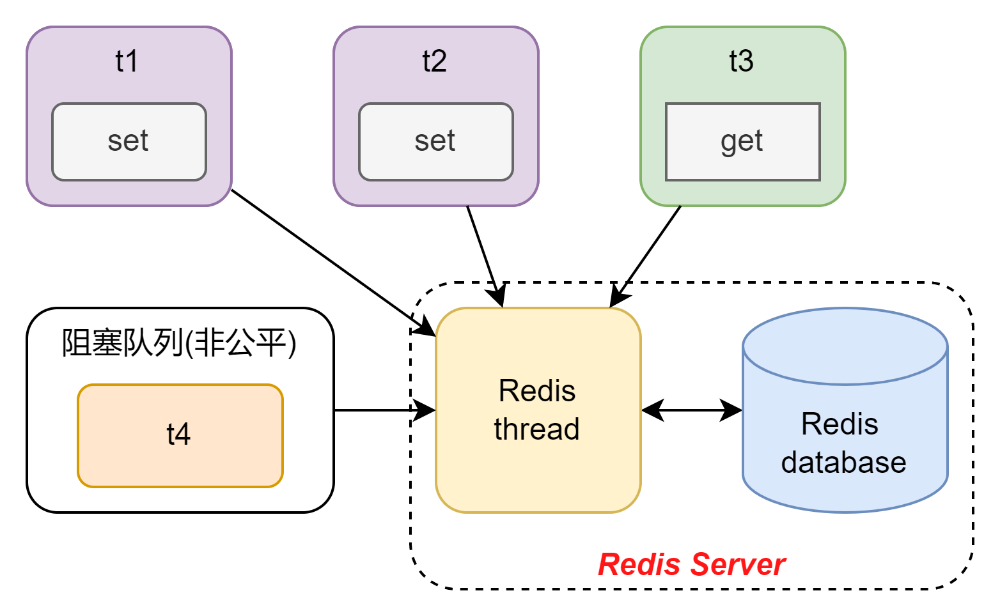
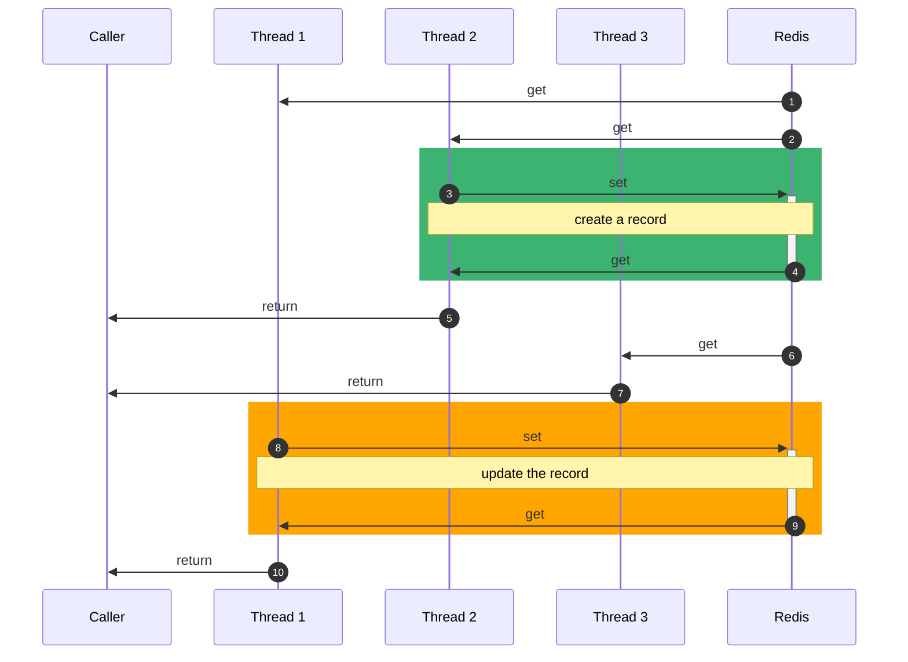

# Redis 2

这一章前半截会先完成一下任务，然后后半截会在自己探索一些用法。

## Task 2634

### String类型

#### 目标

使用get set插入一个不存在的数据，设置过期时间，并保证原子性。

#### 分析：

首先要使用set和get，那么就是最简单的Redis String的使用。为了了解问题，先随便开启4个线程看看是个什么情况。
id是从一个0~20的数组里抽取的整数

```groovy
def t1 = new Thread(() -> redisTemplate.opsForValue().set("id:" + id, "t1:" + id), "t1")
```

结果还是比较符合预期的，每一个线程都插入了一些键值对，并且没有哪一个线程明显插入较多的情况。可以说，通过多线程直接使用set插入就一个线程不安全的操作。
但是我们又听说过redis本身是单线程处理问题的，那为什么还会出现这样的问题呢？这里我个人觉得是这样的，redis虽然对单一命令是单线程处理，但是由于每个线程请求的时候，
无法保证谁获取CPU，因此本质上应该是java这里的问题。具体看下图



上图是我个人的分析结构，但是暂时我没有想到要怎么去测试这个想法的正确性。从我的角度看来，造成原子性问题的本质是java的多线程机制。由于redis服务器本身是单线程的。
所以我可以把服务器分成两个部分，数据库(物理内存)和处理器(redis线程实例)。这里当t1,t2,t3同时请求的时候，假设t3获得了CPU，剩下的t1和t2按照java的逻辑就会被阻塞住。
加入现在阻塞队列中已经有一个t4了，那么t1,t2,t4就会在下一轮一起去尝试获得CPU。也就是说虽然我希望先set再get，但是由于CPU指令重排序，CPU获取等问题。并不能保证原子性。
既单条redis操作都是原子性的，但是组合就不是了。

有了这样的理解后，就开始考虑解决方案了。既然需要线程安全，第一个想到的就是锁。而数据库交互保证原子性，第一个想到的则会是事务。结合一下就是锁住set方法，
并且通过事务的方式保证原子性。

这里由于没有具体使用场景，我就自己想了一个简单的使用场景。比如现在突然要创建一个订单，加入这个订单已经存在，就不用创建，直接返回。
而如果不存在，就先创建再返回。这里可能存在的问题就是多个线程同时尝试set，前面的修改就有可能被覆盖。比如下图的情况



非常清楚地看到，t1和t2最终返回的对象是不一样的。高并发下，虽然单一线程可以解决原子性的问题，但是无法解决线程安全问题。那么解决方案按照刚才的说法就是加锁或者尝试CAS方式。

#### 具体方案

其实我想到的第一种反而是不去用`set`t和`get`，而是直接使用`setnx`，这个是redis自己的API，直接就是CAS操作。那么直接用RedisTemplate的setIfAbsent来实现。
下面是这个的测试类。

```groovy
def "Multi-Thread setnx -- [#id]"() {
    given:
    def t1 = new Thread(() -> redisTemplate.opsForValue().setIfAbsent("id:" + id, "t1:" + id), "t1")
    def t2 = new Thread(() -> redisTemplate.opsForValue().setIfAbsent("id:" + id, "t2:" + id), "t2")
    def t3 = new Thread(() -> redisTemplate.opsForValue().setIfAbsent("id:" + id, "t3:" + id), "t3")
    def t4 = new Thread(() -> redisTemplate.opsForValue().setIfAbsent("id:" + id, "t4:" + id), "t4")

    when:
    t1.start()
    t2.start()
    t3.start()
    t4.start()

    then:
    println redisTemplate.opsForValue().get("id:" + id)

    where:
    id << ids
}
```

我现在Redis里面插入了一组数据，并且只用了一个库。然后在跑这个测试，最终一个都没有修改，和预期完全一致。然后我加入了过期时间，还是一样，没有任何问题。

以上是我的想法，但是我发现网上很多人都说用分布式锁的方式，也就是`setnx`设置锁，然后释放的方式。我查了官方的文档，官方比较推荐的是基于RedLock算法的一种锁机制。
简单来说，就是设置一个会自动释放的锁，只要保证所有操作能在锁释放前完成即可。也就是说，这里我尝试了一下这个思路，代码如下

```groovy
def "Multi-Thread setnx timeout lock -- [#id]"() {
    given:
    def t1 = new Thread(() -> {
        if (redisTemplate.opsForValue().setIfAbsent("setLock", "lock", Duration.ofSeconds(3))) {
            redisTemplate.opsForValue().set("id:" + id, "t1:" + id, Duration.ofSeconds(30))
            redisTemplate.opsForValue().getAndDelete("setLock")
        }
    }, "t1")

    def t2 = new Thread(() -> {
        if (redisTemplate.opsForValue().setIfAbsent("setLock", "lock", Duration.ofSeconds(3))) {
            redisTemplate.opsForValue().set("id:" + id, "t2:" + id, Duration.ofSeconds(30))
            redisTemplate.opsForValue().getAndDelete("setLock")
        }
    }, "t2")

    def t3 = new Thread(() -> {
        if (redisTemplate.opsForValue().setIfAbsent("setLock", "lock", Duration.ofSeconds(3))) {
            redisTemplate.opsForValue().set("id:" + id, "t3:" + id, Duration.ofSeconds(30))
            redisTemplate.opsForValue().getAndDelete("setLock")
        }
    }, "t3")

    when:
    t1.start()
    t2.start()
    t3.start()

    then:
    println redisTemplate.opsForValue().get("id:" + id)

    where:
    id << ids
}
```

感觉这个思路也挺不错，但是我觉得还是会有一个问题。如果说redis的锁突然中断了，那么其它所有人都再也没有办法获取锁了。所以每个锁都要加时间，但是加锁时间太短也会出现问题，
由于redis本质上不支持事务回滚，所以做到一半等于还是脏数据。锁过期时间过长的话，只要出现事务太久的情况，就会阻塞大量的请求。最重要的问题是这里我所有的锁用的key是一样的。
当我释放的时候就会出现可能t1把t2的锁释放了，导致t2自己还没释放，但是别的线程已经可以开始修改了。所以应对这样的情况需要加入一个唯一的key。这个倒是比较好实现的，
直接通过需要修改的key加上一个prefix即可，这样可以保证所有的线程在获取锁的时候，都会遵循一个规则，而且可以同时修改不同的键值对。

#### 总结

通过set和get设置没有的key和超时时间，并保证原子性一般有两种方式。

第一种就直接用setnx，底层原理还没有具体调查到。但是我个人觉得方便又好用

第二种就是通过锁的机制，参考java的多线程加锁方式。

还有一种方式就是通过lua脚本，但是这个目前还没有接触到，所以可能到后面我回来在讨论。

### Hash类型

#### 目标

使用 HASH 相关命令，给 HASH 设置过期时间，修改 HASH，查看过期时间的变化

#### 分析

其实感觉这个任务没啥好分析的，挺简单的。主要是Hash这个类型的过期时间是跟着key走的，不能单独设置一个field的过期时间。关于这一点redis的作者有单独说明，
因为这样可以保证redis的简单高效，如果需要给一个field设置超时时间的话，可以通过`key:field`来存，直接存成string就好了。以下是他的原话。

```text
Hi, it is not possible, either use a different top-level key for that specific field, 
or store along with the filed another field with an expire time, fetch both, 
and let the application understand if it is still valid or not based on current time.
```

这个的用法也比较简单，我就直接做了几个简单的测试，也没啥特别的，就过了。

### Set类型

使用 SET 相关命令

这个前面那张都测试过了，就不在重复讨论了。

### ZSET

使用 ZSET 实现一个用户下单量的排名表，需要的接口有某个用户下单量增加，获取排名前十的用户。

#### 分析

这个任务还是比较常见的，就是通过Zset的API直接做即可，按照官网的说法最慢也就是O(n)，还算可以接受。直接看下面的测试类吧。

```groovy
def "Zset top 10"() {
    given:
    for (x in 1..rounds) {
        if (!redisTemplate.opsForZSet().addIfAbsent("user", "user:" + user, 1)) {
            redisTemplate.opsForZSet().incrementScore("user", "user:" + user, diff)
        }
    }

    when:
    def users = redisTemplate.opsForZSet().reverseRangeWithScores("user", 0, 9)

    then:
    users.forEach(System.out::println)

    where:
    user << ids
    diff = new Random().nextInt(2, 10)
    rounds = new Random().nextInt(2, 7)
}
```

都是很基本的用法，思路就是把下单用户的分数提高，由于Zset内部是通过分数来排序的，并且默认是从小到大，那么就调用reverseRangeWithScores来直接获取，
效果有点类似SQL中的Limit。这个RedisTemplate底层也是调用的redis的zRevRangeWithScores。其它好像也没有什么特别的注意点了，后面如果发现了我在补充吧。

### key中包含{}会怎么样

这个问题和redis的集群系统有关，我想学到集群的时候在好好分析，这里我先大致说一下。官方的说法就是但是使用redis集群的时候，每一个集群会均分2^14个hash slots。
然后数据会通过hash算法直接放入对应的槽，类似于hash map。那么{}的作用就是限定类似的key一定会存在同一个集群里。比如key如果是`{user:}`那么无论后面是什么，
只要是前面包含了这个{}（官方叫Hash Tag），就会被分到同一个集群。并且每一个key只有一个{}会生效。