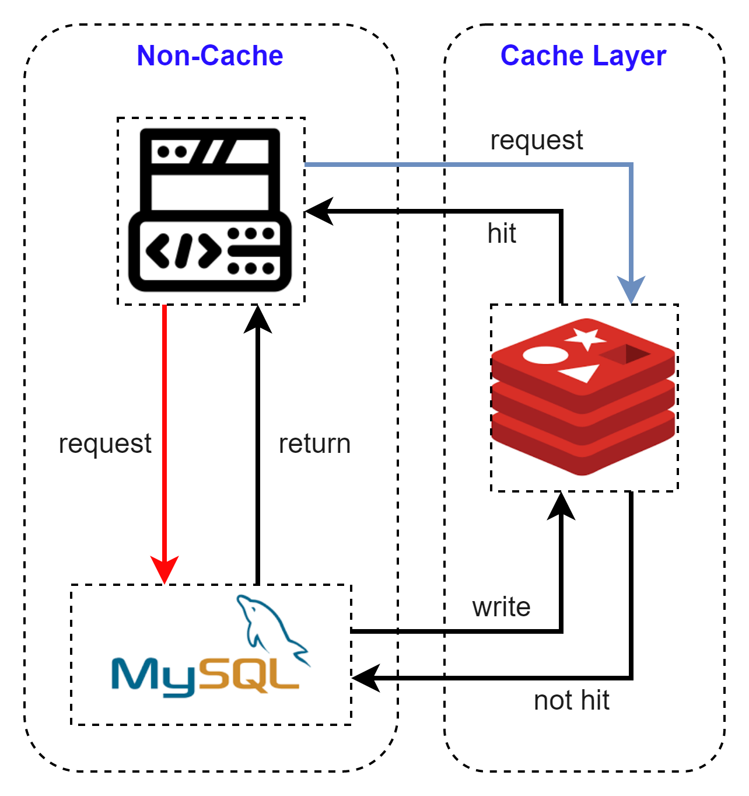
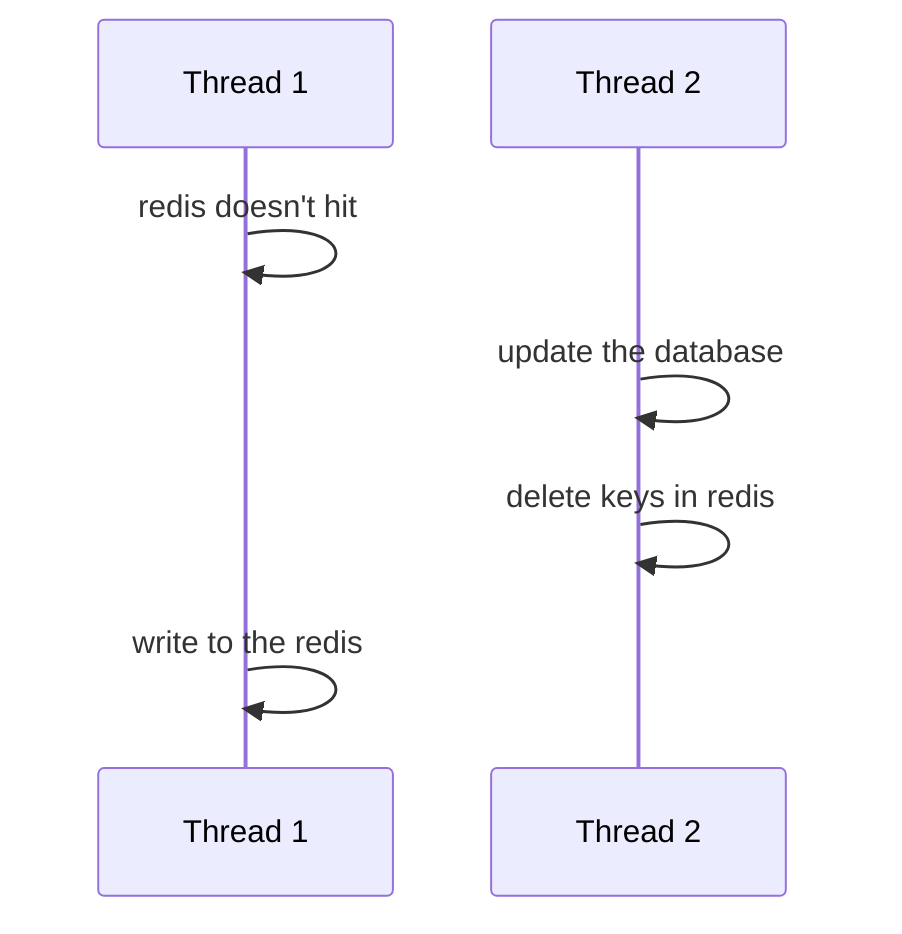
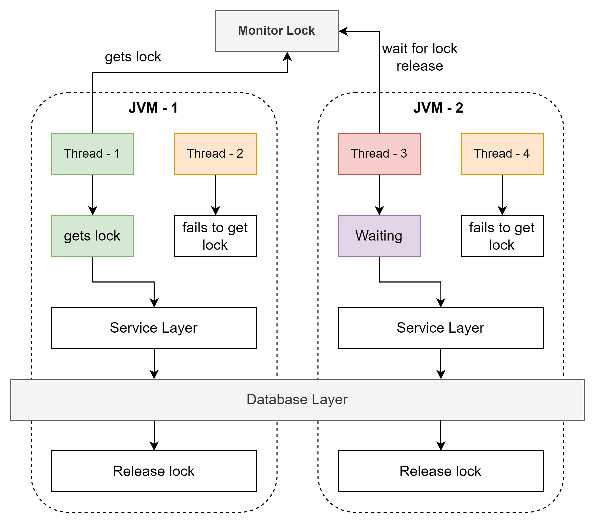
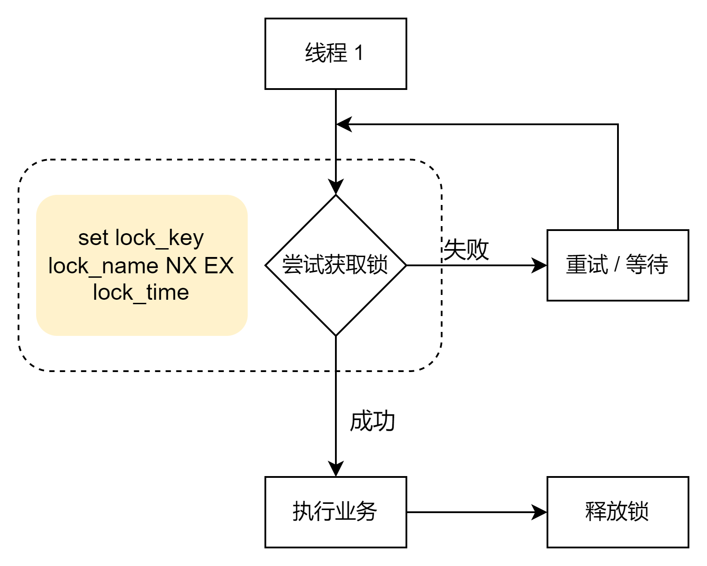
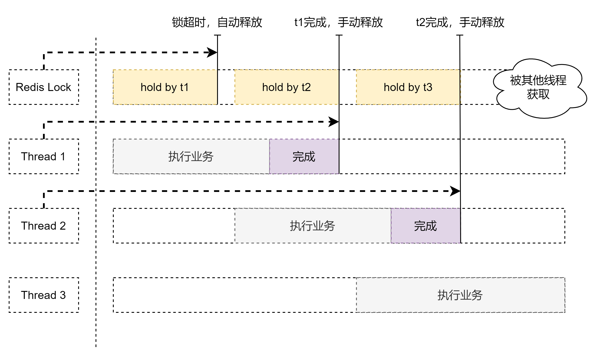
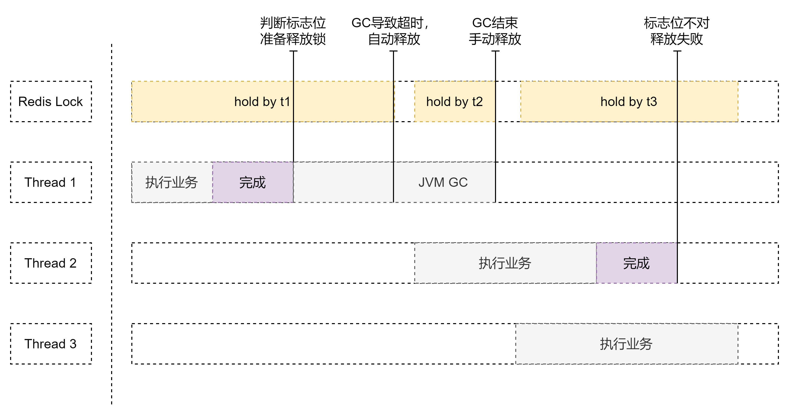

# Redis 3

这一章相对篇理论一些，能够验证的我都写了测试类。

## 缓存

都说redis是企业级缓存方案，所以这次就从缓存的角度入手来研究redis。那么缓存就是数据缓冲地带，其实就是暂时存储数据的地方，听上去很像是物理内存。不过这里一般指的是CPU内部的缓存空间。
由于它是直接在CPU中储存，所以它的读写性能一定是很高的。一般来说，缓存越大的CPU，处理效率越高，但是延迟相应地也会提高。

如果从客户端的角度出发，缓存指的又可以是网站缓存，比如session等。应用层一般是tomcat等服务器自带的缓存空间，不过仅靠这些服务器，性能完全不够用。所以就会用到像redis这样的专业级缓存框架。
服务器在往下走就到了数据库，而数据库其实也有缓存，比如索引等(
这里还有一个就是mySQL的话5.7应该是有缓存的，但是8.0好像就没有了)。数据库再往后就是磁盘了，一般来说磁盘被称为持久层，
但是它也是可以有缓存的，用的太少就不研究了。

## 常见缓存使用模型



简单的来说就是redis在原先客户端与数据库之间加了一层，这一层通过高性能的缓存来提高获取数据的速度，并且减少直接对数据库的访问。比如当用户请求一个高频的数据时，
如果每次都是直接请求数据库，数据库的压力很大，而且数据量大是就是很慢。但是如果先尝试请求redis，那么就会高效很多。当redis中没有时，在通过redis去请求数据库，
这样循环下去，最终就会慢慢地提高命中率。而且把数据写入redis可以做成异步的，也不会对redis本身造成很大的压力。

## 缓存更新策略

既然我可以把一些数据直接存在redis中，但是高并发下，如果出现了一个数据被反复修改，那么就一定需要一个策略来动态的更新缓存。不然用户得到的永远是脏数据。
一般来说会有两种策略，其实上一章里面也有提过，第一个就是超时淘汰策略。给每个key设定时间，到时间自动消失。还有就是主动更新，比如某个key经常发生变化，那么就每隔几秒更新一下。
那么下面我会对这两个策略都进行一下简单的分析。

### 内存淘汰

这个是Redis官方的一个淘汰策略，在一定程度上还真的是解决问题的。本质就是当内存不足的时候，直接自动淘汰一部分数据，当数据未命中的时候在重新写入，那么这个时候就保证了一致性了。
显然这个自动的策略是完全不可取的，就直接略了。

### 超时淘汰

给每一个key设定时间，当时间到了就自动删除，下次查询就会更新数据。个人感觉感觉适合命中率比较低，并且不太长更新的数据。比如评论系统，一些不太重要的小功能。

### 主动更新

在每一次修改数据库后就更新redis的内容，以保证redis和数据库满足一致性。那么目前比较主流的方式有三种

#### Cache Aside Pattern

也就是人为的写入代码，告诉redis怎么去更新，在更新数据库的时候主动更新redis。

#### Read/Write Through Pattern

把redis和数据库整合成一个服务，统一维护和管理。调用的时候直接就是使用接口方法，无需考虑任何其它的操作。

#### Write Behind Caching Pattern

调用的时候明确知道是通过缓存获取的。而所有其它的操作都通过异步来实现一致性。也就是caller只从redis里去数据，而一致性通过异步方法来达到，基本就是最终一致。

## 主动更新策略 实现

### 分析

我一开始以为这个方法不就是每次更新即可，但是后来想了一下这样太占用资源了，而且多线程还不一定安全。所以其实更新缓存是需要有策略的。
那么这个策略我看了很多人的开发经验最终得出了一个简单的结论，其实最好是删除缓存而不是更新。也就是当出现了数据库更新的时候，直接把对应的缓存给删除掉，
等到下次它被请求了，在重新写入缓存。这样做有两个好处，一个是大大节省了空间，没有用到的数据没有必要一直放在缓存里。第二个就是减少了CPU的压力，
因为不需要每次修改就重写。

但是如果使用以上的方法又会出现一个问题，假如数据库更新成功，但是缓存删除失败，那么在下一次数据库更新的时候才有可能会再次删除。这样会导致期间所有的数据都是脏数据。
也就是原子性问题。我想最简单的方法就是开启一个事务，但是如果是微服务的方式，可能就会出现没有办法直接放在一个事务中的情况。那么这个的解决方案我还真的是不太清楚。
等我把微服务搞明白了，再回来看这个思路。

最后就是多线程的线程安全问题了。在并发的时候，要考虑先后问题，到底是先更新还是先删除。其实我觉得本质上就是一个博弈问题，到底是采取乐观方式还是悲观方式。
这个就具体问题具体分析即可。不够个人觉得先操作数据库比较好，因为其实数据库的操作时间肯定比缓存久，所以如果按照时序来看下面的情况发生的概率还是比较低的。



## 经典缓存问题

### 缓存穿透

就是请求的数据在数据库和缓存中都不存在，那么这些请求由于不在redis内部，所以会直接打到数据库，导致数据库压力巨大。

解决思路也比较制式化，一个是缓存空对象，一个是布隆过滤。

缓存空对象很好理解，就是把请求不到的对象直接存成null，放入redis里面，那么下次就会直接返回null。

布隆过滤，也是比较常用的思路，就在客户端和redis中间再加入一层。布隆过滤器会直接判断数据是否存在，基本实现基于hash算法，有点像hash table的感觉。
不过我们没有办法100%相信布隆过滤器，它会有误判的可能性，这个应该是由于哈希碰撞。

### 缓存雪崩

就是表面意思，大量的redis数据失效，导致大量的请求打到数据库上，最终导致了数据库压力特别大。

解决思路也比较制式化，一般就是通过集群的方式提高可用性，或者使用多级缓存。

### 缓存击穿

某个命中率很高的key或者缓存重建比较复杂的key突然失效了。

这个的解决方案可以参考线程安全的解决方案，使用互斥锁。但是就像synchronized一样，互斥锁相对于无锁来说，有点太过重量级，而且可能会出现死锁的问题。并且可能造成大量线程阻塞等待。
因此一般会考虑使用逻辑过期的方式。也就是给每个热点key都假如一个逻辑过期时间，当这个时间过了，那么就开启一个新的线程来获取新的value，但是老的线程依旧直接返回旧值。
虽然这样可能会造成一段时间的数据不一致，但是对于分布式系统来说，速度还是更重要一些。

## 分布式锁

我觉得这个部分可以先看下面这张图



简单的来说就是，如果启用两个相同的服务，也就是两个完全相同的app跑在不同的JVM上。当客户抢购一个东西的时候，假如业务层逻辑里面虽然加了锁，但是仍然可能出现由于JVM不同导致的锁失效。
这里所谓的琐失效并不是说锁没有用了，而是由于不同的JVM会使用不同的监视器来管理锁，最终的结果就是虽然看上去业务逻辑中对客户加锁，但是由于JVM不同所以还是会出现两个相同的用户同时下单的可能性。
并且这种问题在并发+微服务中很常见。那么这个时候就需要一种机制来保证两台JVM可以分享它们的监视器。

其实从JVM的角度入手，目前我还没学到有什么办法可以让两个不同的JVM共享信息。所以这个思路直接否决。那么能够解决问题的方式只能是外部，但是对于抢购这类高并发的操作又要保证高可用和高性能。
所以其实解决方案就呼之欲出了，基本就是redis。因为redis首先和JVM没有任何关系，并且性能优秀，而且本身是单线程，不需要考虑线程安全问题。而且由于可是设置锁的时间，
所以也能很好解决死锁问题。

### 简单的分布式锁原理

根据前面分析的内容下面来实现一个基于Redis的简单分布式锁。先来看这个锁的流程图



观察上面的这个流程，当一个线程通过set来尝试获取锁的时候，要考虑服务中断或者各种可能的突发状况。如果利用setnx先设定一个key在通过expire来设置超时时间，
那么最终的结果就是在设置时间前如果断连，还是会出现死锁的问题。因此必须保证整体的原子性，但是redis不支持事务回滚，所以比较好的办法就是直接用一条指令来操作。
那么图上也给出这个redis指令`set [lock_key] [lock_value] nx ex [lock_time]`

#### 具体实现

```java
@Override
public boolean tryLock(long timeoutSec) {
    return Boolean.TRUE.equals(stringRedisTemplate.opsForValue().setIfAbsent(KEY_PREFIX + name, Thread.currentThread().getName(), timeoutSec, TimeUnit.SECONDS));
}

@Override
public void unlock() {
    stringRedisTemplate.delete(KEY_PREFIX + name);
}
```

我这里的实现方法比较简单，就是定义了一个lock接口，然后规定两个方法，tryLock和unlock。然后直接就用RedisTemplate来调用setnx＋ex就完事了。

### 锁误删原理



使用上面的方法加锁还是会锁误删问题，这个在上一章中也提到过了。主要就是由于不合理地释放锁导致的。先来看上面的图，当线程1获得锁后，由于业务执行时间过长，导致锁自动被释放掉了。
假设线程2得到了锁，在业务执行的途中，线程1完成了工作，在之前的逻辑中，线程1此时会手动释放锁。那么实际上线程2也失去了对锁的控制。这是假如线程3获得了锁，那么在它的工作完成前如果线程2也手动释放了，
就会出现后面又有新的线程获得锁。最终就是全部乱掉，而且线程不安全。

它的解决方案真的很简单，只需加一个标志位来判定这把锁是谁的即可，因为从逻辑的角度，线程1既然超时了，那么它的锁被自动取消，它就不应该可以释放别人的锁。(怎么有种鱼死网破的感觉)
所以只需在之前释放锁的逻辑中假如一个验证当前锁的判断即可。

```java
public static final String ID_PREFIX = UUID.randomUUID() + "-";

@Override
public boolean tryLock(long timeoutSec) {
    return Boolean.TRUE.equals(stringRedisTemplate.opsForValue().setIfAbsent(KEY_PREFIX + name,ID_PREFIX + Thread.currentThread().getName(),timeoutSec, TimeUnit.SECONDS));
}

@Override
public void unlock() {
    String threadId = ID_PREFIX + Thread.currentThread().getName();
    String id = stringRedisTemplate.opsForValue().get(KEY_PREFIX + name);

    if (threadId.equals(id)) {
        stringRedisTemplate.delete(KEY_PREFIX + name);
    }
}
```

这里还是借助了一下java自己的UUID来创建一个唯一的前缀，这样保证标志位不会出现重复。其它就是简单的对比，通过存入的value和当前的值进行比对来确认线程的权限。

### 原子性问题



刚才的办法虽然可以解决锁误删的问题，但是依旧不能保证原子性。如上图的操作，如果线程1在验证完标志位后，释放锁之前。JVM突然准备开始GC，触发了STW。
那么所有的线程都会自动的阻塞等待，而此时由于redis并不受JVM控制，锁超时了就自动释放了锁。那么等到线程2获得锁后，由于线程1已经验证过锁标志位了，所以直接释放，
导致它还是把线程2的锁释放了。因此想要解决这个问题，必须通过一些原子性的手段，但是可惜的是redis事务并不能保证原子性。所以就出现了非常重要的lua特性。

#### 简单的Lua脚本

首先在调用lua脚本的时候，redis常用命令提供了一个叫做EVAL的直接运行lua脚本。先来玩一下这个操作，我就直接用了下面的代码，应该是比较简单的

```shell
EVAL "return redis.call('set','name','jon')" 0
```

直接运行成功了，这个还是比较简单的。但是我还是想稍微说一下它的用法，对于直接通过cli的形式写lua脚本，后面的参数配置很重要。一般需要遵循如下规律。

```shell
EVAL "return redis.call('set', KEYS[1], ARGV[1])" 1 name Jon
```

上面的这行代码意思是，这个脚本一共会有一个KEY参数，剩下的都是ARG参数。并且由于lua数字从1开始，所以取的时候需要使用index = 1作为第一个。而KEYS和ARGV则是lua自己规定好的参数数组，类似java中的`args[]`。

#### java中使用

这次来学习如何在Java中调用lua脚本，首先我写了一个特别简单的lua脚本。

```lua
if redis.call('get', KEYS[1]) == ARGV[1] then
    return redis.call('del', KEYS[1])
end
return 0
```

就用来直接判断标志位，并且直接返回成功与否的。然后观察RedisTemplate中的这段代码

```java
@Nullable
<T> T execute(RedisScript<T> script, List<K> keys, Object... args);
```

很明显这个execute方法就是EVAL的变形。而且它的参数也已经设计好了，都不需要怎么改造。直接调用，代码如下

```java
@Override
public void unlock() {
    stringRedisTemplate.execute(UNLOCK_SCRIPT, Collections.singletonList(KEY_PREFIX + name),
            ID_PREFIX + Thread.currentThread().getName());
}
```

## 总结

这次主要是看了缓存的相关概念，包括策略等。利用redis的`setnx`简单尝试了解决多线程原子性等问题。但是这种分布式锁其实还存在一些别的问题，这些问题会在下一章中详细讨论，并且使用解决方案。