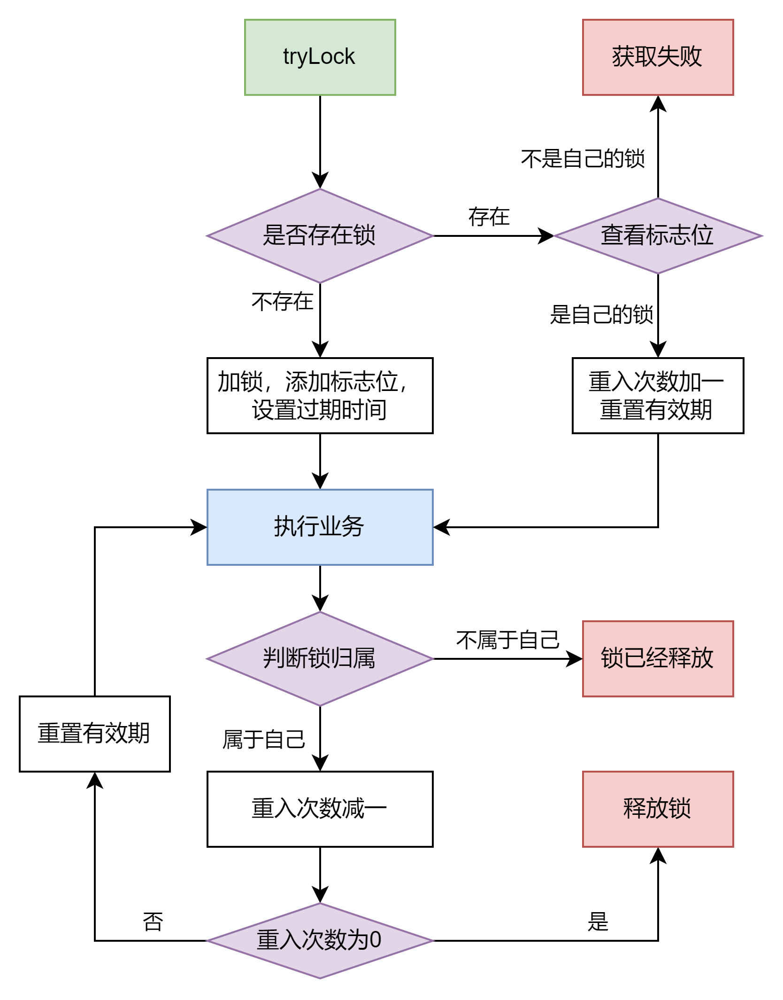
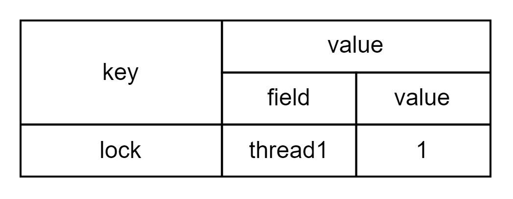
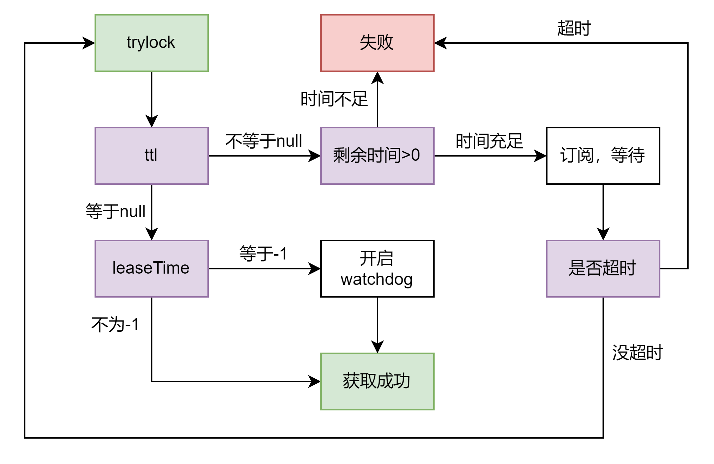
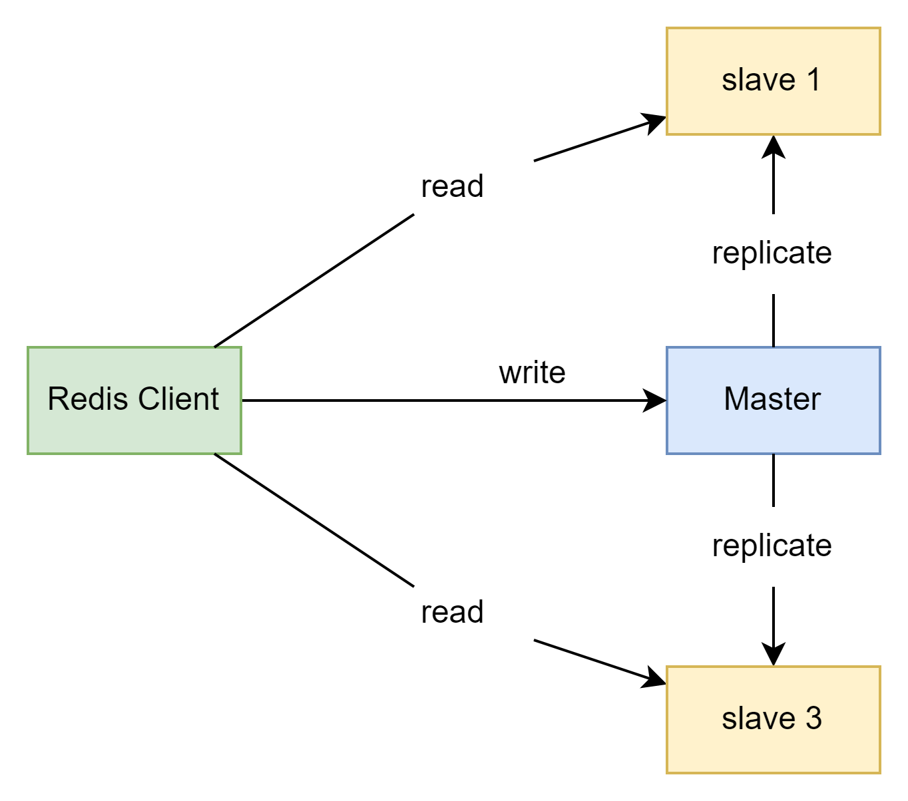
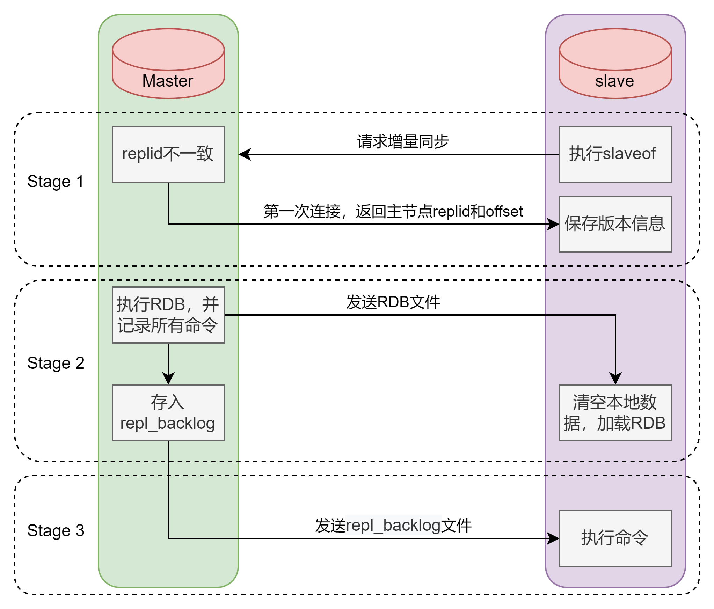
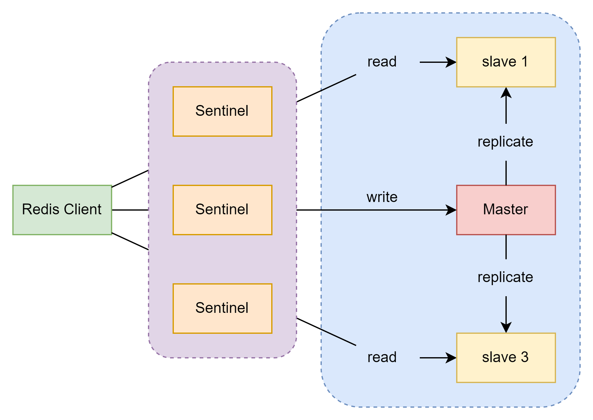
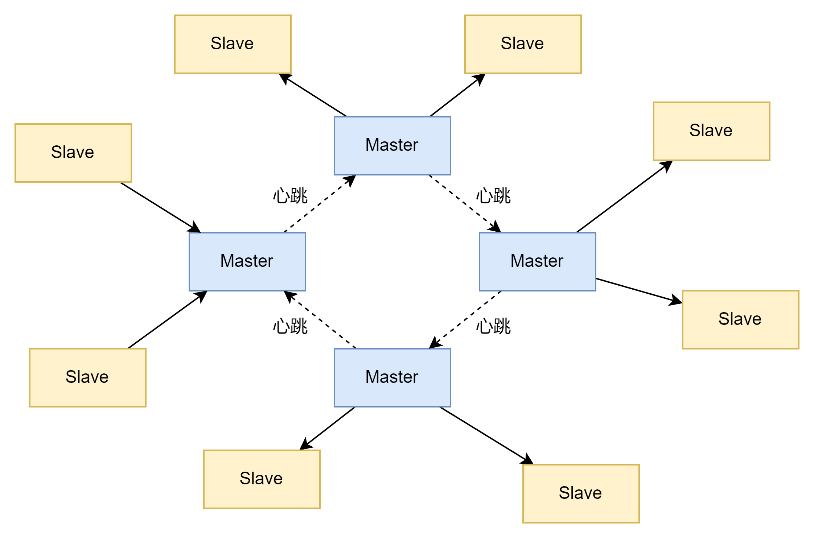

# Redis 4

## 分布式锁问题

关于上一章中出现的分布式锁问题，redis给出了一些解决方案。但是其实整体上依旧存在一些问题，这一章会逐一分析并且尝试使用redis自带的解决方案。

第一个问题就是不可重入，这个有点类似Synchronized的缺点，虽然一个线程可以获得锁，但是它没有办法重新获得锁。这也导致了多线程下容易出现业务失败。

第二个问题是不方便自旋，因为如果一个线程获取锁失败，目前的机制是直接返回false。其实这样也会给业务带来压力，因为大量的请求会直接被拒掉。

下一个问题是超时释放，很多时候一些业务可能存在嵌套别的业务，那么阻塞是必然的，这样也就容易到超时释放的问题。其实和上一个问题一样，导致大量请求失败。

最后一个问题是主从一致性，这个部分的话因为还没有看到主从集群的部分，暂时可能不讨论，等后面会分析的。

## Redisson

简单来说就是基于Redis的功能增强，之前使用redis分布锁的限制，在redisson中得到了解决，它原生支持基本java中所有的锁类型。而且它内部还集成了java的对象和集合，
等于简化了java和缓存方案的开发方式。

### 快速入门

就是加个依赖，没啥好说的，直接看一下配置方式。redisson支持的配置方式主要有两种，一个是spring的configuration类，还有就是yaml文件。

```java
@Configuration
public class RedisConfig {
    @Bean
    public RedissonClient redissonClient() {
        Config config = new Config();
        config.useSingleServer().setAddress("redis://127.0.0.1:6379");
        return Redisson.create(config);
    }
}
```

配置类就是很典型的spring配置类，通过@Bean定义一个工厂类，然后由spring自动管理，这里用的是最简单的配置，其它配置具体用到在讨论。
yaml的配置方式在官方的wiki上面已经给的很全了，就不展示了。

下面来看一个简单的测试类

```groovy
@SpringBootTest
class RedissonTest extends Specification {
    @Resource
    private RedissonClient redissonClient

    def "quick start"() {
        given:
        RLock lock = redissonClient.getLock("nyLock")

        when:
        boolean isLock = lock.tryLock(1, 10, TimeUnit.SECONDS)

        then:
        if (isLock) {
            try {
                println "succeed"
            } finally {
                lock.unlock()
            }
        } else
            println "fail"
    }
}
```

这里用的redissonClient就是刚才配好的客户端，然后通过接口提供的getLock直接获取一个可重入锁。并且在上锁时，直接规定重试时间和锁超时时间。然后就是可重入锁的基本用法了，
try-finally来保证一定会释放锁。那么这里的代码可以说比之前利用redis的`setnx`要简单的多，而且因为封装的很好，所以功能也要更全面一些，比如可以选时间单位等。

### 可重入锁原理

这个原理和java中的可重入锁的原理是完全一致的，这里针对redis的数据类型重构了一下之前的图



基本思路很简单就是通过一个状态位和计数器来判断锁的归属和重入次数。原先在java中，这个是用过线程名字和封装好的计数器来实现的，但是redis里面我们没有办法直接封装一个类，
所以就需要特别的数据结构来完成，很明显就是hash类型。基本结构如下



也就是存的时候，把对应业务的锁名字当作key，然后当前的线程当作field，而重入次数直接作为value。

下面通过源码来验证一下这个原理的准确性

```java
<T> RFuture<T> tryLockInnerAsync(long waitTime, long leaseTime, TimeUnit unit, long threadId, RedisStrictCommand<T> command) {
    return evalWriteAsync(getRawName(), LongCodec.INSTANCE, command,
            "if (redis.call('exists', KEYS[1]) == 0) then " +
                    "redis.call('hincrby', KEYS[1], ARGV[2], 1); " +
                    "redis.call('pexpire', KEYS[1], ARGV[1]); " +
                    "return nil; " +
                    "end; " +
                    "if (redis.call('hexists', KEYS[1], ARGV[2]) == 1) then " +
                    "redis.call('hincrby', KEYS[1], ARGV[2], 1); " +
                    "redis.call('pexpire', KEYS[1], ARGV[1]); " +
                    "return nil; " +
                    "end; " +
                    "return redis.call('pttl', KEYS[1]);",
            Collections.singletonList(getRawName()), unit.toMillis(leaseTime), getLockName(threadId));
}
```

这一段是使用单例模式的时候，tryLock方法最终调用的方法，其实我觉得这个有点傻傻的，不是很优雅。但是确实还是挺清晰的。源码就是直接把一个lua脚本通过字符串的形式写出来了。
那么这一段的内容和我之前写的原理是完全一样的。就是先判断状态位，然后看重入次数。

### 锁重试原理

下面这张图也是根据源码的顺序来写的重试流程图。



先从tryLock开始看，首先调用tryLock，然后程序就会开始判断ttl的值，这里的ttl指的就是锁过期的时间，如果成功获取锁，那么就会返回null，如果需要竞争则返回过期时间。
那么当`ttl==null`的时候，再去判断锁的过期时间，如果过期时间是-1的话，那么就需要开启看门狗。看门狗其实就是一个递归方法，会保证重入的锁一致更新超时时间，默认是30s。
那么当`ttl!=null`的时候，就需要去看这个线程的竞争时间了，如果竞争时间小于0那么肯定就是失败。如果大于0，那么就调用订阅方法。订阅方法其实就是对释放锁这个行为的监听，
它会判断是否超时，如果没有就直接反复调用tryLock，超时了就直接取消订阅然后获取失败。当然释放锁的时候，也需要保证释放取消订阅等。

## MultiLock原理

了解多锁机制前，我想先看一下redis的主从一致性问题。这里采用的是网上的说法，为了保证一致性，可以通过同时开启多个redis服务器并且使用连锁的方式合在一起，
我本来想试一下，但是内存不够了。。。。我后来在自己电脑上试了一下，应该是没有问题的。

思路就是开启三个redis服务，每一个都是单例/单机模式。然后在spring中配置三个Client的工厂类。在业务层自动装配三个redis客户端，然后直接随意取其中一个，
调用getMultiLock，并把三个lock全部扔进去。这个的原理就是如果三个客户端中的lock都一致，那么线程才能获取锁，只要不一致，就无法获取。
而且也不会出现主从不一致的情况，因为压根就没有从库。当然对于这里使用的三个库，我还是可以给他们在加从库。

这个方式虽然可以直接觉得主从不一致问题，但是它的劣势也非常明显。一旦其中一个库挂了，那么全部都会挂掉，因为任何线程无法同时获取三个lock，所以这样就会出现死锁，或者永远无法获取锁的情况。

## 分布式缓存

### Redis持久化

#### Redis Database Backup File Redis数据备份文件

之前接触redis的时候就说过，redis会自动地把数据做持久话处理，也就是从内存写入磁盘。当redis挂了，可以从磁盘中恢复数据。

简单的使用就是通过调用save指令，redis的主进程会执行RDB，阻塞其它所有命令。(因为redis是单线程的)，所以这种方式显然不是最好的思路。如果需要写入的对象很多，
那么就全部阻塞住了，拉低效率。

官方还提供了一个`bgsave`的方式，利用子进程来执行RDB，不会干扰到主进程。并且在redis.config中会默认规定了一些更新策略，但是每个版本都不一样，所以最好还是自己设置一下。
一般就是比较保守，比如3600秒内有一个key发生变化在写入等。

它的底层原理是用过类似forkJoin的方式，对需要持久化的数据做一个快照，然后通过快照的映射关系来保证最终的一致性，但是具体逻辑比较复杂，而且官网没有给出一个比较好的图形解释，
所以这里我也没有研究的很清楚。

#### AOF Append Only File 追加文件

这种方式的思路就是通过不断追加已经出现的操作，来还原整个数据。有点类似于MySQL自带的log，等于就是通过重新跑一遍之前所有的命令，最终到达最后一次记录的点。
这个是默认关闭的，所以需要在config内部修改`appendonly yes`。当然它的写入频率也可以通过配置文件来规定。一般来说，最保守的方式就是每执行一次命令就写入一次，
不过很显然它会非常吃CPU，因为会出现大量的IO操作。为了解决这个问题，可以通过每秒写入的方式，并且开启一个缓冲区，先把所有的内容写入缓冲区，然后每秒从缓冲区写入磁盘。
最后一种思路就是干脆我就不写了，全部交给操作系统去管理，它按照它的步骤来写入，但是这个的可靠性非常差，因为基本上两次写入的间隔很长。

### Redis 主从集群

#### 从头搭建

之前所有使用的Redis，全部都是所谓的单机模式，在这个模式下redis的多线程并发能力是很差的，因为大量的命令被阻塞，而且由于各种锁的问题，还可能会导致大量的多线程安全问题。
可用性也不好。所以Redis自己为了解决这个问题就推出了主从模式。

先来看redis主从集群的大致框架



这个结构本身非常好理解，就是在同一个系统中同时开启三个redis实例，然后其中一个只用来写，另外两个只用来读。因为两个从库只会读，所以新写入的数据需要被同步到从库，
就需要有一个机制来从主库写入从库。这次真的是从头搭建，具体搭建过程感觉也挺有意思的，有非常多的坑，但是和主题没啥关系我就分享了。重点就是干了两个小时，突然断网，心态大崩。

搭建的方式就是通过在一个虚拟机中分别开启三个文件夹，然后使用三个不同的conf文件来启动redis。然后在启动后使用`slaveof`来连接主从。当然5.0以后也可以用`replicaof`，效果是一样的。
成功连上后，使用info replication在主redis里检查。

#### 数据同步原理

##### 全量同步

当主从第一次建立连接的时候，会进行一次全量同步，所谓的全量同步就是把所有数据都发给从库。那么在这个之前会先进行一次数据版本信息的同步。这里直接来看我截取的同步日志。

```shell
25069:S 08 Nov 2022 15:48:16.272 * Connecting to MASTER 0.0.0.0:7001
25069:S 08 Nov 2022 15:48:16.272 * MASTER <-> REPLICA sync started
25069:S 08 Nov 2022 15:48:16.272 * REPLICAOF 0.0.0.0:7001 enabled (user request from 'id=3 addr=127.0.0.1:50826 laddr=127.0.0.1:7002 fd=8 name= age=18 idle=0 flags=N db=0 sub=0 psub=0 multi=-1 qbuf=40 qbuf-free=40914 argv-mem=18 obl=0 oll=0 omem=0 tot-mem=61482 events=r cmd=slaveof user=default redir=-1')
25069:S 08 Nov 2022 15:48:16.273 * Non blocking connect for SYNC fired the event.
25069:S 08 Nov 2022 15:48:16.274 * Master replied to PING, replication can continue...
25069:S 08 Nov 2022 15:48:16.274 * Trying a partial resynchronization (request 36699421dc29134331ee133b1ce419f5f01658d7:1).
25069:S 08 Nov 2022 15:48:16.276 * Full resync from master: da90ee5bf1354f7e6b0b9e3a3ecc07f8b8fa8d21:0
25069:S 08 Nov 2022 15:48:16.276 * Discarding previously cached master state.
25069:S 08 Nov 2022 15:48:16.302 * MASTER <-> REPLICA sync: receiving 175 bytes from master to disk
25069:S 08 Nov 2022 15:48:16.302 * MASTER <-> REPLICA sync: Flushing old data
25069:S 08 Nov 2022 15:48:16.302 * MASTER <-> REPLICA sync: Loading DB in memory
25069:S 08 Nov 2022 15:48:16.307 * Loading RDB produced by version 6.2.7
25069:S 08 Nov 2022 15:48:16.307 * RDB age 0 seconds
25069:S 08 Nov 2022 15:48:16.307 * RDB memory usage when created 1.83 Mb
25069:S 08 Nov 2022 15:48:16.307 # Done loading RDB, keys loaded: 0, keys expired: 0.
25069:S 08 Nov 2022 15:48:16.307 * MASTER <-> REPLICA sync: Finished with success
```

还是比较明显的，第一次同步的时候，由于我的主库里什么都没有，所以并没有什么需要同步的数据，但是可以看到它是先把master的版本信息获取到，然后又master执行`bgsave`命令。
在把生成的RDB文件传给从库。于此同时master会把在同步期间收到的所有命令都放在`repl_baklog`内部，那么通过这个保存同步期间的信息。然后从库会清空自己的所有老数据，并且开始加载RDB文件。
然后master会直接把`repl_baklog`发给从库，让从库自己在执行一遍，这样就可以获取于主库完全相同的内容了。

从库和主库会利用一个Replication Id的标记来记录它们之间的关系，一般来说从库会继承主库的id，如果是第一次建立连接，那么id是不相同的，就会出现需要进行全量同步。
后面再通过offset来记录上一次同步后的改动。一般地，如果offset的值越大，就说明slave和master的区别就越大。

具体的流程可以参考下图



##### 增量同步

其实就是前面图上第三阶段的部分，但是这次的诱因不是简单的同步数据，而是由于从库重启或者异常。那么简单的来说就是通过offset找到在从库没有同步期间的所有命令，
然后发给从库执行一遍。但是这里是会出现问题的，因为repl_backlog的数据写入方式是环状的。这个部分我没找到一个很好的方式去测试，但是大部分的人都这么说。
我尝试找官方的说法，但是没有找到直接描述的文档。大致意思就是由于repl_backlog是大小是固定的，当写完整个文件后，它会自动开始从这个文件的头部继续写，那么就会形成一个环状结构。
如果offset过大，就会出现前面都已经被替代了，而从库还没有开始同步。这时就会自动触发全量同步，大大降低速度。

#### 主从链

当很多台从库同时连接一个主库的时候，就会出现主库压力过大，大量的时间花在RDB。那么就发展出了主从从的一种链式结构。也就是在slave上在加slave，这样就可以大大减轻压力。
不过同时又会出现更新速度较慢的情况。

### Redis 哨兵模式

哨兵模式的主要作用就是实现主从集群的自动故障恢复，当然也可以一定程度上降低缓存击穿和雪崩的情况。先来看它的一个基本结构把



我的理解就是哨兵其实就是在客户端和数据库之间又加了一层。它会监控所有的主从库，然后给客户端发通知，并且修改主从库。那么它的监控方式也比较特别，有点少数服从多数的感觉。

哨兵对于一个库的监控叫做心跳机制。每一秒，每个哨兵都会给某个实例发送ping。只要出现了ping没有返回的情况，这个哨兵就会主观的认为该实例已经下线了。
这个过程被叫做主管下线。当一定数量的哨兵都认为某个实例已经挂掉的时候，那么哨兵之间会形成共识，该实例就处于客观下线了。那么这个阈值是可以自由调整的，一般来说超过半数即可。

既然哨兵们已经把地主(master)给干下去了，那么下一件事情就是选新的地主。当然这个也是有流程的，首先会利用一个down-after-milliseconds的参数来判断该节点和之前地主的关系。
离开地主太久的节点就直接失去竞争机会。剩下的节点就需要对比出身了，如果这个节点的slave-priority的值相对比较低的话那么它优先级就高，但是要注意如果是0则主动放弃参选权利。
如果出身一样，那么就需要对比offset的值，其实这里和前面很像，都是看你和地主的关系谁比较好，也就是offset越大越好。如果前面的都一样，其实这个时候选谁已经没啥区别了，
那么redis会自动的选择id小的那个，我估计是因为id小的可能创建时间比较早。

那么当新的地主选出来，哨兵会给新的master发送过一个信号，要求其执行`slaveof no one`，同时哨兵会给其它的节点发送`slave of [new master ip] [port]`，强迫其它节点称为新的slave。
最有意思的是，当老地主重启完成，回归大家庭的时候，哨兵会把当作一个新的slave在加入集群。

### 分片式集群 

redis的分片式集群一般用于解决高并发情况下海量数据存储的问题。虽然前面的主从哨兵模式可以很完美地解决高可用和并发，但是需要储存大量数据的时候，哨兵就会开始显得有些累赘。
而且主库之前不能直接进行通信也大大降低了效率。因此分片式集群就提供了一种解决方案，它的主要模型如下。



redis会把不同的master直接连接到一起，就像之前的哨兵一样，它们之间会用ping的方式来互相监控，这个被称为心跳检测。而每一个主库又可以有多个从库来保证高可用。
如果每一个主库都可以承接一部分的数据，那么整体可承载的数据量就变得很大。而且由于所有的节点都是连着的，所以访问的时候也无需规定必须访问哪一个主节点，只需随便一个。

#### 散列插槽

记得我之前讨论redis的key中包含`{}`作用的时候提到过，它是用来保证redis的数据存储位置的。那么这里就针对这个部分再次进行一个分析。所谓的散列插槽其实就是Redis给每个库分配的数据量。
简单的来理解就是，Redis一共有16383(2^14-1)个位置，每一个主库会平均的获得一部分的位置用来储存数据。比如现在有三个主库，那么每个人分到的就是5461个槽。

在redis中数据key不和节点绑定，而是和插槽绑定。那么redis会根据key的有效部分来计算插槽的值，最终判定某一个key应该存放位置。举个例子，比如有一个key叫`{1}`，
我是在6000这个端口存的，但是假如计算的插槽值规定这个key需要被存在到6001端口所在的库。那么即便我用redis-cli在6000端口操作，最终数据还是放在6001这个库中的。

所以这里解释了我之前说过的大括号问题，当出现了大括号并且里面的内容不为空的时候，那么括号内部就是有效部分，反之其它情况就是整个key是有效部分。
所以根据这个规则，我们在命名key的时候，应该保证每一个key中都带有具体的{}括起来的值，并且统一规范，比如电子产品一类，食品一类等。

#### 集群伸缩

这个比较好理解，就是可以随意地扩充或减少节点数量。直接利用add-node等命令即可，没啥特别的。
