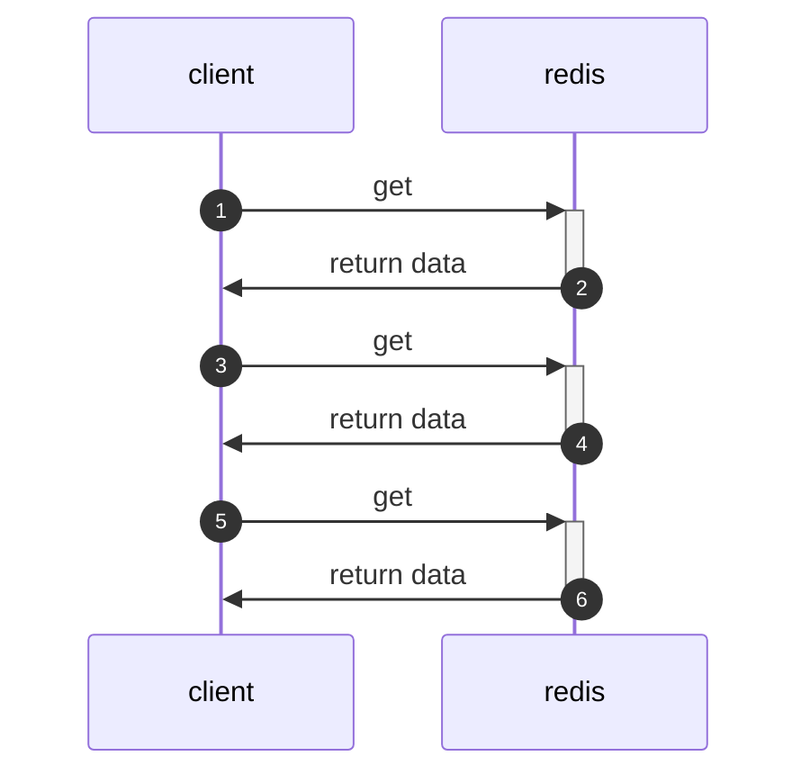
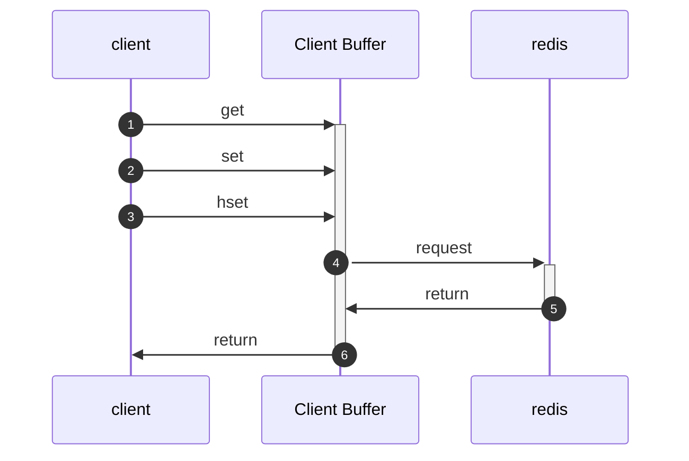
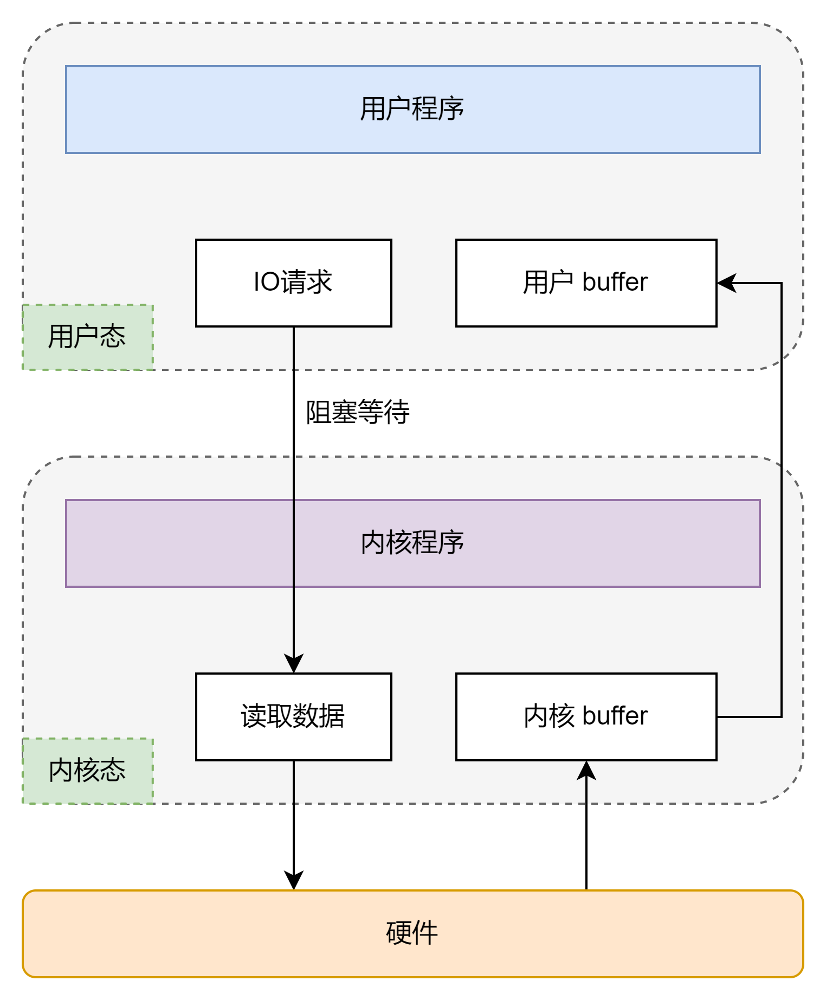
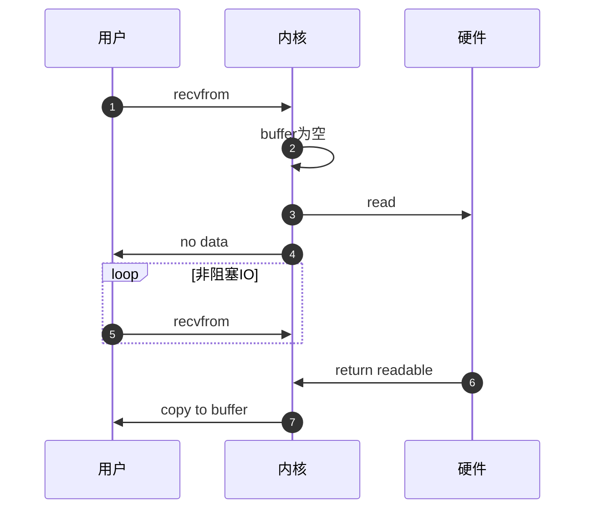

# Redis 5

## Pipeline

我个人的理解就是之前一直在做的批量提交事务，就和mysql的commit一样，当大量的请求都要单次完成的时候，很多的时间都浪费在IO上了。所以把大部分的指令整合一并完成是比较合理的。
但是同样的如果指令过多，则会出现各种各样的小问题。所以平衡好整个的过程是非常重要的。

### 原生支持的命令

其实redis自己原生支持的批量处理命令不是很多，主要就是`mset`之类的。这里提到也是想讨论一下它所谓的原子性，因为pipeline本身是非原子性的，而mget等操作是原子性的。
这个可能会是我比较关注的点，因为如果是非原子性的命令，那么在任何请求期间出现了服务挂掉等就需要保证整体的数据安全性。

### 时序图



上图显示的是使用最简单的get和set请求，可以看到三次操作分成了三次进行，也是需要三次IO。如果我们来看下面的图



假如我们开启pipeline，那么就相当于很多命令同时放入一个buffer里，然后等一定时间到了，或者buffer中存在一定数量的命令后，在一并发给redis去处理。
很明显这样只需要一次IO，而且所有的请求都可以做成异步的，因为在请求期间，client依旧可以给client buffer去发送请求。虽然看上去这样会有一些阻塞的情况，
但是合理利用效率肯定比一直请求快。

### lettuce

说实话这个部分真的花了挺久的，因为jedis的pipeline其实相对简单，就是调API。但是lettuce的设计就复杂一些了，这个部分我结合了源码和网上的文章，也做了一些验证。
但是我还是不敢保证我下面所有的想法都是对的。

#### 简单使用 lettuce

这个lettuce的官方已经给出了非常完全的思路，我就不赘述了。直接上代码

```java
RedisClient redisClient = RedisClient.create("redis://password@localhost:6379/0");
StatefulRedisConnection<String, String> connection = redisClient.connect();
RedisCommands<String, String> syncCommands = connection.sync();

syncCommands.set("key", "Hello, Redis!");

connection.close();
redisClient.shutdown();
```

基本上就是连接到redis客户端，获取一个lettuce连接，然后直接使用即可。官方使用的是一个同步的方案，我就按照官方的思路来看吧。首先spring-data-redis整合的redis底层直接使用的lettuce客户端。
当使用connect进行连接的时候，其实是创建了一个线程安全的连接。这个在StatefulRedisConnection的文档中提到了。继续往下看，教程调用了sync方法，这个就是一个同步方案。
我个人理解的同步就是说立即把收到的请求发出去。也就是说上面的set是立即执行的。那么本质上这个并没有使用pipeline的方式。继续看最后的两行，就是关闭连接，然后停掉客户端。

#### 异步方案

看过了同步方案后，我想看一下异步方案是如何实现的,其实这个就离pipeline的思路不远了。先来看一下基础用法，以下的操作都是根据官方文档的内容进行验证。

```java
CompletableFuture<String> future = new CompletableFuture<>();

System.out.println("Current state: " + future.isDone());

future.complete("my value");

System.out.println("Current state: " + future.isDone());
System.out.println("Got value: " + future.get());
```

看到CompletableFuture仿佛回到了多线程，就是先告知一会儿要做什么，等做完了在直接取数值。由于是异步操作，主线程还是可以继续下面的工作。不够官方说了可以使用RedisFuture也可以用CompletableFuture，
它们的原理都是把结果指向一个地址，这个地址是提前分配好的，等结果出来后就直接获取，这个指向的方式叫做结果句柄。实际上在底层就是通过CAS来替换返回的结果，如果完成了某件事就直接CAS替换地址上的信息。

那么下面来看看如果使用lettuce来创建一个future对象,并且获取它的结果

```groovy
def "lettuce future task"() {
    when:
    RedisFuture<String> future = asyncCommands.get "key"
    def rst = future.get()

    then:
    println rst

}
```

asyncCommands是lettuce的连接调用async得到的，然后在调用get获取结果。这里的话有一个地方就是get是阻塞调用的，如果结果没有出来，线程会阻塞等待。
这样在高并发下太危险了，所以最好还是利用TimeUnit来限制一个超时时间。

```groovy
def "lettuce async set"() {
    when:
    def asyncCommands = lettuceCon.async()
    asyncCommands.setAutoFlushCommands(false)
    def before = System.currentTimeMillis()

    List<RedisFuture<?>> futures = Lists.newArrayList();
    for (x in (1..1000)) {
        futures.add(asyncCommands.set("a" + x, "v:" + x))
        futures.add(asyncCommands.expire("a" + x, 10))
    }
    asyncCommands.flushCommands();

    boolean result = LettuceFutures.awaitAll(5, TimeUnit.SECONDS,
            futures.toArray(new RedisFuture[futures.size()]))
    def after = System.currentTimeMillis()

    asyncCommands.set("test","done")

    then:
    println(after - before)
}
```

这里把1000条指令全部放在一个RedisFuture类型的动态数组中。然后一次性全部交给redis客户端去执行。这也是官方给的例子，我测到的时间大概是424ms。如果使用同步方式，
得到的则是2709ms。可以看到在本地虚拟机环境下，基本上这种处理方式会快6.5倍左右。为了验证这个方法的有效性，我利用redis官方推荐的GUI进行的抓包，结果太长我就没有放上来，
但是从发给server的命令来看，最后一条`asyncCommands.set("test","done")`并由被执行，而且在redis库中也找不到。所以验证此方法有效，且确实是1000条同时执行的，
这个从执行顺序和时间上可以看出来。

虽然看上去这个方法已经足够高效了，但是这个确实还存在一些别的问题。前面其实我一直想说这个，其实设置AutoFlushCommands的时候，真正配置的是连接对象。
也就是说同步和异步都会被设置。那么细想一下就会发现，如果多线程在调用这个连接，那么当我设置这个的时候，等于把所有同步请求直接打断了，强行拉成异步。
显然这个是不可取的。并且如果细看源码会发现下面的这段代码

```java
@Override
public void flushCommands() {
    connection.flushCommands();
}
```

虽然是异步操作在调用这个flush，但是本质上是连接在调用。因此最终所有已经写入的命令都会被flush，那么它会影响到别的正在写入的线程，因此这个方法应该是最好别用，
除非保证这个连接是某个线程独占的。那如果回想一下，不是变成了每一个线程开启一个连接，这不是jedis吗？绕一圈又回到最初的起点了，这肯定不行。那lettuce是如何解决这个设计上的问题呢？

其实说起来也挺简单的，利用了batch的思路。这里我就直接用官网的教程了。

```java
@BatchSize(50)
interface StringCommands extends Commands {

    void set(String key, String value);

    RedisFuture<String> get(String key);

    RedisFuture<String> get(String key, CommandBatching batching);
}

StringCommands commands = …

commands.set("key", "value"); // queued until 50 command invocations reached.
                              // The 50th invocation flushes the queue.

commands.get("key", CommandBatching.queue()); // invocation-level queueing control
commands.get("key", CommandBatching.flush()); // invocation-level queueing control,
                                              // flushes all queued commands
```

以上是官网给的使用案例，具体的测试类我写在PipelineTest里面了。一般来说batch限定方式有两种，一种是作用在类上，一种是作用在方法上。
那么作用在类上的我观察的结果是，只要类中的方法被调用了，那么就会自动记录一次，知道所有方法被调用的总和达到batchSize就自动flush。
而方法上则是该方法到BatchSize才会自动flush。这个地方关于lettuce的使用方式介绍的不是很详细，我也没有找到很具体的文章，所以验证的可能会有问题，
如果有不对，我后面再重新设计测试。

## 底层结构

到目前为止，我只是研究了简单的使用redis，以及如果通过java的层面上正确地调用API。对于redis的底层数据结构还没有进行深入的分析。所以这次我想要把基础的5个redis数据结构做一个完全的分析。
下面讨论的东西也许不是完全有用的。

### 动态字符串 SDS

Simple Dynamic String是redis内部自己定义的字符串类型。自己定义的原因应该是C语言的局限性，C中没有一个字符串这样的数据类型，并且直接使用是无法直接获取字符串长度的。
所以作者给它单独设计了一套结构来保证读的效率。具体的结构由于redis版本的变动已经更新了多次了，目前我使用的redis 6.xx版本内部SDS的内部结构如下

```c
struct __attribute__ ((__packed__)) sdshdr8 {
    uint8_t len; /* used */
    uint8_t alloc; /* excluding the header and null terminator */
    unsigned char flags; /* 3 lsb of type, 5 unused bits */
    char buf[];
};
```

len表示的字符串长度，alloc表示的申请的总字节数，flags不同的SDS类型(8,16，32等)，而buf数组则是最终保存的string。理解了这个结构之后就会知道，当一个数据被存到内存的时候，
它会长这个样子


由于C语言的字符串最后必须使用\0结尾，所以实际字符串只能是2^8-2也就是254。这种结构的优势在于我们可以使用len得到字符串的长度而非遍历整个字符串。并且由于这个长度的特性，还可以做到动态扩容。
当需要扩容的时候，系统会先为SDS申请内存空间，逻辑如下

- 新的字符串长度小于1M，那么申请新字符串长度的两倍+1
- 反之，就申请新字符串长度+1M+1

这种动态的扩容机制，减少了最终内容分配的次数，

### IntSet

基于C的数组的封装。直接来看它的结构

```c
typedef struct intset {
    uint32_t encoding;
    uint32_t length;
    int8_t contents[];
} intset;
```

encoding是编码方式，length是元素的个数，而contents则是真正的整数数组。这个数组为了保证查找的速度，使用了升序来插入一个元素。它这里使用encoding来限定编码方式，
应该是为了保证遍历的时候可以直接通过地址来找到元素，也就是pointer直接指向特定的内存位置。

当然它也具备动态扩容的效果，它的动态扩容也会自动地更新编码方式，比如插入一个查过16个字节的整数会自动触发编码升级，并且自动调整之前所有的元素地址。

### Dict

和python的dict非常的像，不过它是由三个部分组成的：哈希表(dictht)，哈希节点(dictEntry)和字典(dict)。它们结构分别如下

```c
typedef struct dictht {
    dictEntry **table;
    unsigned long size;
    unsigned long sizemask;
    unsigned long used;
} dictht;

typedef struct dict {
    dictType *type;
    void *privdata;
    dictht ht[2];
    long rehashidx; /* rehashing not in progress if rehashidx == -1 */
    int16_t pauserehash; /* If >0 rehashing is paused (<0 indicates coding error) */
} dict;

typedef struct dictEntry {
    void *key;
    union {
        void *val;
        uint64_t u64;
        int64_t s64;
        double d;
    } v;
    struct dictEntry *next;
} dictEntry;
```

它的结构比较复杂，一个一个来看。显示dictht其中包括了4各部分。第一个entry就是一个entry数组，实际上就是每个单独的键值对。然后size就是大小，sizemask就是一个掩码用来取余用的。
最后的used就是已经存放的entry个数。那么所谓的哈希节点就是一个key加上其中存放的值，并且告知了下一个元素的指针。

最后来看dict本身，type就是dict的类型其实就是hash函数。privdata是私有数据，用来做hash运算的。dictht则包含了两个哈希表，一个是当前的数据，另外一个就是个空表为了rehash准备的。
rehashidx就是rehash的状态位，最后的pauserehash就是是否暂停。

添加元素就是根据key计算出hash值，然后通过哈希值和sizemask求交来计算元素的位置，由于它底层也是数组，所以就是直接放入索引位置。通过这个运算方式也可以得知，它的size一定要是2的n次幂。
当出现了哈希值一样的情况，就自动变成链表的形式，整个思路可以说和java中的hashmap非常像，也是通过指针的方式指向下一个元素。并且为了加入的时候方便，每次加入都是加在链表最前面。

#### 扩容

它的动态扩容方式基本等于之前聊过的红黑树模型，先通过负载因子判断，达到条件后就会自动触发扩容。同样收缩的时候也会做负载因子的检查。那么当负载因子超过1的时候，并且redis-server没有后台进程的时候，
就会触发扩容。还有一种则是负载因子超过5，必须扩容。redis使用_dictExpandIfNeeded函数来实现的，扩到下一个最小的2的n次幂。缩容的话就是负载因子小于0.1的时候，就直接缩容。
它的rehash步骤和java中的hashtable不一样，是一种渐进式的rehash。也就是说，不是一次性全部重置，而是一个角标一个角标的慢慢重置，这个实现思路我觉得很值得思考。
比如在具体业务中如果有类似需要不断扩容，但是又不希望短时间大量占用CPU的时候就可以使用这个方式。

### ZipList

采用的是双端链表的格式，但是是由一些特殊的编码内存组成的。也就是可以在任意的一个端插入或者删除。那么它的结构真的好复杂，我这里完全是基于redis 6的数据结构，因为7好像在这里做了修改。 
其实从前面一直看到现在会发现redis的作者在创建这些数据结构的时候，都习惯性的把长度记录了下来，这种思路我觉得可以学一下。因为它记录了长度，虽然是相对占用了一些内存，但是实际大大调高了遍历速度，比如现在需要找第三个节点，我无需遍历前面两个节点的所有内容。 
只要直接看长度，然后通过长度找到地址就完事了。

根据源码，ziplist整体的数据结构确相对复杂，是由bytes、tail、len、entry和end一同构成。zlbytes显示的是整体的内存占用字节数。
zltail表示列表末尾和其实地址差了多少字节，方便遍历。len则是节点的数量，但是这里有个问题就是它的数量不能大于2^16，不然只会显示2^16。entry就是一个节点，
最后的end则是用于记录列表的末端，值稳定在0xff(255)。注意每个entry的大小是不固定，所以entry还需要一套特别的结构来保证遍历。具体结构是previous_entry_length、encoding和content。
上一个节点的长度就是字面意思，用来计算地址的偏移量。encoding则是编码属性，记录content的数据类型(要么字符串，要么是整数)以及长度。content就是数据。

#### 连锁更新问题

其实我看完倒觉得这个可能不会是很大的问题，因为发生的概率太低了。所谓的连锁更新就是有n个连续的250 bytes的entry，在加入了一个254个字节的entry时，由于previous_len需要扩容到5个字节，
导致后续所有的entry都要更新自己的previous_length。那么这种不断的使用CPU并且大量的更新肯定会带来性能问题。但是我个人觉得这个的发生概率真的很低，首先一个entry超过254个字节就很少，
在来连续的出现靠近临界值的entry更是少见，所以具体使用应该不用特别设计，就大概注意一下就好。

### QuickList

它本质上是一个双端链表结构，但是每个节点就是一个ziplist。通过一些配置可以限定每一个ziplist的大小。并且为了减少内存的占用，中间节点的ziplist会自动被压缩。
等到被使用的时候在解压缩。

PS:还有一个SkipList我就直接略了，之前讲过了

### RedisObject

所有存入redis的键值对，实际上就是先封装成redisObject。从源码中可以得知它的结构如下

```c
typeof struct redisObject {
    unsigned type:4;
    unsigned encoding:4;
    unsigned lru:LRU_BITS;
    int refcount;
    void *ptr;
} robj;
```

类型就是redis的数据类型，主要是之前说过的5种，String等。然后编码就是这里数据类型底层要使用的编码。lru就是最近一次被使用的时间。refcount则是引用次数。
到这突然唤醒了我死去的记忆，这不是JVM的GC操作吗？通过看引用次数包括上次被使用时间。那么看来redis的底层的垃圾回收方式和JVM应该会有共同性。

## Redis网络结构

### 用户空间和内核空间

这个开会的时候说过，所有的系统都是作用在硬件上的，所有高层的软件都是在用户空间上使用，包括像java是无法直接访问硬件的，只能通过系统暴露的接口来进行调用。那么内核空间就可以被认定是系统自己的操作空间。
这里的对象是可以直接调用系统资源的，也就是直接操作硬件。所以不同的系统，操作的位数都会影响这个内核空间和用户空间的大小。当系统在使用内存等资源的时候一般会采用寻址的方式。
也就在对应的空间种找对应的地址。那么操作那个空间就可以被称为处于什么状态，比如只在用户空间上操作就可以被称为用户态，反之就是内核态。但是有的时候我们需要一些特权命令来直接操作硬件。
那么这个时候就会出现用户态和内核态的切换。

最简单的例子就是IO。就以Linux为例，比如系统需要执行一次IO操作。那么其中包含了写和读，那么Linux会把用户缓存数据拷贝到内核缓冲区，然后在写入设备。
而读的时候，则是先从设备读到内核缓冲区然后在拷贝到用户的缓冲区。

### 阻塞IO

就已刚才的例子来说，当用户尝试调取一个数据的时候，其实用户需要等待内核缓冲区数据完成拷贝，也就是内核buffer。具体如下图



可以看到当用户发送了一个读数据的请求时，linux内核会直接向硬件发送读取请求，其中可以是磁盘也可以是网络。并且整个用户程序开始阻塞等待，知道硬件给内核态buffer发送了数据，
并且内核buffer把数据拷贝到用户buffer后才恢复运行。显然它的效率不高，只有某个请求的数据必须立即获得的时候可能才会采取这种暴力的方式。

### 非阻塞IO

类似于自旋锁的概念，当用户尝试获取数据时，如果出现了请求数据还没有准备好，那么就自动返回一个空，告诉用户数据还没有好，然后用户会自动去尝试几次，知道获取数据。
具体流程如下



应该还是很清晰的，用户如果获取不到数据就会一直发请求，直到内核态buffer中出现了数据。虽然听上去是非阻塞的，但是如果有大量的请求进来，还不如阻塞住，这样至少不占CPU，
如果都采取这种非阻塞的思路，最后就是CPU被一直占用，等于是大面积的浪费了资源。

### IO多路复用 multiplexing

首先理解一个概念，在linux中文件描述符File Descriptor是用来关联一个文件的，可以把它看成是一个文件的ID。当出现IO的时候，非阻塞IO的方式是调用`recvfrom`来监听一个FD，
并且自旋等待，直到buffer拷贝完成。那么现在多路复用的思路就是开启一个单独的线程来监听所有的fd，只要这一批文件中有一个好了，就拷贝到用户buffer中。
这样的好处是，虽然依旧是阻塞式，但是可以同时监听多个文件IO，而且不会占用CPU资源。

实现多个监听的方式一般分为三种: select，poll和epoll

- select：遍历一个fd的集合，一般来说linux会把fd分成三类——读、写、异常。并且使用select可以设置一个超时时间，超过就把目前就绪的fd来返回。那么它的内部是通过使用一个比特位来记录fd的情况的，
用户会把一串比特位发给内核，然后内核监听，直到超时时间到了。内核会把这个比特位返回去，比特位中包含了具体哪些fd已经就绪了。但是由于它不能直观的看出是哪一个fd，所以最终需要通过遍历来找。
那么显然效率不会太高。
- poll：和select非常像，也是监听一系列的fd。不过它的思路不一样的是刚才的select是把不同的事件类型分成了不同的集合，而这里是把所有的事件放在一个集合里，但是这个事件本身是封装过的，字段就包含了事件的类型。
- epoll：和前两种完全不一样，是一种比较颠覆性的操作方式。首先linux内部定义了一个结构体eventpoll。这个结构体中有两个重要字段，一个是红黑树，一个是链表。
红黑树中会记录所有的fd，而链表中会记录就绪的fd。当加入一个新的需要监听的fd的时候，会先把fd添加到红黑树中，然后设置ep_poll_callback。等callback触发的时候，就把对应的fd加入到rdlist这个就绪列表中。
也就是说，其实每次只是把准备好的fd返回，并且由于红黑树的搜索效率很高，所以可以无限添加监听。由于每次只是拷贝准备好的fd，就不会出现浪费资源的情况。这种模式也被大量的运用在现在比较主流的网络模型上。

#### 事件通知机制

leveltriggered：每当fd有数据可读时，会重复通知多次，直到数据处理完成，也是epoll的默认模式
edgetriggered：每当有数据可读时，只会通知一次，并不会关心数据是否处理完成。

它们的区别其实反应在epoll上就是在内核buffer里的东西最终有没有被删除。举个例子，如果时LT模式，那么内核buffer里的东西会保留到用户buffer全部处理完数据。
如果时ET模式，那么内部buffer里的东西会在第一次被拷贝到用户buffer后就自动删除。

### 信号驱动IO

其实就是把原来等待数据的用户函数放到内核态里。也是内核态在处理数据的时候会发送一个信号给用户，告诉用户数据已经完成了，当用户收到这个信号的时候，会发送一个recvfrom的请求。
因为数据就绪了，所以一定可以成功获取。但是这个办法禁不起推敲，一想就直到这种方案不断的从内核态给用户态发信息，那还不是非常的低效。

### 异步IO

其实就是消息队列的思路，把所有的任务直接扔给内核处理。等内核完成了准备在直接发给用户。这个听上去也不错，但是本质上会有高并发的问题。当大量请求被扔给内核的时候，
内核的压力过大，来不及处理最终一定导致问题。所以和消息队列一样，需要考虑限流的问题。