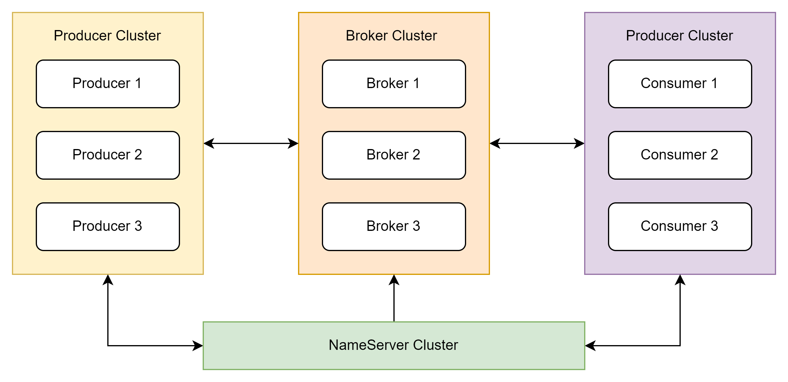

# RocketMQ

本次总结基于基本的使用，但是默认已经有使用MQ的经验，所以很多部分都已省略。

## 基本架构

以上是RocketMQ的一个基本架构，其中隐去了很多细节，后面如果谈到在单独进行细节分析。

本质上，Name Server就是一个注册中心，它会去管理所有的Producer，Consumer以及Broker。当一个producer发送消息的时候，broker会接收这个消息，
然后根据topic和tag进行分片，把消息放置到对应的通道上，之后consumer会去消费这些消息。当然一个consumer可以消费多个通道。
