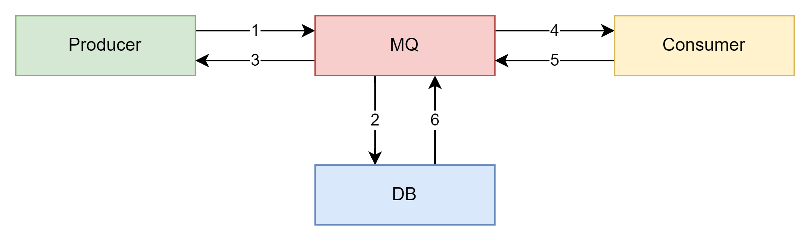
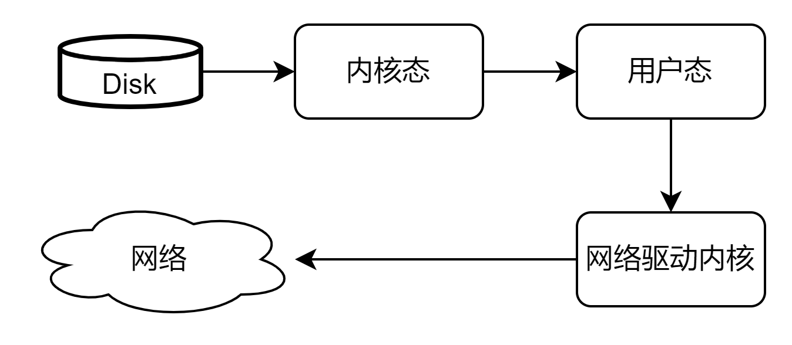

# RocketMQ

本次总结基于基本的使用，但是默认已经有使用MQ的经验，所以很多部分都已省略。

## 基本架构

以上是RocketMQ的一个基本架构，其中隐去了很多细节，后面如果谈到在单独进行细节分析。

本质上，Name Server就是一个注册中心，它会去管理所有的Producer，Consumer以及Broker。当一个producer发送消息的时候，broker会接收这个消息，
然后根据topic和tag进行分片，把消息放置到对应的通道上，之后consumer会去消费这些消息。当然一个consumer可以消费多个通道。

# MQ高级

## 消息存储

所谓的消息发送到MQ后，虽然可能停留时间很短暂，但是也有可能由于停电或不可抗力导致丢失。所以即使发送了消息，MQ也应该有一套机制来保证消息不会丢失。
尤其是对于大规模并发的场景，消息一旦丢失，影响的可能是一系列的订单，或者是后续所有的操作。因此一般MQ内部都会通过一些数据库持久化的方案来保证消息不会丢失。

一般来说架构如下

上图从MQ的视角看一个消息从发送到被消费的全过程。当一个消息进入MQ后，MQ不是先确认消息已经收到，而是先落库，这里的落库指的是放入硬盘。等确认消息已经完成持久化，才会告诉生产者，消息已经收到。
那么这样就保证了发送成功的消息一定是持久化的，也就预防了消息的丢失。而消费者消费完成后，则会删除已经存入的消息。这里就会带来一个问题。
当采取分布式系统时，如果MQ在5结束，6还没开始的时候崩了，那么这个消息在MQ这里等于没有消费完成，而消费者那边已经处理过。就有可能出现重复消费的问题，
从而进一步导致幂等性问题。那么这个问题在MQ这里一般不直接解决，而是通过业务逻辑进行规避。当然这里还存在一个同步和异步的问题，后面还会在聊到。

在linux系统中，一个消息的发送一般需要4个步骤。具体如下

首先把磁盘的数据复制到内核态的内存中，然后在同步到用户态的内存中，在把用户态内存中的数据同步到网络驱动的内存，最终复制到网卡上进行发送。

但是通过java的MappedByteBuffer来实现一个零拷贝技术，底层应该是通过mmap，直接把内核态的数据同步到网络驱动内核，那么这一步会省下大量时间。
但是直接进行内存映射的时候，

### 存储结构

CommitLog 用来存放消息的元数据

ConsumerQueue 存放消息在CommitLog上的索引

IndexFile 提供了查询消息的方法，支持key和时间区间查询。

### 刷盘机制

一般分为两种，同步和异步。

同步刷盘的思路比较简单，就是刚才说的，当生产者发送消息后，mq不会立即返回确认，而是阻塞等待消息落库才会返回。这里的阻塞就是线程的阻塞，可以理解成一个线程被阻塞等待，
直到成功刷盘后在唤醒。

异步刷盘则是先告诉生产者确认消息，然后在开启另外一个线程（不一定是开启，可能是等待线程池分配），让新的线程去刷盘，原来的线程直接返回。

## 高可用性

MQ的高可用一般通过master和slave的集群达到。在一个简单的双主双从的集群中，mq会自动安排消费者在master繁忙时从slave读取消息，当然如果出现了master或者slave不可用，
也会马上把请求发送到其它slave来保证消费端的高可用。

## 负载均衡

生产者的负载均衡主要就是基于topic的路由实现的。一个broker上可以出现很多个队列，那么如果我在多个broker上配置接收同样的topic，就可以做到简单的负载均衡了。
比如通过简单轮询来分摊压力。当然如果想要保持顺序消费，那么还是要把消息发送到同一个队列上。

消费者的负载均衡则是和每一个queue有关。当使用集群模式时，消费者会自动的分摊不同的queue上的消息。只要生产者的负载均衡完成了，那么消费者端其实也就自动负载均衡了。
当然也可以通过换装轮流的方式来消费，比如一个消费者只消费所有broker的第一个队列，然后每个消费者都会至少消费所有broker中的一个队列。不过本质上和前一种区别不大。

当消费者处于广播模式的时候，那么其实每一个消费者都是直接消费所有的queue，那么也就不存在负载均衡的说法。

## 消息重试

为了确保消息被消费，mq引入了消息重试机制。对于非顺序的消息消费，这个比较容易做到，但是对于需要顺序消费的情况，就不是很友好了。简单来说，顺序消费是一定会阻塞的，
所以一般需要监控是否出现消费失败造成大量阻塞的情况。

无序消息，如果消费失败，就直接设置消息的状态然后重新消费即可。当然一下所有的讨论都基于集群模式，因为广播模式是不存在重试的。
mq自带的内部重试只有16次机会，并且每次重试的时间间隔也是完全不同的。具体表格直接在官网上找，我就省略了。所有重试的消息id是不变的。

## 死信队列

当重试全部完成后还是失败的消息就会被自动移到死信队列中，并且保存三天。任何一个死信队列都是对应一个group id而不是一个单独的消费者，也就是说一个死信队列可能存在多个topic。
一般可以通过控制台查看死信队列的情况。然后通过消息手动释放，重发。当然也可以写一个只消费死信的队列消费者。

## 消息幂等性

当一个消费者接收同一个消息多次时，不会导致最终结果不一致。那么一般的解决方案就是通过业务标识来处理，比如设置一个唯一的message id（业务id，并不是mq返回的）。

