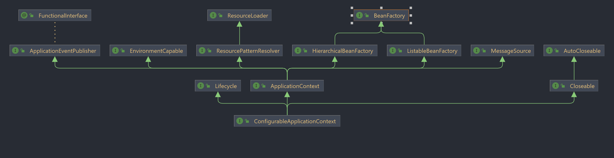
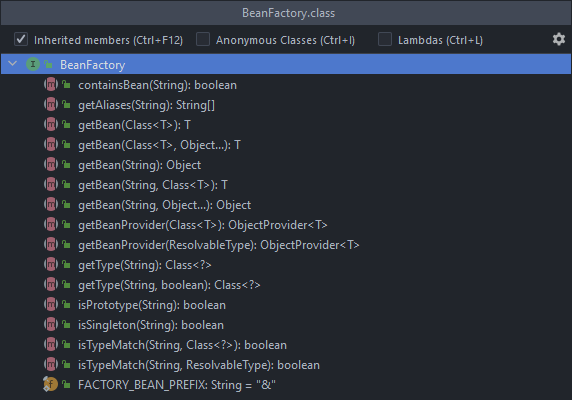
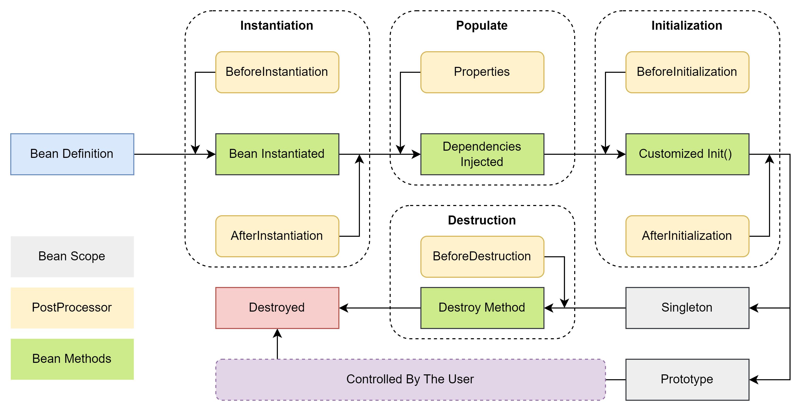

基于前面的内容，这次我会慢慢把spring的重要接口，包括注解的源码深入研究一下。力求搞懂整个过程，主要参考的资料一个是官方的source code，和网上的一些文章。
但是因为文章不能保证正确性，所以任何结论一定是我自己测试后的结果。

# 容器接口

## BeanFactory



首先是ConfigurableApplicationContext，它是Spring默认的SpringApplication.run()的返回值。而它本身是一个接口，它继承了三个接口，Closeable和Lifecycle先不看，
主要看ApplicationContext这个接口，通过ApplicationContext这个接口，能看到最顶层的接口是BeanFactory。实际上，在官方的文档也提到了这一点，
所谓的核心容器IoC，其实更多指的就是BeanFactory，而ApplicationContext则是提供了企业级的功能(虽然它也还是一个接口)。

为了研究BeanFactory，先来看ApplicationContext这个类。这个类中实例化了一个BeanFactory类，如果在去看这个BeanFactory，就会发现一个叫做singletonObjects的
ConcurrentHashMap。里面保存了所有单例对象。所以其实spring底层保存对象的时候，是通过一个BeanFactory里的hashmap来存储的。
而这个hashmap的默认大小是256。那么所谓的取对象，也就是从hashMap中get对象出来。到这里，springIoC的大概实现就比较清晰了，应该就是一开始往IoC里填对象，
后期需要用的时候在取，因为使用了concurrent，所以可以推测，创建对象的时候可能是多线程并发的。

```java
public static void main(String[] args) throws NoSuchFieldException, IllegalAccessException {
        ConfigurableApplicationContext context = SpringApplication.run(SpringSource1Application.class, args);
        Field singletonObject = DefaultSingletonBeanRegistry.class.getDeclaredField("singletonObjects");
        singletonObject.setAccessible(true);
        ConfigurableBeanFactory beanFactory = context.getBeanFactory();
        Map<String, Object> map = (Map<String, Object>) singletonObject.get(beanFactory);
        map.entrySet().stream().filter(e -> e.getKey().startsWith("comp"))
                .forEach(entry -> System.out.println(entry.getKey() + " => " + entry.getValue()));
    }
```

通过上面的这段代码，成功提取了beanFactory中的singletonObjects，尝试提取我定义的两个小pojo类来观察IoC的储存方式，再次印证了刚才的想法。所有的对象都会被储存在HashMap中，
这个HashMap其实才是真正的容器。



那么回到BeanFactory的内容上，来看这个接口的功能。基本上都是一些简单的API，也都比较好理解，所以我就不过分研究了。当然这个接口需要一个实现类，
其实可以说这个接口有很多很多个实现类，但是其中比较有重要的一个是DefaultListableBeanFactory。不过先不看这个，还是继续研究applicationContext.

## ApplicationContext

回到最开始的类图上，ApplicationContext这个接口继承了4个接口，而这4个接口才是它实现比BeanFactory更强大功能的原因。这里就大致了解一下它们的功能，
首先是MessageSource，这个比较简单，就是用来实现一些语言功能的，比如英语转中文之类的。ResourcePatternResolver就是利用通配符取匹配资源用的，比如某目录下的某个资源。
ApplicationEventPublisher就是一个事件对象的publisher，这个事件是带时间戳的。最后一个EnvironmentCapable是用来读取环境文件的。比如系统文件，环境变量等。

所有前面说法的验证都写在代码里了，具体怎么测就不复制上来了，感觉了解一下怎么用就够了，也不是特别重要。除了事件监听器的部分可以提供一定程度上的业务解耦，
但是也可以用消息中间件来解决。而且似乎消息队列会更主流一些。

## BeanFactory 实现类

前面提到DefaultListableBeanFactory是BeanFactory的主要实现类。它提供了很多不同的方法来彻底完善整个BeanFactory接口。但是本质上它的实现其实还是遵循懒汉模式的。
它不会出动调用BeanFactory后处理器(PostProcessor)，Bean后处理器，初始化单例和解析BeanFactory。也就是说，这些事情虽然Spring都帮忙干了，但是都不是BeanFactory干的。

```java
public static void main(String[] args) {
    DefaultListableBeanFactory beanFactory = new DefaultListableBeanFactory();
    // Bean 的定义
    AbstractBeanDefinition beanDefinition =
            BeanDefinitionBuilder.genericBeanDefinition(Config.class).setScope("singleton").getBeanDefinition();

    //BeanFactory
    beanFactory.registerBeanDefinition("config", beanDefinition);

    // 给beanFactory添加常用的后处理器
    AnnotationConfigUtils.registerAnnotationConfigProcessors(beanFactory);
    beanFactory.getBeansOfType(BeanFactoryPostProcessor.class).values().forEach(beanFactoryPostProcessor -> {
        beanFactoryPostProcessor.postProcessBeanFactory(beanFactory);
    });

    // Bean 后处理器， 对Bean生命周期提供扩展 比如@Autowired
    beanFactory.getBeansOfType(BeanPostProcessor.class).values().forEach(beanFactory::addBeanPostProcessor);
    for (String beanDefinitionName : beanFactory.getBeanDefinitionNames()) {
        System.out.println(beanDefinitionName);
    }

    beanFactory.preInstantiateSingletons();
    System.out.println(">>>>>>>>>>>>>>>>>>>>>>>>>>>>>>>>>>>>>>>>>>>>>>>>>>>>>>>>>>>>>>>>>>>>>>>>>>>>>>>>>>>>>>>>");
    System.out.println(beanFactory.getBean(Bean1.class).getBean2());
}
```

以上的代码从不同的角度测试了BeanFactory会做的事情，其实基本逻辑很简单，就是通过一个自己实例化的BeanFactory来加载bean包括各种注解。

### Autowired 和 Resource

如果同时使用这两个注解，谁的优先级会更高。通过测试发现，其实并没有谁的优先级更高，反而应该说，其实是看谁的后处理器先被加载，那么谁就会先被创建。
也就是说，其实后处理的加载顺序决定了bean的注入顺序。这就很有意思了，虽然实际开发并不会用到，但是一般来说spring默认会先创建autowired的后处理器。
当然它内部也自己实现了一个比较方法，数字大一般会后创建，这个实现在spring不同版本中可能长相不太一样，高一点的版本已经换成纯数字来表示优先级，低版本可能还用的是类似枚举的方式。

### 容器读取配置

#### ClassPath XMl

从类路径开始读，也就是classpath路径下的所有包

#### FileSystem XML

从磁盘开始读，也就是绝对路径。这个读法显然不是很好，或者说只适用于简单的开发环境。

```java
DefaultListableBeanFactory beanFactory = new DefaultListableBeanFactory();
System.out.println("读取前");
for (String name : beanFactory.getBeanDefinitionNames()) {
    System.out.println(name);
}
System.out.println("读取后");
XmlBeanDefinitionReader reader = new XmlBeanDefinitionReader(beanFactory);
reader.loadBeanDefinitions(new ClassPathResource("application1.xml"));
for (String name : beanFactory.getBeanDefinitionNames()) {
    System.out.println(name);
}
```

通过上面的这段代码可以测出，其实beanFactory本身也不会去管理配置文件，而是委托`xxxReader`来帮助读取。除了这两种方式外，spring还提供了注解的开发方式。

#### 注解方式

```java
AnnotationConfigApplicationContext context = new AnnotationConfigApplicationContext(Config.class);
System.out.println(context.getBean(Bean2.class).getBean1());
```

上述代码主要测试spring通过注解读取配置类。其中的Config.class是一个配置类，使用了@Configuration来声明。除此以外，spring可以通过注解的形式读取Web配置类。
但是那个MVC的用法确实比较老了，而且SpringBoot已经整合的很好了，所以我就只做了了解，没有去多研究。

#### 小结

这一节主要分析了各种spring读取配置文件的方式，目前比较常用的还是第三种，定义一个配置类，然后通过注解的方式读取。基本流程就是spring中会有很多后处理器，那么这个后处理会有序的读取，
这个有序其实包含了优先级的概念，但是并不是传统意义上的优先级。

## Spring Bean 生命周期

首先在Spring容器中，所有带上@Component标签的类都可以被称为Bean。（话说我猜是因为java创始人喜欢喝java咖啡，所以就用豆子作为类的代替名吧。）
之前已经画过Bean的生命周期了，这次打算更加精进一些。



上图算是比较完整的呈现了一个Spring Bean的一生，从被定义到被销毁(受人掌控的一生，哈哈)。从spring的官方文档中很难找到类似的描述，这里我定义的四个区域采取的是主流的观点。
也就是一个Bean一定会经过的4个过程——实例化，赋值，初始化和销毁。当然，它和一个pojo的生命周期很像，但是spring毕竟是成熟的框架，所以其中必然加入了很多可以调整的部分。

### 实例化 Instantiated

所谓的实例化和之前类中的实例化还是有些许不同的。我个人感觉pojo类的实例化更多的表示整个过程，有点类似spring bean的前三个生命周期的集合。而spring中的实例化似乎就是分配一下内存地址，
剩下的操作交给别的步骤来完成。

这一步中会出现两个后处理器，它们的返回值和作用也不太一样。那么简单的看一下源码就会发现很多有意思的地方，这里以InstantiationAwareBeanPostProcessor为例。

```java
public Object postProcessBeforeInstantiation(Class<?> beanClass, String beanName) {
        return null;
    }
```

如果只是看源码的话就会发现，其实Spring默认的"实例前-后处理器"啥都没有实现，就是单纯的返回一个null。只要这个返回结果不为null，那么返回的Object就会直接替换原先实例化的对象。
这个方法有两个参数，一个是被实例化的bean的class，一个是它的名字。也就是说可以直接通过classloader创建bean，只要return不为null，那么新的bean就会直接放入容器。
后面的依赖注入阶段就不用在运行了。所以它的应用场景还是比较宽泛的，比如一个很简单的pojo类，也不牵涉到依赖引用，那么就可以在实例化前，直接拿到，节省大量的资源。
这类要特别注意我举例的后处理器属于InstantiationAwareBeanPostProcessor不是它的父接口BeanPostProcessor。其它它们在这个方法上的定义还有点小区别，
父接口中如果返回null，那么就直接认定创建失败了。不过一般使用注解开发的时候，默认的processor是Aware的那一个，所以不用过于担心。

```java
public boolean postProcessAfterInstantiation(Object bean, String beanName) {
        return true;
    }
```

"实例后-后处理器"的内容则有所不同，其实应该把它归类到依赖注入会更适合一点。因为这个后处理器的作用就是判断是否进行依赖注入，源码中就是简单的true，
保证一定会进行依赖注入，但是如果由于某些pojo的需求，可能会不进行依赖注入。不过我个人感觉这个应该也用的不多，作为一个了解。

### 赋值 populate

这个阶段虽然只有一个后处理器，但是确实还挺复杂，首先是PropertyValue这个类。这个类其实描述类型参数的封装。其中最重要的两个字段就是name和value，
可以把它想象成一个键值对，只不过它是通过这个类封装的。后处理器在使用这个类的时候，利用了List集合进行管理，具体的实现类叫做MutablePropertyValues。
不过那个类没什么特殊的地方，所以也就不讨论了。

回到刚才说的后处理器，这个阶段唯一的后处理器是postProcessProperties，原先还有一个后处理器但是已经废弃了，因为兼容性的问题保留在了代码里，所以不去深究。
那么这个postProcessProperties到底是干嘛的？先来看它的一个实现源码。

```java
@Nullable
default PropertyValues postProcessProperties(PropertyValues pvs, Object bean, String beanName) throws BeansException {
    return null;
}
```

它也是什么都没干，官方文档的解释是它主要用于如果需要修改某个特定的字段，则可以使用。实际使用场景个人感觉还是比较少的，一般来说都已经用spring来管理这个bean了，
应该就是不想手动去修改一些东西，尤其是单例模式，感觉更是没有必要对字段进行特别赋值。值得一提的部分是，CommonAnnotationBeanPostProcessor中的PostProcessProperties
是用来保证依赖注入的，比如出现了@Autowired等，这个方法会直接根据这些注解来进行注入依赖，内部是通过inject这个方法。

本来想好好分析一下inject这个方法的，结果官方居然偷懒，没有写doc。只好自己分析一下了，

```java
// InjectionMetadata
public void inject(Object target, @Nullable String beanName, @Nullable PropertyValues pvs) throws Throwable {
    Collection<InjectedElement> checkedElements = this.checkedElements;
    Collection<InjectedElement> elementsToIterate = checkedElements != null ? checkedElements : this.injectedElements;
    if (!((Collection)elementsToIterate).isEmpty()) {
        Iterator var6 = ((Collection)elementsToIterate).iterator();

        while(var6.hasNext()) {
            InjectedElement element = (InjectedElement)var6.next();
            element.inject(target, beanName, pvs);
        }
    }
}

// InjectedElement Class 
protected void inject(Object target, @Nullable String requestingBeanName, @Nullable PropertyValues pvs) throws Throwable {
    if (this.isField) {
        Field field = (Field)this.member;
        ReflectionUtils.makeAccessible(field);
        field.set(target, this.getResourceToInject(target, requestingBeanName));
    } else {
        if (this.checkPropertySkipping(pvs)) {
            return;
        }

        try {
            Method method = (Method)this.member;
            ReflectionUtils.makeAccessible(method);
            method.invoke(target, this.getResourceToInject(target, requestingBeanName));
        } catch (InvocationTargetException var5) {
            throw var5.getTargetException();
        }
    }

}
```

其实重点是第二个方法，第一个方法就是把需要添加的字段单独调用InjectedElement的inject方法。第二个方法才是解决注入问题的核心方法。首先判断是否为字段，
如果不是则考虑是否为方法，因为@Autowired是可以加在方法上的，加在方法的作用后面再聊。如果是字段，就通过反射，暴力的把这个值赋给目标实例，如果是方法则暴力调用。
本质思路都是通过反射来暴力解决。也就是说注解其实只是告诉spring，你先需要通过inject这个方式来注入了，而不是直接创建一个对象并按给注释的字段。

简单的总结一下，spring处理注解注入的时候，是通过底层的inject来解决的，而这个解决方式保证了，所有的依赖仍然被spring容器管理。不管是@Autowired还是@Resource，
都是在这一步的时候完成的注入，并且被spring管理。

### 初始化 initialization

这个步骤中的两个后处理器和前面的就不太一样了，前面的都是属于InstantiationAwareBeanPostProcessor的方法，而初始化中的则是继承自BeanPostProcessor。
那么废话不多说了，直接来看源码。

```java
@Nullable
default Object postProcessBeforeInitialization(Object bean, String beanName) throws BeansException {
    return bean;
}

@Nullable
default Object postProcessAfterInitialization(Object bean, String beanName) throws BeansException {
    return bean;
}
```

官方文档中的解释

```text
the bean instance to use, either the original or a wrapped one; if null, no subsequent BeanPostProcessors will be invoked
```

也就是说，其实无论是初始化前还是初始化后，返回的bean都会直接替换掉原来的bean。主要的应用场景应该就是做一些增强服务，比如一个对象已经完成了，但是通过init()方法给它在加入一些特别的功能。
虽然我觉得可以直接放在对象的层面去处理，但是使用init方法无疑是充分解耦的，所以对于一些代理增强之类的问题可算是很好的解决方案。

### 销毁 Destroy

这个步骤倒是不复杂，就是当spring结束的时候用来释放内存的，当然如果在销毁前也可以做一些事来处理这个bean的后事，有点类似与finally的感觉。因为spring中的bean不是简单的被JVM垃圾回收来管理，
spring也会对他进行一些必要的管理。由于这里用法比较简单所以就略过了。spring自己实现的类，大多是打印一些日志，没有什么特别的。

## 模拟一个bean创建的流程

首先是创建一个干净的容器

```java
public static void main(String[] args) {
    // 创建一个空的容器
    GenericApplicationContext context = new GenericApplicationContext();

    // 手动创建Bean
    context.registerBean("bean1", Bean1.class);
    context.registerBean("bean2", Bean2.class);
    context.registerBean("bean3", Bean3.class);
    context.registerBean("bean4", Bean4.class);
    
    // 初始化容器
    context.refresh();

    // 销毁容器
    context.close();
}
```

这里使用的是GenericApplicationContext，因为这个类比较干净，没有加载或者整合任何步骤。基本思路就是把4个bean注册到容器，然后refresh一下观察结果。
先来看registerBean

```java
public <T> void registerBean(@Nullable String beanName, Class<T> beanClass, @Nullable Supplier<T> supplier, BeanDefinitionCustomizer... customizers) {
    ClassDerivedBeanDefinition beanDefinition = new ClassDerivedBeanDefinition(beanClass);
    if (supplier != null) {
        beanDefinition.setInstanceSupplier(supplier);
    }

    BeanDefinitionCustomizer[] var6 = customizers;
    int var7 = customizers.length;

    for(int var8 = 0; var8 < var7; ++var8) {
        BeanDefinitionCustomizer customizer = var6[var8];
        customizer.customize(beanDefinition);
    }

    String nameToUse = beanName != null ? beanName : beanClass.getName();
    this.registerBeanDefinition(nameToUse, beanDefinition);
}
```

其实也不复杂就是把每一个bean都注册一下，保证spring容器知道它在管理的bean有哪些。

```java
public void refresh() throws BeansException, IllegalStateException {
    synchronized(this.startupShutdownMonitor) {
        StartupStep contextRefresh = this.applicationStartup.start("spring.context.refresh");
        this.prepareRefresh();
        ConfigurableListableBeanFactory beanFactory = this.obtainFreshBeanFactory();
        this.prepareBeanFactory(beanFactory);

        try {
            this.postProcessBeanFactory(beanFactory);
            StartupStep beanPostProcess = this.applicationStartup.start("spring.context.beans.post-process");
            this.invokeBeanFactoryPostProcessors(beanFactory);
            this.registerBeanPostProcessors(beanFactory);
            beanPostProcess.end();
            this.initMessageSource();
            this.initApplicationEventMulticaster();
            this.onRefresh();
            this.registerListeners();
            this.finishBeanFactoryInitialization(beanFactory);
            this.finishRefresh();
        } catch (BeansException var10) {
            if (this.logger.isWarnEnabled()) {
                this.logger.warn("Exception encountered during context initialization - cancelling refresh attempt: " + var10);
            }

            this.destroyBeans();
            this.cancelRefresh(var10);
            throw var10;
        } finally {
            this.resetCommonCaches();
            contextRefresh.end();
        }
    }
}
```

虽然这段代码稍有点长，但其实一长串都只是赋值而已。refresh的主要作用其实就是“刷新”，把刚才注册的Bean，等一系列的东西全部更新一遍。
下面我会一步一步来模拟整个解析过程。

首先在注册bean的部分加入下面的内容

```java
context.registerBean(AutowiredAnnotationBeanPostProcessor.class);   // @Autowired, @Value
```

这个部分表示注册一个自动注入注释Bean的后处理类，但是如果只是加入这个还是会出现问题，因为在Bean1中，我定义了一个String的值注入。这个解析器只能解析@Autowired和@Value注释，
它不能解析String的注入，因此还需要给这个容器设置一个能用的解析器。

```java
context.getDefaultListableBeanFactory().setAutowireCandidateResolver(new ContextAnnotationAutowireCandidateResolver());
```

上面的ContextAnnotationAutowiredCandidateResolver就可以完美的解析String类型的注入关于这个类的实现，后面我想在单独分析一下，我大致看了一下，感觉还挺复杂的，
而且和这个部分关系不大，所以暂时放一放。通过加入上述的代码后，可以直接看到所有使用@Autowired注入的字段和方法都得到了执行，并且成功运行了。

继续加入一下代码

```java
context.registerBean(CommonAnnotationBeanPostProcessor.class);  // @Resource, @PreDestroy, @PostConstruct
```

它处理的事情就很多了，基本上除了@Autowired都是由它来解析，甚至包括@PreDestroy和@PostConstruct。同时要注意因为spring内部其实对于BeanPostProcessor是排过序的。
所以一般解析的时候会先解析@Resource再解析@Autowired。

### AutowiredAnnotationBeanPostProcessor

刚才的代码中，利用了AutowiredAnnotationBeanPostProcessor来进行解析，它就是解析所谓@Autowired修饰的变量或方法。那么我们来看看它的一个具体实现，
首先看postProcessProperties的源码。这里还想说一个点，就是@Inject和@Autowired是本质上是一个东西，之不过一个是JSR-330提案，spring中把它叫做@Autowired而已。

```java
@Override
public PropertyValues postProcessProperties(PropertyValues pvs, Object bean, String beanName) {
    InjectionMetadata metadata = findAutowiringMetadata(beanName, bean.getClass(), pvs);
    try {
        metadata.inject(bean, beanName, pvs);
    }
    catch (BeanCreationException ex) {
        throw ex;
    }
    catch (Throwable ex) {
        throw new BeanCreationException(beanName, "Injection of autowired dependencies failed", ex);
    }
    return pvs;
}
```

这里看的这个类其实主要的作用和之前的那个很像。第一步它回去找哪些类被@Autowired修饰，并返回一个封装好的metadata类，再通过metadata类来注入需要的属性。
这个inject方法前面已经讨论过了，方法和字段是分开加入的。

## BeanFactoryPostProcessor 

```java
protected Set<BeanDefinitionHolder> doScan(String... basePackages) {
    Assert.notEmpty(basePackages, "At least one base package must be specified");
    Set<BeanDefinitionHolder> beanDefinitions = new LinkedHashSet<>();
    for (String basePackage : basePackages) {
        Set<BeanDefinition> candidates = findCandidateComponents(basePackage);
        for (BeanDefinition candidate : candidates) {
            ScopeMetadata scopeMetadata = this.scopeMetadataResolver.resolveScopeMetadata(candidate);
            candidate.setScope(scopeMetadata.getScopeName());
            String beanName = this.beanNameGenerator.generateBeanName(candidate, this.registry);
            if (candidate instanceof AbstractBeanDefinition) {
                postProcessBeanDefinition((AbstractBeanDefinition) candidate, beanName);
            }
            if (candidate instanceof AnnotatedBeanDefinition) {
                AnnotationConfigUtils.processCommonDefinitionAnnotations((AnnotatedBeanDefinition) candidate);
            }
            if (checkCandidate(beanName, candidate)) {
                BeanDefinitionHolder definitionHolder = new BeanDefinitionHolder(candidate, beanName);
                definitionHolder =
                        AnnotationConfigUtils.applyScopedProxyMode(scopeMetadata, definitionHolder, this.registry);
                beanDefinitions.add(definitionHolder);
                registerBeanDefinition(definitionHolder, this.registry);
            }
        }
    }
    return beanDefinitions;
}
```

这个方法是我从ClassPathBeanDefinitionScanner中扣下来的。它的代码倒是没有什么可以讨论，主要观察实现过程。首先是扫整个所有的包，
包拿到后，在扫描里面的所有class文件，通过class文件找BeanDefinition(关于BeanDefinition后面我会单独分析)，通过BeanDefinition结合元数据，
直接解析各种不同的注解。解析完后，在把他注册到注册表里，最后返回一个BeanDefinition的LinkedHashSet。其实这个流程还是蛮清楚的，就是一步一步扫描和加入。

# 小结

关于spring核心容器是如何创建和管理Bean的流程，应该在这一章中完全讨论了，其中还有很多需要补充的地方，会放在后面的文章中解释。这次主要理解了，虽然spring
对于java来说提供了很多增幅功能，但是这些功能并不是直接通过一些类实现，而是通过非常多的接口，和子接口来延展。这也是为什么spring这个框架的耦合度相对比较低。
如果从一个简单的层面去理解bean的生命周期，其实就是一个pojo的正常实例化而已，只不过spring加入了很多后处理器去优化和修改这个类的功能。而是这些后处理器本质上
就是通过暴力反射来强行注入或者修改类的信息。

个人感想，spring这个框架太大了，感觉短时间内不可能看得完，所以我会调整一下我的计划，把框架中相对重要的部分单独分析和查看一下，如果没有什么大的问题，就不浪费时间去看那么细枝末节的部分。
而且它的源码其实完全搞懂感觉意义不大，因为它很多实现感觉并不能在业务上使用，相对来说源码分析感觉效率比较低。