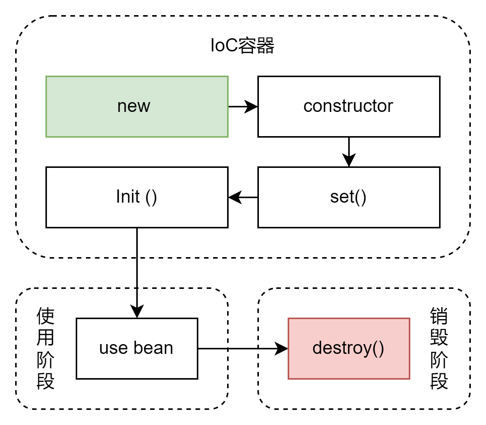

# 初识Spring

## 核心概念

### IoC Inversion of Control 控制反转

对象的创建控制权由程序转移到外部，等于取消了程序自己new一个对象的方式。在Spring框架中，提供了一个容器，这个容器被称为IoC容器，用来充当外部。

### DI Dependency Injection 依赖注入

在容器中建议bean与bean之间的依赖关系，这个过程叫做依赖注入。Spring IoC容器就可以做到依赖注入。

### 实战

```java
public static void main(String[] args) {
    ApplicationContext ctx = new ClassPathXmlApplicationContext("applicationContext.xml");
    BookService bookService = (BookService) ctx.getBean("bookService");

    bookService.save();
}
```

通过配置文件来简单告诉spring如何获得一个bean，整个代码中没有出现任何new，不允许程序自己来创建bean。在配置文件中，详细的规定了bean之间的依赖关系，如下。

```xml
<bean id="bookDao" class="spring1.dao.impl.BookDaoImpl"/>
<bean id="bookService" class="spring1.service.impl.BookServiceImpl">
    <property name="bookDao" ref="bookDao"/>
</bean>
```

简单的通过bean id来保证依赖。

算是一个特别小的Spring framework的入门，都是跟着教程走的，没有什么太多的问题。

## Bean

### 单例

spring IoC创建bean的时候默认是单例模式，通过以下代码可以证明

```java
public static void main(String[] args) {
    // 获取IoC容器
    ApplicationContext ctx = new ClassPathXmlApplicationContext("applicationContext.xml");
    BookService bookService1 = (BookService) ctx.getBean("bookService");
    BookService bookService2 = (BookService) ctx.getBean("bookService");

    System.out.println(bookService1);
    System.out.println(bookService2);
}

/* 打印结果 
 * spring1.service.impl.BookServiceImpl@13c10b87
 * spring1.service.impl.BookServiceImpl@13c10b87
*/
```

可以看到通过IoC创建的对象地址是完全相同的。这里的主要原因是IoC默认的scope是"singleton"，那么可以在配置文件中直接修改scope为"prototype"。
这样就可以创建不同的bean了。

既然如此为什么spring要默认单例模式呢？

个人觉得就是便于管理，当然也利用了享元模式。因为如果我创建Dao对象，那么按照业务逻辑，一个足够了，其它需要它的时候，应该都通过这个实例。如果每次遇到就创建新的，
那么首先会吃掉很多的内存，其次效率也很低(因为需要VM进行加载等操作)。但是这样一来也说明IoC能够管理的Bean最好是值得复用的，如果是那种不断改变字段的对象，那么Spring就一定合适。

### 实例化过程

这一块后续应该还是要看源码的，目前就是简单测试。当我规定一个空参构造器的时候，Spring会直接调用它，但是当我只规定一个有参构造的时候，spring就直接报错了。
所以不出意外，spring应该就是无脑调空参构造器，如果没有就直接报错。

### 工厂类

其实和之前的静态工厂或者实例工厂创建线程和对象一样，不过Spring提供了简化的方式，统一放在IoC中管理。基础这种想法，个人觉得先用实例工厂bean来实例化多个对象会是不错的选择。
因为这样保证了工厂是单例的，然后对象都通过工厂创建，一定程度上也可以解耦。Spring中提供过了FactoryBean这种配置方式来充分简化对象的创建过程。
甚至不需要在获取factory类，直接可以通过spring内部的工厂来获取实例。而且也提供了`isSingleton()`这个方法来控制单例或非单例模式。


#### 小发现

在使用FactoryBean的时候，因为忘了把前面的配置注释掉，发现了一个好玩地方。好像在配置中只要是被依赖的bean，Spring会默认创建一个实例。而且是在初始化，也就是读取配置文件的时候创建。
这个小发现我还没有去看源码，后面有时间会仔细了解一下这里的bean创建过程。

### Bean 生命周期

对于spring来说，通过配置文件来配置初始化和销毁方法的方式还是太繁琐了。spring直接提供了一整套的接口来保证开发者在代码中就实现了全部的生命周期。

基本的生命周期如下



基本来说Spring会先new一个对象，也就是分配内存。然后调用无参构造器，构造完后，如果有set方法，则会通过set方法执行属性注入。最后执行bean的初始化方法(`init`)。
使用完后，可以通过调用容器的`close`主动销毁或者`registerShutdownHook`等待VM关闭时销毁。

## 依赖注入

### 简单的setter注入

就是之前提到的set方法。在一个bean下面写入字段后，也分别对每个字段写入一个setter方法(setter是spring官方推荐叫法)。对于不同类型的注入，配置文件不同，具体如下

```xml
<bean id="bookDao" class="spring1.dao.impl.BookDaoImpl">
    <property name="id" value="10"/>
    <property name="name" value="book A"/>
</bean>
```

配置文件中，只需要加入name和value/ref即可。name就是字段名称，而value则是字段的值。如果字段是除String外的类，那么就需要把value改为ref，并且ref后面跟的是bean id。
spring会根据bean id自动的注入依赖，无需手动创建实例。不过本质上它就是通过无参构造器先构造出一个实例，然后调用setter更新字段。

### 构造器注入

原理相同，在没有配置构造器的时候，spring会默认使用无参构造器，然后调用setter来注入字段值。如果我在开始就是直接通过有参构造来生成bean，那么相对的我就不需要setter了。
直接来看构造注入的配置

```xml
<bean id="bookDao" class="spring1.dao.impl.BookDaoImpl">
    <constructor-arg name="id" value="1"/>
    <constructor-arg name="name" value="Book A"/>
</bean>
```

和前面一样，把每一个构造器参数配置好。在对应的类中加入有参构造器即可，如果想要充分解耦的话，其实还可以加入index或者类型来进一步限制是哪一个参数的值，
这样的话连形参的名字都不需要了。

### 依赖自动装配

对于需要的引用类型，spring甚至提供了autowire来进行自动装配。具体的操作如下

```xml
<bean id="bookService" class="spring1.dao.service.impl.BookServiceImpl" autowire="byType"/>
```

比如这里bookService内部有一个bookDao这样的字段，那么我可以在配置的时候加入autowire来告诉spring去找一个类型是BookDao的bean然后注入进来。当然注入方式也有很多，
比如比较常见的byType和byName。但是由于这种方式其实容易造成问题，所以个人觉得最好还是通过setter来注入比较稳健。

### 集合注入

基本思路是一样的，不过配置文件中要写很多内容，所以后面应该简化办法，但是目前没学到。所以就只是简单的更改配置文件。

```xml
 <property name="array">
    <array>
        <value>10</value>
    </array>
</property>
```

这里就用array举一个例子，其实就是在原先的bean标签下多加入新的property。也比较好理解，本质上就是一个填充一个字段。

## 加载配置文件

这里的点太多了，感觉第一次很难全部总结完，后面如果碰上一个就讨论一个吧。目前我就碰到了几个需要注意的点。首先配置properties文件的时候，
必须要保证properties文件属于resources底下，因为系统的自动会去resources底下找。其次，如果碰上了系统变量和自定义冲突的情况，那么优先级永远是系统第一，
所以为了避免这个情况可以在xml里面设置。

```xml
<context:property-placeholder location="jdbc.properties" system-properties-mode="NEVER"/>
```

不够这种方式会把系统所有的变量都不加载，我个人倒是觉得万一我需要某个系统变量这反而不方便了。所以最好的方案应该是定义变量的时候减少冲突，比如利用`xx.xx`的格式来写。
这样即清晰，也不容易混用。还需要注意的点是必须打开context的namespace，不然系统也不会识别。具体的用法就是直接在需要改写的value中加入占位符，然后在占位符内部引用需要的值。

```xml
<property name="name" value="${jdbc.driver}"/>
```

如果需要加载多个properties文件的话，那么则可以利用*号，但是同时也要注意多个文件中间的overlap问题。不过基本上，很多的开发规范都会要求使用`classpath*:`加载所有可能配置。

# 核心容器小结

## bean的配置

在xml中，对一个bean需要做的配置基本如下

| bean配置字段       | 字段意义     |
|----------------|----------|
| id             | bean的id  |
| name           | bean别名   |
| class          | bean类型   |
| scope          | 单例还是多例   |
| init-method    | 初始化方法    |
| destroy-method | 销毁方法     |
| autowire       | 自动装配类型   |
| factory-bean   | bean工厂实例 |
| factory-method | bean工厂方法 |
| lazy-init      | 懒加载      |

## 依赖注入

在xml中依赖注入的配置如下

| 配置字段            | 字段意义      |
|-----------------|-----------|
| constructor-arg | 定义一个构造器参数 |
| property        | 注入bean的字段 |

至此spring的核心容器的简单入门就讨论完了。目前应该不存在什么问题，基本测试都挺成功的，而且大部分都是内容其实都是优化和简化java的基本代码，很容易上手。
