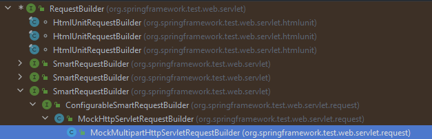

# SpringBoot 2

本章会讨论一些之前没有学习过的技术，比如Redis。不过但是浅尝一下，而且全部是springboot的整合方案。

## yaml 多环境开发

对于多环境配置开发，在主配置文件(yaml)中可以用如下格式来定义即可,对于通用配置只需放在最上面，每一个单独环境的配置需要用---隔开。

```java
spring:
        profiles:
        active:production
        server:
        port:80
        ---
        spring:
        config:
        activate:
        on-profile:production
```

这种方案会导致过多配置放在一个文件中，安全性也不是很好，所以推荐使用分开的方案。总体思路一样，不过这次把不同的配置环境放在不同yaml文件，保证文件名是application-{环境名}即可。

对于properties文件也是相同思路，但是yml实在太好用且简洁了，所以大概率还是用不到properties。

## 日志控制

首先打印日志一般是通过slf4j类来输出，而不是jdk自带的logger。一般日志级别分为6种，其中4种是比较常见的，而剩下的两种——一种基本只存在理论使用可能，一种没啥大用。
根据级别来排序分别是:

- Trace：运行堆栈信息
- Debug：调优，测试代码使用
- Info：运维过程记录
- Warn：报警记录
- Error：错误记录
- Fatal：重大灾难信息，一般合并到error里

基本上trace输出的日志不仅冗长还没啥用处，所以基本不用，而fatal已经是灾难级别了，大部分情况下可能就无法输出成功，所以也没有什么参考价值。一般开发用的最多的应该是debug和info，
主要用于调试和运维。warn是如果出现了一些值得注意的报警，就可以打warn。那么error则是很危险的日志，一般就是业务逻辑出问题，或者系统出问题，需要立即处理。

### 日志输出格式

主要的占位符如下：

- %p: 日志级别
- %d: 日志时间 可以指定格式 `%d{yyy MMM dd HH:mm:ss,SSS}`
- %r: 启动到输出log的时间 单位是ms
- %c: class名，一般是全限定名
- %p: pid 线程id
- %t: 线程名
- %l: 发生位置，比如行数等
- %L: 代码中的行号
- %m: 消息，一般人为指定
- %n: 换行符
- %clr(): 改变颜色，可以配合{}来指定输出的颜色

基本和C的打印方式一致，可以通过xx.xx来控制日志长度，对齐方式，包括裁剪位置。

## 热部署

首先需要导入坐标，一般就是利用springboot自带的devtools

```java
<dependency>
<groupId>org.springframework.boot</groupId>
<artifactId>spring-boot-devtools</artifactId>
</dependency> 
```

一般来说热部署会分为两个部分，第一步是重启，第二部是重载。重启指的是加载自定义的代码，它的加载位置处于restart类加载器。重载则是指加载jar包，加载位置一般是base类加载器。
热部署听上去很神奇，其实也就是在运行图中，重新构建项目，重新打包，然后载入。

## SpringBootTest MockMvc

如果不想通过postman来发送请求，而想使用虚拟请求的话，在springboot的测试中可以使用@AutoConfigureMockMvc来开启虚拟Mvc。这里其实我遇上了一个我解释不了的问题，如果我使用@Autowired，在Spock单元测试下就永远注入不了对象，
但是换到Junit就没有问题，还挺奇怪的。下面是错误的代码复现。

```groovy
def "test web"(@Autowired MockMvc mvc) {
    given:
    MockHttpServletRequestBuilder builder = MockMvcRequestBuilders.get("/books")

    when:
    def action = mvc.perform(builder)
    def status = MockMvcResultMatchers.status()
    def ok = status.isOk()

    then:
    action.andExpect(ok)
    print "test end"
}
```

如果我这么使用，spock会一直提示找不到mvc实例。但是如果我把它移到外面，按照正常的方式来注入就可以。这里我也没有想明白，我尝试换成setup里面定义注入这个mvc就可以。
所以不知道为什么？我后面也测了一下Junit，就没有这个问题。我在社区找了，没有看到和我遇到一样问题的，官方文档还没看完，但是目前也没有发现是怎么回事。

上面的问题算是个小插曲，这里的核心是这个AutoConfigureMockMvc，这个注解我会在后续的反思中详细讨论，目前主要是学会怎么用这个注解来替代postman做单位测试。

### 匹配执行状态

先看下面的这个测试

```groovy
@Autowired
MockMvc mvc

def "test web"() {
    given:
    MockHttpServletRequestBuilder builder = MockMvcRequestBuilders.get("/books")

    when:
    def action = mvc.perform(builder)
    def status = MockMvcResultMatchers.status()
    def ok = status.isOk()

    then:
    action.andExpect(ok)
    print "test end"
}
```

mvc已经在外面自动装配过了。这个简单的测试主要是用MockHttpServletRequestBuilder来模拟一个mvc请求，然后测试请求的状态和响应状态。那么在springboot的模拟mvc测试中，
框架定义了这样的一个实现类——MockHttpServletRequestBuilder。



它实现了RequestBuilder接口，而RequestBuilder接口是spring框架中用来构造请求的接口。整个接口就一个功能，就是构造一个请求，一共有两个实现类实现了它的方法。
这次我用到的是Mock的那个。直接点进源码，发现有800多行，还行，比之前看的某些线程类动不动1500行好多了🙉。。。这个类中的大部分字段名已经完美表达了意思，字段的类型也都是常规的类型。
大部分方法也就是加入和修改已有的属性，本质上有点像是一个pojo。

下面是我觉得有意思的地方，虽然类型我使用的MockHttpServletRequestBuilder，但是创建类我用的是MockMvcRequestBuilders。问题是MockMvcRequestBuilders是一个单独的抽象类，
既没有继承任何类，也不会实现接口。spring框架把这个类完全的独立出去了，我感觉这个设计思路值得我学一下，虽然使用抽象类并且选择不继承可能导致一些关系上面的混乱，
但是这种方式感觉是更加舒服的，通过静态方法直接得到想要的请求类，无需通过实例。这样显然是简化了测试流程的。我个人把这个类看成是一个工厂类，完全就是用来输出这种请求的工厂。

后面的部分就比较简单了，使用两个封装好的类去执行和判断情况。这里要提一下MockMvc这个类，它本身就是用来模拟http请求的，没有什么特别复杂的，
但是它的perform方法确实值得看一下。我主要是想讨论它的返回值。

```java
public ResultActions perform(RequestBuilder requestBuilder) throws Exception {
        /**
         * 前面全部省略
         */

    return new ResultActions() {
        @Override
        public ResultActions andExpect(ResultMatcher matcher) throws Exception {
            matcher.match(mvcResult);
            return this;
        }
        @Override
        public ResultActions andDo(ResultHandler handler) throws Exception {
            handler.handle(mvcResult);
            return this;
        }
        @Override
        public MvcResult andReturn() {
            return mvcResult;
        }
    };
}
```

perform方法会返回一个ResultActions类，这个类的主要就是用来对比响应状态的，其中会有比如andExpect等用来匹配状态的方法。而整个请求返回的response则会保存在mvcResult。
用来对比的andExpect可以接收包括status，content等一系列的参数，只要它属于ResultMatcher即可。

## 数据层方案

springboot在管理数据源的时候，只要导入的坐标是spring-boot-starter格式的就可以不用单独配置直接使用。这里不用配置的意思是，不需要在配置类中明确表明是某个技术。
比如druid，即使在配置类中指规定数据源的url等信息，忽略掉数据源类型，springboot还是会直接初始化druid连接池。这一点真的很方便，但是有的时候又会带来问题，
比如导入两个数据源的时候，可能会出现冲突(不过一般也不应该出现这个问题)。

当我刻意把druid注掉，并且删除了坐标后，springboot居然还是可以连上数据库！而且打印了下面的两行

```text
2022-10-14 16:26:39.327  INFO 10668 --- [           main] com.zaxxer.hikari.HikariDataSource       : HikariPool-1 - Starting...
2022-10-14 16:26:39.471  INFO 10668 --- [           main] com.zaxxer.hikari.HikariDataSource       : HikariPool-1 - Start completed.
```

这又是什么呢？Hikari是springboot内嵌的三个数据源对象之一，剩下的两种分别是tomcat自带的和Commons DBCP。Hikari具体干嘛的这里我还没研究，就知道它是个轻量级的数据源连接方式。
不过我也不打算深究这个部分，毕竟和业务关系似乎不大。

### JDBCTemplate

简单了解过了，现在用这个的应该很少了。基本功能很mybatis plus很像，所以就不讨论了。

### H2数据库

也是springboot自带的数据库，可以手动启动，不过应用场景也不多，所以就忽略了。


### Redis 入门

后续对于Redis等技术还会在详细的研究一下，我这里就是看看springboot是怎么整合的。其实和之前一样，就是导入坐标然后直接使用。我这里就是用了StringRedisTemplate来进行测试。
唯一有意思的就是如果使用RedisTemplate，那么cmd客户端存储的数据和IDEA存储的数据，虽然存在同一个端口的同一个客户端下，但是IDEA中没有办法直接提取。
还有一个就是redis默认的客户端似乎是lettuce，我看很多文章说的是jedis已经被淘汰了，但是由于兼容性问题所以不能删除。所以后面研究的话，也都是基于lettuce的，毕竟我们使用的也是lettuce。

### Elasticsearch

Elasticsearch也是springboot整合好的一个分布式全文搜索引擎。目前还是很多系统选择的搜索引擎，主要的原因还是开源，社区支持比较完善。

我比较震惊的是，这个东西居然吃掉了5.5G的内存。我就按照官方的给的方法，尝试启动了一下这个服务，结果直接吃了几乎6个G的内存。大概用postman玩了一下，感觉有点类似于一个索引式的搜索引擎。

我大概尝试了一下postman发送请求的方式，基本玩法大概懂了，但是对于具体怎么用还要多看看。因为这个暂时不是重点所以就略过了。

## 缓存的简单原理

其实就是在数据库和app之间在加入一层，一些比较常用的信息，只需要从数据库中查询一次即可，其它时候直接访问缓存。这样可以提高大幅度提高效率，但同时分辨哪些是有用的信息，包括怎么进行判断。
因为如果从悲观角度说的话，可能会出现

### Spring-boot-starter-cache

直接导入坐标即可使用，算是学redis前的一个简单入门吧。一般要注意三个点，在要使用的方法上加入`@Cacheable`来保证可以使用。在Cacheable中配置缓存的名字和键。
在容器启动类上加入`@EnableCaching`。这个使用的是spring自带的simple的cache方案


