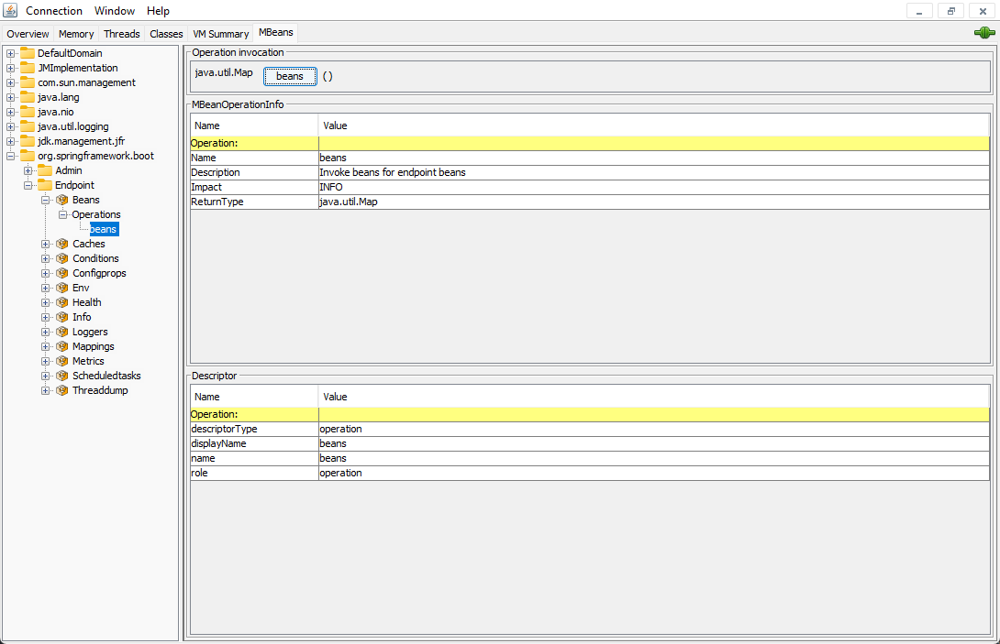

# SpringBoot 3

上一篇中算是预习了springboot整合的大部分技术，比如redis，es等。这次的话，准备按照官网的教程，把大部分任务的反思写完。这次的大部分任务都会写的比较浅显，
因为关于具体逻辑和spring的源码分析都放在了springsource系列里了。

## Building a RESTful Web Service with Spring Boot Actuator

我个人理解的actuator就是一种springboot自己集成的监控器，它可以用来监控程序不同的部分。每个部分又可以拥有很多不同的属性。
官方的github上面明确说明了actuator可以使用http或JMX来管理。这次我两个都尝试了一下



直接启动一个springboot web程序，用jconsole连接。上图中的endpoint没有配置任何自定义端点，全部由spring直接提供。根据官网上的文档，它们监控的范围如下。

- Beans: 显示所有容器中的bean
- Caches: 显示所有缓存信息
- Conditions: 显示配置匹配结果，并给出具体原因
- Configprops: 显示带有@ConfigurationProperties的类，spring会自动校对
- Env: 显示从ConfigurableEnvironment提取所有的属性
- Health: 健康信息
- Info: 程序信息
- Loggers: 日志的配置信息
- Mappings: 显示所有@RequestMapping类
- Metrics: 程序的测量标准
- Scheduled tasks: 显示所有定时任务
- Thread dump: dump一次

以上的这些只是我从jconsole看到的，实际上还有更多的信息可以显示。对于web应用，官方还给出了额外的4个端点——heapdump，jolokia，logfile，prometheus。

默认情况下，除了shutdown以外的所有端点都是默认打开的。如果需要手动关闭的话，就直接通过配置类即可。通过jmx和web查看的时候，暴露的信息是不同的，这个也可以使用配置来解决——include和exclude。

endpoints抽取信息的缓存时间可以通过cache:time-to-live来配置。

### Web 配置

所谓的web配置，和其它的yaml配置没有什么不同，这里就结合官方推荐展示我个人觉得比较方便的配置。

```yaml
management:
  endpoints:
    web:
      base-path: /manage
      path-mapping:
        health: "healthcheck"
  server:
    port: 8000
    address: "127.0.0.1"  
```

基本上，所有的actuator配置都属于management，对于不同的endpoint可以配置的东西也非常多，由于我使用的是web，所以这里就只配了web，base-path就是把原先的/actuator替换成/manage。
后面的path-mapping则是直接把health这个endpoint替换成/healthcheck，并且前面不需要加入/manage。

### 实战——官方文档

在pom中加入actuator坐标，springboot管理，所以直接使用spring-boot-starter系列。如果是web启动的话，默认情况下，直接通过路径+/actuator来访问。
其它也没有什么好说的，都是正常的controller写法，用就行了。

这次尝试了一下record的用法，这个东西在java 14之后推出，基本功能就是把一个臃肿的pojo变成一个record，自带构造器和getter，setter方法。

## Uploading Files

如果想使用servlet container来上传文件的话，其实本来需要配置一个MultipartConfigElement类的。但是springboot直接帮我们一步到位了，这个时候启动服务，
然后观察bean的话，就会发现容器中是有一个MultipartConfigElement的bean。

按照步骤一点一点做的话，难度倒是不大，但是里面设计的很多东西对我来说有点新，我需要一个一个梳理。所以这个部分可能会有点长。

### File 

这个java基础类我居然没分析过，属实是查漏补缺了。首先这个类很多方法是调用FileSystem的，那么不如先来看FileSystem这个类。java最为一个号称全平台可以使用的语言，
为了适应不同操作系统的确对IO这一块有很多的设计。这里看到的FileSystem就是一个经典的例子。

首先FileSystem是一个抽象类，这个设计我觉得还挺经典的。因为任何系统都会具有增删改查文件的操作，但是不同的系统特征和方式又不同，如果使用接口就会觉得怪怪的。
而且抽象类的子类不需要重写所有方法。翻阅了FileSystem的源码，因为我用的是windows系统，所以直接适配到WinNTFileSystem类。这个类里面的主要操作，我看了一下，
都是对pathname或者各种路径url等写成字符串的形式，没有什么特别实质性的内容，和操作系统的交互都写在native方法里了。

下面回到File这个类，它的构造器没什么好说的。里面的方法也都是比较正常的API，没有什么特别出彩的。不过java nio包下的Files，利用了file的一些特性，提供了很多nio的静态方法。
这些静态方法倒是很大程度上提高了效率。这个NIO的部分，应该后面还会单独分析一下。

### StorageService

下面回到官方课程，定义一个业务层接口

```java
public interface StorageService {
    void init();

    void store(MultipartFile file);

    Stream<Path> loadAll();

    Path load(String filename);

    Resource loadAsResource(String filename);

    void deleteAll();
}
```

接口本身没啥特别，就是一些业务逻辑。主要是其中的MultipartFile这个类需要看一下。它也是属于spring框架下的，MultipartFile这个接口继承了InputStreamSource接口。
也就说明，它本质上是一个流接口——用来规定解决文件流的问题。规定的方法基本都是用来解决文件名，或者转存文件的，这些方法到没有什么特别。所以我干脆去看了它的实现。
基本上spring是用CommonsMultipartFile来实现这个接口的，好像自动装配也是注入这个类。而这个类和前面分析的File很像，它的主要功能是用过DiskFileItem来实现的。
那么DiskFileItem其实也没什么东西，都是一些getter方法，其中的字段也都是文件名，路径，写入读取等正常操作。 这样看来，所谓的MultipartFile其实就可以看成是一个java中的File，本质上都是封装。
只不过它的功能做了一些增强，可以利用方法调用来决定文件是继续放在内存还是存入磁盘。那么这里一会儿具体分析实现的时候在详聊。

### FileSystemStorageService

官方课程中StorageService的实现类，有几个方法单独讨论一下。

#### 构造器

```java
public FileSystemStorageService(StorageProperties properties) {
    this.rootLocation = Paths.get(properties.getLocation());
}
```

构造器倒是比较简单，就是springboot的一个configuration类，当作properties文件来用。然后调取一下properties的信息，算是解耦加增强功能的一个部分吧。

#### store

```java
public void store(MultipartFile file) {
    try {
        if (file.isEmpty()) {
            throw new StorageException("Failed to store empty file " + file.getOriginalFilename());
        }
        Files.copy(file.getInputStream(), this.rootLocation.resolve(file.getOriginalFilename()));
    } catch (IOException e) {
        throw new StorageException("Failed to read stored files", e);
    }
}
```

store方法是用来把上传好的文件，存入应用指定的位置的。先来看内部采用的方式，try-catch就不说了，如果上传的是空文件，就直接抛异常。
主要想来讨论一下copy这个方法。刚才说了它是Files的一个静态方法。

首先是两个入参，一个是传入的文件输入流，一个是最终地存入路径。这里所谓的copy做的事情就是开启一个输出流然后直接把输入流读取的内容传给输出流。而且底层特别省事，
直接就是用的java io的transferTo。本来我还想会不会有线程安全问题，后来一想，压根不需要考虑这个问题，只要保证每个文件名不同，最后就不会出现重复写入的情况。
也不会出现阻塞的情况。

#### load

load没啥可说的，就是把路径直接返回。

#### deleteAll

这个也没啥可说的，就是直接调用deleteRecursively，和File类的delete唯一的区别就是会抛异常，而且比较精准，比如什么是IO失败还是文件不存在等。

#### init

```java
public void init() {
    try {
        Files.createDirectory(rootLocation);
    } catch (IOException e) {
        throw new StorageException("Could not initialize storage", e);
    }
}
```

这个方法就是用来初始化，这里就是建个新的文件夹而已。这里的新建文件夹并不是直接在磁盘中开启一个新的文件夹，而是通过路径在服务器里开启一个零时的文件夹，
服务停止后就自动清除了。

#### loadAll

```java
public Stream<Path> loadAll() {
    try {
        return Files.walk(this.rootLocation, 1)
                .filter(path -> !path.equals(this.rootLocation))
                .map(path -> this.rootLocation.relativize(path));
    } catch (IOException e) {
        throw new StorageException("Failed to read stored files", e);
    }
}
```

这个类也是用到了Files的静态方法walk。那么直接看源码

```java
public static Stream<Path> walk(Path start, int maxDepth, FileVisitOption... options) throws IOException{
    FileTreeIterator iterator = new FileTreeIterator(start, maxDepth, options);
    try {
        Spliterator<FileTreeWalker.Event> spliterator =
            Spliterators.spliteratorUnknownSize(iterator, Spliterator.DISTINCT);
        return StreamSupport.stream(spliterator, false)
                            .onClose(iterator::close)
                            .map(entry -> entry.file());
    } catch (Error|RuntimeException e) {
        iterator.close();
        throw e;
    }
}
```

这个部分也是比较有意义，源码虽然不长，但是其中的部分其实就是简单的DFS。它这里调用的FileTreeIterator循环方式就是深度有限。其它的逻辑就很简单了，
不过就是把每个文件夹打开，知道遍历所有的文件。所以它会直接返回一个文件流。之不够官方课程里面用了stream API的一些特性而已。

#### loadAsResource

```java
public Resource loadAsResource(String filename) {
    try {
        Path file = load(filename);
        Resource resource = new UrlResource(file.toUri());
        if (resource.exists() || resource.isReadable()) {
            return resource;
        } else {
            throw new StorageFileNotFoundException("Could not read file: " + filename);
        }
    } catch (Exception e) {
        throw new StorageFileNotFoundException("could not read file: " + filename, e);
    }
}
```

用资源的形式加载，其实就是把上传过的文件直接使用Resource的方式封装。那么就有必要看一下Resource这个接口。简单的看了一下后，
我发现所谓的Resource在spring中其实就是java io里面的File类的马甲。它规定的方法和File类中的方法非常的像。看上去很复杂，其实就是封装了一下各种path，url等字段。
其它判断方法也很简单，都是file里有的。

### FileUploadController

真正控制文件上传的控制层API。由于这次舍弃了RESTful风格，所以使用了比较老式的MVC实现。话说使用@Autowired注入的时候，才发现现在的推荐用法是把自动装配放在构造器上，
这个方式比较安全，也不容易破坏封装。

#### handleFileUpload

```java
@PostMapping("/")
public String handleFileUpload(@RequestParam("file") MultipartFile file, RedirectAttributes redirectAttributes) {
    storageService.store(file);
    redirectAttributes.addFlashAttribute("message",
            "You successfully uploaded " + file.getOriginalFilename() + "!");
    return "redirect:/";
}
```

用来处理上传文件的controller方法。开始直接调用一个store方法，这个没什么可以说的。后面的redirectAttributes是用来修改thymeleaf页面中的一些值的。
这个主要是如何连接到页面展示的部分。对于后端来说只要保证这个请求返回的String是redirect:开头就行了。

#### listUploadedFile

```java
@GetMapping("/")
public String listUploadFiles(Model model) throws IOException {
    model.addAttribute("files", storageService.loadAll().map(
            path -> MvcUriComponentsBuilder.fromMethodName(
                            FileUploadController.class,
                            "serveFile",
                            path.getFileName().toString())
                    .build().toUri().toString())
            .collect(Collectors.toList())
    );
    return "uploadForm";
}
```

这个方法利用Model接口，其实刚才的RedirectAttribute也继承了model接口。通过打断点，发现自动装配的是BindingAwareModelMap实现类。直接看这个类的源码，
观察后发现其实底层就是一个LinkedHashMap，把每一个和网页资源相关的属性都存成键值对而已。那么这里的addAttribute就是使用HashMap的put方法而已，所以它也肯定是非线程安全的。
第二个参数到没有什么，就是用了一个map API来收集所有上传的文件

#### serveFile

```java
@GetMapping("/files/{filename:.+}")
@ResponseBody
public ResponseEntity<Resource> serveFile(@PathVariable String filename) {
    Resource file = storageService.loadAsResource(filename);

    return ResponseEntity.ok()
            .header(HttpHeaders.CONTENT_DISPOSITION,
                    "attachment; filename\"" + file.getFilename() + "\"").body(file);
}
```

主要是想讨论一下Resource和ResponseEntity类。Resource前面提到过了，就是File在spring中的马甲。而ResponseEntity则是spring框架中处理http请求的重要部分。
spring中本身提供了一个处理HTTP请求的类，叫HttpEntity。这里的ResponseEntity就是Http请求的响应。既然都说到了，就都看一下吧。

HttpEntity倒是没有什么东西，本质上就是一个Map，把不同的键值对存起来，其实类似JSON的键值对。这里的ResponseEntity就是在原先的基础上加入了一个状态码。
其它的功能配合Template直接使用即可，没有什么特殊的地方

## Scheduling tasks 

```java
@Slf4j
@Component
public class ScheduledTask {
    public static final SimpleDateFormat dataFormat = new SimpleDateFormat("HH:mm:ss");

    @Scheduled(fixedRate = 5000)
    public void reportCurrentTime() {
        log.info("The time is now: {}", dataFormat.format(new Date()));
    }
}
```

使用Springboot来开启定时任务一般可以分为两步，第一步在容器启动类上加入@EnableScheduling，保证spring容器会管理定时任务。然后在定时任务上直接加入注解@Scheduled。
那么spring就会自动在规定时间触发方法。@Scheduled可接收很多参数。直接看源码

```java
@Target({ElementType.METHOD, ElementType.ANNOTATION_TYPE})
@Retention(RetentionPolicy.RUNTIME)
@Documented
@Repeatable(Schedules.class)
public @interface Scheduled {
	String CRON_DISABLED = ScheduledTaskRegistrar.CRON_DISABLED;
    
	String cron() default "";

	String zone() default "";

	long fixedDelay() default -1;
    
	String fixedDelayString() default "";

	long fixedRate() default -1;
    
	String fixedRateString() default "";


	long initialDelay() default -1;

	String initialDelayString() default "";

	TimeUnit timeUnit() default TimeUnit.MILLISECONDS;
}
```

这个注解的源码倒是不复杂，cron就是声名在外的cron表达式。它的主要格式如下

```java
cron = "{second} {minute} {hour} {day of month} {month} {day of week} {year(optional)}"
```

它的阅读方式也很简单，没有配置的就用*号代替。从左往右，只要设置了具体数字，就表示在那个时刻开启定时任务，注意是开启任务，并不是说那个时间点任务完成。
比如```cron = "10 * * * * * ?"```，就是每10s执行一次。

zone就是时区，TimeUnit就是时间单位，没什么好说的。

fixedDelay是一段固定的延迟。这个时间，是从上一次完成开始算，到下一次任务开始前。这个如果细想就会出现线程安全问题。当然我说的是类似活锁的感觉，由于上个任务没有完成，
下一个任务永远不会开启。

fixedRate也是一段固定的延迟。但是这个时间是两个调用方法的间隔，也就是第一次任务开始到第二次任务开始的时间。并不要求上次任务结束。这里也会有线程问题，
如果上个任务没有执行完，我一直在开新的任务。那么会给CPU造成很大的压力，任务会越堆越多。

initialDelay是第一次执行上两个delay规定任务的延迟。也就是在第一次执行上面定时任务前的等待时间。

### 配置

除了简单的是参数来限制定时任务，spring还提供了一套配置来限制定时任务。这个设计我个人觉得十分合理，就像刚才分析的，如果出现定时任务大量阻塞，或者一直结束给CPU上压力，
所以需要限定定时任务的时间等。

```yaml
spring:
  task:
    scheduling:
      pool:
        size: 1
      shutdown:
        await-termination: off
        await-termination-period: 10s
      thread-name-prefix: ssm_
```

一共就这么多配置，基本也没啥可说的。pool size是处理定时任务的线程池大小，await-termination开启就是线程想要关闭必须等所有任务都完成了才行。
await-termination-period则是等待的时间。如果大量的定时任务阻塞住了，那么就强行关闭。最后一个是所有定时任务线程的前缀名。

PS：我看到很多文章提到了Quartz来设置定时任务。我觉得spring自己内嵌的定时任务处理已经足够好了，完全没有使用quartz的必要，而且那个感觉很冗余，一大堆有的没有配置，
用起来写法也很麻烦。

## Accessing Relational Data using JDBC with Spring

和现在比较主流的Mybatis不同，这个教程使用的JDBCTemplate，算是相对底层的实现方法了。正好也接着这个机会看看JDBCTemplate的源码吧。

首先是整个教程，里面的代码没有什么特别好说的。主要就是JDBCTemplate，当然也使用了Spring内置的H2数据库。官方教程中的代码已经过时了，在springboot 2.7.4中，
excute方法的有些入参形式已经被废弃了。所以我修改成了简单的传入一个sql语句。首先是创建表

```java
jdbcTemplate.execute("DROP TABLE cutomers IF EXISTS");
```

由于我用了自动装配，所以springboot在没有指定datasource的情况下，会自动给JDBCTemplate注入Hikari database，这个之前提到过，就不说了。主要来看上面这行代码。
虽然它只是调用了execute，但是实际的流程真的好复杂。先进源码里面看看。

```java
@Override
public void execute(final String sql) throws DataAccessException {
    if (logger.isDebugEnabled()) {
        logger.debug("Executing SQL statement [" + sql + "]");
    }
    
    class ExecuteStatementCallback implements StatementCallback<Object>, SqlProvider {
        @Override
        @Nullable
        public Object doInStatement(Statement stmt) throws SQLException {
            stmt.execute(sql);
            return null;
        }
        @Override
        public String getSql() {
            return sql;
        }
    }

    execute(new ExecuteStatementCallback(), true);
}
```

可以看到，源码中JDBCTemplate内部定义了一个ExecuteStatementCallback的类，这个类的作用是执行传入的sql语句。那为什么后面又写了一个execute？
关于这个问题，我觉得可以从spring对jdbc的整合开始分析。

首先jdbcTemplate继承了JdbcAccessor并且实现了JdbcOperations接口。接口规定了增删改查等功能。
而JdbcAccessor我觉得主要作用就是提供数据源，前面提到了springboot默认的数据源是Hikari。JDBCTemplate自己其实是用过update来解决所有的增删改的，
但是所有的sql最终都必须回归到execute，而实际上官方其实希望大家去用update方法，execute则是最好JdbcTemplate内部调用，通过重载来实现具体的需求。

除了增删改以外，查的操作其实可以直接通过query方法来实现，不过我看很多人还是推荐直接使用execute，其实如果能保证sql语句是正确的，那么直接调用execute是没有问题的。
那么我们来看一个query方法。

```java
public <T> T query(final String sql, final ResultSetExtractor<T> rse) throws DataAccessException {
    Assert.notNull(sql, "SQL must not be null");
    Assert.notNull(rse, "ResultSetExtractor must not be null");
    if (logger.isDebugEnabled()) {
        logger.debug("Executing SQL query [" + sql + "]");
    }

    class QueryStatementCallback implements StatementCallback<T>, SqlProvider {
        @Override
        @Nullable
        public T doInStatement(Statement stmt) throws SQLException {
            ResultSet rs = null;
            try {
                rs = stmt.executeQuery(sql);
                return rse.extractData(rs);
            }
            finally {
                JdbcUtils.closeResultSet(rs);
            }
        }
        @Override
        public String getSql() {
            return sql;
        }
    }

    return execute(new QueryStatementCallback(), true);
}
```

上来先是检查了sql和ResultSetExtractor不为空，然后就是debug的日志。再往下看，就看到了和之前非常相似的东西。那这个到底是干嘛的呢？execute和query中都存在，
为了理解这个简单的内部类，不如我们先来看一下返回的execute是干嘛的。

```java
@Nullable
private <T> T execute(StatementCallback<T> action, boolean closeResources) throws DataAccessException {
    Assert.notNull(action, "Callback object must not be null");

    Connection con = DataSourceUtils.getConnection(obtainDataSource());
    Statement stmt = null;
    try {
        stmt = con.createStatement();
        applyStatementSettings(stmt);
        T result = action.doInStatement(stmt);
        handleWarnings(stmt);
        return result;
    }
    catch (SQLException ex) {
        // Release Connection early, to avoid potential connection pool deadlock
        // in the case when the exception translator hasn't been initialized yet.
        String sql = getSql(action);
        JdbcUtils.closeStatement(stmt);
        stmt = null;
        DataSourceUtils.releaseConnection(con, getDataSource());
        con = null;
        throw translateException("StatementCallback", sql, ex);
    }
    finally {
        if (closeResources) {
            JdbcUtils.closeStatement(stmt);
            DataSourceUtils.releaseConnection(con, getDataSource());
        }
    }
}
```

这里的这里execute的入参分别是StatementCallback和boolean。后面的参数就是简单判断是否需要释放连接。前面则是sql的封装，不过要特别注意这里指的是静态sql。
那么剩下的就很简单了，先通过DataSourceUtils获取连接，然后创建sql语句，配置一下。下面则是重点，action调用了一个doInStatement方法，这个其实是一个函数式接口，
它规定的功能就是执行sql语句，但是它提供了一些扩展的可能，比如把多条sql同时执行。并且使用这个方法不需要考虑连接池和事务的问题，spring自动管理。剩下的异常处理就不说了。

有了上面的理解，在回到刚才query方法中的doInStatement，不就是实现了这个函数式接口嘛。然后实现了怎么执行sql，在处理了一下连接池。那顺着这个思路在往回走，其实execute中的那个内部类也是一样的思路。
那么我们来看最终所有sql都要汇聚到的execute方法。

```java
private <T> T execute(PreparedStatementCreator psc, PreparedStatementCallback<T> action, boolean closeResources) throws DataAccessException {
    Connection con = DataSourceUtils.getConnection(obtainDataSource());
    PreparedStatement ps = null;
    try {
        ps = psc.createPreparedStatement(con);
        applyStatementSettings(ps);
        T result = action.doInPreparedStatement(ps);
        handleWarnings(ps);
        return result;
    }
    catch (SQLException ex) {
        /* ... */
    }
    finally {
        if (closeResources) {
            if (psc instanceof ParameterDisposer) {
                ((ParameterDisposer) psc).cleanupParameters();
            }
            JdbcUtils.closeStatement(ps);
            DataSourceUtils.releaseConnection(con, getDataSource());
        }
    }
}
```

源码中无关大雅的东西我直接删掉了，就看try里面的东西即可。因为所有的增删改查都会到这一步，所以这里的操作是非常共性的。如果简单的看try里的代码会发现和之前实现DoInStatement几乎又是一样的。
所以到这里，整个JDBCTemplate的思路就比较清晰了。基本上就是spring把JDBC分成了4个包，核心，数据源，对象和支持。
其中对象就是已对象的形式来处理数据，支持则提供了一些异常处理和转换机制。再来就是数据源，一般通过配置文件直接配置。而核心包提供了所有的操作。
JDBCTemplate在设计的时候，利用这4个包的不同功能，直接把原先JDBC的写法简化了，大部分的连接池代码，甚至事务都直接被spring接管。而spring本身也是通过java包下的Statement等原生的类来处理sql。
本质上，JDBCTemplate就是对java JDBC技术的再次封装，大部分的活我们都不需要自己写了，直接调用query等API即可。最贴心的是，spring甚至把异常也分的很细，这个部分的debug都比JDBC本身要简单。

## Accessing data with MySQL

如果只是使用MySQL的话，其实我自己用的更多的倒是Druid连接池。直接接触JPA算是第一次吧。其实javax中的持久层注解，之前已经用过了，比如@Table等。
这次算是补充了之前没见过的@Entity。不得不说这个也不是很复杂，甚至可以说一样。@Entity的作用就是把一个pojo利用JPA映射到一张表上。

关于@Entity和@Table之间的区别，我还真的没找到具体的说法。但是我想到一个思路，之前学db的时候学过entity和table两个专业术语。entity主要是表达一个实例，
或者说一张表中的一行数据，亦或是一张表。但是无论如何，它都仅限于自己这张表本身。和它不同的是，table是可以表达所谓关系型数据库的关系的。也就是每个表之间的关系。
我在想有没有可能@Entity是无法直接表达 表与表直接的关系的，而@Table可以。官方文档中对两个描述仅仅是，@Entity就是表达实体的，但是@Table是用来创建表格的。

这个教程剩下的部分真的没有什么复杂的，就是一个控制器，然后发请求。唯一我觉得可以稍微分析一下的就是Repository这个接口。
spring框架中居然还直接整合了CRUD的操作，真的每天都有小惊喜。直接点源码里面看了看，感觉非常有意思。可以说和我之前学的MyBaits Plus的自定义Mapper非常的像。
估计MP应该有模仿其中的一些实现。然后CRUDRepository这个接口本身倒是比较简单，就是规定了一些基本操作。唯一可能需要看看的就是它需要给出主键id的类型，必须是个封装。
打了个断点，发现Spring自动装配的CURDRepo是SimpleJpaRepository，而且是自动开启事务的。其它也没有什么特别的了。