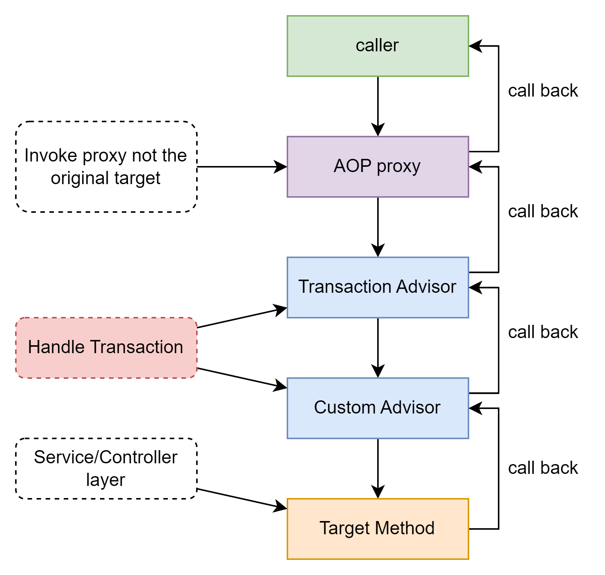

# Springboot 4

## Managing Transaction

这次主要是观察spring如何去开启和管理事务。代码倒是没有什么特别的，就是一个业务层，加spring自带的CommandLineRunner做测试。主要是分析@Transantional这个注解。
话说我记得好像当时笔试题里也有关于这个注解来着，哈哈。

回归正题，这次唯一用到@Transactional的方法如下

```java
@Transactional
public void book(String...people){
        for(String person:people){
        log.info("Booking "+person+" in a seat ...");
        jdbcTemplate.update("insert into BOOKINGS(FIRST_NAME) values (?)",person);
        }
        }
```

整体逻辑就是用JdbcTemplate模拟向数据库插入，修改数据(H2数据库)。由于不知道同时会传入几条数据，所以就用了可变参数。方法内部就直接输出一下，然后更新数据库。
整体比较简单，主要是最上面的注解。

为了深入理解一下@Transactional，还是先来看看spring是如何写这个类的。每个配置的作用都写在注释里面了。比较重要的注释会具体分析一下。

```java

@Target({ElementType.TYPE, ElementType.METHOD})
@Retention(RetentionPolicy.RUNTIME)
@Inherited
@Documented
public @interface Transactional {

    @AliasFor("transactionManager")
    String value() default "";

    // 具体事务管理器Bean
    @AliasFor("value")
    String transactionManager() default "";

    // 事务标签
    String[] label() default {};

    // 事务传播级别
    Propagation propagation() default Propagation.REQUIRED;

    // 事务隔离级别
    Isolation isolation() default Isolation.DEFAULT;

    // 事务超时时间
    int timeout() default TransactionDefinition.TIMEOUT_DEFAULT;

    String timeoutString() default "";

    // 只读事务
    boolean readOnly() default false;

    // 规定哪些异常触发回滚 异常类激 或 异常类名
    Class<? extends Throwable>[] rollbackFor() default {};

    String[] rollbackForClassName() default {};

    // 规定哪些异常不触发回滚 类和类名
    Class<? extends Throwable>[] noRollbackFor() default {};

    String[] noRollbackForClassName() default {};
}
```

首先Spring官方表示，这个注解只能用在方法或者类上，其它任何形式都不可以。当使用在类上的时候，就表示所有的这个类和它的所有子类的所有方法全部自动加上@Transactional。
但是它的父类不会加。本质上，spring是利用AOP的思想来管理事务的。这也就解释了为什么注解只能用在方法上，并且还必须是public方法。因为AOP的原理就是通过切面的思路，在执行到某个逻辑的时候，进行其它操作。

那么这个AOP其实用到了两个类——TransactionManager和TransactionInterceptor。这一对东西其实也不陌生，因为拦截器配一个管理类很像是网关加Controller的组合。
既然是AOP，那我们就先来看看切面类。

### TransactionInterceptor

其实讨论这个之前，我挺想说一下代理模式的。之前java基础里提到过代理的概念，但是当时还不知道切面等思维。现在回来再看代理，其实和切面是可以结合起来的。
所谓的TransactionInterceptor就是同时利用了代理和切面的思维。



上图算是比较清晰的展示spring管理事务的方法，当使用TransactionInterceptor的时候，实际上是用过代理的方式来和对象交互的。其实这种代理我感觉就是@Autowired的前身。
当调用者拿到对象后，spring会利用两个AOP advisor来实现事务管理。比如在Transaction
advisor中开启和关闭事务。然后让用户自己定义一些需要的步骤，比如先读个数据啥的。
最后在跑业务层逻辑。由于是切面，所有的逻辑跑完都可以直接callback，重新回到调用者手上。以上就是spring大体管理事务的思路。

也就是说，controller其实一直以为它在和原始对象交互，但实际上是代理对象在交互。

下面再从源码的角度来验证这个说法

```java
public Object invoke(MethodInvocation invocation)throws Throwable{
        Class<?> targetClass=(invocation.getThis()!=null?AopUtils.getTargetClass(invocation.getThis()):null);

        return invokeWithinTransaction(invocation.getMethod(),
        targetClass,new CoroutinesInvocationCallback(){...});
        }
```

当TransactionInterceptor执行invoke方法的时候，最终返回的是invokeWithinTransaction的结果，直接点进去看这个方法。

```java
protected Object invokeWithinTransaction(Method method,@Nullable Class<?> targetClass,
final InvocationCallback invocation)throws Throwable{

        // If the transaction attribute is null, the method is non-transactional.
        TransactionAttributeSource tas=getTransactionAttributeSource();
final TransactionAttribute txAttr=(tas!=null?tas.getTransactionAttribute(method,targetClass):null);
final TransactionManager tm=determineTransactionManager(txAttr);

        if(this.reactiveAdapterRegistry!=null&&tm instanceof ReactiveTransactionManager){
        ...
        }

        PlatformTransactionManager ptm=asPlatformTransactionManager(tm);
final String joinpointIdentification=methodIdentification(method,targetClass,txAttr);

        if(txAttr==null||!(ptm instanceof CallbackPreferringPlatformTransactionManager)){
        TransactionInfo txInfo=createTransactionIfNecessary(ptm,txAttr,joinpointIdentification);
        Object retVal;
        try{
        retVal=invocation.proceedWithInvocation();
        }
        catch(Throwable ex){...}
        finally{...}

        ...

        commitTransactionAfterReturning(txInfo);
        return retVal;
        }
        }
```

省略了中间一大堆复杂的异常处理和各种判定条件后，就会发现一个简单的问题。最重要的调用其实就是在invocation.proceedWithInvocation上。
这一步才是最终调用目标方法，而其他的所有都是各种AOP的方法，比如在它之前先开始事务等。

到这里我觉得spring使用TransactionManager和Interceptor管理事务的思路已经很清晰了。还有一个需要注意的就是，其实之前写的JdbcTemplate里面也有类似的思想。
使用callback来处理sql，不知道后面还会不会遇到更多的这种方式。

### 事务隔离级别

这里我指的是java JDBC内部规定的级别，其实这个应该是SQL规定的，然后MySQL原生支持。spring也是支持这个事务隔离级别。

| ISOLATION LEVEL              | TRANSACTIONS  |   DIRTY READS    | NON_REPEATABLE READS | PHANTOM READS  |
|------------------------------|:-------------:|:----------------:|:--------------------:|:--------------:|
| TRANSACTION_NONE             | not supported |  Not applicable  |    Not applicable    | Not applicable |
| TRANSACTION_READ_COMMITTED   |   supported   |    Prevented     |       Allowed        |    Allowed     |
| TRANSACTION_READ_UNCOMMITTED |   supported   |     Allowed      |       Allowed        |    Allowed     |
| TRANSACTION_REPEATABLE_READ  |   supported   |    Prevented     |      Prevented       |    Allowed     |
| TRANSACTION_SERIALIZABLE     |   supported   |    Prevented     |      Prevented       |   Prevented    |

脏数据没什么好说的，就是读到已经被修改的数据。不可重复读就是字面意思，在同一个事务中不可以重复读取数据。幻读比较不一样，就是说在修改某条记录提交前，
其它事务插入了一条和原数据一模一样的数据，最后导致修改数据看上去像没有成功。

事务级别本身没啥好说的，根据不同的需求使用即可。一般来说，DBMS默认的应该是TRANSACTION_READ_COMMITTED，但是不同的管理系统会有不同。

### 保存点 savepoint

颇有点游戏出生点的味道，在一个事务内部，java JDBC允许生成保存点，当后续事务出现问题的时候，可以回滚到上一个保存点。直接来看官方给的示范用例

```java
public void modifyPricesByPercentage(String coffeeName,float priceModifier,float maximumPrice)throws SQLException{
        con.setAutoCommit(false);
        ResultSet rs=null;
        String priceQuery="SELECT COF_NAME, PRICE FROM COFFEES WHERE COF_NAME = ?";
        String updateQuery="UPDATE COFFEES SET PRICE = ? WHERE COF_NAME = ?";

        try(PreparedStatement getPrice=con.prepareStatement(priceQuery,ResultSet.TYPE_SCROLL_INSENSITIVE,ResultSet.CONCUR_READ_ONLY);
        PreparedStatement updatePrice=con.prepareStatement(updateQuery))
        {
        Savepoint save1=con.setSavepoint();
        getPrice.setString(1,coffeeName);
        if(!getPrice.execute()){...}
        else{
        rs=getPrice.getResultSet();
        rs.first();
        float oldPrice=rs.getFloat("PRICE");
        float newPrice=oldPrice+(oldPrice*priceModifier);
        updatePrice.setFloat(1,newPrice);
        updatePrice.setString(2,coffeeName);
        updatePrice.executeUpdate();
        CoffeesTable.viewTable(con);
        if(newPrice>maximumPrice){
        con.rollback(save1);
        CoffeesTable.viewTable(con);
        }
        con.commit();
        }
        }catch(SQLException e){...}
        finally{...}
        }
```

我删掉了一些打印，主要看try-catch块中间的内容。当要执行某个CUD的某个任务时，先创建保存点，然后尝试执行，如果最终结果不满足要求，则可以回滚到相对应的保存点。
而且java甚至支持多个保存点。但是要特别注意，整个保存点的建立是完全处于同一个事务当中的。当然java也支持释放保存点，直接调用releaseSavePoint。

### TransactionManager

其实讨论到这里，TransactionManager的作用已经挺明显的了。就是不需要开发者手动开启事务，包括提交和创建连接。首先在springboot中，会通过自动配置类来直接配置数据源。
如果有写配置文件，就会按照配置文件进行读取。具体代码放在了org.springframework.boot.autoconfigure.jdbc下。源码我看了一下没有什么特别好分析的，毕竟配好了直接用，不太有什么变化。

### 事务传播级别

和事务隔离级别很像，它也是用来限制事务的特性的。不过这个传播级别应该是只在spring层面，并不是数据库底层或者JDBC规定的。

#### REQUIRED

默认的事务传播级别。如果没有事务就开启一个事务，如果有就直接加入。也就是说所有内嵌方法都属于一个事务。这里针对只读事务，我做了一个简单的测试。我把大事务外层配置readonly，
而内嵌事务中尝试CUD操作，不出所料直接抛出异常。之后我又把它们反过来，不出所料直接成功了。如此我可以断定这里REQUIRED的思路应该就是把内嵌事务直接放入大的事务中，并且按照大事务的规则走。
请看下面这段代码

```java
@Transactional(propagation = Propagation.REQUIRED)
public void updateById(Integer id){
        Book book=new Book(id);
        bookMapper.updateById(book);
        }

@Transactional(propagation = Propagation.REQUIRED, readOnly = true)
public void updateById(Book book){
        System.out.println("Update by entity");
        bookMapper.updateById(book);
        }

@Transactional(propagation = Propagation.REQUIRED)
public void getAndUpdate(Integer id){
        Book book=getById(id);
        book.setDescription("A sasdasdazxc book");
        updateById(book);
        }
```

测试用例

```groovy
def "read only B to A"() {
    given:
    def book = bookService.getById 8

    when:
    println "before update ---- " + book
    bookService.getAndUpdate(8)

    then:
    println "after update ---- " + bookService.getById(8)
}

def "read only A to B"() {
    given:
    def book = bookService.getById 8
    book.setDescription("test test")

    when:
    println "before update ---- " + book
    bookService.updateById(book)

    then:
    println "after update ---- " + bookService.getById(8)
}
```

根据这个操作第一个测试是可以成功通过的，而且数据也确实更新了。但是第二测试是无法通过的。当我直接调用updateByID这个方法的时候，由于配置了readonly，
整个操作直接失败，然后抛异常。但是当我使用嵌套式的方法，getAndUpdate就可以成功的把updateById的配置覆盖掉，从而骗过这个readonly。这里我感觉需要特别注意，
readonly应该是只读第一个开启事务的方法。并且很多时候它不能保证只读，所以不能依赖这个配置。

#### REQUIRES_NEW

每遇上一个内嵌的方法就开启一个新的事务。如果一个事务出问题，单独回滚那个事务，不影响其它嵌套事务。也就是每个小事务是会自己提交的。
同样，遇到readonly的时候，子事务（内嵌事务）是不会被readonly限制的。

#### SUPPORTS

SUPPORTS有点类似守护线程的感觉，就是如果这个事务是嵌套在别的事务里面，那么它就加入前一个事务，但是如果直接调用它自己的话，那么就不会开启事务。

#### NOT_SUPPORTED

如果在大事务中调用了小事务，那么小事务则不会影响大事务，也不会开启事务。也就是说，大事务中的小事务会把大事务挂起，单独以非事务形式执行小事务，并且它的成功不会影响大事务。

#### MANDATORY

不允许单独存在，必须属于某个大事务。也就是嵌套的方法必须保证隶属于一个大事务，并且这个会和这个大事务一起回滚或者成功。

#### NEVER

其实就是限制这个方法不能是一个事务。

### 事务回滚

默认回滚运行时异常和error。而且要注意的是有一些直接属于异常的非运行时异常是不会触发回滚的。其它需要回滚的部分直接就配置即可。

### 小结

@Transactional真的是个很好用的事务管理工具，但是同样非常多坑。比如readonly，事务传播级别等。基本上碰到实际案例的时候，只能提前设计好。比如考虑大事务的隔离等级等。，
一般来说应该是可兼容性高的事务等级用REQUIRED。

## Building REST services with Spring

redis前最后一个任务了，yeah！而且还是相对简单的，之前都已经使用过类似的方式很多次了，所以我就不在重复分析了。