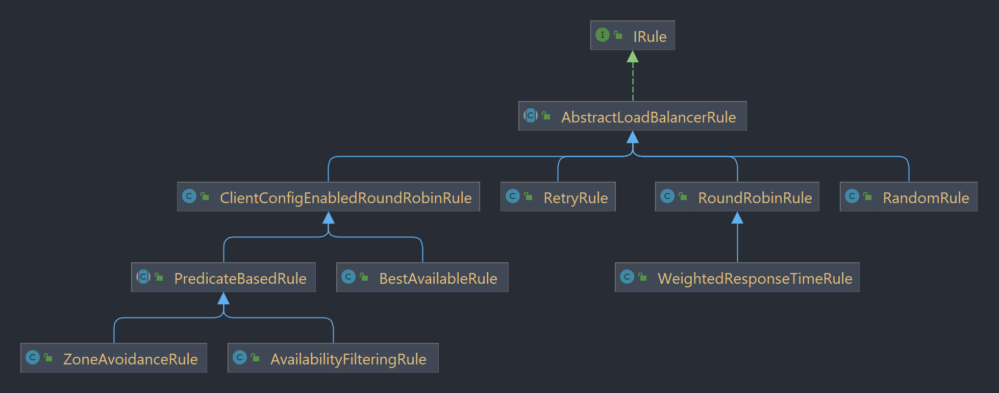

# Spring Cloud 1

## 微服务入门

之前所有学过的技术都是基于一个端口或者说一个服务来使用的。而当业务变的越来越多的时候，如果把所有逻辑写在同一个模块上，显然代码耦合度过高，不利于后期重构和调优。
那么拆分不同的业务就变得十分重要，于是就出现了微服务的概念。微服务实际上就是把注册，下单等不同业务分成独立的一个模块，统一由一个注册中心来管理，到需要调用的时候，
在按需调用。

按照咱们的技术栈，这次所有的微服务都是基于SpringCloud而不是SpringCloudAlibaba。凡是用到的微服务都会总结，但是其它冷门或者没有的就直接略过了。

## Eureka 入门

对于多个微服务而言，它们相互之间的调用是非常重要的。但是每一个微服务其实就是一个单独的实例，它们直接没有任何的直接联系。所以为了保证拆分后的每个服务都能准确的相互调用，
就需要把他们都注册到一个注册中心，这样就可以随意的相互调用了。那么我这里说的准确是指即使不适用注册中心，也可以通过硬编码的方式来请求，比如通过发送http请求的方式获取对象。

那么使用eureka的方式也比较简单，直接在依赖中加入spring-boot-starter-netflix-eureka-server。注意这里是server，因为eureka本身也是一个微服务，
所以即使是server模式，依旧需要配置url和application name。具体的配置方式如下

```yaml
server:
  port: 10001

spring:
  application:
    name: eureka-server
eureka:
  client:
    service-url:
      defaultZone: http://localhost:10001/eureka  # eureka address
```

配置的时候要注意把server port设置好，因为后面所有注册到这个注册中心都需要按照这个端口来。然后其它的就是比较常用的配置了，url也侧面说明了eureka本身也是一个微服务。
准备好配置后，就在application类中加入@EnableEurekaServer。如果是需要被注册的实例就无需配置这个注解。然后直接先启动注册中心，在把剩下的微服务启动后，会自动读取配置类并被读取。
当微服务启动后，直接访问这个端口就可以看到所有被注册的微服务了。

## Ribbon 负载均衡

当统一个服务被同时启动了多台实例后，用户在使用其中一个服务的时候，一般会有注册中心把多台实例的地址发给负载均衡，等待负载均衡器来选择合适的微服务。
比较简单的思路就是直接使用@LoadBalanced注解来自动实现负载均衡。这个@LoadBalanced注解需要怎么用呢？来看下面这个例子

```java
@MapperScan("com.jon.order.mapper")
@SpringBootApplication
public class OrderApplication {

    public static void main(String[] args) {
        SpringApplication.run(OrderApplication.class, args);
    }

    @Bean
    @LoadBalanced
    public RestTemplate restTemplate() {
        return new RestTemplate();
    }
}
```

这是我订单系统的微服务实例，但是由于我的订单连接到了用户，也就是user-service这个微服务，所以我创建了一个ResTemplate bean来发送http请求。
那么我可以在这个bean工厂方法上加入一个@LoadBalanced来保证它每次发请求的时候都会做负载均衡。这里直接看我在很短的时间内立即发送的两个不同请求。

```shell
11-15 16:02:05:166  INFO 18328 --- [nio-8080-exec-2] c.n.l.DynamicServerListLoadBalancer      : DynamicServerListLoadBalancer for client user-service initialized: DynamicServerListLoadBalancer:{NFLoadBalancer:name=user-service,current list of Servers=[localhost:8081, localhost:8082],Load balancer stats=Zone stats: {defaultzone=[Zone:defaultzone;	Instance count:2;	Active connections count: 0;	Circuit breaker tripped count: 0;	Active connections per server: 0.0;]},
Server stats: [
[Server:localhost:8081;	Zone:defaultZone;	Total Requests:0;	Successive connection failure:0;	Total blackout seconds:0;	Last connection made:Thu Jan 01 10:00:00 AEST 1970;	First connection made: Thu Jan 01 10:00:00 AEST 1970;	Active Connections:0;	total failure count in last (1000) msecs:0;	average resp time:0.0;	90 percentile resp time:0.0;	95 percentile resp time:0.0;	min resp time:0.0;	max resp time:0.0;	stddev resp time:0.0], 
[Server:localhost:8082;	Zone:defaultZone;	Total Requests:0;	Successive connection failure:0;	Total blackout seconds:0;	Last connection made:Thu Jan 01 10:00:00 AEST 1970;	First connection made: Thu Jan 01 10:00:00 AEST 1970;	Active Connections:0;	total failure count in last (1000) msecs:0;	average resp time:0.0;	90 percentile resp time:0.0;	95 percentile resp time:0.0;	min resp time:0.0;	max resp time:0.0;	stddev resp time:0.0]]}
ServerList:org.springframework.cloud.netflix.ribbon.eureka.DomainExtractingServerList@5efaab04
```

可以看到，eureka自动帮我把两个请求分别达到了不同的实例上，一台8081，一台8082。那么它的底层是如何实现的呢？不得不说，又到了每日源码环节。

首先在我的代码中，http请求的url是这样的

```java
String url = "http://user-service/user/" + order.getUserId();
```

如果直接把这个放入浏览器中，肯定是什么都访问不了的，因为user-service完全不是一个服务器端口。那为什么在负载均衡下，它可以准确的打到一个user-service实例上呢？
细想一下就直到肯定是用了类似网关的思路，把一个http请求先拦截下来然后在做处理。这里直接参考了网上的说法，一个http请求被负载均衡控制的时候会作用在LoadBalancerInterceptor类
这个类实现了一个ClientHttpRequestInterceptor的接口。所以先来看这个接口。

```java
@FunctionalInterface
public interface ClientHttpRequestInterceptor {
	ClientHttpResponse intercept(HttpRequest request, byte[] body, ClientHttpRequestExecution execution)
			throws IOException;
}
```

首先这个是一个函数式接口，那么它的唯一方法就是拦截。官方规定的实现标准里提到这个方法可以获取，修改http请求，并且返回一个相应结果。这里的修改很有意思，
因为一个http请求打过来，一般都是按照请求的需求直接做业务反馈，但是这里需要修改请求。所以我就继续去看它的实现。回到刚才的实现类

```java
@Override
public ClientHttpResponse intercept(final HttpRequest request, final byte[] body,
        final ClientHttpRequestExecution execution) throws IOException {
    final URI originalUri = request.getURI();
    String serviceName = originalUri.getHost();
    Assert.state(serviceName != null,
            "Request URI does not contain a valid hostname: " + originalUri);
    return this.loadBalancer.execute(serviceName,
            this.requestFactory.createRequest(request, body, execution));
}
```

可以看到，一个请求进来，它先获取url，然后通过getHost方法找到主机的名字。到这里我就明白了为什么一开始说注册eureka的微服务必须配置application name。
因为到这一步会提取微服务名然后映射到真正的端口上，不过这个逻辑是由负载均衡器提供的。所以我打了个断点去看看这个负载均衡器是否和网上说的一致——Ribbon。
我就不截图了，最终得到的是一个RibbonLoadBalancerClient的负载均衡器。那么它的具体作用又是什么呢？直接点进去看execute

```java
public <T> T execute(String serviceId, LoadBalancerRequest<T> request, Object hint)
        throws IOException {
    ILoadBalancer loadBalancer = getLoadBalancer(serviceId);
    Server server = getServer(loadBalancer, hint);
    if (server == null) {
        throw new IllegalStateException("No instances available for " + serviceId);
    }
    RibbonServer ribbonServer = new RibbonServer(serviceId, server,
            isSecure(server, serviceId),
            serverIntrospector(serviceId).getMetadata(server));

    return execute(serviceId, ribbonServer, request);
}
```

这个方法中的第一步就是直接通过serviceId来获取对应的负载均衡器，然后在通过负载均衡器和hint来获取对应的服务器。这里听起来有点绕，我个人的理解是
通过hostname，也就是http请求中的某某service，来告诉负载均衡器，我现在需要这个service的实例，然后负载均衡器内部其实已经记录了符合条件的实例。
这个我打了个断点然后看loadBalancer的字段中有一个allServerList，里面就有符合条件的服务器。所以当使用getServer的时候就是在选实例了，做负载均衡了。

那么这个策略是如何进行的，继续点进去，但是这次内部太长了，我就调重点的来说。它会先达到一个chooseServer方法上，那么这个方法会调用一个rule.choose。
这个rule就是netflix自己规定的接口。这个接口的实现类就是最终选取的方式，那么这里我找到了最终的那个方案，叫RoundRobbinRule，如果我理解没有错的话，就是轮询。
也就是按顺序一个实例一个实例来用。

### 策略

按照刚才提到了IRule这个接口由非常多的实现类。基本上可以说每一种就是一个策略，那么直接一个一个看过去好了。



#### ClientConfigEnabledRoundRobinRule

先看名字最长的，它底下有两个小策略，一个是BestAvailable，一个是PredicateBased。

best available就是字面意思，它会忽略哪些短路的服务器，选择并发数相对较低的服务器，这样服务器的可用性是最高的。

PredicateBased底下还有两个下策略，一个是ZoneAvoidanceRule，这个比较复杂。主要意思就是用Zone来规划服务器，把服务器分成不同的区域，
在区域内按照轮询的方式选择，也就是类似于分片区管理的方案。这个Zone的划分也是基于服务器的类型等来决定的。还有一个是AvailabilityFiltering，
它的思路是先检测服务器的状态。在默认的策略下，会先尝试连接一台服务器，如果一台服务器3次连接失败，那么就会被设置为短路状态，短路状态下的服务器还会再次被连接，
但是尝试连接的间隔会几何增长。只要是短路的服务器，那么这个策略下就永远不会选它。它还有一个条件就是如果配置了最大并发数，那么只要是超过或者达到了最大并发数的服务器，
就不会被选择。这个策略倒是有负载均衡的感觉了。

#### RetryRule

就是一直重试，没啥可以说的

#### RoundRobinRule

刚才也说过了这个就是轮询，当然它的一个子类就是权重轮询。也非常的好理解，只要给每个服务器一个权重，一般相应时间久的服务器权重就比较低。然后选择时候权重高的被选的几率高。
但是只是机率高，并不一定会被选，和java里面的线程优先级有点像，属实是鸡肋。

#### RandomRule

单纯的随机选一个

#### 修改策略

这个也很简单，就是在spring里面加一个bean，这个bean内部可以随便定义自己的规则，比如下面的代码

```java
@Bean
public IRule randomRule() {
    return new RandomRule();
}
```

当然这样的配置是全局的负载均衡配置，如果想要对单一的微服务来配，就需要使用yml文件了。基本格式如下

```yaml
[service name]:
  ribbon:
    NFLoadBalancerRuleClassName: com.netflix.loadbalancer.[Rule name]
```

### 懒加载

Ribbon默认的加载方式是懒汉模式的。这个通过第一次请求就能看出来，一般重启微服务后的第一次请求都会特别慢。那么如果为了更好的可用性，可以调成饥饿模式，直接在配置修改即可。

## Feign

在前面的用法中，我一直用的是最简单的http请求的方式来调用，但是在实际的开发中，如果是用上述的方案，即使通过application name做到了一定程度上的解耦，依旧是硬编码的形式。
所以不同微服务之间的调用肯定要有一个更好的技术来解决。那么这个Feign就是干这个用的。

具体使用也比价简单，首先是通过pom导入依赖。然后在要使用的微服务Application类上加入@EnableFeignClient。然后在创建一个Client类。这个类和想要使用的pojo应该一致。
比如我这里想要使用user，那么我就用userClient来命名比较好。这个类的写法如下

```java
@FeignClient("user-service")
public interface UserClient {
    
    @GetMapping("/user/{id}")
    User findById(@PathVariable("id") Long id);
}
```

可以看到它本身就是一个接口，而非一个类。这一点倒是非常像mapper，而实际上我自己理解它的功能就是mapper。还是先来谈用法，在接口上面加入@FeignClient注解，
这个注解会表示它是一个Feign的客户端，也就是可以调用别的微服务了。那么底下的方法上写入了一个@GetMapping，这个也就和RESTfulController很像，实际上就是按照那个改的。
当我需要在订单服务中请求用户服务的时候，本质上还是在用http请求，只是这里Feign帮我们把请求的url创建好了，不需要人工维护一个很长的url。如果现在一个请求需要上百个参数，
那么人工是无法维护的，但是这个只要一直加入入参就好了。

### 配置

下面来看一下它的一些配置。基本的配置不复杂，大概的配置方法如下

```yaml
feign:
  client:
    config:
      ${default}/${service-name}:
        loggerLevel: FULL
```

这里倒数第二层如果写的是具体的服务名字，就只会作用在特定的服务上，其它情况则是作用在全局。然后基本的配置有4个，比如日志级别——NONE，BASIC，HEADERS，FULL。
然后是decoder和encoder，主要是解析json对象和编码http请求使用。最后是Contract和Retryer，前者是用来支持其它注解，比如springMVC，后者则是刚才提到的重试机制。

当然还有一种配置方式就是通过配置类，这个也是spring里面的老生长谈了。

```java
public class FeignConfig {
    @Bean
    public Logger.Level feignLogLevel() {
        return Logger.Level.FULL;
    }
}
```

在配置完成后，需要在启动类或者具体的客户端注解上加入配置class文件。大概如下

```java
@FeignClient(value = "user-service",configuration = FeignClient.class)
```

这个的作用范围也是由加入的位置决定的。如果是加载@Enable那个注解上，就是作用在全局，注意@Enable是在启动类上的注解。然后上面这行代码的格式则是加载到具体的某一个服务上的。

### 简单原理

其实对于Feign来说，就像我前面提到的，它的功能更像是mapper。主要是把声明的接口方法变成一个http请求发给其它微服务，本质上还是一种http的交互。
它的一个底层实现也是通过URLConnection来做的，也就是不支持连接池。所以如果想要提高性能就需要使用连接池。那么目前比较主流的我看好像是Apache HttpClient。

### 解耦方式

即使直接使用FeignClient的方式来进行开发，依旧无法避免耦合度过高的情况。我这里说的耦合指的是既然FeignClient类的写法这么像controller，并且它们的功能也很像，
为什么不能直接继承呢？如果我写一个super类，其中包括所有的共同的方法，然后让Client类和Controller类都继承这个类，那么实际上解决了代码复用问题。同时又带来了耦合过高的问题。
因为如果这样操作，我是必要在每一个微服务中都写很多这样的类，并且只要修改了其中一个逻辑，所有的类都需要改。那么为了解决这种方式，有人提出了一个新的方案，
把Feign单独写成一个微服务，在这个微服务中暴露接口给其它微服务，这样就成功解耦了。但是同时又会带来没有办法继承，大量代码无法复用的尴尬。
因此对于这个问题，还是需要考虑实际情况在进行操作。那么我这里就是按照主流的方式，尝试了把Feign单独开成一个微服务。

基本方式很简单，先导入一下依赖，还是openFeign那个依赖。然后把之前我写的Client类直接放在这个新包下。然后在需要用到的微服务pom文件里导入它的maven坐标即可。
由于所有微服务都是同一个父模块下的，那么它会自动识别。此时所有feign包下的类都可以直接被导入。

```java
@EnableFeignClients(clients = {UserClient.class}, defaultConfiguration = FeignConfig.class)
```

迁移完成后，即使改掉所有的import，还是会出现找不到这个bean的情况。其实这个倒是比较简单，因为spring只会扫描本微服务的包，所以它无法直接扫描Feign包的内容。
但是如果强行要求它去扫描又失去了原先的设计思路了。所以最好的办法就是用上面的注解，之前我使用的时候因为Feign是直接在包内的，所以不需要去指定哪一个client要被扫描。
现在则需要通过clients这个集合来指定需要扫描的包，而且是精准的到哪一个class文件。