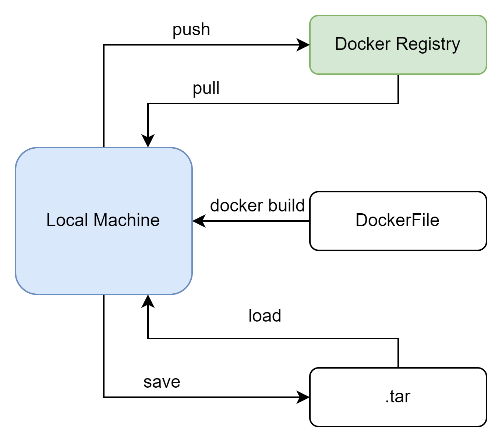
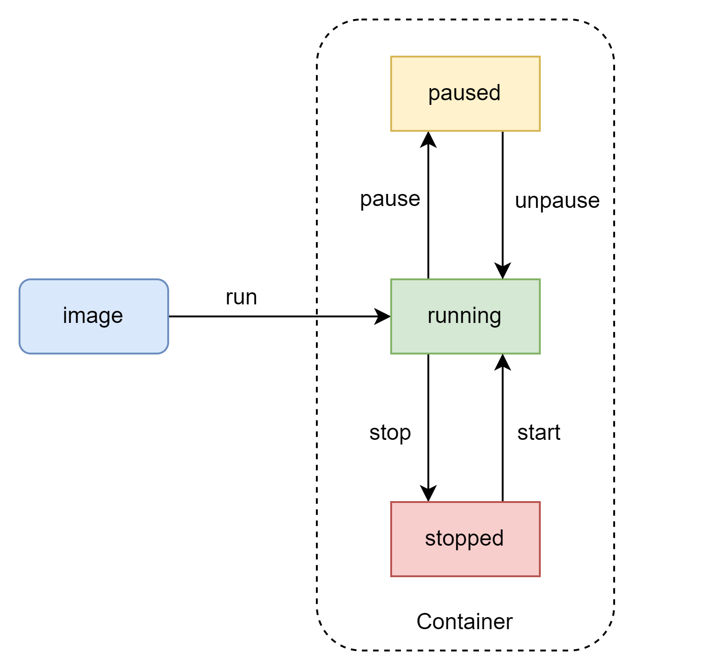

# Spring Cloud 2

## Gateway 网关

### 入门

老生常谈了，加入依赖，然后注册到服务中心。然后就是配置了，我个人觉得配置倒是比较重要。先来看一个简单的例子

```yaml
spring:
  application:
    name: gateway
  cloud:
    gateway:
      routes: # 网关路由配置
        - id: user-service  # 路由id 可自定义
          uri: lb://user-service # 路由目标地址的负载均衡
          predicates: # 断言
            - Path=/user/** # 路径由user开头则成功
        - id: order-service
          uri: lb://order-service
          predicates:
            - Path=/order/**
```

直接看gateway下面的东西，首先routes就是一个简单的路由配置，也就是打到网关的请求会直接分配到哪一个服务上。这里一共定义了两个路由，一个是user-service，
另一个是order-service。URI是用来指向路由的请求地址的，前面的lb就是负载均衡。然后最后的predicates表示的是请求路径的断言，也就是判断请求路径的正确性(符合条件)，
还有一个filter的配置后面用到的时候我在讨论。

### 断言工厂

spring对gateway的断言工厂做了非常好的整合，一共总结了11中基本的predicates。


| Predicate | Description                       | Example                                   |
| :--------: | :-------------------------------- | :---------------------------------------- |
|   After   | After a timestamp                 | After=2022-01-10T15:00:00.000${timezone}  |
|   Before   | Before a timestamp                | Before=2022-01-10T15:00:00.000${timezone} |
|  Between  | between two timestamps            | Between=${timestamp},${timestamp}         |
|   Cookie   | must contain one or more cookies  | Cookies=${cookie},${cookie},...           |
|   Header   | must contain a specific header    | Header=X-Request-Id,\d+                   |
|    Host    | must request a specific host      | Host=${host addr}                         |
|   Method   | must be a specific request method | Method=Get,...                            |
|    Path    | must match the http path          | Path=${http path}                         |
|   Query   | must contain specific variables   | Query=${name}                             |
| RemoteAddr | must within ip range              | RemoteAddr=${ip addr}                     |
|   Weight   | weighted rule                     |                                           |

个人感觉用的时候在回来查就好了。

### Gateway Filter

官方文档真的是太多了吧，一共34个过滤器，全部总结一遍也太多了。我尝试了前三个简单的过滤器设置，基本思路都是一样的，在yaml里面直接配置。
感觉应该比较容易掌握，所以等后面上具体代码的时候，我在分析。

#### Global Filter

虽然可以使用yaml文件来直接配置全局的过滤器，但是这些依旧是配置文件层面上的操作。如果我需要直到某个请求的具体信息，并且做对应的处理，那么还是要回到java的层面上，
因此就需要一个全局的过滤器。幸好spring gateway已经规划好了这个方式。直接来看具体操作方案。

```java
@Order(-1)
@Component
public class AuthorizeFilter implements GlobalFilter {
    @Override
    public Mono<Void> filter(ServerWebExchange exchange, GatewayFilterChain chain) {
        // 获取请求参数
        ServerHttpRequest request = exchange.getRequest();
        MultiValueMap<String, String> params = request.getQueryParams();

        // 获取参数中的Authorization
        String auth = params.getFirst("authorization");
        if ("admin".equals(auth)) {
            return chain.filter(exchange);
        }
        exchange.getResponse().setStatusCode(HttpStatus.UNAUTHORIZED);
        return exchange.getResponse().setComplete();
    }
}
```

上面写了一个非常简单的网关过滤器，然后利用ServerWebExchange对象来处理处理所有的请求。先来看这个接口的实现，所谓的GlobalFilter就是一个spring cloud gateway定义的通用接口。
它的内部只有一个方法就是过滤。按照官方的java文档描述，这个接口就是用来处理一个http请求的，并且把处理好的请求交给链上的下一个过滤器。这个还是比较好理解的，
一般来说不可能只有一个过滤器，当很多个过滤器同时使用，就需要考虑顺序问题。所以它也提供了一个Order的注解来规定过滤器的顺序，0是最高优先级。当然也可以通过实现Ordered接口来规定顺序，这两个方法没有区别。

下一步就是实现过滤功能，首先看一下过滤方法的返回值，是一个MONO对象。我大概懂了这个对象的作用，其实就是一个反应式编程的实现。
不同于原先的静态方式,MONO我个人理解就是一个流。当流中的一个值变化的时候，流可以捕捉这种变化，用户可以通过一些给定的API来获取这个变化。整体的结构就是一个链，
而MONO本身就是这个链，其中的每一个节点就类似于一个状态的变化。当调用了OnComplete等API后，就表示这个链结束了，整个流已经完结了。
(以上的总结可能大部分都不太准确，因为NIO的MONO对象和Flux对象我真的没有时间细细去读。所以只是一个简单的总结。关于这个对象我真的是太年轻了，直接点进去准备看源码，
结果4800+行，果断放弃找官方的文档。结果官方写得更烂，完全看不明白。所以这个东西我打算这样，我会日常学习，慢慢总结。)

回到代码的部分，在这里我想用ServerWebExchange对象获得了一个http请求，然后把这个请求的参数全部取出来。在获取所有参数中的第一个，这里采取了硬编码的方式，
主要是了解用法。如果第一个参数是我想要的值，那么就直接扔到下一个filter。如果不是，就说明需要被拦截，所以设置一个状态码，然后直接返回给用户失败。

还有一个就是过滤器的排序，首先是看order值，谁小谁先。如果一样就按照DefaultFilter>局部路由>全局路由。

## Docker

如果都是用之前的方法来开启微服务，那么成本很大，而且非常的麻烦。所以平时开发就需要一个简单好用的工具来简化，那么docker基本就是干这个的。

### 镜像命令

安装和启动比较简单就不说了，主要是说一下基本的镜像命令，这里我做了一个简图。



说白了就是git，再结合一点maven的感觉。

### 容器命令

还是一样做了个简图



这个应该也都挺好理解，就是直接通过镜像文件开启一个容器。暂停就是吧docker容器所有的线程全部挂起，而停止就是直接杀死所有进程。

基本上主流的容器都会有官方认证的docker镜像，直接拉取，然后使用官方文档操作就好了。下面就已redis为例做一个简单的总结。

首先是上dockerhub上面找到这个镜像，直接搜redis，然后用`docker pull redis`直接拉下来，然后用`docker images`查看是否下载完成。再用`docker run --name [docker name] -p [host port]:[container port] -d [image name]`
开启容器即可。

### 数据卷 volume

数据卷就是一个虚拟的目录，指向宿主机的某个真实目录。默认情况下它的位置是/var/lib/docker/volumes。docker开启一个新容器，就会应该再目录下开启一个新目录，
一般来说，这个目录的名称就是开启的容器名称。这样即使容器被停止了，或者被删除了，那么数据依旧是把保存在数据卷中的。感觉主要好处就是提高复用性，虽然也就一定程度上解决了耦合，
但是还是会有文件位置问题。

#### 挂载数据卷

当启动一个容器的时候，通过`-v`命令来挂载数据卷，把一个容器挂载到数据卷上。这个还是比较简单的，注意挂载的位置即可。

