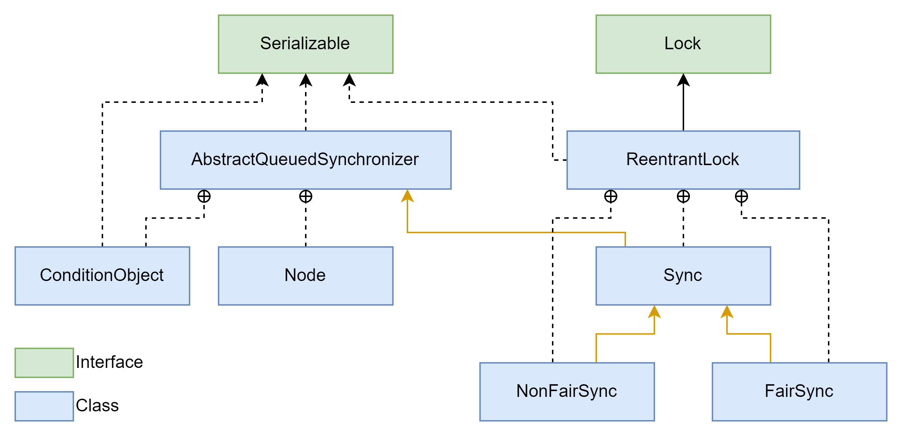
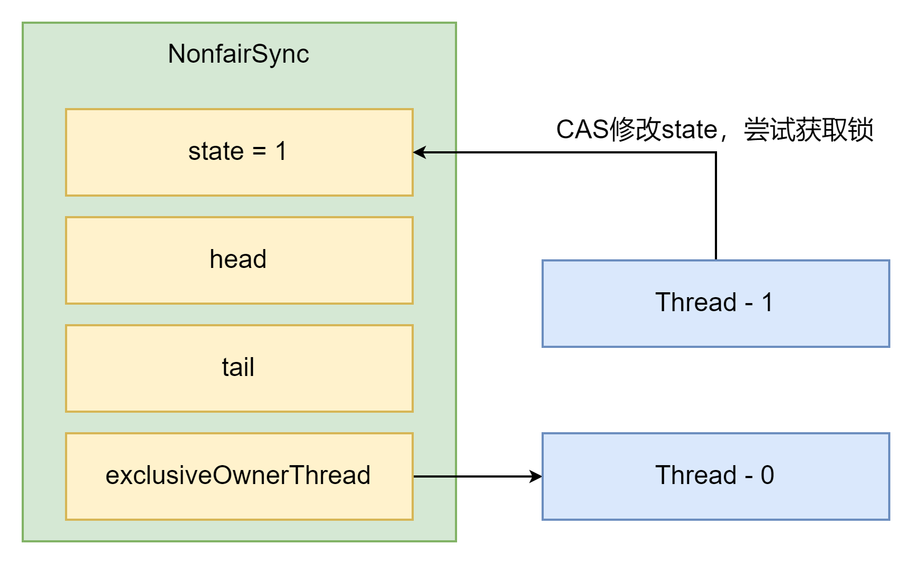
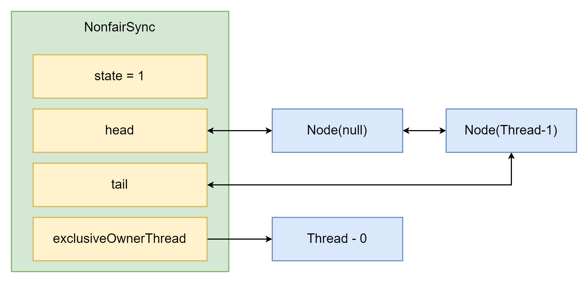

# 补充

非禅道任务，但是由于可能会用到，所以对之前可能漏掉的内容进行了补充。

## 异步模式之工作线程 Worker Thread

有限的工作线程分工处理不同的任务，当然它也是一种享元模式。对比一个任务开一个线程的模式节省了很多资源。

### 饥饿

当使用固定大小的线程池可能会出现饥饿现象。它的表现很像死锁，但是它实际上并不是死锁，而是由于线程池中的线程数量不够导致。举个例子，如果一共有两个线程在线程池中，
现在有三个任务，三个人任务都可以并行，但是由于前两个任务把线程都占用了，而第三个任务没有救急线程。这种情况下，如果前两个线程需要第三个任务的结果，那么第三个任务就会被饿死。
永远也不会线程运行它，并且由于不是死锁，所以很难检查出来。

### 解决方案

那么无脑扩容能不能解决呢？答案是肯定的，一直加入新的线程不就一直有新的线程来处理任务了吗？但是显然这样无法根治这个问题，为什么呢？

如果有出现了一种新任务，那么当前的线程又不够用了，所以一直扩容一定不是最好的办法，而且上下文切换和硬件瓶颈也会限制住效率。那么这个的意思就很明显了，如果我想要它永不被卡住，我就得保证不同类型的任务要有不同的线程池。
并且这个线程的数量也要根据不同任务的时间和级别来。之前反馈里提到过CPU核数+1是线程数比较合理的设计。一般来说可以使用下面的计算公式

$$
Threads = Cores \times Expected CPU Usage \times total Time \times CPU CalculationTime
$$

## Timer

太老了，可以说完全过时了，就是做个了解，具体代码放在TimerTest里面了。也没啥可讨论的地方

## ScheduledExecutorService

基本上代替了timer的位置，它和之前的单例线程池很像，即使前一个任务出现了异常，依旧会开启一个新线程来处理后续的问题，所以不会导致程序崩溃。
当然它也可以定时执行,并且规定间隔时间。不过由于用的不多所以也就不深入了解了。

使用scheduleAtFixedRate完成一个每周一次的任务

```java
// 确定开始时间
LocalDateTime now = LocalDateTime.now();
LocalDateTime time = now.withHour(18).withMinute(0).withSecond(0).withNano(0).with(DayOfWeek.THURSDAY);
if (now.compareTo(time) > 0) time = time.plusWeeks(1);
long initialDelay = Duration.between(now, time).toMillis();

// 时间间隔
long period = 1000 * 60 * 60 * 24 * 7;

// 创建线程池
ScheduledExecutorService pool = Executors.newScheduledThreadPool(2);
pool.scheduleAtFixedRate(() -> log.debug("3333"), initialDelay, period, TimeUnit.SECONDS);
```

利用LocalTimeDate先找出时间，然后在计算间隔时间。这个实现也比较简单就不多说了

## 处理线程池异常

通过submit方法获取future对象，然后使用get方法获取可能出现的异常。所以我上一篇反思中提到我觉得submit会是比较好的提交任务方式，因为它提供了保护性对象，而且比较容易处理异常。
但是缺点是占用内存，使用submit一定会在堆中创建一个新的对象，所以必然导致内存占用上涨，而且相对execute会慢一些。

## Fork Join

算是相对高级一点的线程池优使用模式。它主要是分治设计模式，把一个大任务拆分成很多个小的任务。JDK 7之后为了体现这种思想，使用了Fork/Join线程池。
要注意ForkJoin默认创建的线程池和CPU硬件的核心数相同。这个线程池如果后续用的多的话我在详细看一下，这里作为补充内容就简单略过了。

## JUC 工具包补充

### AQS - AbstractQueuedSynchronizer

其实就是一个阻塞式的解决方案，作为同步器工具的基本框架。直接看源码，它使用一个`state`来表示状态，并且不允许子类直接修改，只能通过改写setState来维护这个变量。
如果细看会发现它还使用Unsafe对象来实现了CAS乐观锁的机制。那么基于这些设计，不同的子类就可以通过独占或共享模式来分配资源，比如单例模式还是多线程模式。包括对资源的访问是共享还是独占。

它本身也提供了基于FIFO的等待队列，说是队列其实就是一个链表，不过它通过维护表头和表尾来实现FIFO的模式。

它当然也规定了条件变量来实现线程等待和唤醒机制其实就相当于ReentrantLock中的条件变量。

那么基于以上的理解，其实通过继承AQS，我们完全可以实现自己去定义一个锁的类。我把测试放在AQSTest里面了，就是一个简单的自定义锁。

### ReentrantLock 再探

#### 继承关系



之前就已经讨论过一部分的内容，这次就在重新梳理一遍。ReentrantLock本质上就是实现了Lock接口，序列化只是为了可转移（没有什么特别需要讨论的）。
内部就像之前说的一样，维护了一个同步类，主要是保证公平锁和非公平锁的。和上面谈到的AQS一样，这里的同步类其实就是继承自AQS同步器。

#### 非公平锁

让我们重新看一下非公平锁的加锁流程。先看下图



当然新的线程想要占有锁时，注意这里时调用lock的情况。那么内部其实调用的时tryAcquire，如果成功就获得，如果失败会重试，那么重试期间如果线程0释放了锁，那么就会成功。那么如果这里重试了几次还是失败了，那么就会转到下面的情况



这里又个很重要的区别，由于网上对这个解读都太老了，而我们用的JDK 17其实源码已经大改了。所以一下的流程是完全没有任何参考的，可能会有大的疏忽。到tryAcquire这一步都还是一样的，但是过了tryAcquire就变成acquire一个方法了。
话不多说，直接上源码

```java
Thread current = Thread.currentThread();
byte spins = 0, postSpins = 0;   // retries upon unpark of first thread
boolean interrupted = false, first = false;
Node pred = null;                // predecessor of node when enqueued
```

源码很长，我逐步分析一下，先来看上面这段，其实i就是一些准备工作，spins就是自旋次数，剩下的就是一些判断条件。pred则是上一个node，下面来看loop中的内容。

```java
if (!first && (pred = (node == null) ? null : node.prev) != null &&
    !(first = (head == pred))) {
    if (pred.status < 0) {
        cleanQueue();           // predecessor cancelled
        continue;
    } else if (pred.prev == null) {
        Thread.onSpinWait();    // ensure serialization
        continue;
    }
}
```

第一个if的三个条件分别是 非首节点、如果传入的节点为空，则上一个节点为空，否则就是直接调用上一个节点（其实就是保证了首节点永远是null）、并且首节点不是上一个节点。
都满足的情况下，就判断前一个节点的状态，保证前一个节点是合法的。

```java
if (first || pred == null) {
    boolean acquired;
    try {
        if (shared)
            acquired = (tryAcquireShared(arg) >= 0);
        else
            acquired = tryAcquire(arg);
    } catch (Throwable ex) {
        cancelAcquire(node, interrupted, false);
        throw ex;
    }
    if (acquired) {
        if (first) {
            node.prev = null;
            head = node;
            pred.next = null;
            node.waiter = null;
            if (shared)
                signalNextIfShared(node);
            if (interrupted)
                current.interrupt();
        }
        return 1;
    }
}
```

看上去很长，其实很好理解。如果先在的这个节点是首节点，那么就尝试获取锁，如果成功就和之前获取到锁的节点一样，把成员变量修改一下。可以把它想成最后的挣扎。

```java
if (node == null) {                 // allocate; retry before enqueue
    if (shared)
        node = new SharedNode();
    else
        node = new ExclusiveNode();
} else if (pred == null) {          // try to enqueue
    node.waiter = current;
    Node t = tail;
    node.setPrevRelaxed(t);         // avoid unnecessary fence
    if (t == null)
        tryInitializeHead();
    else if (!casTail(t, node))
        node.setPrevRelaxed(null);  // back out
    else
        t.next = node;
} else if (first && spins != 0) {
    --spins;                        // reduce unfairness on rewaits
    Thread.onSpinWait();
} else if (node.status == 0) {
    node.status = WAITING;          // enable signal and recheck
} 
```

这里更好理解了，如果node还没创建就创建一下。如果还没有放入队列就放入队列（这里也是用的CAS原理）。如果是第一个并且还没又自旋到位，就继续尝试。如果在队列中就把状态改为等待。
如果以上的都不是适用，那么就进入最复杂的部分。

```java
else {
    long nanos;
    spins = postSpins = (byte)((postSpins << 1) | 1);
    if (!timed)
        LockSupport.park(this);
    else if ((nanos = time - System.nanoTime()) > 0L)
        LockSupport.parkNanos(this, nanos);
    else
        break;
    node.clearStatus();
    if ((interrupted |= Thread.interrupted()) && interruptible)
        break;
}
```

先确认自旋次数，然后看是否需要限时等待，无需的话就直接park。需要的话则限时等待。并且清理节点的状态，归为0（其实就是清除等待状态）。然后用判断是否中断等待。
最终上面的所有都没有成功，就调用`cancelAcquire`来取消获取。

**释放锁**

其实释放锁的过程就很简单了，就是正常的该值，尝试释放。没有什么特别需要分析的，和前几个JDK没啥大的改动。这里唯一需要注意的是jdk中这个头节点为了维护，会把所有从等待队列中获取到锁的node设为null。
这样首节点就永远为null。

**可重入原理**

其实就是通过tryAcquire来实现的，现在的逻辑其实比之前修改了很多，之前在tryAcquire内部判断，但是现在是在tryLock的时候做出大量判断，然后在tryAcquire就判断一下位置。
如果是当前线程就给acquires加一，失败就跳到队列中。

为了保证可重入性，所以tryRelease中也要相应的减少acquires的值。

**可/不可打断模式**

其实很简单，从线程打断的角度去理解。这里所谓的打断还是调用interrupt而已，所以如果使用lock则不可被打断，因为它没有设计如果处理打断标识。用lockInterruptibly则可以打断，因为会处理打断标志位。

#### 公平锁

其实就是通过hasQueuedPredecessors来实现的。就是看队列里有没有第二个人，如果有并且你不是，那么就一定有在你前面的。所以就不是你被唤醒。

#### 条件变量

所谓的Condition就是AQS中的ConditionObject内部类。所以这里又是继承下来的结果。注意这里需要特别注意，由于条件变量的引入，原先处于Sync中的链表就会转移到condition上。这么说可能有点晕，
其实意思就是如果一个线程等待的是某个条件变量，那么就不用考虑把它放入Sync大类的链表里，而是放到ConditionObject的链表里。还有一个区别是Cond中的链表是没有null表头的。


### ReentrantReadWriteLock

支持可重入的读写锁。因为实际情况下，读比写要来的多的多，所以可以同时读写来提高并发度，只要保证锁住的表没有问题即可，当然其中也会有一些乐观锁的内容。如果说都是读操作的，那么完全的并发也不是不可能。

使用这个方式的话，一定需要有一个数据容器类，类似于保护性对象模式，这样安全度会提高。

#### 读写锁注意事项

重入时，无法先获取读锁在获取写锁，如果这样使用会导致写锁的永久等待。并且IDEA不会提示，这种死锁的情况很难也不好排查，所以应该避免。但是好玩的是，可以先获取写锁在获取读锁。
其实这个在JDK的源码中就给出了例子，当时用读写锁的时候，需要只要需要先读后写就必须考虑先释放读锁，其实我想了一下，这个释放锁的过程应该不会太占用资源，因为本身都是在一个线程内部变化，不存在上下文切换。
而且本质上只是一行代码，在CPU内部也就是几个指令，应该不会大幅度的影响性能，尤其是读后马上写的可能性也不大，应该不需要特别考虑减少使用。

#### 缓存读写方案

运用在具体业务中应该也是要考虑先存入数据库，再清空缓存。这样的好处就是如果我先存入数据库，那么就可以保证其它线程读到的时正确的值，虽然所有线程都需要再读一次数据，但是保证了不出现脏数据。

以上的方案还是只考虑了线程数比较少，并且缓存不会过期的问题。还有很大提升空间。

#### 原理

我大概看了一下源码，基本上和reentrantLock的实现原理差不多。主要是维护的state发生了变化。读写锁中的state是32位的Integer。前16位标识读，后16位标识写。根据这个模式，源码中修改了一些判断条件。
不过区别在于，因为现在是前后16位来判断，所以直接使用2进制会很方便。事实上源码也是这样做的，大量的使用了shift。读锁和写锁原来基本一样，都是利用链表来保证公平竞争。

虽然它还是使用了AQS中的node内部类，但是不同的地方在于这里每个在链表中的node都会被归类为独占或是分享。尝试获取同一个锁（读或写）就是被归为分享，而只有一个Node得到的锁则为独占。唤醒的方式也和ReentrantLock一样，
通过上一个Node来唤醒下一个。内部是调用的park/unpark这个方法。

这一块的源码我没有细看，如果我们业务中有大量使用的话，我后面会详细学习。

### StampedLock

更快的方法，实际上就是一种乐观锁的机制。基本上读锁会乐观地认为没有人修改数据，直到读完所有的数据再检查数据是否被写入了，如果没有则直接使用，有就重新读。如果在读远远大于写的情况下，这个方法一定读写锁要快很多，因为本质上其实读就没加锁。
它会提供一个方法来检查读和写的修改操作。测试方法写在StampedLockTest里了，因为整体实现比较简单，就不复制上来分析了。

### Semaphore

用来限制同时访问资源的线程上限的，我记得之前学verilog的时候学过这个，当时是开发板的编码。感觉java中的思路也很类似，都是限制最大使用量。
使用也很简单，就只要规定好semaphore的量，然后调用acquire即可。它也是可以实现公平锁的。

```java
public static void main(String[] args) {
    Semaphore semaphore = new Semaphore(3);
    for (int i = 0; i < 10; i++) {
        new Thread(() -> {
            try {
                semaphore.acquire();
                log.debug("running");
                try {
                    TimeUnit.SECONDS.sleep(1);
                } catch (InterruptedException e) {
                    e.printStackTrace();
                }
            } catch (InterruptedException e) {
                e.printStackTrace();
            } finally {
                log.debug("exit....");
                semaphore.release();
            }
        }).start();
    }
}
```

使用方式过于简单，就不讨论细节了。

### CountDownLatch

它的源码挺简单的，基本和semaphore一样。可以把他看成是反向的。一开始先规定有多少个线程需要被运行，直到等到所有的线程都完成了任务才可以继续。
使用也非常简单，就不复制上来了。

## 线程安全集合

来还债了，之前讨论集合的时候说过线程安全集合类要重点分析一下。我按照主流的说法分成了3个大类。

### 老古董

Hashtable和Vector，基本上Vector很少人在用了。而Hashtable虽然是线程安全的，但是由于ConcurrentHashMap等类的出现，基本上也很少使用了。

### Synchronized修饰的类

比如SynchronizedMap之类的，这些类的方法虽然也很多人使用，但是由于synchronized过于重量级，很难适应轻量级的应用，所以用的也不多。

### JUC下的并发集合类

例如ConcurrentHashMap之类的，这些类是JDK为了并发专门设计的类，所以基本上用的比较多，而且效率也相对较高。下面会针对这些进行详细的讨论。

## ConcurrentHashMap

其实集合的时候就讨论过HashMap的用法了，只是这里是线程安全的。部分API我就略过了，更多从原理的角度分析。注意之前提到过，JDK 8后就把底层改为了红黑树和链表了，不再是segment的方式。

### computeIfAbsent

这个的源码非常地复杂，我就不逐行分析了，和后面的put方法差不太多。主要是看到它的思路，如果map中没有这个元素，那么它会创建一个新的Node，并且用synchronized锁住这个新的node。
最后尝试用CAS加入map，整体其实还是有一个有锁的环境，但是相对于直接加锁还是快一些。如果有这个元素就直接返回元素本身。注意它的内部其实类似CAS，还是做了循环的，为了保证可以一直尝试修改。
如果出现多次修改不成功还是会占用一定的CPU的。其实我觉得最妙的是它用hashcode来看数据的位置以及状态，这个设计真的太精妙了。而且充分利用了二进制的优势来判断不同的情况。

### HashMap 并发死链问题

由于只有JDK 7的segment设计才会出现，我们用的17没这问题，所以我就略了。

### 成员变量

容量它用了private transient volatile来修饰一个int，并且是懒惰启动的。表中的链表用的是简单的内部Node类，和通常用的Node没什么大区别，可以是双向的。
Hash表则是一个Node数组，要特别注意虽然可能会变成红黑树，但是本质还是数组。扩容的时候会用到一个nextTable，也是一个Node数组。Node也有很多子类，比如forwardingNode用来标识迁移中已经解决的链表。

### 重要的内部方法

`tabAt`主要用来获取Node数组中第i个位置的值  
`casTabAt`是利用CAS修改数组中的某个值  
`setTabAt`是直接修改数组中的值不利用CAS （线程不安全）

### 构造器

其实和hashmap真的差不多，就是初始容量，负载因子，并发度。并发度这个量很有意思，其实就是最大容量，如果初始容量高于了并发度，那么就会自动把初始容量改为并发度。

### get原理

完全没有加锁，单纯的乐观锁方式，源码的思路就是利用hashcode先找到位置，然后直接get。如果没有则返回null，有就继续。由于使用了hashcode所以直接使用&代替取模运算，效率极高。
如果是在tree中的，那么就直接调用find方法来从红黑树中找。反之在链表中就用链表的方式查找。

### put原理

使用put的话，新的值会直接覆盖掉旧的值，这个非常重要。并且ConcurrentHashMap不允许有任何null值存入表。所以put会先检查null。注意它还是用了CAS来操作，所以依旧是线程安全的，只是会替换掉原有的值而已。

### initTable

其实就是一直等待一个线程把它创建好，思路还是CAS，利用CAS操作更新表的ctl值，有点类似之前的ReentrantLock的status头。直到一个线程成功，就会把新的表创建出来。当成功修改后，其它线程就会自动的读取到sizeCtl（volatile的）的值，
然后自动调用yield来尽量保证不抢占资源（不是100%，还是要看CPU的心情）。
