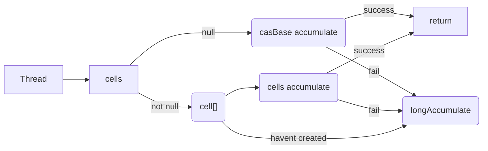

# 线程进阶 10

## 无锁并发

要求：1000个线程同时从账户中取钱，保证账户余额最终数额正确。要求使用无锁方式解决。

```java
class CASAccount implements Account {
    private AtomicInteger balance;

    public CASAccount(Integer balance) {
        this.balance = new AtomicInteger(balance);
    }

    @Override
    public Integer getBalance() {
        return balance.get();
    }

    @Override
    public void withdraw(Integer amount) {
        int next = balance.get();
        while (true) {
            int before = balance.get();
            if (before >= amount) next = before - amount;
            if (balance.compareAndSet(before, next)) break;
        }
    }
}
```

上面的代码只是一个简单的实现，利用了JUC包下的原子类。这个方法还可以被优化，后面会提到。现在就是简单的尝试一下API，

## CAS 工作方式

### CompareAndSwap 流程

其实这个之前也提过，当时是在研究锁升级的时候，从轻量级锁到重量级锁，其中对对象头中的内容改动是就用到了CAS算法。CAS全程是CompareAndSwap，并不是java特有的，其实它算是硬件端，但是大部分操作系统会有自己的实现。
不过在并发编程中，java根据这个算法实现了很多有用的工具。它的原理其实非常地简单，首先需要有三个值，旧的值，新的值，存放的地址。就像C中把变量存在地址中一样，CAS就是先把旧的值和存在地址中的值作比较，
如果相同则直接替换，不同的话就回滚（其实也不算回滚，这里主要为了表示原子性）。整个过程不存在锁。所以才把它称作无锁实现方式。

但是它是否真的安全呢？如果线程a刚做完比较，在修改值之前，线程2也完成了比较，那么就出现多次修改的情况了吗？为什么我们还是可以说它是线程安全的呢？针对这个问题我查了一下CAS具体在CPU中的表现。
其实这个操作看上去分为两步，但是在CPU中其实只有一步，到那时由于不同的操作系统已经CPU架构，这里的答案仅适用于x86架构。那么这一步是啥呢？`lock cmpxchg`这个指令才是CAS在CPU层面下的最终代码。
其实这里就已经很明显了，CAS并不是真的无锁，而是锁在了CPU级别。不过还要提一下的就是如果是单线程则不会出现这个lock。也就是说`cmpxchg`这个命令本身不是原子性的，在多线程的时候，指令中会自动加入lock来保证原子性。
这样说来其实原理也就和synchronized一样了。

结论就是CAS在单线程下确实是无锁的，但是到了多线程其实并非无锁，而是锁在了CPU级别（不同CPU架构会不一样）。

### 乐观锁 悲观锁

为什么说它是乐观锁，而synchronized是悲观锁。我个人是这样理解的，从乐观的角度来说，就是线程认为别人不会来修改我的共享变量，如果出现了修改的话，我就在尝试一次就好了。整体洋溢着乐观的气息，而悲观锁正好相反。
它会认为其它线程都想来动共享变量，那么它就必须保证它使用的时候别人都不能用。举一个简单的列子吧，比如我在火锅里放了好多菜，我想等到最后在捞某一个菜（共享变量）。这个时候我想先干别的事（其它语句），
如果我乐观地看待，就是我假设不会有其他人（线程）来夹这个菜。相反悲观地看，就是我假设肯定会有狗在我不注意的时候捞走。那么为了保证我一定能吃到，我就需要看着这个菜。当然看着它也有等级，我可以直接不让大家吃，直到我干完别的事（锁火锅类）。
那我也可以只盯着这个菜看（锁对象），不管别的菜了。当然我也可以不让大家夹菜（锁方法，本质还是锁对象或类）。

乐观和悲观不过是一种抽象的理解方式而已，但是一般认为使用乐观锁的话，读比写多会更适合一些。反之悲观则是写比读多。这也比较好理解，如果乐观锁中很多写的话，那么肯定会造成大量的重试，虽然没有阻塞线程，但是效率必然受影响。
而如果读比较多的话，不怎么改动共享变量，为何需要使用锁住它呢，这样别的线程必须得一直等，也是浪费了效率。

## JUC 原子类

### 原子整数类 - AtomicInteger

我就以AtomicInteger为一个例子来分析JUC工具包中的源码和原理。里面可能会涉及到UnSafe这个类，但是涉及不多，所以我会在后面在详细分析。

#### 简单使用

```java
AtomicInteger i = new AtomicInteger(0);
```

和打包过的Integer类很像，都是通过一个构造器来创建对象。构造器一共两种，无参构造直接生成一个初始值为0的原子整数，有参就是参数值。基本地修改和获取就是使用get和set，有点类似集合的方式。
AtomicInteger还实现了很多不同的自增自减方法。其实就是线程安全版的`i++`、`++i`、`i--`和`--i`。除了JDK 8加入的`update`和`accumulate`系列，其它所有的方法实际上都是对Unsafe类的调用。
先把Unsafe放一边，来看它自己实现的4个方法。

#### Update 和 Accumulate 系列

```java
public final int getAndUpdate(IntUnaryOperator updateFunction) {
    int prev = get(), next = 0;
    for (boolean haveNext = false;;) {
        if (!haveNext)
            next = updateFunction.applyAsInt(prev);
        if (weakCompareAndSetVolatile(prev, next))
            return prev;
        haveNext = (prev == (prev = get()));
    }
}

public final int updateAndGet(IntUnaryOperator updateFunction) {
    int prev = get(), next = 0;
    for (boolean haveNext = false;;) {
        if (!haveNext)
            next = updateFunction.applyAsInt(prev);
        if (weakCompareAndSetVolatile(prev, next))
            return next;
        haveNext = (prev == (prev = get()));
    }
}

public final int getAndAccumulate(int x, IntBinaryOperator accumulatorFunction) {
    int prev = get(), next = 0;
    for (boolean haveNext = false;;) {
        if (!haveNext)
            next = accumulatorFunction.applyAsInt(prev, x);
        if (weakCompareAndSetVolatile(prev, next))
            return prev;
        haveNext = (prev == (prev = get()));
    }
}

public final int accumulateAndGet(int x, IntBinaryOperator accumulatorFunction) {
    int prev = get(), next = 0;
    for (boolean haveNext = false;;) {
        if (!haveNext)
            next = accumulatorFunction.applyAsInt(prev, x);
        if (weakCompareAndSetVolatile(prev, next))
            return next;
        haveNext = (prev == (prev = get()));
    }
}
```

其实看一个就足够理解剩下的3个了，基本实现思路都是一样的。其实就是通过函数式编程的思维来解决问题。把一个给定的表达式作为参数，然后直接套用。
内部四个方法都是一个无限循环，这里和别的方式不一样的点在于它是内部循环，而不像Unsafe类中的方法需要编写的时候外部套上while。其次是内部循环中，它们也和别的方法一样使用了对比内存中值的方式来实现原子修改。
使用的时候注意一下先后次序就好了，get在前面就是返回旧值，反之就是新值，比较简单不需要过多的注意。

### AtomicBoolean

其实底层是维护了一个int，通过对这个int的修改和值的判断来返回true或者false。所有方法都是调用的Unsafe类，所以没有什么特别需要理解的。

### AtomicLong

就是维护了一个long，和AtomicInteger的方法完全相同，就是改成了long。

### 原子引用 AtomicReference

有了前面的经验后，其实就很好理解了，其它方法都是一样的。不过这里它的底层维护的是一个泛型变量V。那么创建的时候注意传入类型即可。

## 原子类问题

### ABA 问题

先看下面这段代码

```java
final static AtomicReference<String> ref = new AtomicReference<>("A");

public static void main(String[] args) throws InterruptedException {
    String prev = ref.get();
    new Thread(()->{
        log.debug("change A->B {}", ref.compareAndSet(ref.get(),"B"));
    }).start();
    TimeUnit.MILLISECONDS.sleep(500);
    new Thread(()->{
        log.debug("change B->A {}", ref.compareAndSet(ref.get(),"A"));
    }).start();
    TimeUnit.SECONDS.sleep(1);
    log.debug("change A -> C {}",ref.compareAndSet(prev,"C"));
}

/** 输出
 11:51:40.077 [Thread-0] DEBUG ABATest - change A->B true
 11:51:40.584 [Thread-1] DEBUG ABATest - change B->A true
 11:51:41.585 [main] DEBUG ABATest - change A -> C true
 */
```

如果只看输出的日志的话，会得到三个true。但是主线程中的true其实并不知道前面两个线程对这个变量的修改，所以虽然结果是对的，但是过程是不安全的。如果主线程无法感知到其它修改的话，可能会导致纠错困难。
为了解决这个问题，java中自带了一个AtomicStampedReference类

### AtomicStampedReference

重新修改刚才的代码，下面展示main中的内容

```java
String prev = ref.getReference();
int stamp = ref.getStamp();
log.debug("Stamp: {} current value: {}", stamp, prev);

new Thread(() -> {
    int stamp1 = ref.getStamp();
    log.debug("change A->B {}", ref.compareAndSet(ref.getReference(), "B",stamp1,stamp1+1));
}).start();

TimeUnit.MILLISECONDS.sleep(500);
new Thread(() -> {
    int stamp1 = ref.getStamp();
    log.debug("change B->A {}", ref.compareAndSet(ref.getReference(), "A",stamp1,stamp1+1));
}).start();

TimeUnit.SECONDS.sleep(1);
log.debug("change A -> C {}", ref.compareAndSet(prev, "C",stamp,stamp+1));
```

其实直接从类名上就能找到端倪，这里不过是用了一个邮戳来保证每次修改都会被一个戳记录下来。所以当我在从A->B的时候就不再是直接修改了，而是变成了A3->B4。这样就可以让主线程感知到之前发生的变化。
其实这种设计思路是比较合理的，从我个人的角度，一个重要变量的改动最好是都可以记录下来，虽然会占用一些资源，时间也可能更长，但是有利于后期的维护。这里在多思考的一个点就是类似数据库和git，如果每一个小的改动都能有log的话，那么对优化应该是好处的。

说回到这个类上，来分析一下源码。其实内部就是维护了一个泛型Pair类，把用户使用的reference和一个stamp联系在一起。其余所有的方法其实和之前差不多，就是要加入一个stamp。就像前面说过了，这样的维护成本确实有点高。
如果主线程其实只是想要直到他是否被改过而不是想直到具体的改动，那么这个实现就显得有些傻傻的。

### AtomicMarkableReference

基于上面的问题，java其实给出了解决方案。其实如果看源码的话就会发现它还是在维护一个泛型Pair类，但是内部的stamp变成了boolean。相对来说维护成本能好一点毕竟没有计算了，只是两个状态之间转换。

## 原子数组

和之前的原子类不同，当多个线程需要改动一个引用地址中的内容时，就需要用到原子数组了。我个人的理解是为了提高效率所以采用的原子数组，因为其实普通数组使用synchronized或者其它lock也可以解决问题。
但是原子数组是无锁的，至少表面上是无锁的。直接来看下面这个例子

```java
public static void main(String[] args) throws InterruptedException {
    demo(
        () -> new AtomicIntegerArray(10),
        (array) -> array.length(),
        (array, index) -> array.getAndIncrement(index),
        array -> System.out.println(array)
    );
}


private static <T> void demo(
        @NotNull Supplier<T> arraySupplier,
        @NotNull Function<T, Integer> lengthFun,
        BiConsumer<T, Integer> putConsumer,
        Consumer<T> printConsumer) throws InterruptedException {
    List<Thread> ts = new ArrayList<>();
    T array = arraySupplier.get();
    int length = lengthFun.apply(array);
    for (int i = 0; i < length; i++) {
        ts.add(new Thread(() -> {
            for (int j = 0; j < 10000; j++) {
                putConsumer.accept(array, j % length);
            }
        }));
    }

    ts.forEach(Thread::start);
    for (Thread t : ts) {
        t.join();
    }
    printConsumer.accept(array);
}
```

demo需要做的就是让数组中的10个元素全部自增到10_000，并且保证多线程下没有原子性的问题。如果使用普通的数组来实现就会发现不加锁是没有办法解决的。所以尝试采取AtomicIntegerArray的方案。
如果观察源码的就会发现其实和前面又是大同小异，底层维护的还是一个int数组只是通过了VarHandle这个类来保证线程安全。具体地实现就不细细讨论了，因为和之前的用法几乎没有区别。

## 字段更新器 AtomicReferenceFieldUpdater

这个类的主要作用是保证一个对象的成员变量的线程安全性。很重要的一个点是，这个必须配合volatile使用，否则会出现问题。我想原因也很简单。既然它要利用原子操作，那么可见性是必须的。
不过细看的话会发现其实和之前的类也是没有多大区别。所以也不深入分析了。但是我有一个小的思考就是，如果我真的需要保护一个field的话，其实锁或者是多线程并发的思路也许会更好，因为使用这个成本我觉得也挺高的。
因为需要明确知道需要保护的字段以及它的属性。很麻杆，而且也不一定快。

## 原子累加器

虽然原子整数类本身已经具备了自增自减，包括累加累减的能力。但是效率还是不够高，而java提供了一个相对来说更加简单的方式。也就是这里的原子累加器，那么针对不同的原子累加器，java里面有很多种不同的实现。
但是大同小异，所以这里就用longAdder做一个简单的分析。我在AdderTest里面做了一个小的测试，可以明显地看出来用adder的时候会快挺多的。

```java
2000000 cost: 36 ms
2000000 cost: 28 ms
```

是什么原因造成了这种性能的差异，还是需要阅读源码。上来就发现它在维护一个Cell类，这个Cell类是干嘛的？往上层走，看看striped64中Cell是干嘛的。

```java
@jdk.internal.vm.annotation.Contended static final class Cell {
    volatile long value;
    Cell(long x) { value = x; }
    
    final boolean cas(long cmp, long val) {
        return VALUE.weakCompareAndSetRelease(this, cmp, val);
    }
    
    final void reset() {
        VALUE.setVolatile(this, 0L);
    }
    
    final void reset(long identity) {
        VALUE.setVolatile(this, identity);
    }
    
    final long getAndSet(long val) {
        return (long)VALUE.getAndSet(this, val);
    }

    private static final VarHandle VALUE;
    static {
        try {
            MethodHandles.Lookup l = MethodHandles.lookup();
            VALUE = l.findVarHandle(Cell.class, "value", long.class);
        } catch (ReflectiveOperationException e) {
            throw new ExceptionInInitializerError(e);
        }
    }
}
```

Cell类其实只有一个成员变量，value。注意它用volatile保证了value的可见性。继续往下面看，一共有四个final方法。其中cas已经很熟悉了，reset也没有什么可以说的，getAndSet也是老朋友了。
其实具体的方法内容都不需要过于关心，主要是理解Cell本身其实类似long的Wrapper，自己封装了一些方法。唯一需要注意的方法就是CAS，但是前面已经讨论过了，所以就不重复说了。除了方法这个类的开头有这么一段`@jdk.internal.vm.annotation.Contended`。
这个其实是这个类的关闭部分，它保证了一些硬件级别的操作。网上对这个解读也挺多的，我大概总结了一下。

首先CPU中一共有三级缓存，然后如果从CPU时钟的角度来看，CPU到寄存器的速度大概是一个循环。到L1、L2、L3分别是4，15，45个循环左右。而到内存中则需要120个循环以上。那么为了保证处理速度，CPU会把一些指令和数据放入缓存中。但是不同核心的缓存之间不存在通信。
这样就又牵扯到一个缓存行的问题了。我们可以把缓存看成一个一个的缓存行，每一个缓存行对应一小块内存，根据网上的说法一般为64 byte。当数据被放入CPU缓存中后，就会出现数据副本，也是就是所谓的一个数据会出现在不同的核心上。
CPU为了解决数据的一致性问题，在硬件段，只要有一个缓存数据被改动了，其它缓存中的缓存行则必须失效。回到Cell，由于Cell是一个数组，大家都知道数组在内存中是一段连续的空间，不管是几维的数组。那么一个数组为24 byte（之前提到过的对象头和value），那么一个缓存行最多可以存下两个Cell数组。
那么当两个核心把Cell加载到缓存行中的时候，就会创建两个副本。加入现在一个核心把其中一个Cell的值修改了，那么第二个核心中的缓存行就自动失效，显然这个效率很低，因此核心二需要重新从内存中提取数据。那么如果我把两个Cells分别放入不同核心是否就可以解决这个问题了？

其实这就是contended注解的作用，我查到说法是通过给调用此注解的对象头尾分别加入128 byte。这样的话可以保证CPU读取到缓存的时候不会使用相同的缓存行。那么就不会存在相互失效的问题了。重点在于longAdder中是如何使用这个类的。我们来看adder中的add方法

```java
public void add(long x) {
        Cell[] cs; long b, v; int m; Cell c;
        if ((cs = cells) != null || !casBase(b = base, b + x)) {
            int index = getProbe();
            boolean uncontended = true;
            if (cs == null || (m = cs.length - 1) < 0 ||
                (c = cs[index & m]) == null ||
                !(uncontended = c.cas(v = c.value, v + x)))
                longAccumulate(x, null, uncontended, index);
        }
    }
```

其实这个源码看上去很复杂，其实就是规定了一件事，把一个数组分成很多个不同的部分，然后单独自增，最后在合并在一起。这里先要理解三个变量，首先是cells，就是个Cell数组。
然后是base，表示CAS操作的基础值，这里可以直接理解成旧值。最后是cellsBusy，功能类似boolean用来表示cells的锁状态。整体逻辑可以分成两条大线，如下图：



由于cs是一个懒启动，所以进入add的时候会先看cs的状态。如果不存在cells，那么就直接累加，成功就return，失败就longAccumulate（后面会分析）。如果存在cells
那么先判断是否被创建，如果cells已经被创建了，那么就分开累加最后合在一起。反之就直接longAccumulate。如果细细观察JDK 17，会发现longAccumulate参数多加了一个index，用来表示线程的index。
这个改动的实际意义我没搞懂，暂且认为是开发者想提前拿到线程而不用再次调用，节省时间。不过先来看一下longAccumulate的实现

```java
final void longAccumulate(long x, LongBinaryOperator fn,
                          boolean wasUncontended, int index) {
    if (index == 0) {
        ThreadLocalRandom.current(); // force initialization
        index = getProbe();
        wasUncontended = true;
    }
```

开头就是比较简单线程初始化。

```java
// 如果上次的cell的非空的话，那么这里的collide应该是true，基本逻辑就是如果两次以上true的话，cells应该会扩容。
for (boolean collide = false;;) {       // True if last slot nonempty
    Cell[] cs; Cell c; int n; long v;
    if ((cs = cells) != null && (n = cs.length) > 0) {  // cells已被初始化
        if ((c = cs[(n - 1) & index]) == null) {
            if (cellsBusy == 0) {       // 尝试获取cell
                Cell r = new Cell(x);   // 创建新的
                if (cellsBusy == 0 && casCellsBusy()) { // 获取锁 双重检查模式
                    try {               // Recheck under lock
                        Cell[] rs; int m, j;
                        if ((rs = cells) != null &&
                            (m = rs.length) > 0 &&
                            rs[j = (m - 1) & index] == null) { // 再次确认rs存在，并没有被别的线程修改
                            rs[j] = r;  // 赋值
                            break;  // return
                        }
                    } finally {
                        cellsBusy = 0; // 释放锁
                    }
                    continue;           // Slot is now non-empty 这里的collide依旧是false
                }
            }
            collide = false; // cell is non-empty
        }
        else if (!wasUncontended)       // CAS already known to fail 已知会失败
            wasUncontended = true;      // Continue after rehash     rehahs然后继续
        else if (c.cas(v = c.value,
                       (fn == null) ? v + x : fn.applyAsLong(v, x))) // 如果cas可能成功，尝试CAS，并且用fn预估结果
            break;
        else if (n >= NCPU || cells != cs) // CPU核心数不够，CAS失败了，退出本次循环
            collide = false;            // At max size or stale
        else if (!collide) // 第二次更新失败
            collide = true;
        else if (cellsBusy == 0 && casCellsBusy()) {  // 尝试自旋锁，并且扩容cells
            try {
                if (cells == cs)        // Expand table unless stale 双重检查模式
                    cells = Arrays.copyOf(cs, n << 1);
            } finally {
                cellsBusy = 0;
            }
            collide = false;
            continue;                   // Retry with expanded table
        }
        index = advanceProbe(index);    // 随机生成probe
    }
    else if (cellsBusy == 0 && cells == cs && casCellsBusy()) {
        try {                           // Initialize table
            if (cells == cs) {          // 双重检查模式
                Cell[] rs = new Cell[2];        
                rs[index & 1] = new Cell(x);    
                cells = rs;
                break;
            }
        } finally {
            cellsBusy = 0;
        }
    }
    // Fall back on using base
    else if (casBase(v = base,
                     (fn == null) ? v + x : fn.applyAsLong(v, x)))
        break;
}
```

大部分的解释我都写在注释里了，有些可能不太对，因此JDK修改了源码的一些顺序，网上找不到任何直接的分析，所以这里是结合了之前版本的实现。

基本逻辑就是cells，不存在，未加锁，没新建，那么就加锁然后创建，并且初始话一个cell。其它所有情况都是CAS base累加然后return。所有失败的情况就自动再次进入循环。

## LongAdder & AtomicLong

其实从最开始的测试中就能看出来，当多线程对同一个共享变量，或者数组进行累加操作的时候。LongAdder的优势是很明显的，尤其是累加操作变多，线程数变多的时候。但是由于longAdder也会受到CPU核心数的影响，
所以其实也是有瓶颈的。如果实际使用中，线程数不多，并发度不是很高的情况下，其实AtomicLong效果就足够了，而且不会阻塞大量的线程。LongAdder实际上还是会在硬件层面上产生锁的，所以轻量级的使用也不一定合适。
还有一个点是吞吐量，LongAdder的吞吐量和占用空间肯定会比AtomicLong大（毕竟碎片化了缓存），所以实际使用应该考虑CPU缓存和效率的平衡。