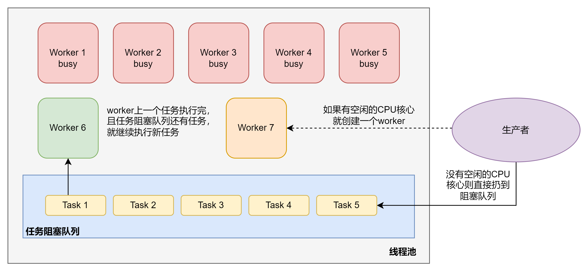
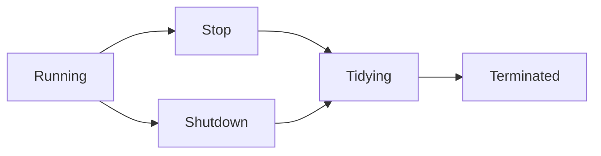

# 线程进阶11

## Unsafe

Unsafe对象从底层提供了操作内存包括线程的方法，java官方把它叫做unsafe其实也可以理解成不太符合java的一个设计初衷吧。我个人的理解是由于它给了java程序员类似于C程序员的权限，
允许出现修改内存指针，包括一些的底层操作。所以导致了整个程序变得不在像java的风格一样稳定。而且如果出错的话，也没有一个很好的机制可以检测和报错。所以很考验底层知识和代码能力。
而且在使用的时候还必须通过反射的方式。下面这段话也是出自源码中对它的一个解释。

> Although the class and all methods are public, use of this class is limited because only trusted code can obtain instances of it

也就是说Unsafe类的使用必须破坏封装（一定程度上），而且需要自己保证代码的准确性。这里我只想做一个基础的了解，所以就没有过多的深入，只要足够我理解上一章说的问题即可。
其实研究这个类最痛苦的是没有官方的docs，都一些网上的文章，很多说法都有待验证。下面我只取一些我验证了或者比较靠谱的总结。

### 单例对象

```java
public final class Unsafe {

    private static native void registerNatives();
    static {
        registerNatives();
    }

    private Unsafe() {}

    private static final Unsafe theUnsafe = new Unsafe();

    public static Unsafe getUnsafe() {
        return theUnsafe;
    }
}
```

上来就看到它是一个单例模式，全局只存在一个Unsafe对象切实static的。并且它是一个final类，可以说为了保证Unsafe类的Safe，java设计的时候也是煞费苦心了。
那么尝试使用一下吧

```java
Field theUnsafe = Unsafe.class.getDeclaredField("theUnsafe");
theUnsafe.setAccessible(true);
Unsafe unsafe = (Unsafe) theUnsafe.get(null);
```

虽然不是JDK的推荐用法，但是这个方法想对简单而且不容易出错。拿到的对象也肯定是Unsafe的唯一实例。通过这个实例就可以干很多事情了，比如获取偏移地址之类的。
利用偏移对象就可以尝试使用不同的Unsafe方法来直接操作，比如CAS操作，由于我获得了地址，所以就可以直接对这个地址该值。使用这个的话要特别注意共享变量需要volatile修饰。
还有要保证不存在伪共享的情况，不过伪共享已经被JVM的`@jdk.internal.vm.annotation.Contended`注解解决了。

## 不可变模型

### SimpleDataFormat 线程安全问题

```java
public static void main(String[] args) {
    SimpleDateFormat sdf = new SimpleDateFormat("yyyy-MM-dd");
    for (int i = 0; i < 10; i++) {
        new Thread(() -> {
            try {
                log.debug("{}", sdf.parse("1951-04-21"));
            } catch (ParseException e) {
                log.error("{}", e);
            }
        }).start();
    }
}
```

上面一段代码会打印出多次的异常，这反映了可变类的线程安全问题。从之前的研究来看，当然是可以使用synchronized来加锁，但是太重量级了。

### 不可变类 解决方案

使用不可变类来解决比较好。Java本身已经提供了一种解决方案了——DateTimeFormatter

```java
DateTimeFormatter stf = DateTimeFormatter.ofPattern("yyyy-MM-dd");
for (int i = 0; i < 10; i++) 
    new Thread(() -> log.debug("{}", stf.parse("1951-04-21"))).start();
```

那么输出的结果是不存在异常的。它能够做成线程安全的原因就是final关键字。这里我主要关注final这个关键字，而非类实现，所以就没细看源码。这里我先把DateTimeFormatter这类放下不谈，来聊一下String。
其实String在之前就已经研究过了，但是这次会侧重在final关键字。

还记得string是维护一个byte数组的，然后通过限定private hash来保证不可变性。由于final加在了类上，所有的方法也自动加入final。从JDK的角度，final可以理解成只读和不可修改，并且不可覆盖。
然而实际上，如果想用String的类，在不破坏不可变性的前提下，可以通过复用模式来解决。也就是在类中添加一个单例String，然后调用String的方法。为了更好的贴合不可变性，String也做了一个保护性拷贝的方式。
如果细看源码，会发现很多部分都加入了copyOf这个方法，其实这个算是双重保护，即使真的出现了可能的改动，也不会影响到最初的String地址中的数组。上述的实现其实在subString中有体现。

当然final也没有那么的过分，虽然不可变，但是是可重载的。比如同样名字的多态方法是可以用final来修饰的。那如果final和static同时又会怎么样呢？也很好理解，既然static的表现就是一段不同的内存空间，
那么加入了final就是既不能动也不能改，简称躺平。同时用final和static修饰的代码块，在内存中应该是一个稳定的空间。那么既然如此，也就说明必须要初始化才可使用，因为只有初始化后JVM才会分配一个空间。

让我们再回到只加final的成员变量上，如果一个类的构造器中给一个final和普通变量赋值，那么多线程下会发生什么呢？这里又牵扯到了重排序了，不过这次是JVM层面上的。加了final的成员变脸会保证不会被重排序到构造器之外。
但是普通的成员变量则不会。这里很关键，因为如果有两个线程同时读取成员变量，就可能出现普通变量完全不同的情况。所以需要特别注意。

以上应该把我能想到的组合都枚举了，如果还有遗漏的话，我后面会补上。

## 享元模式

23个设计模式中的一个，最小化内存的使用，尽可能地去复用一样的对象。

### Wrapper

所有Wrapper类中都会有valueOf这个方法，它的主要作用就把一部分已经缓存了的对象之前使用，减少对内存的消耗。对于Byte，Short，Long来说都会预先缓存-128~127。Character则是0~127.
当然我们也可以通过改变虚拟机参数来修改这个范围。我们的JVM启动参数中没有设计这个，说明我们不完全关注这个，我就没细看。

### 字符串池 和 BigDecimal BigInteger

这两个从JVM的层面做了享元模式。

## 初级自定义线程池

线程池其实运用了之前的生产者消费者模式，享元模式等。算是比较集合的一种高并发工具，为了更好地理解线程池，先从简单的自定义线程池开始。
具体实现由于过长就不复制了，基本模式如下图：



首先生产者会产生各种各样的任务。如果任务创建时CPU有空闲的核心，直接开一个worker（线程），反之就扔到阻塞队列。任务阻塞队列是一个公平的阻塞队列，保证先进先出。
如果worker完成自己的任务，且阻塞队列中还有任务，那就直接从阻塞队列中抽任务。为了保证整体的线程安全，阻塞队列的实现使用了ReentrantLock。worker抽取任务和生产者加任务，
都被锁住，且用await和signal来保证一定拿到。但是一段时间没有任务的话，就会出现worker一致阻塞等待任务，最终导致程序停不下来。所以在拿取任务的时候，提供了一个等待周期的方法，
这样即使出现拿不到任务，worker也会在一段时间后停下来。

上述的设计存在一个缺陷。如果任务过多，超过了阻塞队列的容量，那么生产者也只能被阻塞住，被动地等待。首先主线程会很被动，其次出现在客户端的话，体验会非常地差，等于点一个东西要等很久没有响应。
所以应该加入拒绝策略来减少等待。我个人可能会偏向生产者选择拒绝的方案。也就是说，如果出现阻塞满的情况，生产者可以选择是否抛出异常等。所以这里我想规定一个接口类。

```java
ThreadPool threadPool = new ThreadPool(1, 1000, TimeUnit.MILLISECONDS, 1, (queue, task2612) -> {
    // 死等
    queue.put(task2612);
    // 超时等待
    queue.give(task2612, 1500, TimeUnit.MILLISECONDS);
    // 放弃执行
    log.info("放弃执行");
    // 调用者抛出异常
    throw new RuntimeException("任务加入失败，自动抛出异常 " + task2612);
    // 调用者自己执行任务
    task2612.run();
}
```

设计了五种不同的拒绝策略。使用函数式接口，允许不同调用者采取不同的方案。

## ThreadPoolExecutor

首先它继承了AbstractExecutorService类，而前面这个类实现了ExecutorService接口。这个接口其实还挺重要的，但是我想后面在说。先来看一个线程池的状态问题。就像线程一样，线程池也有自己的状态。
这里比较省事的一点是线程池基本上可以只从java的角度去分析，因为它本质上是java层面的线程管理方案。虽然最终的调度还是CPU来执行，但是线程池本身的状态只存在于java层面。

### 生命周期



上面是一个线程池简单的生命周期。下面来逐个说明这里的意思

- Running：线程池中的线程正常运行
- Shutdown：调用了shutdown方法，不会接受新的任务了，但是会继续处理完阻塞队列中的剩余任务
- Stop：调用了ShutdownNow方法，会中断正在执行的任务，并抛弃阻塞队列的任务
- Tidying：任务全执行完毕，活动线程数量为0，等待被终结
- Terminated：终结状态

源码中，一个线程池状态底层是一个Integer，一共32位，前3位表示线程池的状态，而后29位表示线程数量，因此一个线程池最多可以拥有的线程量就是(2^29-1)。所有的这些信息都会被存在一个原子变量ctl中。
这样的目的也很简单，保证线程安全，且一次cas就能赋值。所以可以看到关于ctl的操作基本都是CAS算法执行的。初次创建的时候可以看到这样一段`private final AtomicInteger ctl = new AtomicInteger(ctlOf(RUNNING, 0));`,
这个部分调用了ctlOf这个方法，细看一下它的实现

```java
private static int ctlOf(int rs, int wc) { return rs | wc; }
```

rs表示的就是线程池状态，而wc则表示workerCount，既线程数量。合并的好处主要是一次操作即可修改全部，而不需要单独修改。并且Integer是一个32位的数，非常容易通过2进制的方式来修改，就像之前String中的思路一样，速度会更快。

### 构造方法

ThreadPoolExecutor提供了很多构造方法，就直接入参最多的那个。

```java
public ThreadPoolExecutor(int corePoolSize,
                          int maximumPoolSize,
                          long keepAliveTime,
                          TimeUnit unit,
                          BlockingQueue<Runnable> workQueue,
                          ThreadFactory threadFactory,
                          RejectedExecutionHandler handler) {
    if (corePoolSize < 0 ||
        maximumPoolSize <= 0 ||
        maximumPoolSize < corePoolSize ||
        keepAliveTime < 0)
        throw new IllegalArgumentException();
    if (workQueue == null || threadFactory == null || handler == null)
        throw new NullPointerException();
    this.corePoolSize = corePoolSize;
    this.maximumPoolSize = maximumPoolSize;
    this.workQueue = workQueue;
    this.keepAliveTime = unit.toNanos(keepAliveTime);
    this.threadFactory = threadFactory;
    this.handler = handler;
}
```

- corePoolSize：核心线程数量 （最多可保留的线程数）
- MaximumPoolSize：最大线程数（所有线程的最多数量）
- keepAliveTime：生存时间-救急线程
- unit：救急线程 生存时间单位
- workQueue：任务阻塞队列
- threadFactory：线程工厂（创建线程对象，给线程起名字）
- handler：拒绝策略

如果我规定一个线程池中的最大线程数为3，阻塞队列为2，那么它可以不使用拒绝策略处理的任务一共是5个（假设每个任务都需要很久完成）。
处理任务的线程又分为救急线程和核心线程。核心线程可以想象成不会消失的线程，知道线程池的任务完成才会消失，但是救急线程则不是，它主要是处理一些突发状况的，比如上面的例子中核心线程只有2个，那么当第五个任务尝试进入阻塞队列时就会失败。
然而线程池不会立即触发handler解决，而是开一个新的救急线程来处理任务5，当它的任务结束，并且不在需要新的线程时，它就自动消失。
当然它的使用有也限制条件，如果出现了有界的队列才会开启，并且线程总数还没有超MaximumPoolSize。当然不同的框架和技术对这个救急线程的应用也很不同。所以还是要根据不同的情况来看，比如tomcat就做了微调。

### 拒绝策略

拒绝策略JDK中给出了4个经典方案，DiscardPolicy，DiscardOldestPolicy，CallerRunsPolicy，AbortPolicy。直接来看源码，那么不约而同地，它们都实现了RejectedExecutionHandler这个接口。一看果然它是一个函数式接口。
和我之前给出的例子稍有不同，它定义了两个入参，Runnable任务和线程池。下面来看具体实现

#### AbortPolicy

这个最简单，直接抛出异常，告诉Executor哪一个task没执行。

#### CallerRunsPolicy

这个也好理解，如果线程池没有被中断的话，就让调用者自己执行任务（反客为主策略）。

#### DiscardPolicy

直接放弃任务，实现就一个空的lambda表达式。

#### DiscardOldestPolicy

这个比较有意思，就是把队列中的最早的那个任务放弃掉（喜新厌旧模式）。

当然大部分的第三方框架都没有直接使用jdk的4个经典策略，而是使用很多自己实现。其中netty好像就是创建一个新的线程来执行任务（感觉不好，线程池总数变得毫无意义）。

### newFixedThreadPool

```java
public static ExecutorService newFixedThreadPool(int nThreads) {
        return new ThreadPoolExecutor(nThreads, nThreads,
                                      0L, TimeUnit.MILLISECONDS,
                                      new LinkedBlockingQueue<Runnable>());
    }
```

创建一个固定大小的线程池，其中核心线程数即最大线程数（无急救线程）。所以也不需要超时时间。为了配合这个设计，任务阻塞队列也是无界的。
它的一个使用场景就是当不同任务都比较耗时，且任务量已知。因为比较确定，所以不太容易出错。

这里想要先讨论一下线程工厂的问题，其实如果观察源码就会发现线程工厂也不过是一个函数式接口，只要实现了这个接口完全可以自己定义线程工厂。

### newCachedThreadPool

```java
public static ExecutorService newCachedThreadPool(ThreadFactory threadFactory) {
    return new ThreadPoolExecutor(0, Integer.MAX_VALUE,
                                  60L, TimeUnit.SECONDS,
                                  new SynchronousQueue<Runnable>(),
                                  threadFactory);
}
```

带缓冲的线程池很有意思，它的核心线程数居然是0，而最大线程数为Integer.MAX_VALUE，也就是2^32-1的大小。急救线程的生存空间为60s。也就是说这个线程池中的所有线程都是救急线程。
这里它的队列采用的是SynchronousQueue。这个队列的特性就是它没有任何的容量，没有线程来拿是不能先放的（所谓的一手交钱一手交货）。其实这个可以理解成消费者一直在等生产者给任务，反之就是生产者在等消费者获取任务。
算是一种双向阻塞，这里请教了一下Ryan使用场景。感觉如果是需要保证线程安全且阻塞情况不多场景使用会比较好。但是如果出现了大量的任务，而消费者只有几个的话，会造成大量的阻塞，并且还有小概率出现线程饥饿的情况。
所以jdk设计这种缓冲线程池应该就是用来解决突然的高并发问题，比如一段时间突然出现了大量的并发，那么就可以用这个方法在无锁（消息队列）的情况下，速度解决一些任务。因为本质上它就是把任务从生产者传递到了消费者，并且去掉了一些可能出现的内存瓶颈。

### newSingleThreadExecutor

```java
public static ExecutorService newSingleThreadExecutor(ThreadFactory threadFactory) {
    return new FinalizableDelegatedExecutorService
        (new ThreadPoolExecutor(1, 1,
                                0L, TimeUnit.MILLISECONDS,
                                new LinkedBlockingQueue<Runnable>(),
                                threadFactory));
}
```

单例线程模式，整个线程池只有一个核心线程，它的阻塞队列是一个无界双向的链表。由于是核心线程，即使任务结束后，也不会消失。这个设计听上去很傻啊？那我干嘛不直接开一个线程处理任务，
非老半天劲最后还不是一样？我去看了一下它的原理才明白。它实际上就是像007一样的，线程池会监控这个单例线程，如果它出现了意外，比如终止或者任务失败，那么线程池会自动创建一个新的单例线程来取代之前的线程。
并且保持整个池种的线程数为1，这样我就不同担心因为线程死亡而造成的整体阻塞。下面来看一个例子

```java
public static void main(String[] args) {
    ExecutorService pool = Executors.newSingleThreadExecutor();
    pool.execute(() -> {
        log.debug("1");
        int i = 1 / 0;
    });
    pool.execute(() -> log.debug("2"));
    pool.execute(() -> log.debug("3"));
}

/** 打印结果
 11:13:14.357 [pool-1-thread-1] DEBUG ThreadPoolTest2 - 1
 11:13:14.359 [pool-1-thread-2] DEBUG ThreadPoolTest2 - 2
 11:13:14.359 [pool-1-thread-2] DEBUG ThreadPoolTest2 - 3
 Exception in thread "pool-1-thread-1" java.lang.ArithmeticException: / by zero
 */
```

可以看到虽然线程1失败了，但是线程2还可以继续执行剩下的任务，所以它的好处就是可以保证线程池永远又可用的线程。

## 线程池API

### 提交任务 submit

```java
public <T> Future<T> submit(Callable<T> task2612) {
    if (task2612 == null) throw new NullPointerException();
    RunnableFuture<T> ftask = newTaskFor(task2612);
    execute(ftask);
    return ftask;
}
```

submit的源码很简单, 就是利用newTaskFor直接创建一个future对象，然后执行这个future对象，注意submit返回一个future对象而不是future的结果。如果需要得到结果的话则调用get()即可。

### invokeAll

一共两个版本，一个带超时，一个不带超时。

```java
public <T> List<Future<T>> invokeAll(Collection<? extends Callable<T>> tasks)
    throws InterruptedException {
    if (tasks == null)
        throw new NullPointerException();
    ArrayList<Future<T>> futures = new ArrayList<>(tasks.size());
    try {
        for (Callable<T> t : tasks) {
            RunnableFuture<T> f = newTaskFor(t);
            futures.add(f);
            execute(f);
        }
        for (int i = 0, size = futures.size(); i < size; i++) {
            Future<T> f = futures.get(i);
            if (!f.isDone()) {
                try { f.get(); }
                catch (CancellationException | ExecutionException ignore) {}
            }
        }
        return futures;
    } catch (Throwable t) {
        cancelAll(futures);
        throw t;
    }
}
```

基本上也没啥复杂的地方，就是检查一下任务不是null。然后加到一个列表里，然后在一个一个执行就完事了。带时间的那个版本就是如果超时就直接cancelAll。基本上都挺直接的，就不做深入分析了。

### invokeAny

从源码的角度，invokeAny真的是挺复杂。由于源码过长，我就不放上来了。具体逻辑其实很invokeAll相同，也是上来先做一些sanity check。然后在用定界的一个arraylist存放，最后会把先执行完的返回，不过这次返回的是future的结果。

## 线程池关闭

### shutdown

把线程池变成shutdown状态（不代表直接关闭）。它会等待已提交和队列中的任务完成后才结束。并且它是阻塞执行的，假如主线程调用了shutdown，那么它不会一直等待shutdown运行完，而会直接运行后面的代码。
下面来看一下源码

```java
public void shutdown() {
    final ReentrantLock mainLock = this.mainLock;
    mainLock.lock();
    try {
        checkShutdownAccess();
        advanceRunState(SHUTDOWN);
        interruptIdleWorkers();
        onShutdown(); // hook for ScheduledThreadPoolExecutor
    } finally {
        mainLock.unlock();
    }
    tryTerminate();
}
```

这个也比较简单，就是先上锁，这个没什么好说的。然后就是状态检查，这个也很简单，主要来看下面的两个方法，`advanceRunState(SHUTDOWN)`,`interruptIdleWorkers`。

```java
private void advanceRunState(int targetState) {
    // assert targetState == SHUTDOWN || targetState == STOP;
    for (;;) {
        int c = ctl.get();
        if (runStateAtLeast(c, targetState) ||
            ctl.compareAndSet(c, ctlOf(targetState, workerCountOf(c))))
            break;
    }
}
```

advanceRunState方法主要作用就是改变线程的状态。之前提到过ctl，这里就再次用到了。利用ctl直接修改前三位的值，然后CAS替换。

```java
void interruptIfStarted() {
    Thread t;
    if (getState() >= 0 && (t = thread) != null && !t.isInterrupted()) {
        try {
            t.interrupt();
        } catch (SecurityException ignore) {
        }
    }
}
```

interruptIdleWorkers底层实际上就是调用每一个线程的interrupt。又到了interrupt问题了，所以上面我有标注shutdown并不能直接停掉这个线程池，而是要看情况。那么无事可做的线程就会打断，
而正在执行的还会继续（如果内部没有设计中打断方案的话）。最后调用`tryTerminate()`，尝试终结所有线程，如果有线程还在运行也不会等线程结束，而是直接完成shutdown的运行。

### ShutdownNow

把线程池状态变成stop，和前面的主要区别就是会把队列中的任务返回，并且打断所有线程。可以重点在于它所谓的打断不过是调用一次interrupt，依旧不是真实的打断。所以要特别注意，这个不能终止线程池里的所有线程，我个人把他定义成假中断。
所以shutdownNow其实就是把线程池中所有的线程都调用一遍interrupt。如果全部成功打断那么tryTerminate()就会成功，如果没有全部打断则还是会失败的。所以我看网上有人说这个是可以打断线程池，我觉得不准确。

## 小结

至此，线程池的基本用法就全部结束了。这次从线程池的工作原理出发，先用自定义方案后使用不同的策略，最后过渡到API上。基本上应该是把常用的线程池API搞清楚了。但是还有Scheduled类线程池还没有讨论，虽然不在禅道任务上，
不过我尽量花个1到2天总结完。