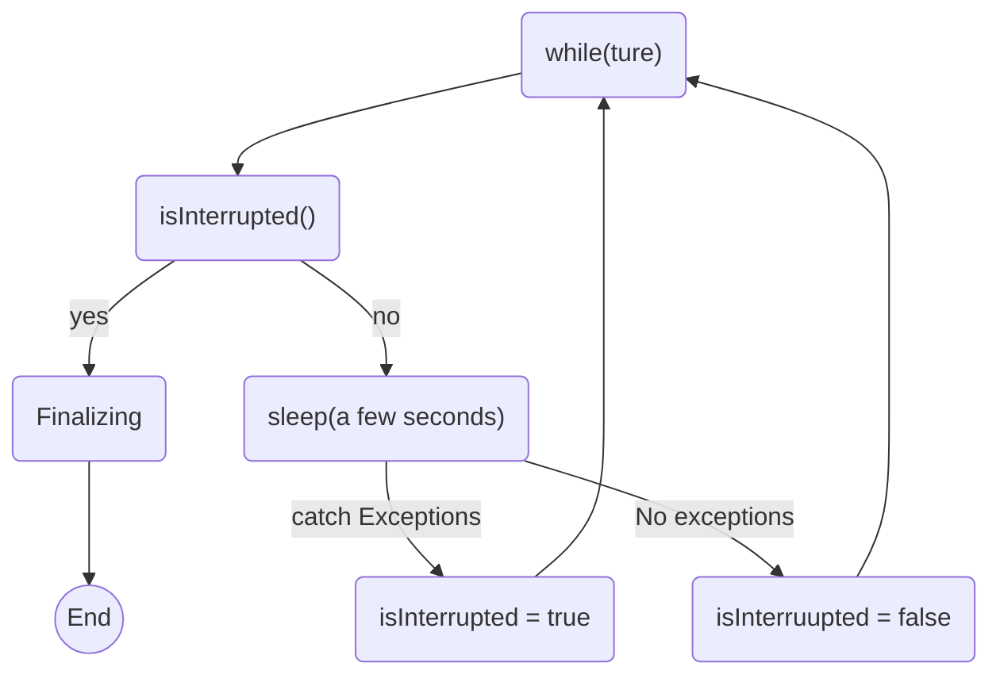
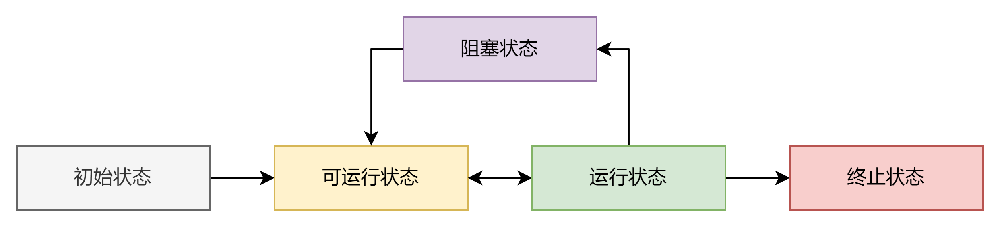
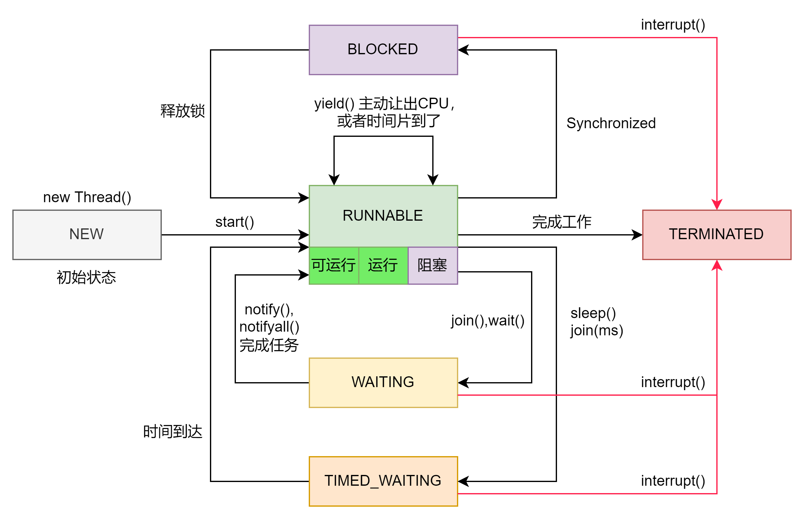
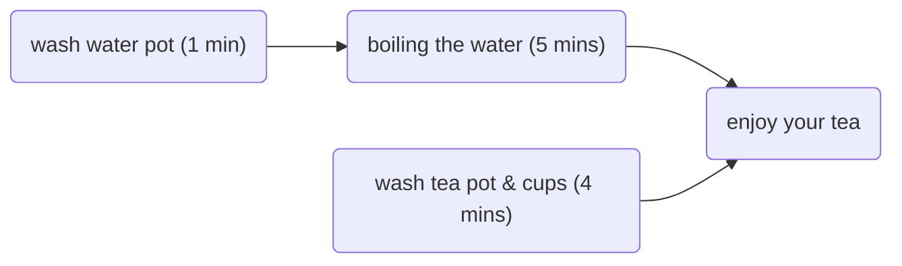

# 线程进阶3

## 昨天反馈中的验证

```java
// interrupt support

void JavaThread::interrupt() {
  // All callers should have 'this' thread protected by a
  // ThreadsListHandle so that it cannot terminate and deallocate
  // itself.
  debug_only(check_for_dangling_thread_pointer(this);)

  // For Windows _interrupt_event
  WINDOWS_ONLY(osthread()->set_interrupted(true);)

  // For Thread.sleep
  _SleepEvent->unpark();

  // For JSR166 LockSupport.park
  parker()->unpark();

  // For ObjectMonitor and JvmtiRawMonitor
  _ParkEvent->unpark();
}
```

这个是native interrupt的源码，C我已经忘光了。基本3个主流的操作系统都对应了三种不同的实现方式。但是大差不大，我就看了windows的这个版本。主要就是3个重要的操作
sleepEvent，parker和parkEvent。这里的三个东西一个都看不懂，但是不妨碍理解过程。  
第一个注释写的是thread.sleep，对应java源码里的打断sleep的情况。这里这个`unpark`，我查了一下，可以想象成就是打断或者唤醒一个线程。
它的原理就是如果判断出是一个sleepEvent的话，就会通过interrupt的那个标记位判断是否抛出异常。也就是Thread源码中提到的阻塞对象会直接抛出一个被打断异常的情况。  
第二个注释说的是关于锁的问题，这里我还没有研究到锁，但是看了一些分析。基本原理大概是java中如果有是使用`unsafe.park()`/`unpark()`的话，它就是一个计时条件等待的东西。如果使用了interrupt并不保证会直接打断，
或者抛出异常，得看具体使用的是哪一个锁。具体这个部分我也没搞明白。。。。  
第三个注释说的是监视器的问题，但是其实可以不用从这个方面理解。简单的解读就是和parkEvent相关，根据相关文章，这里的情况会比较多，如果是synchronized，那么其实并不会被打断，只是会被唤醒然后尝试获取锁，失败就继续循环。
但是如果是wait则根据是否为notify唤醒来判断要不要抛出异常。所以这里应该是对应java源码里的wait，join情况。  
既然这样的话，似乎NIO和IO的部分在windows的底层C码里没有找到。不知道是不是我遗漏了。然后关于interrupt这个方法的验证和使用，后面会陆续更新，目前只学到三种方法，还没有具体结合锁还有其它的问题。

## 优雅终止一个线程

### 暴力法（已启用）

在JAVA最初的版本中，提供了`stop`,`suspend`,`resume`之类的方法，但是从JDK 2后已被弃用。具体原因后面会讨论，主要和锁也有关系。可以通过stop的方法暴力的杀死一个线程，
虽然会有诸多问题，但的确是可以做到的。

### 两阶段终止模式

直接暴力的关闭线程可能会造成某个占用锁线程没有办法释放锁，从而形成了一个死锁。这样的设计显然是不行的。而且也太暴力，一点不优雅。于是就有人提出了两阶段终止模式。其实说白了就是给被终止的那个线程一个处理后事的机会，比较人性化。



根据经典的流程，复现上述的过程的代码

```java
public void start() {
    monitor = new Thread(() -> {
        while (true) {
            if (Thread.currentThread().isInterrupted()) {
                log.debug("被打断了");
                break;
            }
            try {
                Thread.sleep(1000); // 释放CPU占用
                log.debug("正常运行中...");
            } catch (InterruptedException e) {
                log.error("休眠中被打断，会重置打断标记,重新设置打断标记");
                Thread.currentThread().interrupt();
            }
        }
    }, "monitor");
    monitor.start();
}
```

代码的主题部分很简单，就是使用Thread自带的isInterrupted标记来判断线程是否被打断了。但是由于interrupt在打断sleep这种被阻塞线程时会抛出一个异常，并且把isInterrupt这个判断位改回false，
所以捕获异常后需要再次调用interrupt。根据昨天的研究，捕获异常并处理的时候，线程处于runnable状态，所以需要再次调用interrupt，保证标记为true。这样我设定的程序就可以保证捕捉到。

PS：volatile关键字可以继续优化这个实现，但是目前还没有研究到，所以暂时使用这种原始的方法

### 已弃用的方法

`suspend`,`stop`,`resume`三个方法在JDK 2后已经弃用了，主要原因是这三个代码都会直接破坏同步块从而造成死锁。所以最好不用

## 主线程 

主线程结束是否会影响其它还在运行的线程呢？

```java
public static void test1() throws InterruptedException {
    Thread t1 = new Thread(()->{
        while (true){
            if (Thread.currentThread().isInterrupted()) break;
        }
        log.debug("t1 已经结束了");
    },"t1");
    t1.start();

    Thread.sleep(1000);
    log.debug("main结束");
}
```

做了一个小测试，在if设了个断点。观察debugger里面的frames。可以看到main线程已经执行完了，但是t1还在一直循环。这说明只要还有线程（非守护）没有执行完任务，整个程序会一直运行。即便主线程已经结束了。

## 守护线程

顾名思义，守护线程就是一个守护其他线程的线程。在线程中基本承担一个保姆的角色。既然它守护别的线程，那么当所有其它线程都已经结束的时候，它的使命就已经结束了，所以它就会自动停止。
在上面那段代码的中start前设置Daemon为true即可将t1设置为守护线程。

```java
t1.setDaemon(true);
```

虽然t1的内部还是一个无线循环，但是由于t1已经变成了守护线程，所以在主线程完成后，t1就自动结束了。

### 守护线程类型

垃圾回收器就是一种守护线程。它一直在观察堆内存的中对象，当一个对象一直不被引用的时候，垃圾回收器就会自动的回收这个对象释放内存。这个和JVM的运行逻辑相关。显然如果程序停止了，那么垃圾回收器也应该停止，因为没有需要回收的对象了。

## 线程状态

### 操作系统 层面

  
根据昨天的总结，java中的线程状态定义和操作系统中的不太一样。我重新查了一下系统中的线程状态，一般分为5类，其实和java的定义非常像。
初始状态，可运行，运行，阻塞和终止。

|   线程状态    | 描述                                                                                                                     |
|:---------:|:-----------------------------------------------------------------------------------------------------------------------|
|   初始状态    | 可以理解为仅从语言状态创建了一个线程。比如Java中`new Thread`，这里还没有和操作系统关联                                                                    |
|   可运行状态   | 从java层面上来说就是告诉调度器，这个线程可以起飞了。此时已经和操作系统的线程相关了，CPU调度的时候会考虑执行某一个可运行的线程                                                     |
|   运行状态    | 已经获取了CPU的时间片，正在被运行（占用CPU）。当时间片用完，调度器会把它再次放回可运行状态（也就是放回调度队列。虽然叫队列，但是没有先来后到，全看调度器怎么想）。如果任务运行完，则会直接进入终止状态                 |
|   阻塞状态    | 线程需要等待别的线程，IO或者主动放弃CPU使用权一段时间。等待的时候就可以称为阻塞状态，但是注意这里是操作系统中的定义，java中的定义会有些许不同。阻塞状态完成后，线程并不会立即再次获得CPU，而是直接扔回调度队列，等待调度器的召唤 |
|   终止状态    | 所有被打断线程（和java的interrupt**没关系**）或者已经完成任务的线程都处于这个状态。一旦到达终止就不会在变回其它状态                                                     |

### JAVA 层面

  
java中的线程定义与操作系统中的略有区别，但是并不大。这里只是给出了一个简单的图示，并不完整，后续会优化。  
下表中加粗的地方表示的是java的阻塞和系统的阻塞线程大致相同

| 线程状态              | 描述                                                                                                                     |
|-------------------|------------------------------------------------------------------------------------------------------------------------|
| NEW               | 创建了一个线程，但是没有`start()`                                                                                                  |
| RUNNABLE          | 任何出刚出生的线程调用了`start()`就会变为就绪状态。但是由于java API层面上把操作系统中的状态合并了，所以这里的就绪状态其实涵盖操作系统中的可运行，运行以及阻塞（主要是IO导致的阻塞）。 因为java分不清楚BIO的阻塞。 |
| **BLOCKED**       | 调用阻塞API或者synchronized的代码块，有时候也和锁有关                                                                                     |
| **WAITING**       | `join`，`wait`和`park`导致在java中被称为waiting。                                                                                |
| **TIMED_WAITING** | `sleep`和`join(ms)`导致的阻塞在java中被归为TIMED_WAITING，注意这是java定义的阻塞不是操作系统的定义                                                   |
| TERMINATED        | 和前面完全一样，就是一种终止状态                                                                                                       |

### 6种状态的例子

简单的复刻了一下，应该没有什么问题。

```java
Thread t1 = new Thread(()->log.debug("这是t1线程"), "t1");  // 空线程

Thread t2 = new Thread(()->{
    while (true) {}
}, "t2");

Thread t3 = new Thread(()->log.debug("这是t3线程"), "t3");

Thread t4= new Thread(()->{
    synchronized (StateTest.class){
        try {
            Thread.sleep(100000);
        } catch (InterruptedException e) {
            throw new RuntimeException(e);
        }
    }
}, "t4");

Thread t5 = new Thread(()-> {
    try {
        t2.join();
    } catch (InterruptedException e) {
        throw new RuntimeException(e);
    }
}, "t5");

Thread t6 = new Thread(()->{
    synchronized (StateTest.class){
        try {
            Thread.sleep(100000);
        } catch (InterruptedException e) {
            throw new RuntimeException(e);
        }
    }
}, "t6");
```

结果如下

```shell
10:55:06.864 [main] DEBUG test.StateTest - t1 状态 NEW
10:55:06.865 [main] DEBUG test.StateTest - t2 状态 RUNNABLE
10:55:06.865 [main] DEBUG test.StateTest - t3 状态 TERMINATED
10:55:06.865 [main] DEBUG test.StateTest - t4 状态 TIMED_WAITING
10:55:06.865 [main] DEBUG test.StateTest - t5 状态 WAITING
10:55:06.865 [main] DEBUG test.StateTest - t6 状态 BLOCKED
```

就是一个小测试，没有什么特别需要讨论的。

## 线程基础 应用习题

### 题目要求

条件： 没有开水。水壶，茶壶，茶杯需要清洁。火已经生好，茶叶也有。  
需求： 最短时间内喝到热茶  

### 思路

从多线程的角度，可以使用4个线程来分别干洗茶杯，水壶，分配茶叶。但是由于之前说过的，这里一个线程需要工作的事情很少，占用时间也很短，如果使用4个线程则会出现频繁的上下文切换，反而是浪费资源的。
不如只使用2个线程。虽然一定程度上加大了单任务的时间，但是效率还是更优的，而且也方便管理。而泡茶的部分必须有开水和其它工具。烧水需要水壶。因此这个程序按照顺序执行应该是一下步骤



只开启两个线程，所以需要把上面烧水的部分合并，下面洗杯子的部分单独列成一个线程。

```java
Thread t1 = new Thread(()->{
    log.debug("洗水壶");
    Helper.sleep(1000); // helper方法，无需再写try catch块
    log.debug("烧水");
    Helper.sleep(5000);
},"烧水线程");

Thread t2 = new Thread(()->{
    log.debug("洗茶杯");
    Helper.sleep(2000);
    log.debug("洗茶壶");
    Helper.sleep(1000);
    log.debug("拿茶叶");
    Helper.sleep(1000);
    Helper.join(t1);    // 等待水烧开
},"清洗线程");

t1.start();
t2.start();

Helper.join(t1);
Helper.join(t2);
log.debug("茶来了");
```

这里的实现方法其实是单纯且不科学的，但是由于还没学习到notify和wait方法，所以暂时使用这个模拟。主要的问题有，t1和t2并没有交流，如果我希望t1和t2互换工作，就没有办法实现。
而且这里我让t2等t1，如果现实中t1比t2还快，那么就造成了资源浪费。所以需要一种机制去沟通和解决线程之间的切换问题。

