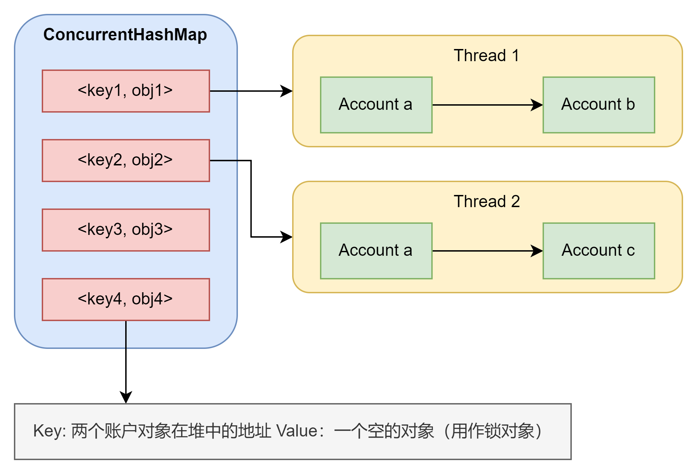
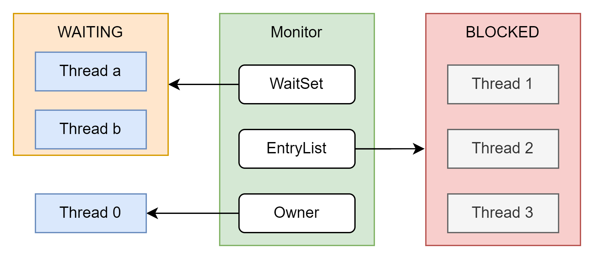

# 线程进阶4

## 基于昨天的反馈

```java
private static final ConcurrentHashMap<String, Object> lockMap = new ConcurrentHashMap<>();

public static void transfer(Account sender, Account receiver, int amount) {
    String key = getKey(sender, receiver);
    Object lock = lockMap.computeIfAbsent(key, k -> new Object());
    synchronized (lock) {
        if (sender.getBalance() >= amount) {
            sender.setBalance(sender.getBalance() - amount);
            receiver.setBalance(receiver.getBalance() + amount);
        }
    }
}

private static String getKey(Account sender, Account receiver) {
    return List.of(sender, receiver)
            .stream().map(Objects::toString)
            .sorted().collect(Collectors.joining());
}
```

首先第一种实现方式是不可靠的。如果只有两个账户，那么它是完全可靠的，但是如果出现了一个账户同时给2个不同的账户转帐则不可靠。先来看它的实现，我把具体流程放入了下图  
  
直接来看它的调用方式，当一个账户想要转账时，首先调用`getKey()`。它会返回一个排序过的两个账户堆地址的字符串。然后去ConcurrentHashMap中尝试提取这个字符串映射的对象。
也就是锁对象。那么这种方式，锁住的是两个账户之间的转账。但是无论有多少个账户正在转账，只要一个账户没有同时参与到不同的转帐，那么这种方法就是安全的。但是如果出现a想要同时给b和c转账，
则会出现问题，因为图中线程1和2可以同时获得账户a的余额。所以其实这种方法如果想要改进的话应该把每个账户都锁住，保证同一个时间一个账户只能和另一个账户进行交易。无论收钱还是转出都得锁住。
这样就需要用到两把锁，一把锁住sender一把锁住receiver。但是这样如果在获取第二把锁之前程序中断，或者别的线程抢先获得锁了，那么就会出现死锁了,这样做仍然存在危险。那么为了避免这种风险，就出现了第二种做法。

收到交易请求后，先判断通过方法给sender和receiver排序，保证使用synchronized锁住两个账户的时候，一定是有一个先于第二个。这样说可能有点不太清晰。其实就是我要保证我锁住的两个对象是按顺序的。
至于这个顺序可以是先sender后receiver，也可以反过来。具体看第二个方法的代码。

```java
public static void transfer(Account sender, Account receiver, int amount) {
    Account a, b;

    if (sender.toString().compareTo(receiver.toString()) >= 0) {
        a = sender;
        b = receiver;
    } else {
        a = receiver;
        b = sender;
    }

    synchronized (b) {
        synchronized (a) {
            if (sender.getBalance() >= amount) {
                sender.setBalance(sender.getBalance() - amount);
                receiver.setBalance(receiver.getBalance() + amount);
            }
        }
    }
}
```

这里我故意换了b和a的顺序，但并不会影响结果。因为我要保证的只是它们的相对关系不变即可。`toString()`会自动返回对象类型和堆内存的地址。直接对比每一个账户的toString结果，这样每两个账户之间的相对关系就是确定的。
比如账户A地址排在账户B之前，那么不管A在谁之后，只要它和B交易，就一定会先锁A在锁B。如果不做这一步，那么两个线程同时锁住A和B，就无法进行交易了。因为这里的逻辑是两个锁必须被同一个线程锁住才能执行。只要保证相对关系不变，就永远不会出现死锁。

## Wait-Notify



Owner和EntryList的流程已经讨论过了。WaitSet指向一个WAITING队列（非先来后到），线程a和b都是之前获得过这个锁，由于某种原因暂时释放了锁，虽然它们被称为WAITING，但是在操作系统中它们依然是阻塞状态。
要特别注意这个，java中对于阻塞（BLOCKED）的定义和操作系统中的完全不一样。其实可以把WAITING想象成一个线程正在等待一些必要的操作执行完毕才能继续执行，比如IO。
当特定的操作完成后，可以通过notify唤醒WAITING中的线程。第二需要注意的就是唤醒后会被加入EntryList里面而不是直接获得锁。

## APIs

### wait

```java
public static void test1() {
    try {
        lock.wait();
    } catch (InterruptedException e) {
        throw new RuntimeException(e);
    }
}
```

直接尝试调用wait，编译器居然通过了。但是运行时会直接报错`IllegalMonitorStateException`，这就证明了一个线程必须获得过锁才可以使用wait方法。
那么为了保证一个对象关联一个监视器锁，使用synchronized来锁住这个对象。

````java
private static void test2() throws InterruptedException {
    Thread t1 = new Thread(()->{
        log.debug("Thread 1 starting");
        synchronized (lock){
            try {
                lock.wait();
            } catch (InterruptedException e) {
                e.printStackTrace();
            }
            log.debug("Other stuff to do...");
        }
    },"t1");

    Thread t2 = new Thread(()->{
        log.debug("Thread 2 starting");
        synchronized (lock){
            try {
                lock.wait();
            } catch (InterruptedException e) {
                e.printStackTrace();
            }
            log.debug("Other stuff to do...");
        }
    },"t2");

    t1.start();
    t2.start();

    Thread.sleep(3000); // 确保线程1和2都已进入WAITING
    log.debug("t1: {} t2: {}",t1.getState(),t2.getState());

    log.debug("notify threads");
    synchronized (lock){
        lock.notify();
    }
}
````

此时线程1和2都尝试占有lock对象的锁，假设t1先获得了锁，那么t2会自动进入阻塞队列(假设锁自动升级)。如果t1调用了wait，那么它会释放掉锁，并且自动进入这个monitor的WaitSet中直到被唤醒。
当然也可以直接规定停止的时间，在时间完毕后就会自动被唤醒。不过需要额外注意，加入等待时间后，线程的状态不再是WAITING而是TIMED_WAITING。

### notify

就是把在WaitSet中的线程唤醒，但是这里的唤醒也是非公平的。JVM会随机唤醒一个在WaitSet中的线程。

### notifyAll

其实底层就是把所有WaitSet里面的线程都notify一遍。就是把所有线程唤醒而已。

## Wait & Sleep

sleep是Thread中的静态方法，可以直接让当前线程进入休眠状态。sleep是不需要获得对象锁的，所以也不需要配合synchronized。并且它也不会释放对象锁。  
wait是Object的方法的对象方法。必须先有对象才可以使用wait，而且必须和synchronized一起使用。wait会释放对象锁。

也就是说使用sleep来让线程休息或者等待别的线程是效率较低的，因为它不会让出控制权，所以会导致别的线程一直等待。但是如果一个优先级较高（手动认定的，不是线程的成员变量）的线程，我需要它越快完成越好时，
也许采取sleep是有用的，这样可以保证醒来还是这个线程在运行而不是等待被调度。

用wait也不是完美的，如果等待的结果一直不返回，则线程就会一直被等待，从而造成死锁或者死循环。而加入时间又要考虑规定时间内等待的结果能不能返回，这也是有风险的。而且如果一个实例挂了的话，可能导致整个全部等待。
所以实际运用的时候还是需要考虑如何避免。

## wait 常见使用方式

```java
synchronzied (lock) {
    while (!condition) {
        lock.wait();
    }
}

synchronzied (lock) {
    lock.notifyAll();
}
```

其实也就是说，如果要唤醒则全部唤醒，但是这样的方式确实不够优雅。我看到很多文章说可以通过LockSupport或者ReentrantLock的方案来实现唤醒特定线程。等到后面研究这个部分的时候我在详细补充。

## 保护性暂停 Guarded Suspension

当一个线程需要等待另一个线程的结果时，可以让他们关联到同一个线程。

```java
public class GuardedObjectTest {
    public static void main(String[] args) {
        GuardedObject guardedObject = new GuardedObject();

        new Thread(() -> {
            log.debug("thread 1 waiting for the result of thread 2");
            Object a = guardedObject.get();
            log.debug(a.toString());
        }, "t1").start();

        new Thread(() -> {
            log.debug("thread 2 doing some jobs here");
            Object obj = new Object();
            guardedObject.complete(obj);
        }, "t2").start();

    }
}

class GuardedObject {
    private Object response;

    // obtain results
    public Object get() {
        synchronized (this) {
            while (response == null) {
                try { this.wait(); } 
                catch (InterruptedException e) { throw new RuntimeException(e);}}
            return response;
        }}

    // 结果已经产生了
    public void complete(Object response) {
        synchronized (this) {
            this.response = response;
            this.notifyAll(); // 确保会被notify
        }
    }
}
```

一般的设计思路就是在保护性对象中加入两个方法，一个接受线程的结果，一个传递线程的结果。主要的好处是把不同线程的工作再次分离了，如果输出结果的线程还需要做别的事情，它只需要直接调用complete告诉保护性对象它的活做完了，而不是非要等到全部运行完。
等待结果的线程也可以快速的获得需要的数据，而不是被动的等待另外一个线程全部跑完。还有一个好处就是等待结果的变量可以设为局部变量而不是全局变量，因为保护性对象提供了一个输出的方法。

### join 源码

上述模式加入时间限制，通过计算时间来控制wait的时间，然后在get中人为打断等待。然后根据这个模式再看join的源码。

```java
public final synchronized void join(final long millis)
    throws InterruptedException {
        if (millis > 0) {
            if (isAlive()) {
                final long startTime = System.nanoTime();
                long delay = millis;
                do {
                    wait(delay);
                } while (isAlive() && (delay = millis -
                        TimeUnit.NANOSECONDS.toMillis(System.nanoTime() - startTime)) > 0);
            }
        } else if (millis == 0) {
            while (isAlive()) {
                wait(0);
            }
        } else {
            throw new IllegalArgumentException("timeout value is negative");
        }
    }
```

其实join的源码就是用这种设计模式实现的。在while开始前join会记录开始时间，并在while中计算经过的时间，一直判断等待时间。

### 扩展 解耦等待和生产

一一对应的消息方案。这个扩展模式和消息队列相关，但是不同于RocketMQ，它是基于线程的通讯而非进程。基本思想是，把每一个不同的任务和结果分离。
设想现在有一栋大楼，大楼中的每一个住户都代表一个线程，整栋大楼有很多快递员。住户可以不断的买东西，快递员需要准确的把每一个快递送到住户手上。

首先分析模式，多个快递员送多个快递。在多线程并行的情况下，需要保证的是快递不会送乱，不会出现多次送同一个和有快递没有送出。那么最简单的方式就是使用一个线程安全的集合来处理所有的快递，
保证每一个住户是key，而快递是value。所以先把快递员和住户分成两类，并且会把快递投入（complete）到一个快递柜（MailBox）中,所以住户可以请求快递柜（get）。
既然住户和快递员之间要共享变量（快递柜），那么显然需要考虑线程安全的问题，所以本次使用了HashTable做为维护的对象。这种设计模式依旧存在缺陷后面会分析。
具体的代码没有什么特别注意的地方，就是基于上述分析的实现，我就没有粘贴上来。

优点  
- 解耦了不同线程的关联。不会出现一个线程非要死等另一个线程的情况
- 高内聚，低耦合。居民和快递员只需要干一件事，不需要考虑彼此的情况
- 生产和消费是一一对应的，便于监控线程的状态。

缺点
- 上述的实现中，每个居民同一时间只能下单一次。因为快递的运送是根据id的，而全局使用了一个hashtable，因此每个居民同时间只能有一个快递，不然hashtable的同一位置就会出现链表。由于实现的时候每一个快递员只送一个id，所以一个id下如果出现多个快递则处理不了。
- 无法指定确定送快递的顺序，如果有一个快递我希望优先送（和其它快递没有联系，只是希望这个快递可以优先），在这个模式中是不能解决的，因为没有优先级队列参与。
- 生产和消费是一一对应的，不容易更合理的分配资源。一个居民（快递）就需要一个快递员。
- 同步消费，放入快递柜中的快递会立即被住户取走。

## 异步模式

### 生产者/消费者

和之前的保护性暂停方案的共同点在于都是使用一个对象来分离生产和消费的关系。但是区别在于它异步的，所有放入快递柜的数据并不需要并立刻处理。
这次快递柜的容量也有限制，保证不会出现一直往快递柜里加快递的情况。实现的方式是链表，这样的话可以保证两头都能加入，而且两头都可以直接提出。

优点
- 不再是一一对应，每个快递可以由同一个人送
- 同一个人可以同时下单无数个快递，因为每次只会取一个快递
- 减少了资源的使用

缺点
- 所有快递都必须等待消费者的消费，容易造成堵塞
- 如果消费者卡死，则整个程序卡死
