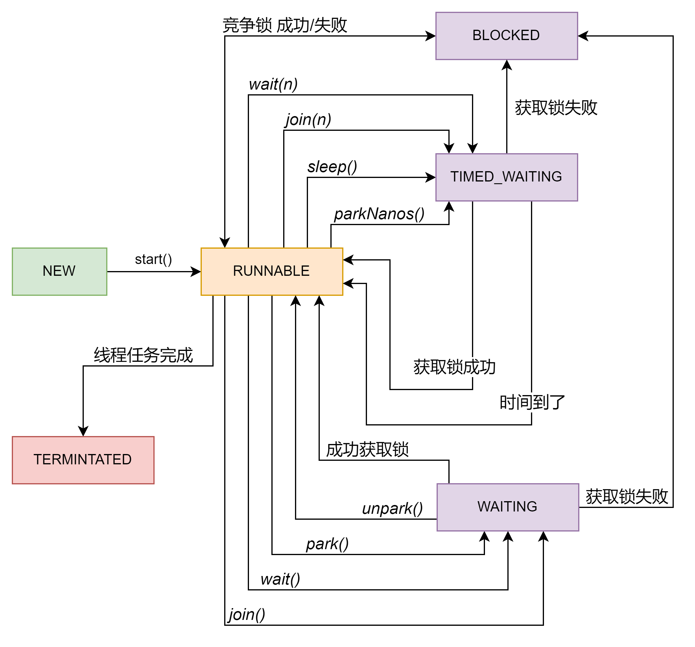
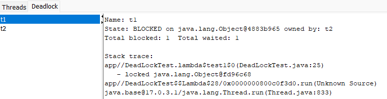

# 线程进阶7

## LockSupport

### park & unpark

先来简单使用一下这两个方法

```java
public static void test1() throws InterruptedException {
    Thread t1 = new Thread(()->{
        log.debug("t1 started");
        try {
            TimeUnit.SECONDS.sleep(2);
        } catch (InterruptedException e) {
            throw new RuntimeException(e);
        }
        log.debug("t1 park");
        LockSupport.park();
        log.debug("t1 resume");
    },"t1");

    t1.start();
    TimeUnit.SECONDS.sleep(1);
    log.debug("unpark....");
    LockSupport.unpark(t1);
}
```

我这里故意把unpark的时间早于park，所以主线程会先unpark，但是t1依旧可以继续运行。其实到这就能看出park和notify是由本质区别的。但是具体的区别还得去研究源码。

### 实现原理

首先源码中LockSupport中的park实际调用的是Unsafe类中的park，而Unsafe类中的park也是一个native方法（又是C）。不过好在这次找到了不少人的分析，看起来就比较轻松了。
其实逻辑的部分不复杂。每个线程会自带一个Parker对象，对象中只存在三个变量——计数器、互斥量、条件变量。先来明确一下分别是干什么的。
首先是计数器（_counter），它的作用其实相当于boolean，用来判断这个parker对象是否调用过unpark。互斥量(_mutex)实际上就是保证线程不会随意进入临界区的锁，可以上锁也可以解锁。
条件变量(_cond)则是等待这个线程需要执行的所有条件都满足后，需要被通知的变量，也可以看成是一个boolean。如此直接来看park和unpark的流程

park
- 获取parker对象
- 将计数器归零，并且检查计数器最开始的值是否为1，如果为1则不需要继续执行
- 计数器不为1，给互斥量加锁
- 条件变量阻塞，释放互斥量上的锁，并且等待被其它线程唤醒（等待其它线程的结果，条件不满足）
- 被唤醒后，重新获得锁（不是马上获得）
- 正常运行至结束，再次将计数器归零，释放锁。

unpark
- 获取parker对象
- 给互斥量加锁
- 计数器设为1
- 唤醒其它在条件变量上等待的线程
- 释放锁

从上述的流程中，可以得到一个结论。所谓的park和unpark其实并不是直接影响线程的状态，而是通过修改一些变量来判断是否需要暂停，这里很像interrupt，只是修改了标志位。
park和unpark必须先获得互斥量的锁。而这个锁其实是操作系统提供的，这里过于底层，所以暂时不讨论。

### 对比notify

| Park & Unpark               | Wait & Notify             |
|-----------------------------|---------------------------|
| 无需使用synchronized<br/>无需监视器锁 | 必须配合synchronized使用，需要监视器锁 |
| 已线程为单位来阻塞和唤醒                | notify只能随机唤醒一个线程，要么就是全部唤醒 |
| 可以先park                     | 不能先notify                 |

## 线程状态 进阶

### Java中的六种状态



这次算是把大部分用到的方法和状态转换写完整了，还是要注意这里所有的状态都是基于java，不是操作系统。

#### 一个小发现

这里有一个值得注意的地方，如果使用wait来阻塞线程的话，直接打印会显示WAITING状态，但是实际是阻塞。并且因为notify把线程放入监视器锁的EntryList中，所以在debug的时候IDEA栈帧会显示
MONITOR而不是RUNNING或者WAITING。这个是我观察的结果，不知道是否完全正确。

## 多把锁

如果现在有两个人（线程）同时在一个办公室（Class）工作，但是只有一张办公桌（对象锁），那么同一时间只能有一个人可以工作。但是如果我在办公室多放几张桌子就可以让更多的人同时工作。
所以其实可以在一个类中对创建一些不同的对象，不同方法可以锁不同的对象，这样提高并发度。

具体的做法就是在同一类底下写入不同的对象，让不同的方法锁不同的对象。比如OP线程只需要锁住OP的办公桌就好了，这样同时间IT也可以继续在IT的办公桌上开始。

```java
@Slf4j
class Office {
    private final Object OPTable = new Object();
    private final Object ITTable = new Object();

    public void operating() throws InterruptedException {
        synchronized (OPTable) {
            log.debug("运维工作一会儿");
            TimeUnit.SECONDS.sleep(2);
        }
    }

    public void coding() throws InterruptedException {
        synchronized (ITTable) {
            log.debug("IT工作一会儿");
            TimeUnit.SECONDS.sleep(2);
        }
    }
}
```

不过这样做也会有缺点，首先这样会使用多个对象，占用更多的堆内存。而且需要保证每个业务间不存在关联，如果出现一个线程需要多把锁，那么就会出现死锁。

## 线程活跃性

### 死锁

最容易出现的情况，在设计中必须要避免的问题。下面是一个简单的例子，省略了try-catch

```java
new Thread(() -> {
    synchronized (a){
        log.debug("Thread 1 获得锁 a");
        TimeUnit.SECONDS.sleep(2);
        synchronized (b){
            log.debug("Thread 1 获得锁 b");
        }
    }
},"t1").start();

new Thread(() -> {
    synchronized (b){
        log.debug("Thread 2 获得锁 b");
        TimeUnit.SECONDS.sleep(2);
        synchronized (a){
            log.debug("Thread 2 获得锁 a");
        }
    }
},"t2").start();
```

线程1和2同时占有a和b导致互相等待对方释放，就像纳什均衡，双方都没有办法先让出一步最后只能一直等待。观察死锁的方式，这里尝试了一下`jconsole`的deadlock功能。



基本上本地环境下，查一个死锁还是挺方便的，等待的锁的地址和占用的线程。当然也可以用`jstack`来获得全部的信息，这样可能更完整一些。

```shell
Found one Java-level deadlock:
=============================
"t1":
  waiting to lock monitor 0x0000017e42deb260 (object 0x00000007045491c0, a java.lang.Object),
  which is held by "t2"

"t2":
  waiting to lock monitor 0x0000017e42debb20 (object 0x00000007045491b0, a java.lang.Object),
  which is held by "t1"

Java stack information for the threads listed above:
===================================================
"t1" #16 prio=5 os_prio=0 cpu=15.62ms elapsed=381.19s tid=0x0000017e43167290 nid=0x5858 waiting for monitor entry  [0x000000156e2ff000]
   java.lang.Thread.State: BLOCKED (on object monitor)
        at DeadLockTest.lambda$test1$0(DeadLockTest.java:25)
        - waiting to lock <0x00000007045491c0> (a java.lang.Object)
        - locked <0x00000007045491b0> (a java.lang.Object)
        at DeadLockTest$$Lambda$28/0x0000000800c0f3d0.run(Unknown Source)
        at java.lang.Thread.run(java.base@17.0.3.1/Thread.java:833)

"t2" #17 prio=5 os_prio=0 cpu=0.00ms elapsed=381.19s tid=0x0000017e43178870 nid=0x3b60 waiting for monitor entry  [0x000000156e3ff000]
   java.lang.Thread.State: BLOCKED (on object monitor)
        at DeadLockTest.lambda$test1$1(DeadLockTest.java:39)
        - waiting to lock <0x00000007045491b0> (a java.lang.Object)
        - locked <0x00000007045491c0> (a java.lang.Object)
        at DeadLockTest$$Lambda$29/0x0000000800c0f5e8.run(Unknown Source)
        at java.lang.Thread.run(java.base@17.0.3.1/Thread.java:833)
```

`jstack`会提供几乎所有信息，比如哪一行，地址，锁对象地址。也是很方便的，而且不需要开一个图形界面。

### 就餐问题的思考

5个人就餐，每个人左右手分别摆放了1支筷子。每个人必须使用一双筷子才可以就餐，所有筷子都是公用的（干净又卫生）。5个人同时才是就餐，得到筷子全靠运气。

```java
class Person extends Thread {
    private final Chopstick left;
    private final Chopstick right;

    public Person(String name, Chopstick left, Chopstick right) {
        super(name);
        this.left = left;
        this.right = right;
    }

    @Override
    public void run() {
        while (true){
            synchronized (left){
                synchronized (right){
                    log.debug("{} is eating...", this.getName());
                    try {
                        TimeUnit.SECONDS.sleep(1);
                    } catch (InterruptedException e) {
                        e.printStackTrace();
                    }
                }
            }
        }
    }
}
```

5个线程如果同时开始的话，一段时间后就会出现死锁。因为CPU的调度是无法预测的，所以有些人可能会分占住到筷子的两边。

### 活锁

正好和死锁相反，两个单独的线程都不断的在更改共享变量，并且共享变量也是判断条件之一。那么就会出现由于双方都修改所以导致的程序永远无法结束的情况，比如一个一直`++`，另一个一直`--`，最后就会导致一个变量一直反复横跳。
比如下面的例子。

```java
 new Thread(() -> {
            while (count > 0) {
                try {
                    TimeUnit.MILLISECONDS.sleep(20);
                    count--;
                    log.debug("count: {}", count);
                } catch (InterruptedException e) {
                    e.printStackTrace();
                }
            }
        }, "t1").start();

new Thread(() -> {
    while (count < 20) {
        try {
            TimeUnit.MILLISECONDS.sleep(20);
            count++;
            log.debug("count: {}", count);
        } catch (InterruptedException e) {
            e.printStackTrace();
        }
    }
}, "t2").start();
```

线程1和2分别在更改对方的变量，所以导致在一段时间内，这个变量会一直满足两个线程的条件。最终程序一直在跑，这个情况感觉在实际操作中可能比较容易出现。应该后面练习的时候多注意。

### 饥饿

一个线程由于优先级太低，始终得不到执行。但是这个可能性很低很低，而且优先级这个概念已经被废弃了，所以我也没有过多的关注。不过很多文章都提到了读写锁可能会出现这个情况。到后面看到读写锁问题的时候我在详细分析一下。