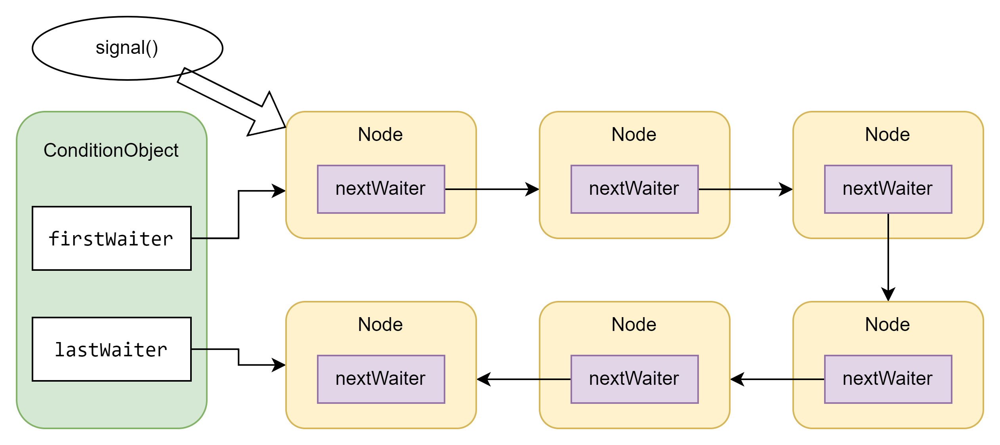

# 线程进阶8

## ReentrantLock

前面说过synchronized已经有些过时，而且准备弃用了。那么代替synchronized更安全好用的方式就是ReentrantLock。就像名字写的一样，ReentrantLock一定是可重入的。
那么对比synchronized，它具备下面的一些特性：
- 可中断
- 可以设置超时时间
- 可以设置公平锁
- 支持多个条件变量

### 可重入

synchronized的时候提过了，其实就是获得了锁的线程有权利再次获得这个锁，也就是同一线程的不同栈帧应该可以获得锁。但是它和synchronized的区别就是它是从对象的角度保护临界区，而synchronized是从关键字的级别。

### 基本用法

```java
public static void test1() {
    reentrantLock.lock();
    try {

    } finally {
        reentrantLock.unlock(); // 释放锁
    }
}
```

此段是源码推荐用法。首先定义一个ReentrantLock，然后在临界区开始前上锁，结束后解锁。尽量使用finally来保证一定解锁。

### 可打断

```java
private static void test3() throws InterruptedException {
    Thread t1 = new Thread(() -> {
        try {
            // 如果没有竞争那么此方法就会获取lock对象的锁
            // 如果有竞争就进入阻塞队列，可以被其它线程用interrupt方法打断。
            log.debug("尝试获取锁");
            reentrantLock.lockInterruptibly();
        } catch (InterruptedException e) {
            log.debug("没有获得锁, 直接返回");
            e.printStackTrace();
            return;
        }
        try {
            log.debug("获取到锁了");
        } finally {
            reentrantLock.unlock();
        }
    }, "t1");

    reentrantLock.lock();
    t1.start();
    TimeUnit.SECONDS.sleep(1);
    log.debug("t1状态 - {}", t1.getState());
    log.debug("打断 t1");
    t1.interrupt();
}
```

可打断的特性就是interrupt的一个应用。Thread类中的interrupt方法打断线程的时候分很多情况，而且它并不是直接打断线程，而是改写线程的打断标志位。直接观察t1在等待锁时的状态，发现t1的状态是WAITING而不是BLOCKED。
在使用interrupt尝试打断这个WAITING状态，发现返回的异常是InterruptedException，所以说明使用`lockInterruptibly`的时候`interrupt`会把它当作类似`wait()`来处理。所以这里的可打断指的是使用`lockInterruptibly`的时候，
别的线程可以通过调用interrupt打断阻塞（java中的WAITING）状态。


### 锁超时

和上面的实现基本一样，但是这次使用了`trylock`来控制等待的时间，如果超过了等待时间就直接放弃获取锁。方式就是把`trylock`当作判定条件放入一个if，然后之后加入try catch来控制输出。
那么通过这个方式就可以解决之前的5人就餐问题了。因为ReentrantLock可以自动放弃获取锁，所以当一定时间过后就一定能保证有个人都拿到锁。下面来看具体实现。

```java
public void run() {
    while (true) {
        if (left.tryLock()) {
            try {
                if (right.tryLock()) {
                    try {
                        log.debug("开吃");
                        TimeUnit.MILLISECONDS.sleep(40);
                    } catch (InterruptedException e) {
                        e.printStackTrace();
                    } finally { right.unlock();}
                }
            } finally { left.unlock(); }
        }
    }
}
```

把之前的筷子类改为继承ReentrantLock，然后使用`trylock`来锁。这样的话，如果一个人获取锁失败后，他就会放下筷子而不是继续等待另外一支（退一步海阔天空）。
当然虽然解决了死锁的问题，但是这里又会出现活锁的问题，因为每个人都可以不断的拿起筷子一直吃不停。

### 公平锁

ReentrantLock不同于synchronized的一个重要特性就是公平锁。虽然默认状态下，它是非公平的，但是它是可以变得公平的。具体关于这个部分的分析会放在后面的源码阅读里。这里就简单讨论一下
直接看源码中的构造器，其中有一个带有fair的构造器。

```java
public ReentrantLock(boolean fair) { sync = fair ? new FairSync() : new NonfairSync(); }
```

可以看到如果fair为true的话，那么就会直接创建一个公平同步，反之则是非公平的。当然公平锁并不一定是好的，事实上如果想要保证公平的话就会降低并发度，也许对于业务来说还是不好的。
具体公平锁的实现流程会放在源码中解析。

### 条件变量

这里的条件变量可以理解为线程等待锁的时候的判断条件。满足条件的线程就可重新竞争锁。和synchronized中的waitSet不同，ReentrantLock是支持使用多个不同的条件来限制的。
也就是说，对于想要竞争锁的线程，ReentrantLock可以单独赋予线程一个条件，显然这样的效率和并发度是更高的。为了更好的理解条件变量，我直接看了Condition类的源码。
其实源码中没有什么很复杂的内容，实质上就是一个简单的接口，在ReentrantLock中使用的这个，关联的是ConditionObject这个类。我稍微研究了一下其中的三个方法，await，signal和signalAll。
其实可以对应到object中的wait，notify，notifyAll，换汤不换药而已。但是如果细看signal就会发现，它invoke的是等待最久的线程，也就是公平的。它的结构如下 



ConditionObject内部实际上在维护一个链表，它本身会记录链表中的头尾节点。每次调用signal的时候，会自动把头节点唤醒（等待最久的）。然后firstWaiter指向下一个节点。  
回忆之前在synchronized中提到的可以优化的一个例子，两个小朋友一个需要牛奶，一个需要咖啡才能入睡，并且它们睡在一个房间。之前的方法是使用synchronized锁住这个房间，
然后使用while循环判断是否得到牛奶/可乐，没有就一直wait，得到后就会被notify。之前设计出现的问题是，synchronized会造成效率问题。 因为无法直接notify特定的线程，即使只是牛奶到了，也必须唤醒全部的线程，这浪费了资源，而且还需要防止虚假唤醒造成的死锁。
所以新的改进方案如下。

```java
public static void main(String[] args) throws InterruptedException {
    new Thread(() -> {
        lock.lock();
        try {
            log.debug("等待咖啡");
            while (!hasCoffee) {
                try {
                    waitCoffeeSet.await();
                } catch (InterruptedException e) {
                    log.debug("等待咖啡被打断，555555");
                    e.printStackTrace();
                }
            }
        } finally {
            lock.unlock();
        }
        log.debug("喝完咖啡，更不要睡了");
    }, "咕咕").start();

    new Thread(() -> {
        lock.lock();
        try {
            log.debug("等待牛奶");
            while (!hasMilk) {
                try {
                    waitMilkSet.await();
                } catch (InterruptedException e) {
                    log.debug("等待牛奶被打断，555555");
                    e.printStackTrace();
                }
            }
        } finally {
            lock.unlock();
        }
        log.debug("心满意足，呼呼大睡");
    }, "嘟嘟").start();

    TimeUnit.SECONDS.sleep(1); // 保证线程进入等待状态
    new Thread(() -> {
        lock.lock();
        try {
            waitMilkSet.signal();
            hasMilk = true;
        } finally {
            lock.unlock();
        }
        log.debug("送完牛奶了，我可以睡了");
    }, "工具人1").start();

    TimeUnit.SECONDS.sleep(1);
    new Thread(() -> {
        lock.lock();
        try {
            waitCoffeeSet.signal();
            hasCoffee = true;
        } finally {
            lock.unlock();
        }
        log.debug("送完咖啡，我还得陪孩子");
    }, "工具人2").start();
}
```

上面这段代码稍有点长，其实就是使用了源码推荐的语法来做的。源码中给的一个例子是先加锁，然后用try-finally保证解锁。在临界区使用await和signal来操作。中间的4个线程都严格按照这个写法进行。
可以看到相比于synchronized，代码的行数确实多了很多，但是整体逻辑也跟清晰了，加锁，对谁加锁，什么时候开始锁都一清二楚。而且可以针对特定的线程跳出特定的条件，可以唤醒特定的等待线程，效率和并发度大大提高。

### 源码阅读

从源码中可以看到三个内部类，Sync,FairSync,nonFairSync。其中Sync是另外两个的父类。Sync本身继承自AbstractQueuedSynchronizer，

#### Sync

```java
@ReservedStackAccess
final boolean tryLock() {
    Thread current = Thread.currentThread();    //获取当前线程
    int c = getState(); // 获取状态
    if (c == 0) {   // 新线程
        if (compareAndSetState(0, 1)) {
            setExclusiveOwnerThread(current);   // 独占锁，并且转为RUNNABLE
            return true;
        }
    } else if (getExclusiveOwnerThread() == current) {  // 独占线程
        if (++c < 0) // overflow
            throw new Error("Maximum lock count exceeded");
        setState(c);
        return true;
    }
    return false;
}
```

先来看一下`trylock`这个方法，首先这是一个非公平锁法。然后基本逻辑也很简单，其实JDK 17的一个实现比JDK 8的实现简化了很多了。基本逻辑就是如果当前的锁没有人竞争那么就直接获得。
如果已经被某个获取了就尝试重入，重入成功则增加重入次数，失败则直接判定获取失败。注意它是一个final方法，子类无法继承。

```java
@ReservedStackAccess
protected final boolean tryRelease(int releases) {
    int c = getState() - releases;
    if (getExclusiveOwnerThread() != Thread.currentThread())
        throw new IllegalMonitorStateException();
    boolean free = (c == 0);
    if (free)
        setExclusiveOwnerThread(null);
    setState(c);
    return free;
}
```

这个tryRelease的方法也相对简单。就是通过线程的状态来决定是否释放独占。如果是独占线程，那么就自动释放，并且清空独占。反之就抛出异常。

```java
@ReservedStackAccess
final void lock() {
    if (!initialTryLock())
        acquire(1);
}

@ReservedStackAccess
final void lockInterruptibly() throws InterruptedException {
    if (Thread.interrupted())
        throw new InterruptedException();
    if (!initialTryLock())
        acquireInterruptibly(1);
}
```

`lock`没有什么好说的，就是正常调用，先判断是不是首次锁住。`lockInterruptibly`则会稍微复杂一些，它会看看线程的阻塞状态，如果线程会被这个锁阻塞住的话，那么就直接抛出一个异常。这样调用这个方法的代码中可以加入catch来捕获并且处理。
和之前提到的可打断可以结合起来看。如果线程没有被阻塞的话，那么基本思路就和lock差不多了。这里要注意的是无论线程之前处于什么状态interrupted都会把线程的标志位归零，所以在`acquireInterruptibly(1)`内部，不出意外`Thread.interrupted()`结果应该总为true。

```java
abstract static class Sync extends AbstractQueuedSynchronizer {    
    abstract boolean initialTryLock();
    
    final ConditionObject newCondition() {
        return new ConditionObject();
    }

    private void readObject(java.io.ObjectInputStream s)
        throws java.io.IOException, ClassNotFoundException {
        s.defaultReadObject();
        setState(0); // reset to unlocked state
    }
}
```

这里的initialTryLock会在具体实现的类中详细讨论。而剩下的两个，一个用来创建新的条件，一个是自定义的反序列化逻辑。和主要的功能关系不大，就没有细看。

#### FairSync

```java
static final class FairSync extends Sync {
    
    final boolean initialTryLock() {
        Thread current = Thread.currentThread();
        int c = getState();
        if (c == 0) {
            if (!hasQueuedThreads() && compareAndSetState(0, 1)) {
                setExclusiveOwnerThread(current);
                return true;
            }
        } else if (getExclusiveOwnerThread() == current) {
            if (++c < 0) // overflow
                throw new Error("Maximum lock count exceeded");
            setState(c);
            return true;
        }
        return false;
    }
    
    protected final boolean tryAcquire(int acquires) {
        if (getState() == 0 && !hasQueuedPredecessors() &&
            compareAndSetState(0, acquires)) {
            setExclusiveOwnerThread(Thread.currentThread());
            return true;
        }
        return false;
    }
}
```

公平类，主要实现了Sync中的initialTryLock这个方法。它通过检测是否有等待更久的线程来保证公平，在线程第一次获得锁的时候，会同时检查重入次数和等待池中的线程。
等待更久的线程会获得锁。

#### NonFairSync

```java
static final class NonfairSync extends Sync {

    final boolean initialTryLock() {
        Thread current = Thread.currentThread();
        if (compareAndSetState(0, 1)) { // first attempt is unguarded
            setExclusiveOwnerThread(current);
            return true;
        } else if (getExclusiveOwnerThread() == current) {
            int c = getState() + 1;
            if (c < 0) // overflow
                throw new Error("Maximum lock count exceeded");
            setState(c);
            return true;
        } else
            return false;
    }
    
    protected final boolean tryAcquire(int acquires) {
        if (getState() == 0 && compareAndSetState(0, acquires)) {
            setExclusiveOwnerThread(Thread.currentThread());
            return true;
        }
        return false;
    }
}
```

非公平锁，其实思路基本和Sync的tryLock一样。先判断是否为线程初次，如果是就直接改状态然后获得锁。如果不是的话就判断是否为重入，重入成功就设置重入次数，然后再次获得锁。  

### 小结

基本上ReentrantLock类中主要由一个父类和两个子类构成。两个子类分别保证了公平和非公平的方式。JDK版本对于两个类的实现还是有一些出入的，这里只讨论17的实现。我稍微对比了一下之前的一些实现，基本上就是把tryLock和tryAcquire交换了一下，但是具体逻辑一直没变。
然后这里的分析只是一个小的分析，后面的反思会结合VM详细的分析一下。关于它和synchronized各自的优势也会在后面给出。

## 同步模式

### 固定顺序 wait-notify

两个线程，希望其中一个线程先运行。两个线程间不存在等待关系。

```java
static final Object lock = new Object();
static boolean t2HasRan = false;

public static void main(String[] args) {
    new Thread(() -> {
        synchronized (lock) {
            while (!t2HasRan)
                try {
                    lock.wait();
                } catch (InterruptedException e) {
                    log.debug("等待被中断");
                    e.printStackTrace();
                }
        }
        log.debug("this is thread 1");
    }, "t1").start();

    new Thread(() -> {
        synchronized (lock) {
            log.debug("This is thread 2");
            t2HasRan = true;
            lock.notifyAll(); // 唤醒
        }
    }, "t2").start();
}
```

由于wait和notify必须先获得锁，所以必须配合synchronized使用。然后为了防止虚假唤醒，最好使用while来一直判断。

### 固定顺序 ReentrantLock

实现基本和之前的改写例子一样，就放在代码里了，没有复制上来。

### 固定顺序 park unpark

```java
public static void main(String[] args) {
    Thread t1 = new Thread(() -> {
        LockSupport.park(); //
        log.debug("This is t1");
    }, "t1");
    t1.start();

    new Thread(() -> {
        log.debug("This is t2");
        LockSupport.unpark(t1); // 修改标志位
        }, "t2").start();
}
```

使用park和unpark来解决顺序问题，让t1暂停，直到t2运行完。这里利用unpark的特性，不管谁先运行，一定都是t2先运行完后，t1的park才会失效。但是这个方案有局限性，只能运作在两个线程的情况，如果出现了三个线程，虽然可以使用，但是unpark的位置会很混乱不如前面的两种清晰。

### 交替输出 wait-notify

多个线程，每个线程输出不一样的内容。保证交替输出，并且交替顺序不变。

```java
class WaitLabel {
    private int flag;
    private int iterations;

    public synchronized void print(String content, int currentFlag, int nextFlag) {
        for (int i = 0; i < iterations; i++) {
            while (this.flag != currentFlag) {
                try {
                    this.wait();
                } catch (InterruptedException e) {
                    log.debug("等待被打断");
                    e.printStackTrace();
                }
            }
            log.debug("线程 {} 内容：{}",Thread.currentThread().getName(),content);
            this.flag = nextFlag;
            this.notifyAll(); // 全部叫醒
        }
    }
}
```

为了使用wait和notify，做了一个等待标识类。其中通过synchronized的方法来保证线程获取同一个对象。通过flag和nextFlag来保证交替打印。这个作为最容易的实现方式，显然存在很多问题，
首先需要线程自己知道下一个输出，不够自动化。其次使用了synchronized锁住整个部分，为了等一个结果，所有线程都会被阻塞住。如果中途出现了打断，异常的处理也不够优雅。

### 交替输出 ReentrantLock

```java
@Slf4j
class AwaitSignal extends ReentrantLock {
    private int iterations;

    public AwaitSignal(int iterations) {
        this.iterations = iterations;
    }

    public void print(String context, Condition current, Condition next) {
        for (int i = 0; i < this.iterations; i++) {
            lock();
            try {
                current.await();
                log.debug("线程 {} 内容是 {}", Thread.currentThread(), context);
                next.signal();
            } catch (NullPointerException e) {
                log.debug("条件变量不存在 当前条件变量为 {}", current);
                e.printStackTrace();
            } catch (InterruptedException e) {
                log.debug("等待被打断");
                e.printStackTrace();
            } finally {
                unlock();
            }
        }
    }
}
```

和前面稍有不同，这次我把不同的线程放在了不同的条件变量等待池中。这类似于解耦，而且通过一个静态方法，让线程本身不需要判断下一个条件变量，提高了容错率。

###  交替输出 Park & Unpark

```java
class ParkUnpark {
    private int iterations;

    public ParkUnpark(int iterations) {
        this.iterations = iterations;
    }

    public void print(String content, Thread next) {
        for (int i = 0; i < iterations; i++) {
            LockSupport.park();
            System.out.print(content);
            LockSupport.unpark(next);
        }
    }
}
```

这里上来就让所有线程都暂停住，每一个线程运行完后会直接唤醒下一个线程。由主线程来唤醒第一个线程。这里再次利用了unpark可以提前修改标志位的特性。

## 线程安全问题的反思

从线程进阶4到8，都在讨论线程安全的问题。java中自带的解决方案很多，比如synchronized，ReentrantLock等等。这些方法的核心都是先找到临界区，然后在考虑竞界条件。
不同的机制会带来不同的效果，其实很难说synchronized就一定差，但是它确实已经不太满足现在的多线程开发需求了。

### synchronized

优势在于简单易用，不需要考虑开启锁，释放锁。劣势在于相对较慢，而且不方便单独掌控线程。虽然JDK 6之后对锁进行了一系列的优化，但是效率不够高。

### LockSupport

特性很多，也很方便易用。但是需要开始和释放锁。Park的整个流程也相对复杂，而且容易出现park和unpark混乱的情况。

### ReentrantLock

目前比较主流的方案，异常处理机制可能是相对比较突出的。然后也比较容易套入不同的设计模式。