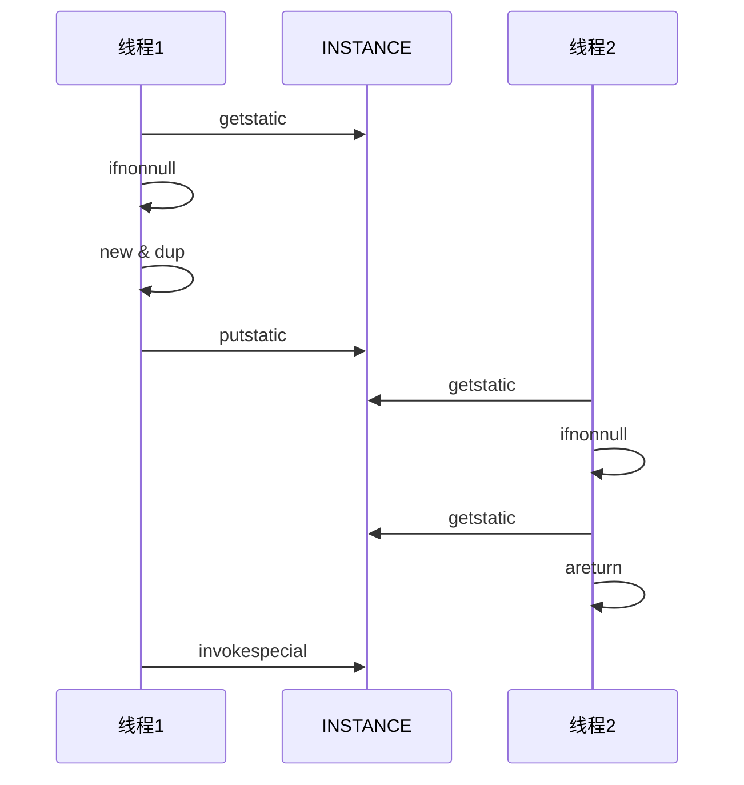

 线程进阶9

参考文章：  
- [jakob volatile](https://jenkov.com/tutorials/java-concurrency/volatile.html#:~:text=The%20Java%20volatile%20keyword%20is%20intended%20to%20address%20variable%20visibility,read%20directly%20from%20main%20memory.)
- [JMM模型全解](https://zhuanlan.zhihu.com/p/490499876)

## 可见性

先来看下面这段代码

```java
public class AtomicTest {
    static boolean run = true;

    public static void main(String[] args) throws InterruptedException {
        Thread t = new Thread(() -> {
            while (run) {
                // nothing here
            }
        });

        t.start();
        TimeUnit.SECONDS.sleep(1);
        log.debug("停止 t");
        run = false;
    }
}
```

直接运行后，会发现线程不会停下来。这就可能是JIT的优化导致的，由于上面的代码每循环一次就需要读取一次run。run作为一个static变量会出在主存中，而根据之前JMM的逻辑，主存的变量会被读取到线程栈帧的局部变量表，这种读取属于IO操作。
IO势必会消耗资源而且降低效率，于是JIT就会自动优化这个过程。把run这个变量存在自己的工作区缓存中以减少对主存的访问。当主线程修改了run的值并且同步到主存中后，在高速缓存区中的内存并没有发生改变。JIT会保证线程t从高速缓存中读取run而不是主存。
所以最终造成了一个类似死锁的情况，即使主线程修改run还是无法停下线程t。

这种主存中修改，但是线程看不见的情况就是并发编程中的可见性。一个线程对共享变量的修改必须让其它线程看的到，而且必须是立刻就得看到。

### 解决方案 volatile

关闭JIT可能是一种方法，但是很多时候需要JIT的一些优化，而且一棒子打死也不可取，也不够优雅。那么有没有从JAVA代码的层面解决问题的方式呢？这就是volatile的用处了。
再刚才的代码中加入volatile，保证每次必须从主存中读取。`volatile static boolean run = true`，一个简单的思考就是这样一定会导致效率降低，因为主存IO显然和缓存IO的速度是不能比的。

java官方对volatile的描述我实在没找到，只在官方的并发教程中（基于JDK 8）找到了下面的描述:

> Using volatile variables reduces the risk of memory consistency errors, 
> because any write to a volatile variable establishes a happens-before relationship with subsequent reads of that same variable.
> **This means that changes to a volatile variable are always visible to other threads.** 
> What's more, it also means that when a thread reads a volatile variable, it sees not just the latest change to the volatile, 
> but also the side effects of the code that led up the change.  

大概的意思也很简单，就是volatile保证了一个线程对变量的修改对其它线程可见，并且是即时可见。同时也会导致如果一个线程对这个变量做了一些不好的操作，那么别的线程也会感知到，也就是所谓的error propagation。但是到这里，其实还是没有很好的解释volatile的原理，于是我去看Jakob大神的解释。  
在他的理解中，volatile其实就是限制了变量必须存在于主存中，而不是CPU的缓存中（硬件端）。我不知道这样说可以不可以，**volatile并不是改变了读取的方式，而是限制了变量的位置**。这里借用大神的解释，volatile修饰的变量在写入的时候，会保证一定把局部修改的变量立即存入主存中，
读取操作则是一定从主存中获取变量。

这里还牵扯到一个Full Visibility的问题，现在有三个变量，一个是volatile，其它两个不是，但是在同一个方法中，如果我同时修改了这三个变量，那么它们会被一起放入主存中。因为是存在主存中的，所以volatile只能修饰成员变量或者静态变量，而在方法中的局部变量则不能被修饰。

当然还有一些别的特性，这里暂时先聊这么多。

> PS：在while中加入`System.out.println()`也可以达到相同的效果，因为print的源码中使用了synchronized来保证每次只能有一个outputStream工作。这也再次证明了print是非常占用资源的，因为它也算是重量级加锁。

### 解决方案 synchronized

如果直接来看问题的话，第一个想到的其实是synchronized，通过加锁的方式，肯定是可以保证线程读到数据的。但是仔细一想会发现其实很不合理，首先synchronized占用大量资源，需要锁对象。其次为了保证一定能读取到，必须对主线程和线程t都加锁。可以说是非常的不优雅了。
但是synchronized却可以解决**原子性**的问题。

## 原子性

原子性：一个或者多个操作，要么全部发生，要么都不发生。不是一成不变就是覆水难收。 

从这个角度去看刚才的volatile，就会发现它完全保证不了原子性。因此volatile只是限定了变量的位置，也就是`getstatic`操作，但是它无法限制`putstatic`。两个线程同时修改一个变量，只要它们的返回时间不同，那么势必一个会被另一个覆盖。
所以根据jakob的说法，一写多读是volatile最理想的使用场景，但是实际使用中肯定不会那么理想。而且即使是一写多读，还是会有问题。比如线程1和2同时读取a，线程1会更改a的值，而线程2会用a的值来进行判断。如果在a被改之前线程2通过了判断做了一些操作，但是这些操作是我不想要的。
虽然可以通过join来等待，但是如果我就是不想阻塞的话，那么volatile是无法直接解决这个问题的。

### 两阶段终止模式 进阶

之前已经用interrupt的方法实现过了，但是当时说的是这个模式还是不够优雅和安全。这次使用volatile来更优雅的实现。

```java
public void start() {
    monitor = new Thread(() -> {
        while (true) {
            if (!isStopped) {
                log.debug("优雅停止");
                break;
            }
            try {
                TimeUnit.SECONDS.sleep(1);
            } catch (InterruptedException e) {
                e.printStackTrace();
            }
        }
    }, "monitor");

    monitor.start();
}

public void stop() {
    isStopped = true;
}
```

和之前不同，这次不需要考虑虚假打断的情况。只需要修改判断条件即可。当然这个也有一定问题，就像之前说的，这个方案并不能立刻停止，必须等待monitor线程第二次读取isStopped的时候才能停止。

### 犹豫模式 balking

本质上就是做过的事不要再做一遍，实际表现中最简单的方式就是在开启一个线程前加入一个if判断是否已经有人在做同样的事了。由于这个是一个比较抽象的概念，等碰到很复杂的例子的时候我在详细讨论。
目前我就是给`start()`开始加了个if。但是由于会出现原子性的问题，所以还是需要用synchronized来锁住。

> 单例模式  
> 很类似于单例模式的思路，同一时间只能有一个实例。但是犹豫模式是允许多个对象的，但是要做不一样的事。可以认为单例模式是犹豫模式的一个例子。

## 有序性

JVM会在不影响（其实不一定）正确性的前提下，把代码中的语句顺序重新调整。乍一看似乎没有必要，但是其实这个是为了迎合CPU的运行逻辑。重排序其实也可以分为三个阶段：

- 编译器层面的重排序：编译器在不改变单线程语句语义的情况下，会根据情况重新安排语句的顺序。
- 指令级并行的重排序：CPU在不存在数据依赖的情况下，会根据情况重新调整语句的顺序。
- 内存系统的重排序：CPU在执行IO的时候可能从CPU Cache或者主存中读写，所以加载和储存操作看上去像是乱序执行的。

一般来说，这三种是层层递进的，先是编译器重排序，然后是指令级别最后是内存系统的重排。第一个是JAVA层面的，后两个是处理器角度的重排序。

### CPU 角度

首先处理器层面的重排序和不同的处理器密切相关。我查到的资料是x86只支持对写后读和流水线操作进行重排序，而其他操作都不会重排序。别的处理器可以参考上次给我的那个表格。
其实javac在java的层面上就会对一部分指令做限制，比如有些读写指令，javac会直接给它们套上一层屏障，保证它们操作顺序即使是CPU也无法改变。但是这些内存屏障并不是每个CPU都支持。
不过这些内存屏障基本是被JMM管理的。如果抛开java只看CPU的话就会发现，其实其中的很多操作都是因为CPU内存结构导致的。因为CPU的内存结构相当复杂，所以我只是参考了老大的那篇[文章](https://zhuanlan.zhihu.com/p/490499876)（话说那个文章5.2.2上面那段 高速缓存好像打成了告诉缓存了）。

文章内容太复杂，感觉没办法简单的复述。不过可以稍微总结一下。  
其实CPU为了提高效率会想很多不同的办法，其中因为CPU级别的内存模型（所谓的高速缓存）导致了客观上需要重排序。就像文中的例子，b=a+1，c=1。显然c先运行可以减少等待。不过相较于其它处理器，
x86在指令重排序上已经减轻了很多负担。由于仅支持对写后读的重排使得程序只需满足这个即可。

### 编译器 角度

从程序的角度出发，javac其实也会对指令进行一些重排序。也和CPU的想法一样，对于单线程中没有相互依赖关系的语句会进行重排序。但是受限于不同的CPU和甚至是操作系统的特性，重排序的结果会不一样。
所以很难去找到一个通用的方案和逻辑。

**注意**：以上所有的讨论都是基于单线程的模型，如果出现了多线程修改共享变量，那么重排序就会导致各种问题。

### 一个简单的例子

下面来看一个重排序的例子

```java
int num = 0;
boolean ready = false;

// 线程1 执行
public void actor1(I_Result r) {
    if (ready) {
        r.r1 = num + num;
    } else {
        r.r1 = 1;
    }
}

// 线程2 执行
public void actor2(I_Result r) {
    num = 2;
    ready = true;
}
```

不考虑重排序的话，一共可能会出现三种情况

1. 线程1先执行，r最终等于1
2. 线程2先执行，但是在ready=true之前线程1开始执行，依旧是r=1
3. 线程2先执行完，线程才开始，r最终等于4

但是如果出现了指令重排序则有可能出现r=0的情况，因为在线程2中num和ready互不干扰，所以javac层面就有可能会进行重排序。

### jcstress

其实这个也算是一个官方的并发压力测试工具，具体使用有点复杂，这里我就只是做过简单的验证，所以不讨论它的使用。

```java
@JCStressTest
@Outcome(id = "1, 0", expect = Expect.ACCEPTABLE, desc = "kkk")
@Outcome(id = "4, 0", expect = Expect.ACCEPTABLE, desc = "kkk")
@Outcome(id = "0, 0", expect = Expect.ACCEPTABLE_INTERESTING, desc = "Let go")
@State
public class ConcurrencyTest {
    int num = 0;
    boolean ready = false;

    @Actor
    public void actor1(II_Result r) {
        if (ready) {
            r.r1 = num + num;
        } else {
            r.r1 = 1;
        }
    }

    @Actor
    public void actor2(II_Result r) {
        num = 2;
        ready = true;
    }
}
```

在做了多次测试后，发现r1最终等于0的情况还是很少的，虽然相对出现几率甚至小于0.05%。但是依旧是不安全的。

```shell
Observed state   Occurrences              Expectation  Interpretation
            0, 0           802   ACCEPTABLE_INTERESTING  Let go
            1, 0   145,281,997               ACCEPTABLE  kkk
            4, 0    16,930,772               ACCEPTABLE  kkk
```

### 解决方案 volatile

在刚才的测试中加入volatile来保证ready的读写问题。结果发现，最终没有出现r1=0的情况了。具体为什么在ready加入volatile我会放到后面去讨论，这和内存屏障的机制有一些关系。

### 内存屏障

根据上面的例子，重新去理解加入volatile的代码。这里涉及到读写屏障的区别问题。写屏障保证的是在改屏障之前对共享变量的改动，都会被立即写入主存中。
而读屏障保证的则是在屏障之后对共享变量的读取，都是从主存拿的信息。那么就可以得出这样的一个结论。  

1. 写屏障会确保指令重排序时，不会把写屏障之前的代码排在写屏障之后。这样确保了之前的所有改动都会被写入主存中。而且发生顺序不变。
2. 读屏障正好相反，会去报指令重排序的时候，不会把之后的代码放在前面。

但是这样要注意的问题还是原子性，当出现指令交错的时候。这个内存屏障并不能保证读写的正确性，因为它无法规定线程的先后顺序。

## volatile 原理

### double-checked locking 问题

为了提高单例模式的效率，前人在singleton的基础上，想出了double-checked locking的方式。来看下面这段代码。

```java
public class DoubleCheckedLocking {
    private DoubleCheckedLocking() { }
    private static DoubleCheckedLocking INSTANCE = null;
    public static DoubleCheckedLocking getInstance() {
        if (INSTANCE == null) {
            synchronized (DoubleCheckedLocking.class) {
                if (INSTANCE == null) {
                    INSTANCE = new DoubleCheckedLocking();
                }
            }
        }
        return INSTANCE;
    }
}
```

粗略的看一下会觉得这个实现似乎没有什么问题，当线程调用`getInstance()`的时候，如果没有已创建的实例就会创建，有就直接返回。但是如果我们从多线程的角度去理解这段代码，就会发现其实它还是有很小的概率会出现问题的。
比如我们可以想一下编译器重排序的过程，当编译器发现两个指令没有依赖关系的时候就有可能会给语句重新排序。那么直接来看字节码：

```shell
 0 getstatic #7 <DoubleCheckedLocking.INSTANCE : LDoubleCheckedLocking;>
 3 ifnonnull 37 (+34)
 6 ldc #8 <DoubleCheckedLocking>
 8 dup
 9 astore_0
10 monitorenter
11 getstatic #7 <DoubleCheckedLocking.INSTANCE : LDoubleCheckedLocking;>
14 ifnonnull 27 (+13)
17 new #8 <DoubleCheckedLocking>
20 dup
21 invokespecial #13 <DoubleCheckedLocking.<init> : ()V>
24 putstatic #7 <DoubleCheckedLocking.INSTANCE : LDoubleCheckedLocking;>
27 aload_0
28 monitorexit
29 goto 37 (+8)
32 astore_1
33 aload_0
34 monitorexit
35 aload_1
36 athrow
37 getstatic #7 <DoubleCheckedLocking.INSTANCE : LDoubleCheckedLocking;>
40 areturn
```

重点来看第17到24行。先来分别解释一下，从17到24行的语义分别为，创建一个新的对象，复制对象的引用地址，通过引用地址调用构造方法，将对象引用的值赋给静态变量INSTANCE。
有意思的地方来了，JVM这哥们有的时候真的是负作用。根据指令重排序的一些规则（不是一定发生，有概率会发生），24行和21行有可能会交换执行顺序。因为从JVM的角度看上去，单线程下，先赋值在调用构造函数是一样的。
反正最终的结果也是引用地址里的对象。可惜这里是多线程，单线程的思路是不可取的。但是这里又出现了一个新的问题，说好的synchronized可以保证原子性，可见性和有序性呢？这就要从synchronized到底在干嘛说起了。
它就是一个锁，锁住了一个临界区内的代码。对于临界区内代码的执行顺序问题，synchronized从来没有说过它可以保证。那既然这样为什么又说它可以保证三要素呢？其实从单线程的角度就很好理解了。synchronized保证了临界区同时只能有一个线程访问，
既然是一个线程访问，只要语句没有依赖关系，那么随意调换顺序并不会影响什么。也就是说，如果共享变量全部都在相同锁的同步块中使用的话，是不会出现问题。而这里INSTANCE这个共享变量其实出现在了synchronized的外面。
也就是说，当synchronized锁住临界区的时候并不能同时锁住对INSTANCE的读取操作。如果此时有一个线程2尝试获取INSTANCE的话，是没有任何阻碍的。具体的流程请看下面的图：



从上面这个图就可以很清晰地看出问题了，当线程1发生了指令重排序（不是代码语句重排序，是JVM指令），在调用构造方法前线程2已经开始获取INSTANCE，那么此时虽然JVM已经给了对象一个地址，但是这个对象还是没有被实际赋予意义。
但是从线程2的角度看，已经有引用地址了，这个对象是存在的。所以就会直接返回INSTANCE。但是此时的INSTANCE并没有实际意义。所以也就是说，虽然synchronized保证了临界区的安全，但临界区外面的安全是没法保证的。

### 解决方案

其实超级简单，就是在INSTANCE上面加上volatile关键字。volatile前面分析过，它是可以阻止指令重排序的。原理就是内存屏障，volatile会保证写操作前面的指令不被放到后面去，但是并没有说前面的语句不会被重排。
不过这里及时发生了重排也没有关系，只要保证`putstatic`不发生在其它之前即可。同理，读操作后面的指令也不会放到前面去，所以就能保证无论多少个线程最终都必须等线程1完事了，才能读到正确的INSTANCE。

## happens-before

对可见性的一个总结。happens-before规定了对共享变量的写操作对其它线程的读操作是可见的。我个人的理解是happens-before其实是JMM层面上的，JMM规定了一系列的操作顺序。
其中的大部分都已经讨论过了，这里就直接列出了

- 单线程下，按顺序执行操作
- 锁被占用的情况下，unlock一定发生于lock之前
- volatile的写操作早于后面对这个变量的读操作
- 线程必须先启动才能run
- join时 前面的线程必须先完成，才能等待的线程才能开始继续运行
- interrupt方法早于一个线程中的检测中断方法
- 对象的finalize一定晚于构造方法
- 可传递性，A先于B，B先于C。则A先于C

## 总结

从JMM的角度出发，结合CPU的运行方式重新思考了并发三要素。在考虑重排序问题上，应该要分清楚是什么级别上的，编译器，还是处理器？然后对于不同的规则，使用对应的方法和前人总结的设计模式。
volatile不仅不是万能的，而且大部分时候还容易导致问题。所以使用的时候要格外小心。最需要注意的就是原子性。volatile不能直接保证原子性，该使用锁时就用锁。
volatile我个人的理解就是限定了对象的位置，一个变量必须存在主存中（无论是读写）。