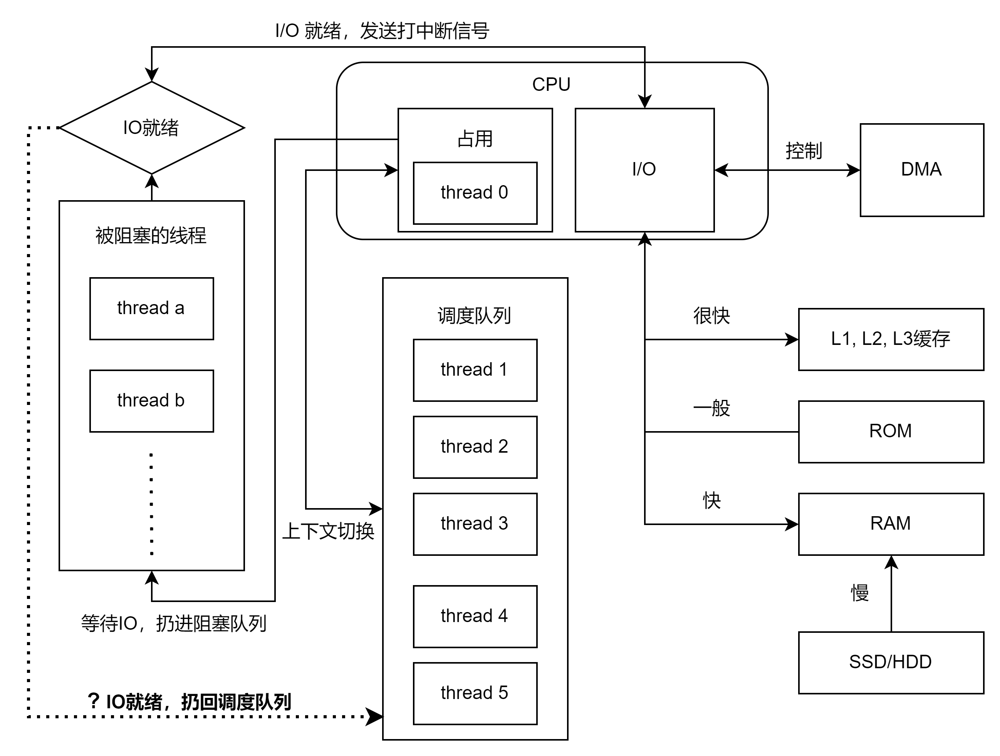

# 线程进阶2

## 关于昨天反馈中问题的反思

  
根据昨天的反馈 ，我重新画了以下CPU中线程的调用过程。

### 线程调度问题

```text
CPU 调度，指的是非阻塞等待的可以运行的线程（Java 中对应的是 Runnable），处于一个调度队列，CPU 按照一定算法从调度队列取线程并执行（Running），CPU 时钟到来的时候，将运行的线程挂起放回调度队列，然后调度其他线程。
```

假如只有一个核心，那么当thread 0正在占用CPU，并且thread a在等待IO的结果（blocked）时，其实当CPU要进行一次脉冲的时候，当前占用的thread 0可能会被调度队列中的其它线程所取代，
从而发生上下文切换。但是由于thread 0本身并没有在等待别的结果，所以只是挂起（waiting/timed_waiting）。那么它会被重新放入调度队列。  
所以我可以说调度队列中的东西不光是runnable，其实也有waiting的线程吗？ 还是说其实等待中的线程被放到了另一个等待队列中，它和调度队列是两个队列，然后它本身也可以进行上下文切换。   
第二思考是，我参考了一些文章对于CPU处理IO的解释。很多说法是，IO其实并不会被CPU直接处理，也就不占用CPU资源，是由DMA这个芯片来处理的。所以我可以理解成上图画的。
比如thread a在等待IO，而等待的期间它不可以发生上下文切换，必须等到DMA芯片告诉CPU一个中断信号（IO就绪），然后CPU才会直接继续考虑调度这个thread a。如果是这样的过程的话，
我可以理解成IO就绪后，thread a就会被重新放回调度队列，而不是直接再次获得时间片。也就是说，其实thread a等待完IO后可能还需要一会儿才会被调度器选中？  
第三个思考是如果高并发下，有很多的线程在请求IO（比较极端的情况）。假如多个IO都同时完成，那么感觉把等待IO的线程加回调度队列是比较合理的，就是让调度器去决定谁先。

### 多线程阻塞

```text
线程主要在等待 IO，等待 IO 的线程 CPU 是不会主动调度的也就是不会切换到这个线程的，但是这种情况多加一些线程可以降低阻塞。
```

这里是不是可以这样理解，只有一个线程等待IO的时候我运行别的线程，就提高了CPU的利用率。所谓多加线程降低阻塞，实际上就是当CPU经常处于空闲状态的时候，多加一些线程可以一直让CPU运行，不浪费资源。

上面的所有问题和思考，我可能有一部分和锁有关，等我把锁全部看完的时候，还会再想一下。

## sleep & yield

### sleep

首先是一个static方法，并且是对当前正在运行的这个线程进行休眠。也就是把一个线程从runnable转移到timed waiting状态。
简单验证了一下，具体代码就不复制了。

```shell
12:08:48.725 [main] DEBUG test.sleepTest - Thread t1 状态 RUNNABLE
12:08:49.232 [main] DEBUG test.sleepTest - Thread t1 状态 TIMED_WAITING
12:08:50.243 [main] DEBUG test.sleepTest - Thread t1 状态 TERMINATED
```

#### 打断sleep的方式

使用interrupt来打断休眠，是线程会从timed_waiting转换为短暂的runnable状态（抛出异常），然后terminated。

```java
private static void test2() throws InterruptedException {
    Runnable r = new Runnable() {
        @Override
        public void run() {
            try {
                log.debug("t2 开始休眠 1s");
                Thread.sleep(2000); // t2 休眠1秒
                log.debug("t2 休眠完成 {}", Thread.currentThread().getState().name());
                if (Thread.currentThread().isInterrupted()) log.debug("线程被中断了");
                else log.debug("线程被还原了");
            } catch (InterruptedException e) {
                log.debug("t2 被叫醒");
                log.debug("t2 叫醒后状态 {}", Thread.currentThread().getState().name());
            }
        }
    };
    Thread t2 = new Thread(r, "t2");

    t2.start();
    log.debug("t2 状态 {}", t2.getState().name());    // 查看t2的状态

    Thread.sleep(200); // 主线程 休眠1秒
    log.debug("主线程打断睡眠");
    t2.interrupt();
    t2.run();
    Thread.sleep(200);
    log.debug("t2 状态 {}", t2.getState().name());    // 再次查看t2的状态
}
```

结果中t2被叫醒后的状态居然是Runnable，而不是terminated。这里其实我还是有疑问，因为源码和大部分文章都只是说如果调用interrupt，阻塞状态下的线程应该是抛出一个异常并且结束阻塞。
并没直接给出具体线程的状态怎么样了。 我的测试中出现了runnable，那么我之前的猜想是不是对的？被阻塞的线程被给出一个中断信号后，就会被重新放回调度队列，等待再次占用CPU。
于是我就做了测试，我把t2的睡眠时间改为了10秒。重新拉起测试，然后再输出前，让主线程先休息1s。在排除了所有影响的结果后，我的出了一下结论。  

被打断的线程，并不会直接被打断，而是被告诉你需要中断。当线程发现需要被打断的时候（isInterrupted方法），这个线程会自行决定要不要中断阻塞。 虽然源码中告诉我们，一个被阻塞线程会立即退出阻塞状态并且抛出异常，
但是神奇的是，如果再interrupt后面立刻加入run。仍然可以继续这个线程的运行，但是可能没有实际应用场景。interrupt完后线程显示RUNNABLE不是因为线程变回了runnable状态，而是因为线程捕获异常的时候还是处于runnable状态的。
等到输出完日志，抛出异常后，线程还是会自动回到terminated。所以根据这个过程，我会把大致的生命周期化成图放在后面的反思里。

> PS:
> - 可以利用TimeUnit来代替sleep，底层调用的是一样的native方法，不过TimeUnit单位更清晰
> - 无锁环境下可以考虑用sleep来减少cpu占用（如果需要一个无线循环的话）

### yield

主动让出使用权，但是调度器完全可以忽略。完全无法确定结果，所以感觉应该最好不用。

## 线程优先级

昨天反馈中也提到了，源码中也是一样。这个只是一个提示，并不能保证任何线程的优先问题。所以这种不确定的调度方式最好不用。

## join

保证某一个线程一定拿到某个结果了才会开始继续运行。基本用法比较简单，我就没有复制上来。如果等待多个结果，就对不同的线程使用join即可。
主要要注意CPU的核心数量，如果核心数不够的话有一些线程会串行执行，并不会提高速度。

## interrupt 进阶

### 打断 阻塞状态

一般指使用了sleep, wait和join的线程，这里使用了一个比较简单的例子

```java
public static void test1() throws InterruptedException {
    Thread t1 = new Thread(()->{
        log.debug("进入睡眠");
        try {
            Thread.sleep(5000); // 也可以换成join或者wait
        } catch (InterruptedException e) {
            log.debug("t1 打断标记 {}", Thread.currentThread().isInterrupted());
            e.printStackTrace();
        }
    },"t1");

    t1.start();
    Thread.sleep(1000);
    t1.interrupt();

    Thread.sleep(1000);
    log.debug("t1 打断标记 {}", t1.isInterrupted());
}
```

第二次主线程sleep是为了保证t1确保被打断了，小的线程安全问题。这个的结果是打断标记为false。因为之前以及讨论过了，所以直接给结论。
打断一个阻塞的线程会直接抛出异常，并且重置打断标记，这个过程是在抛出异常之前完成的。具体流程我猜测是在interrupt0这个方法中实现的，不过这个是JVM的工作。

## 今日总结

今天主要详细的测试了不同的阻塞方法对线程的状态的影响，包括阻塞线程被中断后的一些变化。对于线程的生命周期又提高了一点认识。
明天打算把线程的生命周期画出来，然后研究interrupt，以及如何优雅地终止一个线程。

