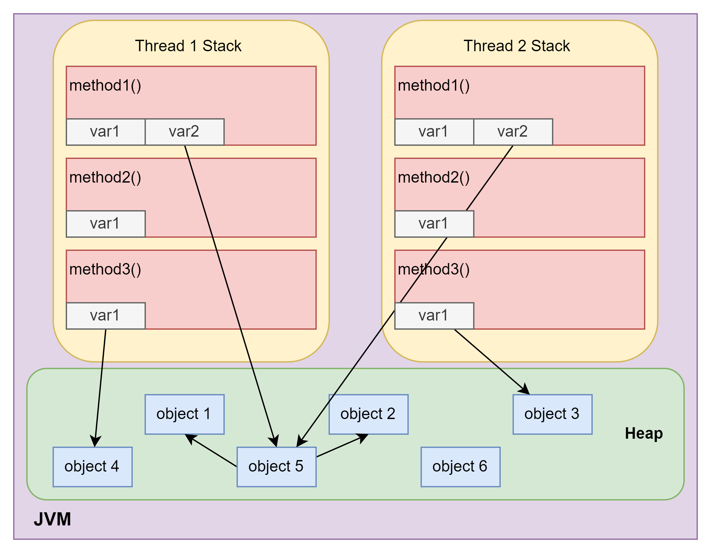
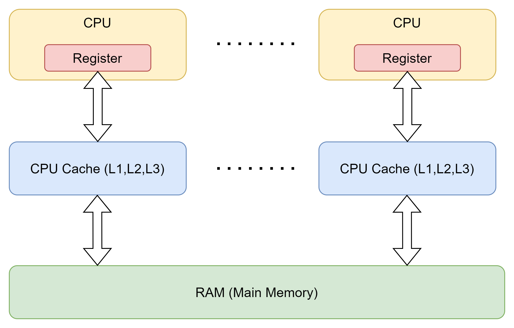
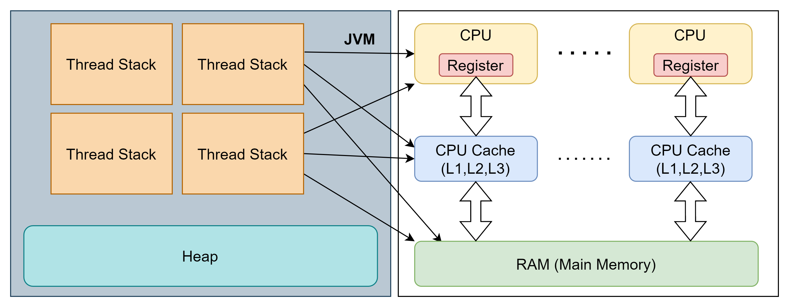

# JMM 

参考文章：  
- [JMM内存引入](https://pdai.tech/md/java/jvm/java-jvm-x-introduce.html)
- [The JSR-133 Cookbook for Compiler Writers](https://gee.cs.oswego.edu/dl/jmm/cookbook.html)


## 入门

### 栈堆模型

 
这个部分之前讨论过，其实对于JVM来说，每一个线程都是独立的一个栈。由于所有的对象是统一放在堆中的，所以如果一个线程需要使用某个对象，就需要使用指针指向堆中的对象。
图中也可以看到在线程1和2的局部变量中没有对象。那么这里的var1要怎么理解呢？很简单，它们都是primitive type的变量。这里要特别注意String不是基本类型，而且它的存储方式会相对特殊，一会儿单独讨论。
既然这些存在于线程中的局部变量都是基本类型，那么是否说明它们不可被别的线程使用呢？其实也不是，当一个线程需要用到别的线程产生的局部变量时可以通过副本的方式获取。但是这种获取方式只能得到值而不是变量的引用。
这又牵扯到java的经典问题，call by reference还是call be value？显然上面的例子应该说明java时值传递，但是调用对象似乎又是引用传递的。这里我个人的理解是call by value。至于为什么调用对象会被改动，一会儿在讨论。

除了每个线程单独的局部变量表以及每个栈帧产生的局部变量外，堆又是用来干嘛的呢？虽然我们直到堆中存放的是很多对象，但是任意一个具体的对象（最开始）都肯定是由某一个线程创建的，那为什么这个对象不属于线程的局部变量呢？
这里就是JVM的内存管理模型的结果了，虽然线程可以创建和调用对象，但是JVM会把所有创建的对象统一管理起来，这里可以参考字节码。

```shell
 0 new #7 <test/Account>
 3 dup
 4 sipush 1000
 7 invokespecial #9 <test/Account.<init> : (I)V>
10 astore_1
```

这是创建一个新对象的时候JVM会运行的字节码，最后一条指令`astore_1`意思是把这个对象的引用存到局部变量中。这就产生了一个新的疑问？这听上去不是很像引用传递吗？其实不是，虽然JVM把reference存到的局部变量中，但是当一个线程需要使用某个对象时，JMM会这个对象的副本给到线程而不是原件。
当副本修改完成后，由于传递值是对象的引用，所以会修改到原始的对象。但是这个过程并不是直接发生在原始对象上的。


### 线程如何访问对象

前面提到线程需要对象时，JVM会把对象的引用当作值传递给线程，访问这个对象的栈帧会得到对象的副本，然后在本地进行操作。要注意的是如果两个线程同时访问同一个对象，它们会分别得到局部对象副本。
这也是为什么java多线程中会出现线程安全的问题。因为一个线程对变量的改变另一个线程是无法直接看见的。  
在上图中，对象5会指向对象1和2。那么当一个线程访问对象5的时候也会自动获得访问对象1和2的权限。

### 小结

JVM在处理对象时，会统一把所有对象放在堆中，如果线程需要就直接传副本给线程。传过去的值实际上是对象的引用（但是仍然传的是值）。线程中的局部变量不可被其它线程直接使用，如果需要调用也是副本的形式。
一个线程堆栈中的所有栈帧可以共享变量。

## 硬件角度分析JMM

  
一般来说和CPU直接交互的是CPU中自带的缓存，其中包括了一级二级三级缓存，这些缓存可以在主内存中进行读写。

### 硬件内存与JMM



根据上图的模型，几乎可以发现JVM的数据可能存在与任何一个位置，包括寄存器，缓存和主存。这个模型实际上让多线程和数据定位变得尤为困难，因为数据可能出现的位置很杂乱，不同线程还不共享。

### 共享对象的可见性

这里之前已经提到过了，由于线程堆栈中的栈帧修改的是某一个对象的局部副本，而不是对象本身。所以JVM需要通过一些操作来更新原始的对象，这就出现了共享变量的不可见问题。
由于这种更新并不是实时的，所以别的线程可能调用的是修改前的对象，因此会出现数据错乱的情况。也就是所谓的线程不安全。  

在硬件中的表现：线程1会让CPU1把主存中的对象数据读取到缓存，然后在到寄存器最后执行。如果此时线程2调用了相同的对象，由于处理完的数据还在CPU1的缓存中，CPU2中的缓存仍然是未修改的。
这时CPU1完成了操作，把缓存中的数据写入了主存。此时线程2还在对原始数据进行修改，等线程2执行完成了，它会把缓存中的数据在放回主存。这就相当于直接覆盖了线程1写入的数据。
