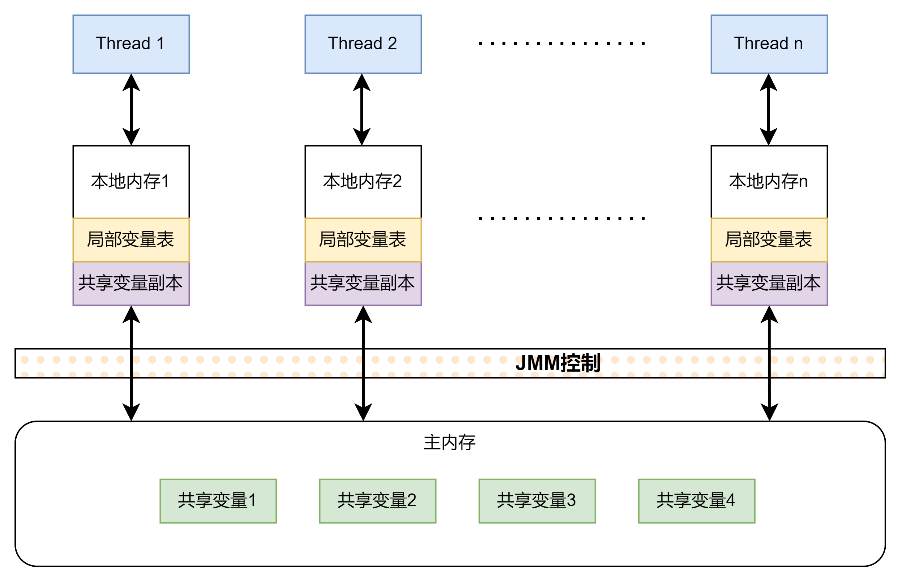
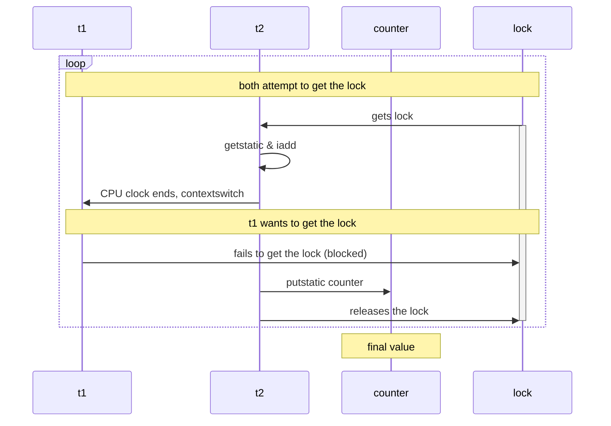

# 线程进阶4

## 共享思维 入门

假设现在只有一个功能强大的计算机，有两个人想要租用这个计算机。租用费由实际使用时间来决定。  
假设A想要全天租用计算机，但是一天中A需要吃饭，睡觉，休闲。并不是一直可以使用这个计算机。这样租用的费用就会相对地减少很多。
而B如果也想使用这个计算机，ta就必须等到A使用完，这样的话也浪费了很多时间。而且也不够公平。  
既然这样为了提高利润，不如让ta们轮流使用。但是这里有牵涉到一个问题，运行到一半的数据需要存储，为了最大化收益，我决定把相同的数据存在同一个储存中。
这样的话，A和B可以共用数据。这就又出现新的问题，如果A和B不能同时看到数据的变化，那么就会造成数据的错乱，从而导致意想不到的结果。比如A的时间到了，但是A还没有把数据写入储存，
而B已经开始对这个数据进行操作，那么最终的结果显然是混乱的。

## Java线程中的共享问题

### 线程不安全的例子

```java
private static void test1() throws InterruptedException {
    Thread t1 = new Thread(()-> {
        for (int i = 0; i < 5000; i++) {
            counter++;
        }
    },"t1");

    Thread t2 = new Thread(()-> {
        for (int i = 0; i < 5000; i++) {
            counter--;
        }
    },"t2");

    t1.start();
    t2.start();

    // 等待所有线程完成
    t1.join();
    t2.join();
    log.debug("counter: {}", counter);
}
```

因为没有做同步处理，所以导致counter的结果并不是0（极小概率碰到0）。这里直接观察反编译结果

```shell
 9 getstatic #38 <test/ThreadUnsafeTest.counter : I>
12 iconst_1
13 iadd
14 putstatic #38 <test/ThreadUnsafeTest.counter : I>
```

可以看到counter++/--被分成了4条完全不同的JVM指令。并且每一轮开始的时候是先从static中获取变量，然后做计算，完成后放回。
为了详细理解这个部分到底发生了什么问题，我去简单了看了下JMM的模型。

### JMM如何分配线程的内存

  

和之前线程的分配一样，这里只是**JAVA对于内存的处理**，而不是操作系统甚至硬件中的处理方法。其实JAVA中的本地内存模型对应了硬件里面的很多部分，
包括内存，缓存，寄存器等。这里我只讨论java本身。从上图来理解刚才的字节码，如果使用`getstatic`，实际上是从主内存中取出共享变量，然后进行操作，在放回主内存。
由于线程是并行的，所以上面的例子可以看成线程1和2同时在读取主内存中的共享变量，所以主内存的共享变量也许还没有完全更新就被读取了。当然这个模式其实也解释了java中的线程要想互相沟通，
必须要通过主内存，也就是分为两步——获得数据,返回数据。

重点：JMM是语言级别的模型，和硬件中的内存分配不是一回事。

## 临界区和竞态条件

### 临界区 Critical Section

刚才提到的多线程共享资源问题，其实多线程如果只是读取数据而不写入的话，基本也不会出问题。但是不断改变共享变量导致了读取的数据并不准确，就如同的上面例子。
那么在java中如果出现了一段代码块，存在对共享资源的多线程读写操作，那么它就被称为**临界区**。

### 竞态条件 Race Condition

多线程在临界区内执行，由于代码的执行序列不同而导致结果无法预测，这种情况就被称为竞态条件

## 阻塞式解决方案

为了避免出现竞态条件，java中提供了很多设计思路。其中锁和synchronized关键字又被称为阻塞式解决方案。

### synchronized 关键字

其实synchronized的本质是一个锁，所有被synchronized修饰的方法都会尝试获得这个锁，如果这个锁被占住了，则会处于阻塞状态（java中为blocked）。而拥有锁的线程会一直运行完当前的内容才会释放锁。
同一时间只存在一把锁。这种类型的锁一般称为互斥锁。

#### 简单实现

```java
static final Object lock = new Object(); // 锁对象

synchronized (lock) {
    counter++;
}
```

简单来说使用synchronized必须要有一个锁对象，这个对象可以是Object类。其它任何使用同样锁对象的线程想要获取这个锁的时候就会被阻塞，在java中是blocked。

```shell
14 monitorenter
15 getstatic #35 <test/SynchronizedTest.counter : I>
18 iconst_1
19 isub
20 putstatic #35 <test/SynchronizedTest.counter : I>
23 aload_1
24 monitorexit
```

通过观察字节码文件，可以看到在加入了synchronized后，`getstatic`前面加入了`monitorenter`来表示尝试获取钥匙，成功获取则一直占用，直到任务完成。

#### 抽象理解方式



synchronized中的锁对象可以想象成一个房间，这个房间只有一个门。房间内最多只可以有一个人。这个过程可以想象成一个线程进入了房间后，就把钥匙拿走并且反锁了房门。
但是这里关键的是，即便我把钥匙拿到了，也在房间里，不代表我可以一直在房间里。CPU的时间片还是限制了这个线程的使用时间，当时间片到了之后，线程还是会被踢出房间，但是它仍然拥有钥匙。
于是就出现了这样的情况，t1拥有钥匙，但是时间片用完了，t2想进入依然不行。所以t2只能等到t1再次获得时间片并且把任务完成了，才能得t1手里的钥匙。

#### 一些思考

原子性：并发三要素，其实synchronized相对完美地解决了原子性的问题。因为同一时间只能有一个线程获取锁，所以一个操作除非全部完成，否则全部回滚。即使我使用stop或者别的方式中途杀死了线程，
这个锁依旧不可能被释放，虽然是死锁但也保证了数据的原子性。当然这样并不是最完美的。  
使用synchronized锁对象的问题：在java中，可以把锁对象理解成，每一个对象都自动获得一个对象锁，而锁对象其实就是刚才的房间。既然这样，如果我使用不同的锁对象那么还是可以同一时间修改同样一个共享变量。
这也是为什么sync关键字并不完美。  
synchronized的方式除了使用对象锁，还可以使用类锁。它们在JVM的底层表现也许会有不同，具体研究请看下文。

## 面向对象的保护方式

其实这个方式包含对象锁，和类锁。先来看一个简单的例子，

```java
class Room {
    private int counter = 0;

    public void increment() {
        synchronized (this){
            counter++;
        }
    }

    public void decrement() {
        synchronized (this){
            counter--;
        }
    }

    public int getCounter() {
        synchronized (this){
            return counter;
        }
    }
}
```

这是一个简单的内部类。类的内部所有的方法中（非方法签名），写入synchronized块。而锁对象是this，根据类的定义我们知道this代表的是一个实例，所以这里其实是对象锁。和之前直接创建一个空对象其实并没有区别，只是这种方式把synchronized嵌入了方法中，可以去掉不必要的重复。
但是这种方式的缺点就就是，对于每一个需要使用的方法，我都得重写一遍synchronized块，造成了代码的冗余。所以java中通过的方法签名的方式优化了这个功能。

```java
public synchronized void increment() {
    counter++;
}
```

这里直接在成员方法签名里加入了synchronized关键字，在成员方法中，这个步骤相当于对this加锁，和上面的代码等价。但是注意对于静态方法，这个方式就变得不同了，之前讨论过，静态方法在JVM中并不是作为一个实例运行的，而是单独运行。
在一个类中的静态方法属于这个类而不是某个实例，所以当在静态方法中加入synchronized的时候，其实是类锁，那么它也就无法完全保证原子性，这也是为什么说synchronized并不能完美地保证原子性。为了验证等价性，我观察了字节码文件。
方法签名在字节码中相当于运行的时候在编译synchronized，而直接写成代码块则会在加载的时候就编译。

### 一点小思考

如果一个类中有的加入了关键字，有的没加，那么没加入的就会破坏线程安全，所以一般来说要加全加。这也许就是为什么很多线程安全的集合几乎每个操作方法都加入了synchronized。  
如果同时出现类锁和对象锁，那么谁的优先级会更高，或者说谁才是真正控制锁的那个人呢？其实这个问题本身就不成立，因为他们呢锁住的对象就不一样，对象锁是对实例的禁锢，但是类锁会锁住类。所以最终的结果是，并行执行，互不干扰（不互斥）。
这里我个人的理解，锁其实锁住的是操作过程，而不是成员变量，因为JMM中每个线程还是使用的局部变量表，它们只是通过主内存交换了信息。

### JVM如何处理

先来看字节码

```shell
14 monitorenter
15 getstatic #80 <test/SynchronizedTest.counter : I>
18 iconst_1
19 isub
20 putstatic #80 <test/SynchronizedTest.counter : I>
23 aload_1
24 monitorexit
25 goto 33 (+8)
28 astore_2
29 aload_1
30 monitorexit
```

很明显，JVM通过`monitorenter`和`monitorexit`指令来控制锁的归属权。深入了解底层，monitor翻译过来就是监视器，它会监视每一个锁的计数器。而每一个类或者实例只能有一个计数器（锁），并且只会被唯一监视器监视。
在同一时间，一个监视器只能被一个线程获得。如此，当一个线程想要获得锁，就会发生三种情况：

- 计数器为0，目前还没有被获得，那这个线程立刻获得锁，并且计数器+1。别的线程想要获得锁必须等待计数器再次归零
- 如果monitor拿到了锁的所有权，又重入了这把锁，那锁计数器就会累加成2。根据重入的次数会一直累加
- 锁经被别的线程占用，只能等待别的锁

相对地，一个线程想要释放锁就等于把计数器减一直到减到0为止。

这里重入的意思其实就是再次用到了这个锁，比如有三个synchronized的成员方法，它们是扣在一起的，如下图所示。


那么当线程调用a的时候，自动获得监视器锁，然后在a调用b，c则不会被阻塞，可直接重入这个锁。当bc结束时，直接释放监视器锁。

## synchronized弃用的简单理解

这里参考了这篇文章的内容以及一些mutex底层的详解：[synchronized解析](https://pdai.tech/md/java/thread/java-thread-x-key-synchronized.html#%E5%AF%B9%E8%B1%A1%E9%94%81)  
实际上，JVM的`monitorenter`一类的指令是依赖操作系统中的Mutex lock实现的。最简单的操作原理是一个while循环，一直等待所释放，后来出现了把一个线程挂起等待的方式。但是即便这样，挂起一个线程的时候，会从用户态切换到内核态来执行。这种切换的代价一般认为是很大的。
如果同步方法只是单线程执行，那么这种切换不仅代价巨大，而且也没有任何必要。java 6之后对锁进行了大量优化，相对缓解了一些压力，但是仍然不够。具体关于锁的优化会放在后面的反思中讨论。

## 小结

本次反思主要讨论了java中共享变量可能带来的问题，以及如何处理这些问题。简单的从JVM的角度研究了synchronized关键字，包括对JMM的入门。由于锁的机制很复杂，而且环环相扣，所以后面会慢慢补充完整。
目前一些理解可能不太成熟。