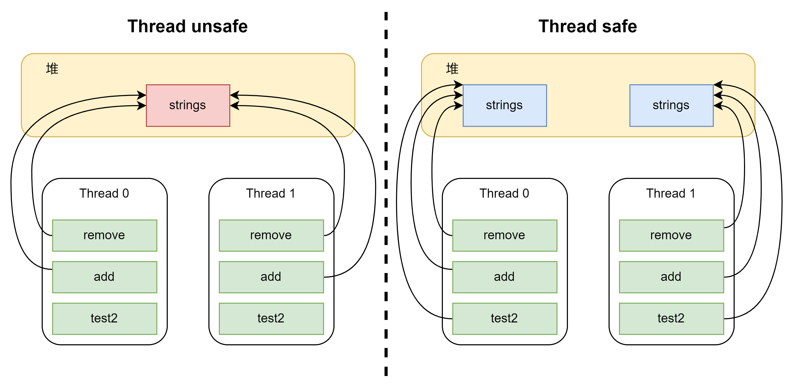

# 线程进阶5

## 线程安全

### 成员变量和静态变量是否线程安全

基本上只读文件，没有线程安全问题。因为我只是需要信息，而不是改写信息。如果这些变量没有被共享，那么也不会存在问题。其实就是在主内存中被特定的线程修改（单一线程），不存在线程安全问题。
那么唯一会出问题的就是读写，并且是并发读写。当多个线程想要访问用一个共享变量，并且要对其进行操作时，操作的代码就变成了临界区，这个是线程安全问题就尤为重要。

### 局部变量是否线程安全

基本上，局部变量是线程安全的。根据JMM，大部分情况下它属于一个线程，只在当前线程的本地内存中出现，不存在与别的线程分享的情况。看下面这个简单的例子

```java
public static void test1(){
    int i = 10;
    i++;
}
```

如果只是对这个method中的i进行修改，那么无需考虑线程安全问题。因为即使我在此方法中加入别的方法，根据JMM的原则，也会在相应地在新的栈帧中复制一个局部变量过去，这两个局部变量是不共享的。
但是当使用对象是则会要格外注意，看下面这个例子

```java
static ArrayList<String> strings = new ArrayList<>();

private static void test2() {
    for (int i = 0; i < 2; i++) {
        new Thread(() -> {
            for (int j = 0; j < 1000; j++) {
                add();
                remove();
            }
        }, "Thread" + i + 1).start();
    }
}

private static void add() { strings.add("1"); }

private static void remove() { strings.remove(0); }
```

这里两个不同的线程引用了同一个变量，所以等于分享了变量，因此出现了线程安全的问题。这里可以从JVM的角度理解，如下图所示  
  
当在method内部定义局部变量时，实际上在堆内存中创建或者预留了一个对象，所有内部方法使用此对象会让指针指向局部的对象（右图），而在方法外部定义对象，则会导致所有方法指向同一个对象（左图）。所以局部变量实际上不需要考虑线程安全，因为它根本就没有被分享。

### 小结

通过刚才的例子，其实判断是否线程安全的方式已经非常简单了。只要保证一个变量不被分享即可。如果一个变量非要被分享（高并发），那么就需要考虑线程安全。
而解决它的本质，就是考虑访问的顺序，同时间谁能访问，包括操作之后的可见性。  
在分享变量中，如果有父类子类则需要特别小心，因为很有可能子类会把父类的方法重写从而导致线程安全问题。如果是这样可以通过final或者private关键字来保护线程安全。（这里顺带一提，古早版本中的java如果使用final修饰方法，JVM会通过内嵌方式尝试提高效率，但是很多时候由于方法体过长导致并不会提高效率，所以现在变成由JVM直接进行判断了，无需非要final）

## 线程安全类

只是一个小的入门，jdk中有太多的线程安全类了。之后会结合collection的内容一起分析。在讨论大部分JUC和线程安全类之前，要明确一点就是每个类中的方法，单独看都是线程安全的，但是如果组合使用，并不一定安全。

### 简单例子

使用Hashtable做一个小的例子，使用hashTable的`put`方法是线程安全的。

```java
static Hashtable<String,String> myStringTable = new Hashtable<>();

private static void test3() {
    for (int i = 0; i < 2; i++) {
        new Thread(() -> {
            for (int j = 0; j < 1000; j++) {
                myStringTable.put("1","a");
                myStringTable.remove("1");
            }
        }, "Thread" + i + 1).start();
    }
}
```

上面这段代码是不会出现线程安全问题的，因为HashTable中的put和remove都是synchronized的方法，并且锁的是对象，因此尝试修改同一对象是符合原子性的。实际上只是不同的线程尝试获取这个对象的监视器锁。那么什么样的组合会出现线程安全问题呢？

```java
private static void test4() {
    for (int i = 0; i < 2; i++) {
        new Thread(() -> {
            if (myStringTable.get("key") == null){
                myStringTable.put("key","a");
            }
        }, "Thread" + i + 1).start();
    }
}
```

上面的这段代码中，可能会出现线程安全问题。虽然get和put分别都是线程安全的，但是两个操作并不是原子性的，当t1使用get结束后会释放锁，如果t2立即获得了锁，那么此时t1还没有更新，t2更新的值可能把t1更新的值覆盖。
不过JDK很贴心的设计了一个`putIfAbsent`方法来保证原子性。这个API就可以保证改修改完成前不会释放锁。

### 不可变类 线程安全

其中最火的应该就是String类吧。这个在之前讨论string的时候已经讨论过了，String作为一个final类，其实并不是修改了字符串，而是新加入了一个字符串，并且通过intern方法可以把新建的string放入常量池来提高效率。
实际上所有的final类，都是线程安全的，因为它们永远不会被改变，所以可以看成只读，而只读是线程安全的。

## 卖票习题

代码行数略多，大致就是一个售票窗口类（包括可售的票数，以及API），在main中使用2000个线程去模拟抢票。调用售票窗口的`sell`，然后等待所有线程完成任务，在打印结果。可以自定义初始票数。

```java
@Slf4j
public class SellTest {
    public static void main(String[] args) throws InterruptedException {
        TicketWindow ticketWindow = new TicketWindow(2000);
        List<Thread> threads = new ArrayList<>();
        List<Integer> sales = new Vector<>();
        
        for (int i = 0; i < 2000; i++) {
            Thread t = new Thread(() -> {
                int count = ticketWindow.sell(randomAmount());
                sales.add(count);
            });
            threads.add(t);
            t.start();
        }

        for (Thread thread : threads) thread.join();

        log.debug("tickets sold: {}", sales.stream().mapToInt(c -> c).sum());
        log.debug("remaining tickets: {}", ticketWindow.getCount());
    }

    static Random random = new Random();
    public static int randomAmount() { return random.nextInt(5) + 1; }
}

@Getter
class TicketWindow {
    private int count;

    public TicketWindow(int count) { this.count = count; }

    public int sell(int amount) {
        if (this.count >= amount) {
            this.count -= amount;
            return amount;
        } else return 0;
    }
}
```

结果如下

```java
17:06:37.756 [main] DEBUG test.SellTest - tickets sold: 2003
17:06:37.759 [main] DEBUG test.SellTest - remaining tickets: 0
```

运行后的结果，发现一共就2000张票但是最后却卖出了2003张（某程，某麦网经典操作）。不看代码，先预分析，大致的可能性会有，售票窗口类设计问题，方法中的线程安全问题，共享变量问题，其它小的失误问题。
根据这些可能性开始看代码。首先考虑是否用了线程不安全的集合，这里一个是arraylist，一个是vector。vector是线程安全的，而且只用了`add`，并且是局部变量，应该不会出现问题。而arraylist是非线程安全的，但是这里只是用来存储线程，并且让主线程等待而已。所以也不会有问题。
既然排除非线程安全集合的影响，那么下面就要考虑设计的问题了。首先看售票窗口类的方法，只关注sell的话，发现sell本身没有使用synchronized签名。大概问题就在这了。根据临界区的定义，想办法找和共享变量读写相关的代码。
这里就是`ticketWindow.sell()`。那么下面的工作就很简单了，在sell方法签名中加入synchronized。  
虽然这道练习很简单，但是解决问题的思路还是值得总结一下。基本上对于简单的多线程问题，如果想要debug，最重要的是先确定临界区和竞界条件。找到具体出现问题的点。为了确保不出现问题，还应该检查集合的使用，很多时候即使集合本身线程安全，但是组合使用就会带来问题。

## 转账习题

```java
public class TransferTest {
    public static void main(String[] args) throws InterruptedException {
        Account a1 = new Account(1000);
        Account a2 = new Account(1000);

        Thread t1 = new Thread(() -> {
            for (int i = 0; i < 1000; i++) a1.transfer(a2, randomInt());
        }, "t1");
        Thread t2 = new Thread(() -> {
            for (int i = 0; i < 1000; i++) a2.transfer(a1, randomInt());
        }, "t2");

        t1.start();
        t2.start();
        t1.join();
        t2.join();

        log.debug("total {}", a1.getBalance() + a2.getBalance());
    }

    static Random random = new Random();
    public static int randomInt() {return random.nextInt(100) + 1;}
}

@Data
@AllArgsConstructor
class Account {
    private int balance;

    public void transfer(Account receiver, int amount) {
        if (this.balance >= amount) {
            this.setBalance(this.getBalance() - amount);
            receiver.setBalance(receiver.getBalance() + amount);
        }
    }
}
```

结果如下

```java
17:49:25.045 [main] DEBUG test.TransferTest - total 8018
```

钱会越来越多，或者越来越少。显然还是线程安全的问题。那么使用上面总结的思路，先看集合的使用——压根没有使用集合，直接略过。然后找临界区，发现应该是t1和t2的代码块。再找共享变量，分别是a1和a2的balance。
发现居然不是指向同一对象的，那么这就证明了，使用synchronized锁对象无法解决问题，所以只能使用类锁。所以在transfer中加入synchronized(Account.class)来锁。

### 依然存在的问题

虽然这里使用synchronized看上去解决了问题，但是如果同时有1W个在进行转账，那么我依旧会把所有的实例锁起来。也就是说每一轮只有一个账户可以转账，这然显然违背了多线程的设计初衷，而且带来性能问题。
具体解决方案会在后面的反思中提到。

## Monitor 监视器/管程

### java对象内存布局

在开始讨论monitor之前，先要了解java中对象在内存中是如何存储的。这次使用了`jol`工具，OpenJDK官方内存工具。 以下讨论都基于64位JVM。

java中把具体的对象一般分为普通对象（一个实例）和数组对象。（突发奇想，感觉这也解释了为什么那么多的类底层都是数组，因为方便分配内存）就以普通对象为例，一个对象在内存会被分为对象头和实例数据，如果JVM没有设置过的话还会有自动填充的padding字节。

- 对象头：存储的是对象在运行时状态的相关信息、指向该对象所属类的元数据的指针
- 实例数据：存储的是真正的数据，也就是成员变量的值等等。在拥有父类时，会包含父类的字段。字段的存储顺序会受到数据类型长度、以及虚拟机的分配策略的影响
- padding字节：对齐填充字节是为了64位的jvm中对象的大小向8字节对齐。当对象的长度不足8字节的整数倍时进行填充操作。但是这个部分可调，并不是一定会有的。

那么直接来观察，使用`System.out.println(VM.current().details());`先确认JVM是多少位的。

```text
# Running 64-bit HotSpot VM.
# Using compressed oop with 3-bit shift.
# Using compressed klass with 3-bit shift.
# WARNING | Compressed references base/shifts are guessed by the experiment!
# WARNING | Therefore, computed addresses are just guesses, and ARE NOT RELIABLE.
# WARNING | Make sure to attach Serviceability Agent to get the reliable addresses.
# Objects are 8 bytes aligned.
# Field sizes by type: 4, 1, 1, 2, 2, 4, 4, 8, 8 [bytes]
# Array element sizes: 4, 1, 1, 2, 2, 4, 4, 8, 8 [bytes]
```

使用的是64位的JVM，根据规则，对象头则是12个字节。

### 对象头 Object header

普通对象的对象头中包含了两个部分——标记字和类型指针。一般标记字会分配8个字节，而类型指针为4个（默认开启压缩指针），剩下的部分为value（成员变量）。
在不同的锁情况下，标记字的内容会有所不同，这里就简单了解一下，后面学习JVM和JMM的时候还会详细研究。  
观察一个对象头，使用`System.out.println(ClassLayout.parseInstance(a1).toPrintable());`找到一个a1的对象头

```text
test.Account object internals:
OFF  SZ   TYPE DESCRIPTION               VALUE
  0   8        (object header: mark)     0x0000000000000001 (non-biasable; age: 0)
  8   4        (object header: class)    0x00c0f3d0
 12   4    int Account.balance           2000
Instance size: 16 bytes
Space losses: 0 bytes internal + 0 bytes external = 0 bytes total
```

这里由于没有给a1上锁，所以mark中前面的部分都为0，而最后两位(01)表示无锁。因为是Account所以指向的是account类的地址。

### Monitor

在之前的研究中提到过一个对象可以关联一个监视器，那么这个监视器到底是干嘛用的呢？  
其实简单的来理解就是开启房门的钥匙。当我（线程）用synchronized锁住一个变量或者类的时候，只要我拥有这个对象对应的监视器就相当于我拥有了钥匙，我可以通过钥匙打开房门继续我的操作。
那么这个过程具体是怎么实现的呢？可以参考下面的图  
  
当一个对象关联到一个monitor的时候，对象头中的最后两位会变成10.并且前面62位（如果是64位的JVM）会变为指向monitor的指针。最初monitor中的owner是null，当thread a首次获取monitor的时候，自动改为thread a。
这时如果thread1，2，3都想要得到monitor的话，就会进入阻塞状态，同时也会加入一个EntryList中（没有先来后到）。等thread a释放了monitor后，系统或者Java会根据它们的设计来选择一个线程拥有这个monitor。
如果有一个thread b之前获得过锁，但是条件不满足进入WAITING，那么就会被在WaitSet中。这个部分后面会详细解释。

### 字节码角度

昨天的研究中，提到了JVM会使用`monitorenter`和`monitorexit`来表明获取锁和释放锁，但是具体的结构没有深入，而今天通过monitor的流程图再来分析一次。
首先观察一个同步代码块的字节码

```shell
 0 aload_0
 1 dup
 2 astore_1
 3 monitorenter
 4 aload_0
 5 dup
 6 getfield #7 <test/Room.counter : I>
 9 iconst_1
10 iadd
11 putfield #7 <test/Room.counter : I>
14 aload_1
15 monitorexit
16 goto 24 (+8)
19 astore_2
20 aload_1
21 monitorexit
22 aload_2
23 athrow
24 return
```

根据今天的研究，当线程获取monitor的时候，对象头中的MarkWord会替换为monitor指针，其实也就是由`monitorenter`指令做到的。当释放锁的时候就是把对象头中的MarkWord在还原回原先的数据。

此时我们看到第十六行，在解锁完成后，直接跳到24行，那么为什么还需要19-23行的内容呢？这就是java中的一个异常处理机制，当JVM发现前面的字节码并不能正确运行（即无法正常释放锁），那么它就会自动跳转到第19行执行来尝试释放锁。并且抛出一个异常。
这个部分可以看字节码中的ExceptionTable。

## Synchronized 进阶

关于昨天提到的synchronized在JDK 6之后进行了一大波的优化。其中java新出了很多锁的类型，也对应的把对象头中的存储变得不一样了。

### 轻量级锁


当一个对象虽然会被多个线程访问，但是它们的访问时间是错开的时候，就可以通过轻量级锁来优化。其实java对于这类的优化是透明的，用户无法直接控制。
具体的流程：
- 当出现synchronized代码块时，栈帧内部会创建一个锁记录对象（用户不可见）。锁记录的内部会存入储存对象的标记字（mark word）,然后产生一个对象的引用。
- 完成所记录后，jvm会把所记录中的object reference指向synchronized的锁对象，并且尝试使用CAS算法替换堆中对象的MarkWord。
- 如果成功替换，那么对象头中的MarkWord就会被改为lock_record地址（62位）+00（表示轻量级锁）。这就表示线程对对象加锁了。
- 如果失败，CAS是一个原子性的，则不会改变对象中的MarkWord。失败后会出现两种情况：
  - 其它线程持有当前对象的轻量级锁，那么进入锁膨胀阶段
  - 线程自己重入了，那么就会在栈帧中再加入一条LockRecord，但是锁记录中会显示null。新的LockRecord仅作为重入的计数
- 当退出时，如果有null的锁记录，就会把重入的数量减一。直到没有null为止
- 当出现了非null的锁记录时，会再次尝试使用CAS换回原来的MarkWord
  - 成功。释放锁
  - 失败。说明不是轻量级锁了，进入重量级锁解锁阶段

### 锁膨胀


回到刚才的过程，线程a已经获取object锁，此时线程b尝试CAS替换MarkWord。显然会失败，此时进入所膨胀阶段：
- 此时线程b（这里其实有点疑惑，我感觉这个活应该是JVM去做，不过也没什么必要纠结这个）会为对象申请一个monitor，让对象的MarkWord指向monitor。其实就是对象头中的前62位地址修改一下
- 当申请monitor操作完成后，线程b会自觉的把自己加入EntryList，也就是之前synchronized的过程。
- 后面就都一样了，释放锁，唤醒BLOCKED的线程，根据算法选择一个线程。

### 自旋锁

如果每次出现多个线程抢夺一个锁就锁膨胀的话，不仅浪费了资源，也也失去了使用轻量级锁的意义。所以java在优化锁中加入了自旋锁来解决这个问题。
实际上就是线程想要获取一个被占用的锁时，可以不每次都发生锁膨胀然后阻塞。相反，线程可以通过一个忙循环的方式不断的检测（JVM中默认为10次），也可以自己设置。
但是这方法只适用于阻塞时间很短的环境，如果阻塞时间很长的话则会导致CPU一直被自旋锁（线程）占用而白白浪费了资源。

### 偏向锁

这个我看咱们后台的JVM推荐启动参数里也特别关闭了。想问个小问题，JDK 15后是默认关闭，为什么我们要刻意关闭？是有什么别的影响吗？  
简单的来说就是java会把同一个线程中的不同栈帧放在一起，在之前轻量级锁中，每当一个新的栈帧想要获取对象锁的时候，就会用CAS来尝试替换。而偏向锁实际上就是取消了这个过程，极大程度上减少了CPU的消耗。具体的做法就是把MarkWord中的数据改成一下形式


当线程内部栈帧尝试获取相同的锁对象时，栈帧直接观察前54位，如线程id相同，则直接重入，无需CAS。
很多文章中说，JVM默认参数中会出现延迟，可以用`-XX:BiasedLockingStartupDelay=0`来关闭。但是我看了一下好像我的JVM默认参数默认就是0。可能是JDK版本不一样吧。
既然我们的态度是选择关闭，我就没有特别多的去了解。