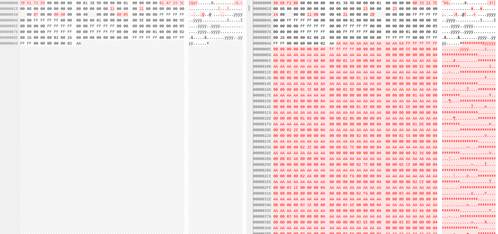
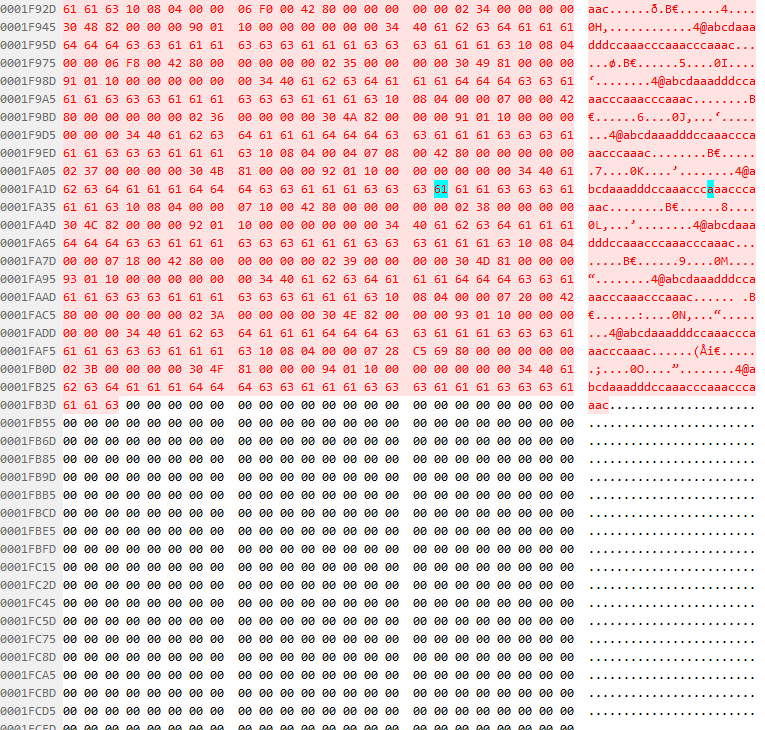
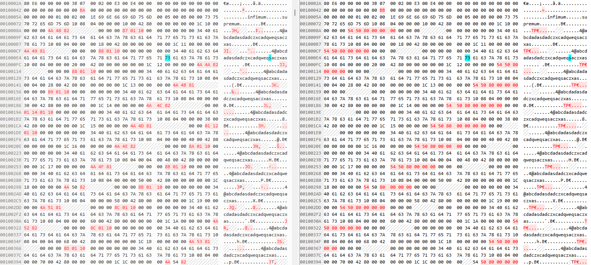
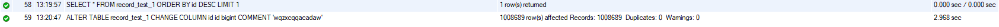
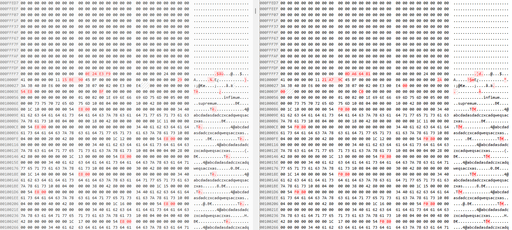
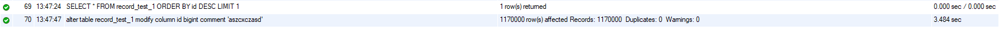
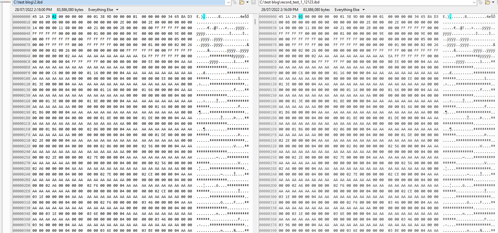
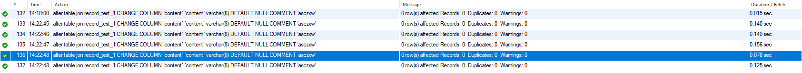
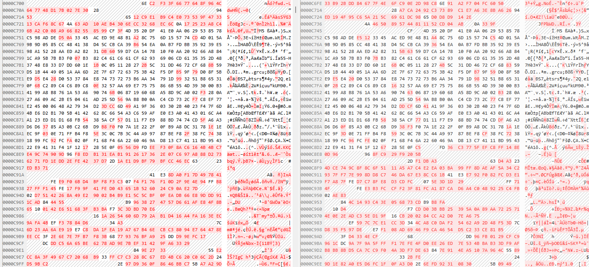

配置：

- server 8.0
- dynamic

表格概况

```mysql
create table record_test_1
(
    id      bigint auto_increment,
    score   double,
    name    char(4),
    content varchar(8),
    extra   varchar(16),
    primary key (`id`)
) row_format = dynamic;
```

# 插入100W条数据后的表格

再直接修改之前我重新对比了一下只有4条的表格（以下简称小表）和有100W+的表格（以下简称大表）
它们大致的区别是大表中会在表头之后加入很多乱码  
  
根据idb文件的分配，这个部分应该是FSP Header但是这个远远超出了112个字节了，不过这个并不是重点，直接来看元数据的位置。
元数据的位置改变了很多，但是行数基本没有发什么变化，由于位置错开了，所以我没法一张图直接截图出来，我就把两个文件都上传了。具体行数在0000c070。
我对比了以下行数的区别，好像元数据的部分，大表反而比小表少十几行（大概900个字节左右）。我查了以下原数据中存放的内容。一般都是表本身的信息，比如表的行数，用户名，数据库名字等。
那么由于数据增多，元数据变多也是合理的。

下面进入数据表（user records）
由于数据量相对比较大，所以应该是自动分页了，可以看到每一部分数据之间会自动间隔一些用0填充的字节。  
  
这个部分也符合预期，因为毕竟插入了很多数据。

然后大表的最后也和小表一样被大概很多行的0填充了。

# 无并发情况下， alter的影响

直接使用

```mysql
alter table record_test_1
    modify column id bigint comment 'aszcxczasd';
```

进行修改。  
  
这个改动大概使用了2.7秒而且可以看到如下的结果

```shell
1008689 row(s) affected Records: 1008689  Duplicates: 0  Warnings: 0
```

可以看到所有的行数都产生了影响，但是是否就证明会直接改动数据呢？下面直接观察数据的变化。  

可以明显的看到，的确和之前说的一样，会进行修改。这样的话就可以说明它的储存方式是把comment代入到每一条数据中去。
为了确保这里的没有其他的干扰情况，我又尝试了以下的改写方式。

为了排除刚才可能产生的影响我复制了原始的数据库，然后在对原始的数据库进行改动。

```mysql
ALTER TABLE record_test_1
    CHANGE COLUMN c1 c1 bigint COMMENT = 'asdzxcasd';
```

我的得到了以下结果  
  
很神奇，这里修改的时间变成了0.016秒。这是否能说明前面的说法错误了呢？因为有可能是东西放入缓存所以变快了。为此我尝试了一个新的方法。
我回归到原始的数据库，新加入了一条数据，然后在使用了上面的指令，这次的时间又回到了2.968秒  

这里时间甚至比之前还要多出来了。继续观察数据的变化，还是一样  
  
在次出现了和之前完全一样的情况，由此证明刚才的速度上升很有可能只是因为数据被放入了buffer所以操作速度变快了，而并不是没有修改数据。
排除了这些原因后，我继续测试了以下模拟并发的情况。虽然结果应该是没有什么疑问了。

# 并发（先写在读，保证一定一定不在缓存中）

  
可以看到速度很慢，已经到了将近4s，这里我在不断先写在读，我用的mybatis然后做了一个亿的数据加入和读写，在这个途中我尝试使用alter改变数据。
可以整体时间和之前完全没有任何区别，因为数据不断增多，所以显然会便慢。
直接观察了后续的hex code，发现也还是一样，依旧是更新了所有数据的一小部分。我把这个也放在文件中了。因为截图的位置变化太大，很难截出来。

# 反转

那是不是真的就没办法了呢。。。很神奇的是，我在网上看到了这样一段sql

```mysql
alter table jon.record_test_1
    CHANGE COLUMN `content` `content` varchar(8) DEFAULT NULL COMMENT 'asczxw';
```

这次终于出现了我比较满意的结果。先看截图  
  
这次可以看到只有表头元数据的位置发生了改变，而数据的部分也没有发生改变。在检测一下修改的时间  

这里是高并发情况下的尝试，发现完全没有任何问题。改写的时间基本一致，偶尔会相对长一些0.1秒左右，但是仍然可以较快的改变。
最后我又重新观察了一下结果，发现和前面一样只是元数据的部分不太一样。


说实话，我不知道为什么，甚至官方的文档还说过使用alter可能会改变整个表的值，这个是因为innoDB导致的。一下是官方的说法

```markdown
Bear in mind that ALTER TABLE ... COMMENT ... discards any existing comment for the table. See Setting NDB_TABLE
options, for additional information and examples.
```

但是当我定义了DEFAULT NULL之后就不会出现这个问题了，这里我查不到任何官方解释，我就只能认定它可能是mySQL的一个内部机制问题吧。
不过至少现在可以看到，它是可以直接进行修改的。