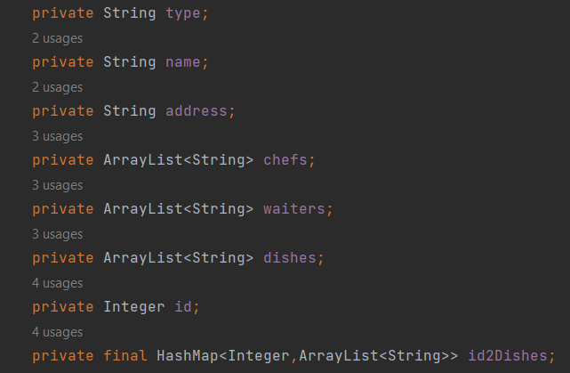

### 1. class的基础
本次任务只使用了基础的class类型，没有abstract也没有继承

a) fields & final关键字

fields在java class中基本类似于一个类的properties。
大部分情况下，每一个field都定义了这个类的不同属性。比如本次实现的
餐厅类中
> 名字、种类、地址等都是餐厅本身具备的属性
> 

定义fields的时候一般使用private作为access modifier，这里主要的
原因是封装。外部无法直接调用和修改一个类的变量，只能通过setter和getter
来进行赋值和提取。<br>
除此以外本次任务中的```id2Dishes```变量使用了final来限制修改应用对象，这里比较有意思的地方很多。
我大概看了很多解释，final关键字指定了一个变量无法被修改，但是为什么final hashmap，arraylist，
甚至array仍然可以添加和删除呢？
原因主要由一下几个点
> final虽然规定了变量不可被修改，但是其实它所指定的是reference不可被修改。
> 也就是说当创建array或者arraylist这些变量的时候，实际上是在内存空间中给这些变量确定了一个地址。
> 当使用final定义的这些变量的时候，final keyword会确保指针指向的这个内存地址不可更改。
> 也就是说虽然我给某个array添加或者删除了某些元素，但是这个array在内存的地址并没有发生改变。
> 所以实际上并没有影响final所限制的reference，因此不会报错。但是当我使用primitive类型的变量时，
> 在内存空间中，改变这个变量的值就类似于改变地址，所以final关键字会限制改动。
> 以下截图证明了primitive类型和其他类型的区别：
>  <br>
> 很明显，primitive类型的变量被final修饰后就不肯更改，而array和string任然可以被更改。

但是final修饰的类中，String是比较特别的。String的源码中虽然被final修饰但是仍然可以被修改，但是其实string并不是被修改了。
而是被替换了指向的地址——也就是创建了一个新的String。我尝试通过反编译的方法去看，是否创建了新的string，但是结果表明反编译不能直接看出String的地址变化。
所以我尝试找源码中的一些线索。比如下面这张图中的substring源码，我们会发现其实使用substring并不是改变了string本身的值，
而是创建了一个新的string，并且把老的变量指向这个新的string。


