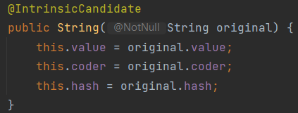

### 上周的任务跟进
#### 1. String创建
String的创建方式有很多不同的方式，参考了一些大神的讲解和源码之后，还是得出很多结论的。
基本上主要有一下三个构造方法：
- char[]
- byte[]
- int[]

这里可以发现，三种形式的构造方法都底层全部都是数组的形式。根据string的创建规则，使用一下代码来创建一个string。
```shell
String s = new String(new char[] {'a','b','c'});
```
会得到一个名为s的字符串，而这个字符串会指向一个字符串对象，字符串对象本身含有一个value和一个hash值。
这个字符串又会指向一个char数组。所以这里实际上会产生两个地址。而s指向字符串的地址，字符串指向char数组的地址。
使用其他两种方法构建的时候也是同样的效果。JDK 9之后，String底层的存储从原本的char[]改为了byte[]。
所以会牵扯到一个encode的问题。以JDK 17为例，在源码中，byte的encoder默认是```LATIN1 UTF16```（使用0表示）。
这个设计虽然可能会导致编码的时候出现错乱，但是有效的减少了内存的使用。因为一个char的空间是两个byte，
而一个byte的空间就是一个byte。这里我稍微看一些大神的解释，如果创建的字符串中含有中文或者无法缩减到一个byte存储的字符时，
java会统一转成unicode处理，类似于向下兼容。也就是说，其实并没有节省内存空间。<br>
字符串也可以有其他的创建模式，比如使用一个已有的字符串进行创建。使用以下代码来进行创建
```shell
String s = new String(new char[] {'a','b','c'});
String s2 = new String(s);
```

<br>以上的源码中就能发现，当一个新创建的string是某一个已经存在的String的时候，java实际上只是将已有的value，coder和hash赋给这个新的string。
并不是添加一个完全新的string。

#### 2. StringTable
其实string在创建的时候，内部分为两种情况：一种不被管理（可以出现重复的字符串）；而另一种则是被管理的（StringTable）。
使用StringTable来进行创建的String不会出现重复的情况。
所谓的StringTable其实就是一张hash table，其实每次创建的**字符串对象**就是表中的key。由于hash table的key不可重复，
所以StringTable保证了不会出现两个一样的字符串。但是既然前面提到了会有不被管理的字符串，那么就说明并不是每一次创建字符串的时候，
Java都会把它加入StringTable。事实上很多时候，使用new来构建的新字符串一般都需要使用intern来放入StringTable中。

StringTable的大小也决定一部分的性能。目前default的StringTable大小为60013，但是这个大小可以通过JVM的参数来进行调整。
理论上来说，越大的话应该可以容纳更多的字符串，但是实际的查询速度还是会变慢，所以这里应该尽量找寻平衡。

#### 3. intern()
intern()方法只要的作用是将一个字符串对象尝试放入StringTable中，如果放入的字符串是新的，则会直接放入。如果放入的字符串已存在，
那么就会把hash table里面的key直接返回。尝试下面这个例子：
```shell
String s1 = "abc";
String s2 = new String(new char[] {'a','b','c'});
String s3 = s2.intern();

System.out.println(s1 == s2);
System.out.println(s1 == s3);
System.out.println(s2 == s3);
```
结果是
```shell
false
true
false
```
根据刚才探究的逻辑，java在创建第一个字符串的时候，由于直接使用字面量进行创建。
那么会直接放入StringTable中，而使用new进行创建的时候则会创造一个新的地址（也就是在栈中放入一个新的字符串）。
对于s3这个字符串，我尝试将s2放入StringTable，根据StringTable的规则，因为abc已经存在于StringTable，所以直接把abc作为返回值。
所以s1==s3会成立。
<br> 对于在StringTable没有的对象，java又是如何实现的呢？
```shell
String s1 = new String(new char[] {'a','b','c'});
String s2 = s1.intern();
String s3 = "abc";

System.out.println(s1 == s2);
System.out.println(s1 == s3);
System.out.println(s2 == s3);
```
我尝试这种方式，得到结果均为true。也就是说，如果stringTable中没有这个对象，那么java会把字符串放入，并返回刚加入的这个字符串。
所以这里的s1,s2和s3其实都是都一个对象。
<br>PS: 我看了一些关于StringTable的讲解中，都提到如果是jdk 1.6，那么这里的逻辑会有所不一样。但是因为我们使用的java版本远高于1.6所以就没有进一步研究。
主要区别好像是在与如果StringTable没有这个字符串的话，jdk 1.6是会把对象先复制再加入，最后返回。

#### G1垃圾回收器
这个部分也是看到有人提出，在垃圾回收的过程中，直接把所有创建的String自动的加入到StringTable中。
一般使用JVM的参数来开启。但是这种方式的话，并不是把新的String指向或者调用StringTable里面的key，
而是把新的Strings指向同一个char[]。这种方式相比手动的添加intern，其实还是占用更多的内存的。
很多文章中都提到JVM其实会把很多老的，没有被引用的字符串自动回收。但是具体的逻辑没有找到很清晰的解释。

#### 总结
String作为一个final类，它的值是永远不可修改的。但是很多情况下，我们可以直接修改string的值，原因就是java其实是创建了一个新的string对象，
并把这个对象返回给修改后的string。<br>
为了减少内存的占用，java 9之后把原先char[]改为了byte[]，这样的话每一个元素都可以省下一个byte的空间。
但是这里一定要主要coder必须是默认的0；如果coder改变了，那么java会自动”向下兼容“，也就是使用最长的那种方式储存（为了保证所有的字符都可以编码成功）。<br>
StringTable是java实现String重复的重要部分。StringTable本质上就是一个hash table，这张表的key就是加入的字符串。即便出现了撞键，java也会用过链的方式解决。
所有通过直接赋值的方式创建的string会自动的放入table中，而通过new创建的则需要使用intern放入table。
也可以在JVM中开启G1GC来自动加入。<br>
Java对待的String的态度，我自己的理解是用的时候捧着，不用的时候直接扔掉（doge）。。。。
常用的string只要存入了table可以节省大量空间，但是那些不怎么用，java会自动垃圾回收掉。<br>
关于String为什么要做成不可变的。我自己觉得可能主要是因为，这样的可以保证一个数据的统一性。
如果我需要同时使用某一个string的话，那么开发的时候可以确保这个string不会被别的代码更改。
类似于并发中的可见性？之前在ifeve.com上看到的，并发中有一个线程安全的概念，如果string是final的话，
那么我就可以保证线程安全，那么我就可以直接调用，无需先复制在使用。

#### 一些新的思考
这次研究这个string的部分，发现不少东西都和JVM相关。后面准备每天稍微看个半小时JVM，
很多参数看起来好有用！！！final修饰符，很多文章都提到在并发中，它的作用很明显，
等后面学到并发的时候，准备再二次探索一下。

### Hexo的部署
不知道为啥，又失败了。。。。。可以部署到online，但是图片在安装了官方的image-assert插件之后，
还是不能正常打开，而且还出现了新的问题。theme不能使用了，css文件有出现了问题。目前在积极解决中。

### Task 2609
已经开始了，但是今天估计不能全部完成。可能要到明天或者后天才能把反思全写完。